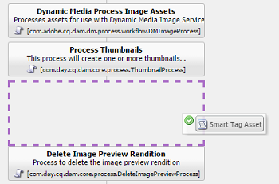

# Configure Experience Manager for smart tagging of assets {#configure-aem-for-smart-tagging}

Tagging assets with taxonomy-controlled vocabulary ensures that the assets can be easily identified and retrieved by tag-based searches. Adobe provides Smart Content Service (SCS) that uses artificial intelligence and machine learning algorithms to train images.

Smart Content Service uses an artifical intelligence framework of [Adobe Sensei](https://www.adobe.com/sensei/experience-cloud-artificial-intelligence.html) to train its image recognition algorithm on your tag structure and business taxonomy.

<!-- TBD: Create a similar flowchart for how training works in CS.
 
-->

## Integrate with Adobe I/O {#aio-integration}

Before you can tag their images using SCS, integrate [!DNL Adobe Experience Manager] with the Smart Content Service using Adobe I/O. Use this configuration to access the Smart Content Service from within [!DNL Experience Manager].

The article details out the following key tasks that are required to configure the Smart Content Service. At the back end, the [!DNL Experience Manager] server authenticates your service credentials with the Adobe I/O gateway before forwarding your request to the Smart Content Service.

* Create a Smart Content Service configuration in [!DNL Experience Manager] to generate a public key. Obtain public certificate for OAuth integration.
* Create an integration in Adobe I/O and upload the generated public key.
* Configure your [!DNL Experience Manager] instance using the API key and other credentials from Adobe I/O.  
* Optionally, enable auto-tagging on asset upload.

### Prerequisites for Adobe I/O integration {#prerequisite-for-aio-integration}

Before you can use the Smart Content Service, ensure the following to create an integration on Adobe I/O:

* An Adobe ID account that has administrator privileges for the organization.
* The Smart Content Service service is enabled for your organization.

### Obtain a public certificate {#obtain-public-certificate}

A public certificate allows you to authenticate your profile on Adobe I/O.

1. In the [!DNL Experience Manager] user interface, access **[!UICONTROL Tools]** > **[!UICONTROL Cloud Services]** > **[!UICONTROL Legacy Cloud Services]**.  

1. On the Cloud Services page, click **[!UICONTROL Configure Now]** under **[!UICONTROL Assets Smart Tags]**.

1. In the **[!UICONTROL Create Configuration]** dialog, specify a title and name for the Smart Tags configuration. Click **[!UICONTROL Create]**.

1. In the **[!UICONTROL AEM Smart Content Service]** dialog, use the following values:

   **[!UICONTROL Service URL]**: `https://mc.adobe.io/marketingcloud/smartcontent`

   **[!UICONTROL Authorization Server]**: `https://ims-na1.adobelogin.com`

   Leave the other fields blank for now (to be provided later). Click **[!UICONTROL OK]**.

   

1. Click **[!UICONTROL Download Public Certificate for OAuth Integration]**, and download the public certificate file `AEM-SmartTags.crt`.

   

### Reconfigure if a certificate expires {#certrenew}

When the certificate expires it is no longer trusted. To add a new certificate, follow these steps. You cannot renew an expired certificate.

1. Log in your [!DNL Experience Manager] deployment as an administrator. Click **[!UICONTROL Tools]** > **[!UICONTROL Security]** > **[!UICONTROL Users]**.  

1. Locate and click **[!UICONTROL dam-update-service]** user. Click on **[!UICONTROL Keystore]** tab.
1. Delete the existing **[!UICONTROL similaritysearch]** keystore with the expired certificate. Click **[!UICONTROL Save & Close]**.

   

   *Figure: Delete existing `similaritysearch` entry in Keystore to add a new security certificate.*

1. Navigate to **[!UICONTROL Tools]** > **[!UICONTROL Cloud Services]** > **[!UICONTROL Legacy Cloud Services]**. Click **[!UICONTROL Asset Smart Tags]** > **[!UICONTROL Show Configuration]** > **[!UICONTROL Available Configurations]**. Click the required configuration.  

1. To download a public certificate, click **[!UICONTROL Download Public Certificate for OAuth Integration]**.
1. Access [https://console.adobe.io](https://console.adobe.io) and navigate to the existing Smart Content Services on the **[!UICONTROL Integrations]** page. Upload the new certificate. For more information, see the instructions in [Create Adobe I/O integration](#create-adobe-i-o-integration).

### Create an integration {#create-aio-integration}

To use Smart Content Service APIs, create an integration in Adobe I/O to generate API Key, Technical Account Id, Organization Id, and Client Secret.

1. Access [https://console.adobe.io](https://console.adobe.io/).
1. On the **[!UICONTROL Integrations]** page, select the appropriate account and verify that the associated organization role is system administrator.
1. Click **[!UICONTROL New integration]**.
1. On the **[!UICONTROL Create a new integration]** page, select **[!UICONTROL Access an API]**. Click **[!UICONTROL Continue]**.
1. Under **[!UICONTROL Experience Cloud]**, select **[!UICONTROL Smart Content]**. Click **[!UICONTROL Continue]**.
1. On the next page, select **[!UICONTROL New integration]**. Click **[!UICONTROL Continue]**.
1. On the **[!UICONTROL Integration Details]** page, specify a name for the integration gateway and add a description.
1. In the **[!UICONTROL Public keys certificates]**, upload `AEM-SmartTags.crt` file that you downloaded above.
1. Click **[!UICONTROL Create Integration]**.
1. To view the integration information, click **[!UICONTROL Continue to integration details]**.

   

### Configure Smart Content Service {#configure-smart-content-service}

To configure the integration, use the values of Technical Account ID, Organization Id, Client Secret, Authorization Server, and API key fields from the Adobe I/O integration. Creating a Smart Tags cloud configuration allows authentication of API requests from the [!DNL Experience Manager] instance.

1. In [!DNL Experience Manager], navigate to **[!UICONTROL Tools > Cloud Service > Legacy Cloud Services]** to open the [!UICONTROL Cloud Services] console.
1. Under the **[!UICONTROL Assets Smart Tags]**, open the configuration created above. On the service settings page, click **[!UICONTROL Edit]**.
1. In the **[!UICONTROL AEM Smart Content Service]** dialog, use the pre-populated values for the **[!UICONTROL Service URL]** and **[!UICONTROL Authorization Server]** fields.
1. For the fields **[!UICONTROL API Key]**, **[!UICONTROL Technical Account Id]**, **[!UICONTROL Organization Id]**, and **[!UICONTROL Client Secret]**, use the values generated above.

### Validate the configuration {#validate-the-configuration}

After you've completed the configuration, you can use a JMX MBean to validate the configuration. To validate, follow these steps.

1. Access your [!DNL Experience Manager] server at `https://[aem_server]:[port]`.

1. Go to **[!UICONTROL Tools > Operations > Web Console]** to open the OSGi console. Click **[!UICONTROL Main > JMX]**.
1. Click **[!UICONTROL com.day.cq.dam.similaritysearch.internal.impl]**. It opens **[!UICONTROL SimilaritySearch Miscellaneous Tasks.]** 
1. Click **[!UICONTROL validateConfigs()]**. In the **[!UICONTROL Validate Configurations]** dialog, click **[!UICONTROL Invoke]**.

   The validation result is displayed in the same dialog.

## Enable smart tagging for newly uploaded assets (Optional) {#enable-smart-tagging-for-uploaded-assets}

1. In [!DNL Experience Manager], go to **[!UICONTROL Tools > Workflow > Models]**.
1. On **[!UICONTROL Workflow Models]** page, select the **[!UICONTROL DAM Update Asset]** workflow model.
1. Click **[!UICONTROL Edit]** from the toolbar.
1. Expand the Side Panel to display the steps. Drag **[!UICONTROL Smart Tag Asset]** step that is available in the DAM Workflow section and place it after the **[!UICONTROL Process Thumbnails]** step.

   

   *Figure: Add smart tag asset step after the process thumbnail step in the DAM Update Asset workflow.*

1. Open the step to configure. Under **[!UICONTROL Advanced Settings]**, ensure that the **[!UICONTROL Handler Advance]** option is selected.

   

1. In the **[!UICONTROL Arguments]** tab, select **[!UICONTROL Ignore Errors]** if you want the workflow to ignore failures when predicting tags.

   

   To tag assets when they are uploaded irrespective of whether smart tagging is enabled on folders, select **[!UICONTROL Ignore Smart Tag Flag]**.

1. Click **[!UICONTROL OK]** to close the process step, and then save the workflow. Click **[!UICONTROL Sync]**.

>[!MORELIKETHIS]
>
>* [Tag assets using smart service](smart-tags.md)