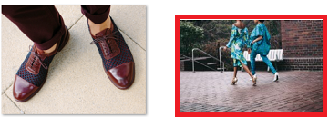
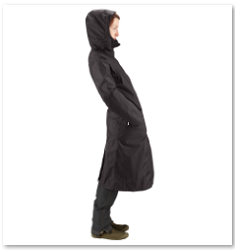
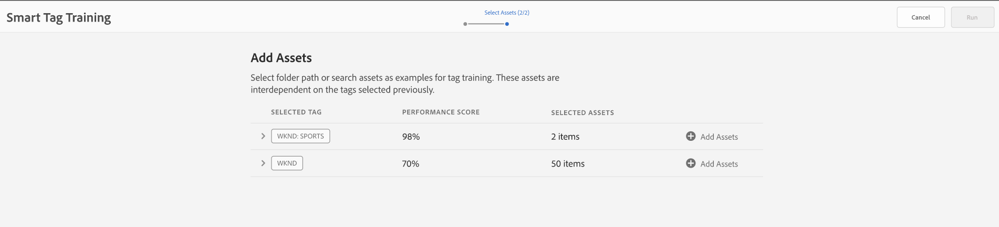
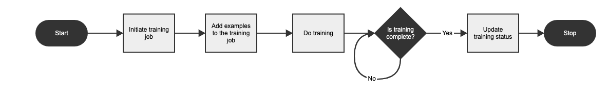

# Smart Tags Training

Smart tags training allows you to train your tags so that you can specify the particulars if the relevant tags are not there. It uses an artificially intelligent framework of [Adobe Sensei](https://business.adobe.com/why-adobe/experience-cloud-artificial-intelligence.html) to train its image recognition algorithm on your tag structure and business taxonomy. This content intelligence is then used to apply relevant tags on a different set of assets. [!DNL Experience Manager Assets] automatically applies smart tags to uploaded assets, by default. 

## Determining the requirement of smart tags training {#smart-tag-training-requirement}

Smart tags training is required in the following scenarios:

* To add an automated labeler to save iterations of adding labels every time you upload the same asset.
* To improve the ability of assets to apply relevant tags.
* To increase accuracy of the tags appearing for an asset.
* To add unavailable or missing labels.

>[!NOTE]
>
>Training smart tags is applicable in an ***image-type*** of asset only.

## Steps involved in training smart tags

[!DNL Experience Manager] as a [!DNL Cloud Service] auto-generates the Smart Tags to the text-based assets and to videos by default. To train smart Tags to images, complete the following tasks:

* [Understand tag models and guidelines](#understand-tag-models-guidelines)
* [Train the model](#train-model)
* [Tag your digital assets](#tag-assets)
* [Manage the tags and searches](#manage-smart-tags-and-searches)

## Understand tag models and guidelines {#understand-tag-models-guidelines}

A tag model is a group of related tags that are associated with various visual aspects of images being tagged. Tags relate with the distinctly different visual aspects of images so that when applied, the tags help in searching for specific types of images. For example, a shoes collection can have different tags but all the tags are related to shoes and can belong to the same tag model. When applied, the tags help find different types of shoes, say for example by design or by usage.

Before you create a tag model and train the service, identify a set of unique tags that best describe the objects in the images in the context of your business. Ensure that the assets in your curated set confirm to [the training guidelines](#training-guidelines).

### Training guidelines {#training-guidelines}

Ensure that the images in the training set conform to the following guidelines:

<table>
   <tr>
      <th> Metrics </th>
      <th> Description </th>
   </tr>
   <tr>
      <td> <b>Quantity and size </b></td>
      <td> Minimum 10 and maximum 50 images per tag. </td>
   </tr>
   <tr>
      <td> <b>Coherence</b> </td>
      <td> Ensure that the images for a tag are visually similar. It is best to add the tags about the same visual aspects (such as the same type of objects in an image) together into a single tag model. For example, it is not a good idea to tag all of these images as <i>my-party</i> (for training) because they are not visually similar. </td>
   </tr>
   <tr>
      <td colspan="2">  <i>Figure: Illustrative images of Coherence to exemplify the guidelines for training</i>
      </td>
   </tr>
   <tr>
      <td> <b>Coverage</b></td>
      <td> There should be sufficient variety in the images in the training. The idea is to supply a few but reasonably diverse examples so that learns to focus on the right things. If you're applying the same tag on visually dissimilar images, include at least five examples of each kind. For example, for the tag <i>model-down-pose</i>, include more training images similar to the highlighted image below for the service to identify similar images more accurately during tagging.</td>
   </tr>
   <tr>
   <td colspan="2">  <i>Figure: Illustrative images of Coverage to exemplify the guidelines for training</i>
   </td>
   </tr>
   <tr>
      <td><b>Distraction/obstruction</b> </td>
      <td> The service trains better on images that have less distraction (prominent backgrounds, unrelated accompaniments, such as objects/persons with the main subject). For example, for the tag <i>casual-shoe</i>, the second image is not a good training candidate. </td>
   </tr>
   <tr>
      <td colspan="2">  <i>Figure: Illustrative images of Distraction/obstruction to exemplify the guidelines for training</i>
      </td>
   </tr>
   <tr>
      <td> <b>Completeness</b> </td>
      <td> If an image qualifies for more than one tag, add all applicable tags before including the image for training. For example, for tags, such as <i>raincoat</i> and <i>model-side-view</i>, add both the tags on the eligible asset before including it for training. </td>
   </tr>
   <tr>
      <td colspan="2">  <i>Figure: Illustrative images of Completeness to exemplify the guidelines for training</i>
      </td>
   </tr>
   <tr>
      <td> <b>Number of tags</b> </td>
      <td> Adobe recommends that you train a model using at least two distinct tags and at least ten different images for each tag. In a single tag model, do not add more than 50 tags. </td>
   </tr>
   <tr>
      <td> <b>Number of examples</b> </td>
      <td> For each tag, add at least ten examples. However, Adobe recommends about 30 examples. A maximum of 50 examples per tag are supported. </td>
   </tr>
   <tr>
      <td> <b>Prevent false positives and conflicts</b> </td>
      <td> Adobe recommends creating a single tag model for a single visual aspect. Structure the tag models in a way that avoids overlapping tags between the models. For example, do not use a common tags like <i>sneakers</i> in two different tag models names <i>shoes</i> and <i>footwear</i>. The training process overwrites one trained tag model with the other for a common keyword. </td>
   </tr>
</table>

**Examples**: Some more examples for guidance are:

* Create a tag model that only includes,

  * The tags related to car models.
  * The tags related to jackets for adults and kids.

* Do not create,

  * A tag model that includes car models released in 2019 and 2020.
  * Multiple tag models that include the same few car models.

>[!NOTE]
>
>You can use the same images to train different tag models. However, do not associate an image with more than one tag in a tag model. It is possible to tag the same image with different tags belonging to different tag models. 
>You cannot undo the training. The above guidelines should help you choose good images to train.

## Train the model for your custom tags {#train-model}

To create and train a model for your business-specific tags, follow these steps:

1. Create the necessary tags and the appropriate tag structure. Upload the relevant images in the DAM repository.
1. In [!DNL Experience Manager Cloud Service] user interface, access **[!UICONTROL Assets]** > **[!UICONTROL Smart Tag Training]**.
1. Click **[!UICONTROL Create]**. Provide a **[!UICONTROL Title]**, **[!UICONTROL Description]**.
1. Click on the folder icon in **[!UICONTROL Tags]** field. A popup window opens. 
1. Search or select the appropriate tags from the existing tags in `cq-tags` that you want to add to the model. Click **[!UICONTROL Next]**.

   >[!NOTE]
   >
   >You can sort the tags structure in ascending or descending order based on the **[!UICONTROL Name]** (alphabetical order), **[!UICONTROL Created]** date, or **[!UICONTROL Modified]** date.
   

1. In the **[!UICONTROL Select Assets]** dialog, click **[!UICONTROL Add Assets]** against each tag. Search in the DAM repository or browse the repository to select at least 10 and at most 50 images. Select assets and not the folder. Once you've selected the images, click **[!UICONTROL Select]**.

   

1. To preview the thumbnails of the selected images, click the accordion in front of a tag. You can modify your selection by clicking **[!UICONTROL Add Assets]**. Once satisfied with the selection, click **[!UICONTROL Submit]**. The user interface displays a notification at the bottom of the page indicating that the training is initiated.
1. Check the status of the training in the **[!UICONTROL Status]** column for each tag model. Possible statuses are [!UICONTROL Pending], [!UICONTROL Trained], and [!UICONTROL Failed].

*Figure: Steps of the training workflow to train tagging model.*

### View training status and report {#training-status}

To check whether the Smart Tags service is trained on your tags in the training set of assets, review the training workflow report from the Reports console.

1. In [!DNL Experience Manager Cloud Service] interface, go to **[!UICONTROL Tools]** > **[!UICONTROL Assets]** > **[!UICONTROL Reports]**.
1. In the **[!UICONTROL Asset Reports]** page, click **[!UICONTROL Create]**.
1. Select the **[!UICONTROL Smart Tags Training]** report, and then click **[!UICONTROL Next]** from the toolbar.
1. Specify a title and description for the report. Under **[!UICONTROL Schedule Report]**, leave the **[!UICONTROL Now]** option selected. If you want to schedule the report for later, select **[!UICONTROL Later]** and specify a date and time. Then, click **[!UICONTROL Create]** from the toolbar.
1. In the **[!UICONTROL Asset Reports]** page, select the report you generated. To view the report, click **[!UICONTROL View]** from the toolbar.
1. Review the details of the report. The report displays the training status for the tags you trained. The green color in the **[!UICONTROL Training Status]** column indicates that the Smart Tags service is trained for the tag. Yellow color indicates that the service is partially trained for a particular tag. To train the service completely for a tag, add more images with the particular tag and execute the training workflow. If you do not see your tags in this report, execute the training workflow again for these tags.Tags
1. To download the report, select it from the list, and click **[!UICONTROL Download]** from the toolbar. The report downloads as a spreadsheet.

>[!NOTE]
>
>What if I want to transfer Smart Tags traning from one instance to another via an export?
>You do not need to export Smart Tags training if the environment belongs to the same IMS org. It is automatically shared. If the environment is across IMS orgs, then there is no way to share or export Smart Tags training.

## Limitations and best practices related to smart tags {#limitations-smart-tags-training}

* To train the model, use the most appropriate images. The training cannot be reverted or training model cannot be removed. Your tagging accuracy depends on the current training, so do it carefully.
* You cannot train the service that applies Smart Tags to videos using any specific videos. It works with default [!DNL Adobe Sensei] settings.

>[!NOTE]
>
>The ability of the Smart Tags to train on your tags and apply them on other images depends on the quality of images you use for training.
>For best results, Adobe recommends that you use visually similar images to train the service for each tag.
