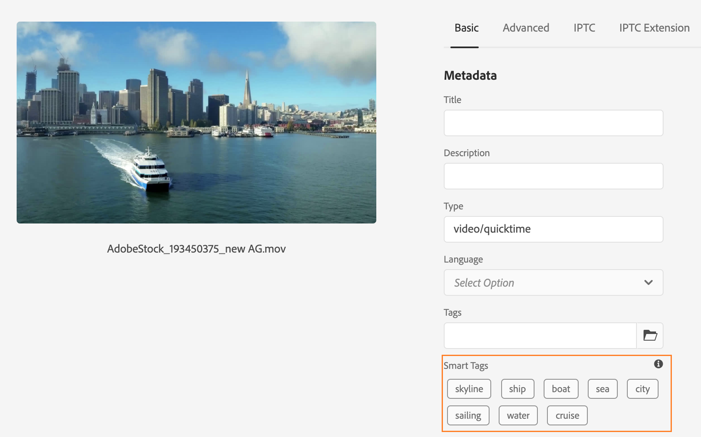
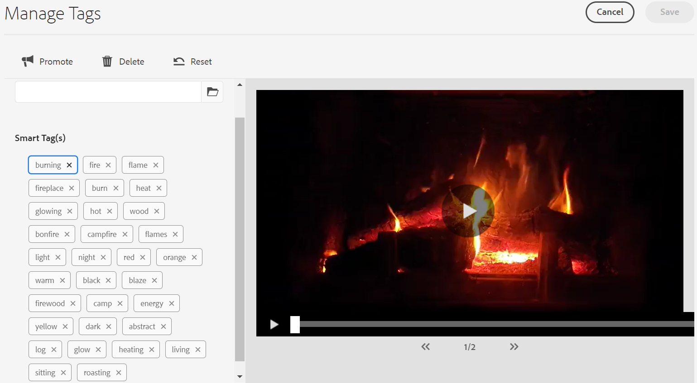
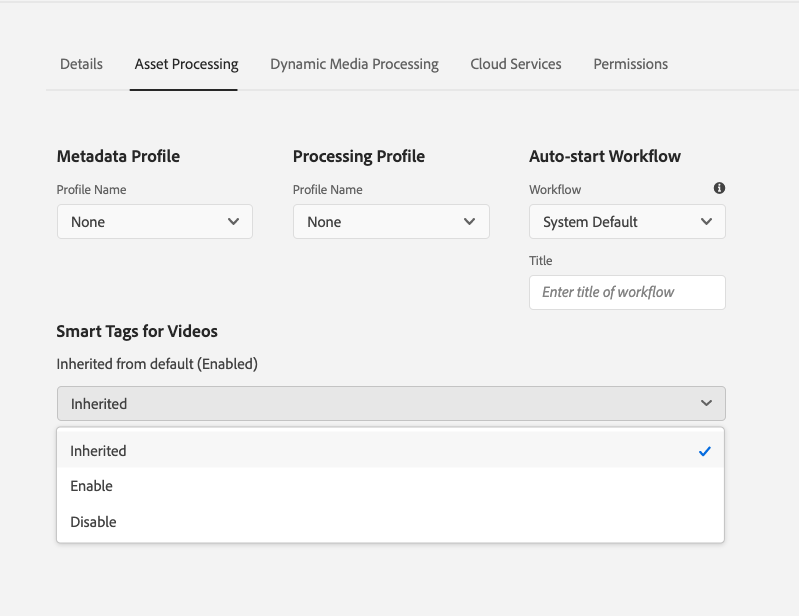

# Smart tag your video assets {#video-smart-tags}

<table>
    <tr>
        <td>
            <sup style= "background-color:#008000; color:#FFFFFF; font-weight:bold"><i>New</i></sup> <a href="/help/assets/dynamic-media/dm-prime-ultimate.md"><b>Dynamic Media Prime and Ultimate</b></a>
        </td>
        <td>
            <sup style= "background-color:#008000; color:#FFFFFF; font-weight:bold"><i>New</i></sup> <a href="/help/assets/assets-ultimate-overview.md"><b>AEM Assets Ultimate</b></a>
        </td>
        <td>
            <sup style= "background-color:#008000; color:#FFFFFF; font-weight:bold"><i>New</i></sup> <a href="/help/assets/integrate-aem-assets-edge-delivery-services.md"><b>AEM Assets integration with Edge Delivery Services</b></a>
        </td>
        <td>
            <sup style= "background-color:#008000; color:#FFFFFF; font-weight:bold"><i>New</i></sup> <a href="/help/assets/aem-assets-view-ui-extensibility.md"><b>UI Extensibility</b></a>
        </td>
          <td>
            <sup style= "background-color:#008000; color:#FFFFFF; font-weight:bold"><i>New</i></sup> <a href="/help/assets/dynamic-media/enable-dynamic-media-prime-and-ultimate.md"><b>Enable Dynamic Media Prime and Ultimate</b></a>
        </td>
    </tr>
    <tr>
        <td>
            <a href="/help/assets/search-best-practices.md"><b>Search Best Practices</b></a>
        </td>
        <td>
            <a href="/help/assets/metadata-best-practices.md"><b>Metadata Best Practices</b></a>
        </td>
        <td>
            <a href="/help/assets/product-overview.md"><b>Content Hub</b></a>
        </td>
        <td>
            <a href="/help/assets/dynamic-media-open-apis-overview.md"><b>Dynamic Media with OpenAPI capabilities</b></a>
        </td>
        <td>
            <a href="https://developer.adobe.com/experience-cloud/experience-manager-apis/"><b>AEM Assets developer documentation</b></a>
        </td>
    </tr>
</table>

The expanding need for new content calls for reduced manual efforts to deliver compelling digital experiences in no time. [!DNL Adobe Experience Manager] as a [!DNL Cloud Service] supports auto-tagging of video assets using artificial intelligence. Tagging the videos manually can be time-consuming. However, [!DNL Adobe Sensei] powered video smart tagging feature uses artificial intelligence models to analyze video content and add tags to the video assets. Thereby reducing time for DAM users to deliver rich experiences to their customers. Adobe's machine learning service generates two sets of tags for a video. While, one set corresponds to objects, scenes, and attributes in that video; the other set relates to actions such as drinking, running, and jogging.

Video tagging is enabled by default in [!DNL Adobe Experience Manager] as a [!DNL Cloud Service]. However, you can [opt-out of video smart tagging](#opt-out-video-smart-tagging) on a folder. Videos are auto-tagged when you upload new videos or re-process existing ones. [!DNL Experience Manager] also creates the thumbnails and extracts metadata of the video files. The smart tags are displayed in descending order of their [confidence score](#confidence-score-video-tag) in asset [!UICONTROL Properties].

## Smart tagging videos on upload {#smart-tag-assets-on-ingestion}

When you [upload video assets](add-assets.md#upload-assets) to [!DNL Adobe Experience Manager] as a [!DNL Cloud Service], the videos are processed. Once the processing is complete, see the [!UICONTROL Basic] tab of asset [!UICONTROL Properties] page. Smart tags are automatically added to the video under [!UICONTROL Smart Tags]. Asset microservices uses [!DNL Adobe Sensei] to create these smart tags.



The applied smart tags are sorted in descending order of [confidence score](#confidence-score-video-tag), combined for object and action tags, within [!UICONTROL Smart Tags].

>[!IMPORTANT]
>
>You are advised to review these automatically generated tags to ensure that they conform to your brand and its values.

## Smart tagging existing videos in DAM {#smart-tag-existing-videos}

The already existing video assets in DAM are not smart tagged automatically. You need to [!UICONTROL Reprocess Assets] manually to generate smart tags for them.

To smart tag video assets, or folders (including subfolders) of assets that already exist in assets repository, follow these steps:

1. Select the [!DNL Adobe Experience Manager] logo and then select assets from the [!UICONTROL Navigation] page.

1. Select [!UICONTROL Files] to display the Assets interface.

1. Navigate to the folder to which you want to apply smart tags.

1. Select the entire folder or specific video assets.

1. Select  [!UICONTROL Reprocess Assets] icon and select the [!UICONTROL Full Process] option.

<!-- TBD: Limit size -->


Once the process completes, navigate to the [!UICONTROL Properties] page of any video asset within the folder. The automatically added tags are seen in [!UICONTROL Smart Tags] section in [!UICONTROL Basic] tab. These applied smart tags are sorted in descending order of [confidence score](#confidence-score-video-tag).

## Search for tagged videos {#search-smart-tagged-videos}

To search for the video assets based on the auto generated smart tags, use [Omnisearch](search-assets.md#search-assets-in-aem):

1. Select the search icon  to display the Omnisearch field.

1. Specify a tag, in the Omnisearch field, that you have not explicitly added to a video.

1. Search based on the tag.

The search results display the video assets based on the tag you specified.

Your search results are a combination of video assets with searched keywords in the metadata and the video assets that are smart tagged with the searched keywords. However, the search results that match all search terms in metadata fields are displayed first, followed by the search results that match any of the search terms in the smart tags. For more information, see [Understand [!DNL Experience Manager] search results with smart tags](smart-tags.md#understand-search).

## Moderate video smart tags {#moderate-video-smart-tags}

[!DNL Adobe Experience Manager] lets you curate the smart tags to:

* remove inaccurate tags assigned to your brand videos.

* refine tag-based searches for videos by ensuring that your video appears in search results for the most relevant tags. It, therefore, eliminates the chances of unrelated videos from showing up in search results.

* assign a higher rank to a tag to increase its relevance with respect to a video. Promoting a tag for a video increases the chances of the video appearing in search results when a search is performed based on that tag.

To know more about how to moderate the smart tags for assets, see [Manage smart tags](smart-tags.md#manage-smart-tags-and-searches).



>[!NOTE]
>
>Any tags that are moderated using the steps in [Manage smart tags](smart-tags.md#manage-smart-tags-and-searches) are not remembered on reprocessing of the asset. The original set of tags are displayed again.

## Opt out of video smart tagging {#opt-out-video-smart-tagging}

As the automated tagging of videos runs in parallel to other asset processing tasks like thumbnail creation and metadata extraction, it can be time consuming. To expedite the asset processing you can opt out of video smart tagging on upload at folder level.

To opt out of automated video smart tags generation for assets uploaded to specific folder:

1. Open [!UICONTROL Asset Processing] tab in folder [!UICONTROL Properties].

1. In [!UICONTROL Smart Tags for Videos] menu, [!UICONTROL Inherited] option is selected by default and video smart tag is enabled.

    When the [!UICONTROL Inherited] option is selected, the inherited folder path is also visible along with the information whether it is set to [!UICONTROL Enable] or [!UICONTROL Disable].

    

1. Select [!UICONTROL Disable] to opt out of smart tagging of videos uploaded to the folder.

>[!IMPORTANT]
>
>If you have opted out of tagging videos on a folder at the time of upload and want to smart tag the videos after upload, then **[!UICONTROL Enable Smart Tags for Videos]** from [!UICONTROL Asset Processing] tab of the folder [!UICONTROL Properties] and use [[!UICONTROL Reprocess Asset] option](#smart-tag-existing-videos) to add smart tags to the video.

## Confidence score {#confidence-score-video-tag}

[!DNL Adobe Experience Manager] applies a minimum confidence threshold for object and action smart tags to avoid having too many tags for each video asset, which slows down indexing. Your asset search results are ranked based on the confidence scores, which generally improve search results beyond what an inspection of the assigned tags of any video asset suggests. Inaccurate tags often have low confidence scores so they seldom appear at the top of the Smart Tags list for assets.

The default threshold for action and object tags in [!DNL Adobe Experience Manager] is 0.7 (should be value between 0 and 1). If some video assets are not tagged by a specific tag, then it indicates that the algorithm is less than 70% confident in the predicted tags. The default threshold might not always be optimal for all the users. You can, therefore, change the confidence score value in OSGI configuration.

To add the confidence score OSGI configuration to the project deployed to [!DNL Adobe Experience Manager] as a [!DNL Cloud Service] through [!DNL Cloud Manager]:

* In the [!DNL Adobe Experience Manager] project (`ui.config` since Archetype 24, or previously `ui.apps`) the `config.author` OSGi configuration, include a config file named `com.adobe.cq.assetcompute.impl.senseisdk.SenseiSdkImpl.cfg.json` with the following contents:

```json
{
  "minVideoActionConfidenceScore":0.5,
  "minVideoObjectConfidenceScore":0.5,
}
```

>[!NOTE]
>
>Manual tags are assigned a confidence of 100% (maximum confidence). Therefore, if there are video assets with manual tags that match the search query, they are displayed before smart tags matching the search query.

## Limitations {#video-smart-tagging-limitations}

* You cannot train the service that applies Smart Tags to videos using any specific videos. It works with default [!DNL Adobe Sensei] settings.

* Tagging progress is not displayed.

* Only the videos smaller than 300 MB in file size are auto-tagged. The [!DNL Adobe Sensei] service skips video files that are larger in size.

* Only the videos in the file formats and supported codecs mentioned in [Smart Tags](/help/assets/smart-tags.md#smart-tags-supported-file-formats) are tagged.

**See also**

* [Translate Assets](translate-assets.md)
* [Assets HTTP API](mac-api-assets.md)
* [Assets supported file formats](file-format-support.md)
* [Search assets](search-assets.md)
* [Connected assets](use-assets-across-connected-assets-instances.md)
* [Asset reports](asset-reports.md)
* [Metadata schemas](metadata-schemas.md)
* [Download assets](download-assets-from-aem.md)
* [Manage metadata](manage-metadata.md)
* [Search facets](search-facets.md)
* [Manage collections](manage-collections.md)
* [Bulk metadata import](metadata-import-export.md)
* [Publish Assets to AEM and Dynamic Media](/help/assets/publish-assets-to-aem-and-dm.md)

>[!MORELIKETHIS]
>
>* [Manage smart tags and asset searches](smart-tags.md#manage-smart-tags-and-searches)
>* [Train Smart Tag service and tag your images](smart-tags.md)
