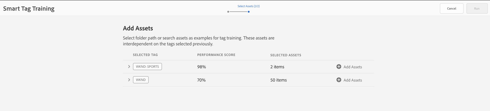
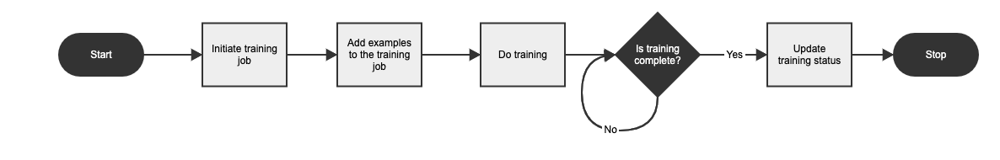
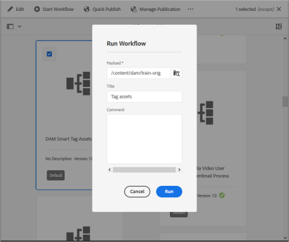
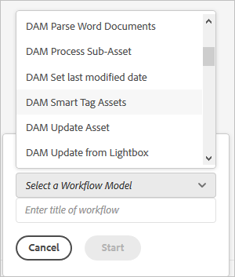

# Train Smart Content Service and auto-tag your images {#train-service-tag-assets}

Organizations that deal with digital assets increasingly use taxonomy-controlled vocabulary in asset metadata. Essentially, it includes a list of keywords that employees, partners, and customers commonly use to refer to and search for their digital assets. Tagging assets with taxonomy-controlled vocabulary ensures that the assets can be easily identified and retrieved by tag-based searches.

Compared to natural language vocabularies, tagging based on business taxonomy helps align the assets with a company's business and ensures that the most relevant assets appear in searches. For example, a car manufacturer can tag car images with model names so only relevant images are displayed when searched to design a promotion campaign.

In the background, the Smart Tags uses an artificial intelligence framework of [Adobe Sensei](https://www.adobe.com/sensei/experience-cloud-artificial-intelligence.html) to train its image recognition algorithm on your tag structure and business taxonomy. This content intelligence is then used to apply relevant tags on a different set of assets.

<!-- TBD: Create a flowchart for how training works in CS.
 
-->

To use smart tagging, complete the following tasks:

* [Integrate [!DNL Adobe Experience Manager] with Adobe Developer Console](#integrate-aem-with-aio).
* [Understand tag models and guidelines](#understand-tag-models-guidelines).
* [Train the model](#train-model).
* [Tag your digital assets](#tag-assets).
* [Manage the tags and searches](#manage-smart-tags-and-searches).

Smart Tags are applicable only for [!DNL Adobe Experience Manager Assets] customers. The Smart Tags is available for purchase as an add-on to [!DNL Experience Manager].

<!-- TBD: Is there a link to buy SCS or initiate a sales call. How are AIO services sold? Provide a CTA here to buy or contacts Sales team. -->

## Integrate [!DNL Experience Manager] with Adobe Developer Console {#integrate-aem-with-aio}

>[!IMPORTANT]
>
>The new [!DNL Experience Manager Assets] deployments are integrated with [!DNL Adobe Developer Console] by default. It helps configure the smart tags functionality faster. On the older deployments, administrators can manually [configure smart tags integration](/help/assets/smart-tags-configuration.md#aio-integration).

You can integrate [!DNL Adobe Experience Manager] with the Smart Tags using [!DNL Adobe Developer Console]. Use this configuration to access the Smart Tags service from within [!DNL Experience Manager]. See [configure Experience Manager for smart tagging of assets](smart-tags-configuration.md) for tasks to configure the Smart Tags. At the back end, the [!DNL Experience Manager] server authenticates your service credentials with the Adobe Developer Console gateway before forwarding your request to the Smart Tags service.

## Understand tag models and guidelines {#understand-tag-models-guidelines}

A tag model is a group of related tags that are by a visual aspect of the image. For example, a shoes collection can have different tags but all the tags are related to shoes and can belong to the same tag model. Tags can relate only with the distinctly different visual aspects of images. To understand the content representation of a training model in [!DNL Experience Manager], visualize a training model as a top-level entity comprised of a group of manually added tags and example images for each tag. Each tag can be exclusively applied to an image.

Tags that cannot realistically be handled are related to:

* Non-visual, abstract aspects such as the year or season of release of a product, mood of or emotion evoked by an image.
* Fine visual differences in products such as shirts with and without collars or small product logos embedded on products.

Before you create a tag model and train the service, identify a set of unique tags that best describe the objects in the images in the context of your business. Ensure that the assets in your curated set conform to [the training guidelines](#training-guidelines).

### Training guidelines {#training-guidelines}

The images in your training set should conform to the following guidelines:

**Quantity and size:** Minimum 10 images and maximum 50 images per tag.

**Coherence**: Images for a tag should be visually similar. It is best to add together the tags about the same visual aspects (such as the same type of objects in an image) together into a single tag model. For example, it is not a good idea to tag all of these images as `my-party` (for training) because they are not visually similar.

**Coverage**: There should be sufficient variety in the images in the training. The idea is to supply a few but reasonably diverse examples so that AEM learns to focus on the right things. If you're applying the same tag on visually dissimilar images, include at least five examples of each kind. For example, for the tag *model-down-pose*, include more training images similar to the highlighted image below for the service to identify similar images more accurately during tagging.

**Distraction/obstruction**: The service trains better on images that have less distraction (prominent backgrounds, unrelated accompaniments, such as objects/persons with the main subject). For example, for the tag *casual-shoe*, the second image is not a good training candidate.

**Completeness:** If an image qualifies for more than one tag, add all applicable tags before including the image for training. For example, for tags, such as *raincoat* and *model-side-view*, add both the tags on the eligible asset before including it for training.

**Number of tags**: Adobe recommends that you train a model using at least two distinct tags and at least 10 different images for each tag. In a single tag model, do not add more than 50 tags.

**Number of examples**: For each tag, add at least 10 examples. However, Adobe recommends about 30 examples. A maximum of 50 examples per tag are supported.

**Prevent false positives and conflicts**: Adobe recommends creating a single tag model for a single visual aspect. Structure the tag models in a way that avoids overlapping tags between the models. For example, do not use a common tags like `sneakers` in two different tag models names `shoes` and `footwear`. The training process overwrites one trained tag model with the other for a common keyword.

**Examples**: Some more examples for guidance are:

* Create a tag model that includes,
  * only the tags related to car models.
  * only the tags related to colors of shirts.
  * only the tags related to jackets for women and men.
* Do not create,
  * a tag model that includes car models released in 2019 and 2020.
  * multiple tag models that include the same few car models.

**Images used to train**: You can use the same images to train different tag models. However, the do not associate an image with more than one tag in a tag model. Hence, it is possible to tag the same image with different tags belonging to different tag models.

You cannot undo the training. The above guidelines should help you choose good images to train.

## Train the model for your custom tags {#train-model}

To create and train a model for your business-specific tags, follow these steps:

1. Create the necessary tags and the appropriate tag structure. Upload the relevant images in the DAM repository.
1. In [!DNL Experience Manager] user interface, access **[!UICONTROL Assets]** > **[!UICONTROL Smart Tag Training]**.
1. Click **[!UICONTROL Create]**. Provide a **[!UICONTROL Title]**, **[!UICONTROL Description]**.
1. Browse and select the tags from the existing tags in `cq:tags` that you want to train the model for. Click **[!UICONTROL Next]**.
1. In the **[!UICONTROL Select Assets]** dialog, click **[!UICONTROL Add Assets]** against each tag. Search in the DAM repository or browse the repository to select at least 10 and at most 50 images. Select assets and not the folder. Once you've selected the images, click **[!UICONTROL Select]**.

   

1. To preview the thumbnails of the selected images, click the accordion in front of a tag. You can modify your selection by clicking **[!UICONTROL Add Assets]**. Once satisfied with the selection, click **[!UICONTROL Submit]**. The user interface displays a notification at the bottom of the page indicating that the training is initiated.
1. Check the status of the training in the **[!UICONTROL Status]** column for each tag model. Possible statuses are [!UICONTROL Pending], [!UICONTROL Trained], and [!UICONTROL Failed].

*Figure: Steps of the training workflow to train tagging model.*

### View training status and report {#training-status}

To check whether the Smart Tags service is trained on your tags in the training set of assets, review the training workflow report from the Reports console.

1. In [!DNL Experience Manager] interface, go to **[!UICONTROL Tools] > **[!UICONTROL Assets] > **[!UICONTROL Reports]**.
1. In the **[!UICONTROL Asset Reports]** page, click **[!UICONTROL Create]**.
1. Select the **[!UICONTROL Smart Tags Training]** report, and then click **[!UICONTROL Next]** from the toolbar.
1. Specify a title and description for the report. Under **[!UICONTROL Schedule Report]**, leave the **[!UICONTROL Now]** option selected. If you want to schedule the report for later, select **[!UICONTROL Later]** and specify a date and time. Then, click **[!UICONTROL Create]** from the toolbar.
1. In the **[!UICONTROL Asset Reports]** page, select the report you generated. To view the report, click **[!UICONTROL View]** from the toolbar.
1. Review the details of the report. The report displays the training status for the tags you trained. The green color in the **[!UICONTROL Training Status]** column indicates that the Smart Tags service is trained for the tag. Yellow color indicates that the service is not completely trained for a particular tag. In this case, add more images with the particular tag and run the training workflow to train the service completely on the tag. If you do not see your tags in this report, run the training workflow again for these tags.Tags
1. To download the report, select it from the list, and click **[!UICONTROL Download]** from the toolbar. The report downloads as an [!DNL Microsoft Excel] spreadsheet.

## Tag assets {#tag-assets}

After you have trained the Smart Tags service, you can trigger the tagging workflow to automatically apply appropriate tags on a different set of similar assets. You can apply the tagging workflow periodically or whenever required. The tagging workflow applies to both, assets and folders.

### Tag assets from the workflow console {#tagging-assets-from-the-workflow-console}

1. In Experience Manager interface, go to **[!UICONTROL Tools > Workflow > Models]**.
1. From the **[!UICONTROL Workflow Models]** page, select the **[!UICONTROL DAM Smart Tags Assets]** workflow and then click **[!UICONTROL Start Workflow]** from the toolbar.

   

1. In the **[!UICONTROL Run Workflow]** dialog, browse to the payload folder containing assets on which you want to apply your tags automatically.
1. Specify a title for the workflow and an optional comment. Click **[!UICONTROL Run]**.

   

   Navigate to the asset folder and review the tags to verify whether your assets are tagged properly. For details, see [manage smart tags](#manage-smart-tags-and-searches).

### Tag assets from the timeline {#tagging-assets-from-the-timeline}

1. From the Assets user interface, select the folder containing assets or specific assets to which you want to apply smart tags.
1. From upper-left corner, open the **[!UICONTROL Timeline]**.
1. Open actions from the bottom of the left sidebar and click **[!UICONTROL Start Workflow]**.

   

1. Select the **[!UICONTROL DAM Smart Tag Assets]** workflow, and specify a title for the workflow.
1. Click **[!UICONTROL Start]**. The workflow applies your tags on assets. Navigate to the asset folder and review the tags to verify whether your your assets are tagged properly. For details, see [manage smart tags](#manage-smart-tags-and-searches).

>[!NOTE]
>
>In the subsequent tagging cycles, only the modified assets are tagged again with newly-trained tags.However, even unaltered assets are tagged if the gap between the last and current tagging cycles for the tagging workflow exceeds 24 hours. For periodic tagging workflows, unaltered assets are tagged when the time gap exceeds 6 months.

### Tag uploaded assets {#tag-uploaded-assets}

Experience Manager can automatically tag the assets that users upload to DAM. To do so, administrators configure a workflow to add an available step of to smart tag assets. See [how to enable smart tagging for uploaded assets](/help/assets/smart-tags-configuration.md#enable-smart-tagging-for-uploaded-assets).

## Manage smart tags and asset searches {#manage-smart-tags-and-searches}

You can curate smart tags to remove any inaccurate tags that may have been assigned to your brand assets, so that only the most relevant tags are displayed.

Moderating smart tags also helps refine tag-based searches for assets by ensuring that your assets appear in search results for the most relevant tags. Essentially, it helps eliminate the chances of unrelated assets from showing up in search results.

You can also assign a higher rank to a tag to increase its relevance with respect to an asset. Promoting a tag for an asset increases the chances of the asset appearing in search results when a search is performed based on the particular tag.

To moderate the smart tags of your assets:

1. In the Omnisearch field search for assets based on a tag.

1. Inspect the search results to identify the assets that you do not find relevant to your search.

1. Select the asset, and then select  from the toolbar.

1. From the **[!UICONTROL Manage Tags]** page, inspect the tags. If you do not want the asset to be searched based on a specific tag, then select the tag and select  from the toolbar. Alternatively, select `X` symbol next to the label.

1. To assign a higher rank to a tag, select the tag and select  from the toolbar. The tag you promote is moved to the **[!UICONTROL Tags]** section.

1. Select **[!UICONTROL Save]** and then select **[!UICONTROL OK]** to close the [!UICONTROL Success] dialog.

1. Navigate to the [!UICONTROL Properties] page for the asset. Observe that the tag you promoted is assigned a high relevance and, therefore, appears higher in the search results.

### Understand AEM search results with smart tags {#understandsearch}

By default, AEM search combines the search terms with an `AND` clause. Using smart tags does not change this default behavior. Using smart tags adds an additional `OR` clause to find any of the search terms in the applies smart tags. For example, consider searching for `woman running`. Assets with just `woman` or just `running` keyword in the metadata do not appear in the search results by default. However, an asset tagged with either `woman` or `running` using smart tags appears in such a search query. So the search results are a combination of,

* assets with `woman` and `running` keywords in the metadata.

* assets smart tagged with either of the keywords.

The search results that match all search terms in metadata fields are displayed first, followed by the search results that match any of the search terms in the smart tags. In the above example, the approximate order of display of search results is:

1. matches of `woman running` in the various metadata fields.
1. matches of `woman running` in smart tags.
1. matches of `woman` or of `running` in smart tags.

### Tagging limitations {#limitations}

Enhanced smart tags are based on learning models of brand images and their tags. These models are not always perfect at identifying tags. The current version of the Smart Tags has the following limitations:

* Inability to recognize subtle differences in images. For example, slim versus regular fitted shirts.
* Inability to identify tags based on tiny patterns/parts of an image. For example, logos on T-shirts.
* Tagging is supported in the languages that Experience Manager supports. For a list of languages, see [Smart Content Service release notes](https://experienceleague.adobe.com/docs/experience-manager-64/release-notes/smart-content-service-release-notes.html#languages).

To search for assets with smart tags (regular or enhanced), use the Assets Omnisearch (full-text search). There is no separate search predicate for smart tags.

>[!NOTE]
>
>The ability of the Smart Tags to train on your tags and apply them on other images depends on the quality of images you use for training.
>For best results, Adobe recommends that you use visually similar images to train the service for each tag.

>[!MORELIKETHIS]
>
>* [Configure Experience Manager for smart tagging](smart-tags-configuration.md)
>* [Understand how smart tags help manage assets](https://medium.com/adobetech/efficient-asset-management-with-enhanced-smart-tags-887bd47dbb3f)
>* [Smart tagging video assets](smart-tags-video-assets.md)
