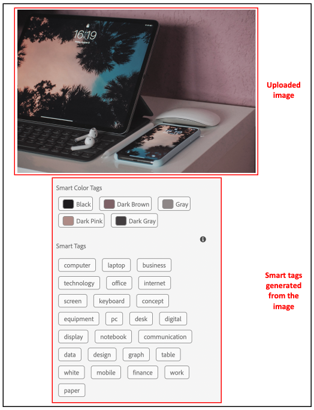
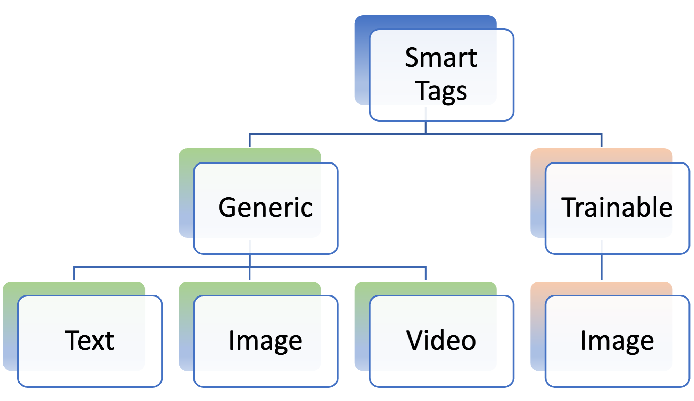
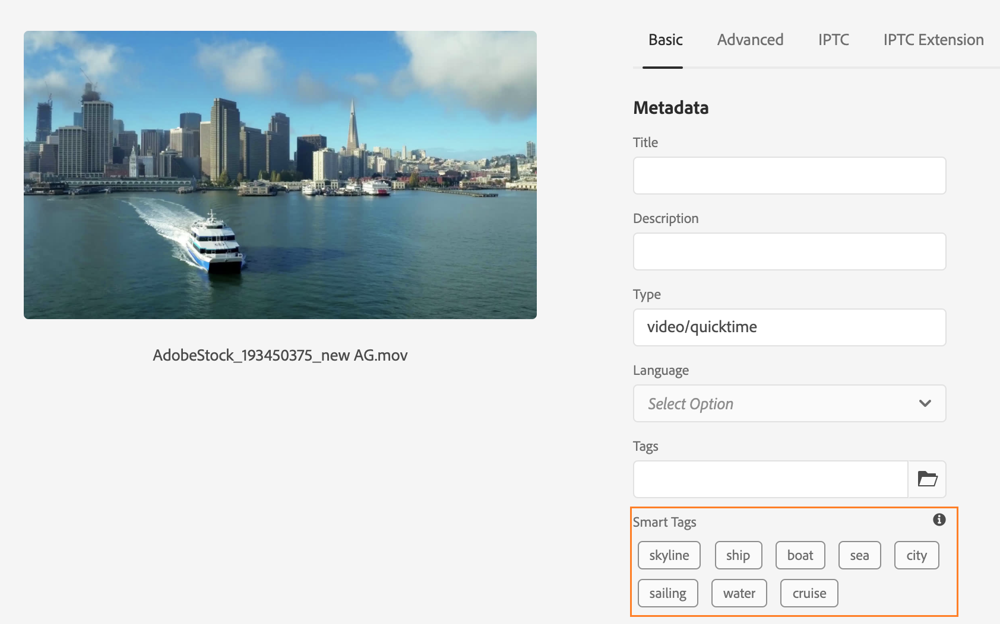
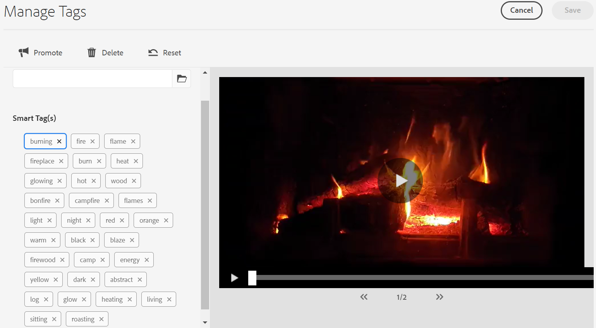
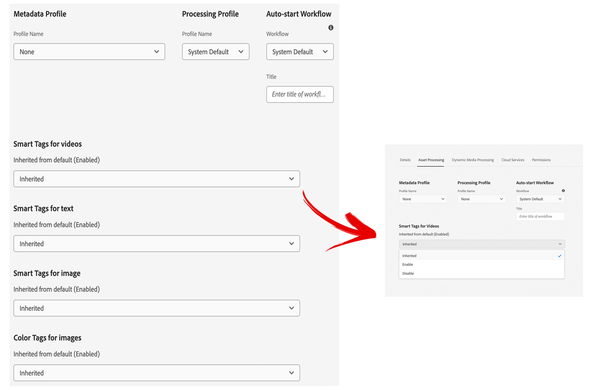

# Smart Tags for AEM Assets {#using-smart-tags}

Organizations possess numerous digital assets, and this number continues to grow rapidly. Searching for a specific asset amidst such a vast amount of data poses a significant challenge. To address this, `metadata` and `tags` are employed to enhance the searchability of digital assets. Organizations use taxonomy-controlled vocabularies in asset metadata. These typically consist of keyword lists that employees, partners, and customers commonly use to refer to and locate digital assets.

Smart Tags are keywords that not only appear in the text but also best describe the asset. Tagging assets with taxonomy-controlled vocabulary ensures they can be easily identified and retrieved through search.

For instance, words arranged alphabetically in a dictionary are easier to find than randomly scattered ones. Tagging serves a similar purpose. It organizes assets according to business taxonomy, ensuring that the most relevant ones appear in search results. For example, a car manufacturer can tag car images with model names, so that only relevant images are displayed when designing a promotional campaign. Whether tagging "runners" or "running shoes," users do not need to worry about typos, spelling variations, or alternate search terms—Smart Tags recognize them all.

In the background, the functionality uses the artificially intelligent framework of [Adobe AI](https://business.adobe.com/ai/adobe-genai.html), which automatically applies Smart Tags to uploaded assets—by default—along with text aligned to the business taxonomy.

## Prerequisites and configuration {#smart-tags-prereqs-config}

Smart Tags is automatically provisioned for [!DNL Adobe Experience Manager] as a [!DNL Cloud Service] and hence no configuration is required.

## Smart Tags workflow {#smart-tags-workflow}

[!DNL Adobe AI] powered smart tagging uses artificial intelligence models to analyze content and add tags to the assets, thereby reducing time for DAM users to deliver rich experiences to their customers. The Smart Tags are displayed in descending order of their [confidence score](#confidence-score) in asset properties.

* **Image-based assets**
  For images, the Smart Tags are based on some visual aspect. Images in many formats are tagged using smart content services. Smart Tags are applied to the [supported file types](#supported-file-formats) that generate renditions in JPG and PNG format.

  <!-- -->

* **Video-based assets**
  For video-based assets, tagging is enabled by default in [!DNL Adobe Experience Manager] as a [!DNL Cloud Service]. As is the case with Image and text based tags, videos are also auto-tagged when you upload new videos or reprocess existing ones. [!DNL Adobe AI] generates two sets of tags for a video: One set corresponds to objects, scenes, and attributes in that video, and the other set relates to actions such as drinking, running, and jogging. Also check [opt out video smart tagging](#opt-out-video-smart-tagging).

* **Text-based assets** 
  For supported assets, [!DNL Experience Manager] already extracts the text, which is then indexed and is used to search for the assets. However, Smart Tags based on keywords in the text provide a dedicated, structured, and higher priority search facet. The latter helps improve asset discovery as compared to a search index.
  For text-based assets, the efficacy of Smart Tags does not depend on the amount of text in the asset but on the relevant keywords or entities present in the text of the asset. 

  

Smart Tags are implemented in AEM Assets using the following workflow:

1. Create or upload an asset in AEM. Out of the box tags are generated for image, video, and text based Assets.

1. If you find that specific tags are not generated, then you can train your image-type tags accordingly. Refer to [Smart Tags training](/help/assets/smart-tags-training.md).

## Supported file formats for Smart Tags {#supported-file-formats}

|Images (MIME types) | Text-based assets (file formats) | Video assets (file formats and codecs) |
|----|-----|------|
| image/jpeg | CSV | MP4 (H264/AVC) |
| image/tiff | DOC | MKV (H264/AVC) |
| image/png | DOCX | MOV (H264/AVC, Motion JPEG) |
| image/bmp | HTML | AVI (indeo4) |
| image/gif | PDF | FLV (H264/AVC, vp6f) |
| image/pjpeg | PPT | WMV (WMV2) |
| image/x-portable-anymap | PPTX |  |
| image/x-portable-bitmap | RTF |  |
| image/x-portable-graymap | SRT |  |
| image/x-portable-pixmap | TXT |  |
| image/x-rgb | VTT |  |
| image/x-xbitmap | |  |
| image/x-xpixmap | |  |
| image/x-icon |  |  |
| image/photoshop |  |  |
| image/x-photoshop |  |  |
| image/psd |  |  |
| image/vnd.adobe.photoshop |  |  |

## Preparing an asset for out of the box smart tagging

When you [upload assets](add-assets.md#upload-assets) to [!DNL Adobe Experience Manager] as a [!DNL Cloud Service], the uploaded assets are processed. Once the processing is complete, see the [!UICONTROL Basic] tab of asset [!UICONTROL Properties] page. Smart Tags are automatically added to the assets under [!UICONTROL Smart Tags]. Asset microservices uses [!DNL Adobe AI] to create these Smart Tags.



<!--
The applied smart tags are sorted in descending order of [confidence score](#confidence-score), combined for object and action tags, within [!UICONTROL Smart Tags].
-->

>[!IMPORTANT]
>
>You are advised to review these automatically generated tags to ensure that they conform to your brand and its values.

## Untagged Assets in DAM {#smart-tag-existing-assets}

The existing or older assets in DAM are not smart tagged automatically. You need to [Reprocess](https://experienceleague.adobe.com/docs/experience-manager-cloud-service/content/assets/admin/about-image-video-profiles.html?lang=en#adjusting-load) Assets manually to generate Smart Tags for them. Once the process completes, navigate to the [!UICONTROL Properties] page of any asset within the folder. The automatically added tags are seen in the [!UICONTROL Smart Tags] section of the [!UICONTROL Basic] tab. These applied Smart Tags are sorted in descending order of [confidence score](#confidence-score).

<!--
To smart tag assets, or folders (including subfolders) of assets that exist in assets repository, follow these steps:

1. Select the [!DNL Adobe Experience Manager] logo and then select assets from the [!UICONTROL Navigation] page.

1. Select [!UICONTROL Files] to display the Assets interface.

1. Navigate to the folder to which you want to apply Smart Tags.

1. Select the assets and click  [!UICONTROL Reprocess Assets] icon and select the [!UICONTROL Full Process] option.


-->

## Confidence Score {#confidence-score}

Your asset search results are ranked based on the confidence scores, which generally improve search results beyond what an inspection of the assigned tags of any asset suggests. Inaccurate tags often have low confidence scores, so they seldom appear at the top of the Smart Tags list for assets.
<!--
[!DNL Adobe Experience Manager] as a [!DNL Cloud Service] applies a minimum confidence threshold for object and action-smart tags to avoid having too many tags for each asset, which slows down indexing. 

The default threshold for action and object tags in [!DNL Adobe Experience Manager] for an image is 0.5 and for video it is 0.7 (should be value from 0 through 1). If some assets are not tagged by a specific tag, then it indicates that the algorithm is less than 70% confident in the predicted tags. The default threshold might not always be optimal for all the users. You can, therefore, change the confidence score value in OSGI configuration.

To add the confidence score OSGI configuration to the project deployed to [!DNL Adobe Experience Manager] as a [!DNL Cloud Service] through [!DNL Cloud Manager]:

In the [!DNL Adobe Experience Manager] project (`ui.config` since Archetype 24, or previously `ui.apps`) the `config.author` OSGi configuration, include a config file named `com.adobe.cq.assetcompute.impl.aisdk.AISdkImpl.cfg.json` with the following contents:

```json
{
  "minVideoActionConfidenceScore":0.5,
  "minVideoObjectConfidenceScore":0.5,
}
```
-->

>[!NOTE]
>
>Manual tags are assigned a confidence of 100% (maximum confidence). Therefore, if there are assets with manual tags that match the search query, they are displayed before Smart Tags matching the search query.

## Moderate Smart tags {#moderate-smart-tags}

[!DNL Adobe Experience Manager] as a [!DNL Cloud Service] allows you to curate the Smart Tags to:

* remove inaccurate tags assigned to your brand assets.

* refine tag-based searches for assets by ensuring that your asset appears in search results for the most relevant tags. It, therefore, eliminates the chances of unrelated assets from showing up in search results.

* assign a higher rank to a tag to increase its relevance with respect to an asset. Promoting a tag for an asset increases the chances of the particular asset appearing in search results when a search is performed based on that tag.

To know more about how to moderate the Smart Tags for assets, see [Manage Smart Tags](smart-tags.md#manage-smart-tags-and-searches).



>[!NOTE]
>
>Any tags that are moderated using the steps in [Manage Smart Tags](smart-tags.md#manage-smart-tags-and-searches) are not remembered on reprocessing of the asset. The original sets of tags are displayed again.

## Manage Smart Tags and asset searches {#manage-smart-tags-and-searches}

You can curate Smart Tags to remove any inaccurate tags that may have been assigned to your brand assets, so that only the most relevant tags are displayed.

Moderating Smart Tags also helps refine tag-based searches for assets by ensuring that your assets appear in search results for the most relevant tags. Essentially, it helps eliminate the chances of unrelated assets from showing up in search results.

You can also assign a higher rank to a tag to increase the tag's relevance for the asset. Promoting a tag for an asset increases the chances of the asset appearing in search results when a search is performed based on the particular tag.

To moderate the Smart Tags of your digital assets:

1. In the search field, search for digital assets based on a tag.

1. To identify the digital assets that you do not find relevant to your search, inspect the search results.

1. Select an asset, and then select  from the toolbar.

1. From the **[!UICONTROL Manage Tags]** page, inspect the tags. If you do not want the asset to be searched based on a specific tag, then select the tag and select  from the toolbar. Alternatively, select  next to the label.

1. To assign a higher rank to a tag, select the tag and select  from the toolbar. The tag you promote is moved to the **[!UICONTROL Tags]** section.

1. Select **[!UICONTROL Save]** and then select **[!UICONTROL OK]** to close the [!UICONTROL Success] dialog.

1. Navigate to the [!UICONTROL Properties] page for the asset. Observe that the tag that you promoted is assigned a high relevance and, therefore, appears higher in the search results.

### Understand [!DNL Experience Manager] search results with Smart Tags {#understand-search}

By default, [!DNL Experience Manager] combines the search terms with an `AND` or `OR` clause to find any of the search terms in the applied Smart Tags. Using Smart Tags does not change this default behavior. For example, consider searching for `woman running`. Assets with just `woman` or just `running` keyword in the metadata do not appear in the search results by default. However, an asset tagged with either `woman` or `running` using Smart Tags appears in such a search query. So the search results are a combination of,

* Assets with `woman` and `running` keywords in the metadata.

* Assets smart tagged with either of the keywords.

The search results that match all search terms in metadata fields are displayed first, followed by the search results that match any of the search terms in the Smart Tags. In the above example, the approximate order of display of search results is:

1. matches of `woman running` in the various metadata fields.
1. matches of `woman running` in Smart Tags.
1. matches of `woman` or of `running` in Smart Tags.

## Opt out of smart tagging {#opt-out-smart-tagging}

As the automated tagging of assets runs in parallel to other asset processing tasks like thumbnail creation and metadata extraction, it can be time consuming. To expedite the asset processing, you can opt out of smart tagging on upload at folder level. To opt out of automated Smart Tags generation for assets uploaded to specific folder:

1. Open [!UICONTROL Asset Processing] tab in folder [!UICONTROL Properties].
1. In [!UICONTROL Smart Tags for Videos] menu, for example, [!UICONTROL Inherited] option is selected by default and video smart tag is enabled.

    When the [!UICONTROL Inherited] option is selected, the inherited folder path is also visible along with the information whether it is set to [!UICONTROL Enable] or [!UICONTROL Disable].

    

1. Select [!UICONTROL Disable] to opt out of smart tagging uploaded to the folder.

1. Similarly, you can opt out smart tagging for [!UICONTROL Smart Tags for Text], [!UICONTROL Smart Tags for Image], and [!UICONTROL Color Tags for Images].

>[!IMPORTANT]
>
>If you have opted out of tagging on a folder at the time of upload and want to smart tag the after upload, then **[!UICONTROL Enable Smart Tags]** from [!UICONTROL Asset Processing] tab of the folder [!UICONTROL Properties] and use [[!UICONTROL Reprocess Asset] option](#smart-tag-existing-assets) to add Smart Tags to the assets.

<!--
## Benefits of Smart Tags to your assets {#benefits-of-smart-tags}

Following are the benefits of using Smart Tags in your AEM Assets:
*  Makes an asset searchable.
*  Smart Tags are generated automatically to your assets, thus, it minimizes your effort to perform tagging manually.
*  It allows the usage of the same vocabulary, tag structure, and taxonomy so that you need not to worry about tagging if by chance you miss tagging at first.
*  Whether you are tagging "runners" or "running" shoes, you do not need to worry about typos, wrong spellings, or alternative search terms as Smart Tags know it already!
*  Helps your assets to become organized and categorized.
-->

## Limitations and best practices related to Smart Tags {#limitations-best-practices-smart-tags}

These models are not always perfect at identifying tags. The current version of the Smart Tags has the following limitations:

* Inability to recognize subtle differences in images. For example, slim-fit versus regular-fit shirts.
* Inability to identify tags based on tiny patterns or parts of an image. For example, logos on shirts.
* The tags that are not handled relate to:

  * Non-visual, abstract aspects. For example, the year or season of release of a product, mood or emotion evoked by an image, and a subjective connotation of a video.
  * Fine visual differences in products such as shirts with and without collars or small product logos embedded on products.

* Only the videos smaller than 300 MB in file size are auto-tagged. The [!DNL Adobe AI] service skips video files that are larger in size.
* To search for files with Smart Tags (regular or enhanced), use the [!DNL Assets] search (full-text search). There is no separate search predicate for Smart Tags.
* In comparison of general tags, the assets that are tagged using business taxonomy are easier to identify and retrieve by tag-based searches.

## Frequently asked questions{#faq-smart-tags}

+++**How do Smart Tags improve search experience of an asset?**
  
  [!DNL Adobe] AI tags the assets automatically once you upload them. The automated process runs so fast at the backend that you will see tags added in your assets after a few seconds once the upload is completed.

+++

+++**What happens if the Smart Tags list is inaccurate or showing unwanted tag?**
  
  An inaccurate or unwanted tag can be removed from the list. For example, as an automobile dealer, you might want to remove "damaged" tag from the list.

+++

+++**How can you prioritize assets containing same tags?**
  
  Yes, you can prioritize assets containing the same tags. You can promote a tag into the Smart Tags list of an asset to perform prioritization. Promoting a tag allows you to prioritize the images appearing in the search results for that particular tag.

+++

+++**Is the application of Smart Tags limited to a particular folder?**
  
  Smart Tags are configurable and can be applied on any folder inside DAM.

+++

+++**How may I know that tagging needs training?**
  
  Refer to [Determining the requirement of Smart Tags training](/help/assets/smart-tags-training.md#smart-tag-training-requirement).

+++

+++**What are the supported file formats for tagging an asset?**
  
  Refer to [Supported file formats](#supported-file-formats).

+++

+++**In which language smart tags are generated?**
  
  Smart tags are generated in English language only. They can be translated to other languages by translating the whole asset including metadata.

+++

+++**I do not want to use Smart Tagging anymore.**

You can [opt out Smart Tagging](#opt-out-smart-tagging) anytime you want to discontinue.

+++
