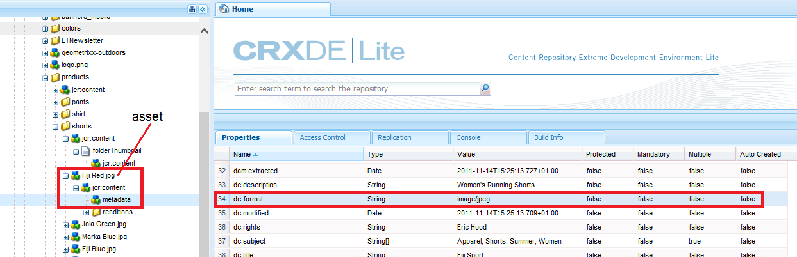
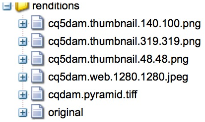

# Smart tag your assets {#smart-tag-assets}

## Overview of Smart Tags {#overview-of-enhanced-smart-tags}

Organizations that deal with digital assets increasingly use taxonomy-controlled vocabulary in asset metadata. Essentially, it includes a list of keywords that employees, partners, and customers commonly use to refer to and search for digital assets of a particular class. Tagging assets with taxonomy-controlled vocabulary ensures that they can be easily identified and retrieved by tag-based searches.

Compared to natural language vocabularies, tagging digital assets based on business taxonomy helps align them with a company's business and ensures that the most relevant assets appear in searches. For example, a car manufacturer can tag car images with model names so only relevant images appear when images of various models are searched to design a promotion campaign.

In the background, the Smart Content Service uses AI framework of [Adobe Sensei](https://www.adobe.com/sensei/experience-cloud-artificial-intelligence.html) to train its image recognition algorithm on your tag structure and business taxonomy. This content intelligence is then used to apply relevant tags on a different set of assets. Smart Content Service is a cloud service that is hosted on Adobe I/O. To use it in Adobe Experience Manager (AEM), the system administrator must integrate your AEM instance with Adobe I/O.

>[!NOTE]
>
>Smart Content Services are applicable only for Assets customers. The Smart Content Service is available for purchase as an add-on to Experience Manager.

<!--  -->

## Prerequisites {#prerequisites}

Before you can use the Smart Content Service, ensure the following to create an integration on Adobe I/O:

* An Adobe ID account that has administrator privileges for the organization.
* The Smart Content Service service is enabled for your organization.

## Configure Asset tagging using the Smart Content Service {#configure-asset-tagging-using-the-smart-content-service}

You can integrate Adobe Experience Manager (AEM) with the Smart Content Service using Adobe I/O. Use this configuration to access the Smart Content Service from within AEM.

The article details out the following key tasks that are required to configure the Smart Content Service. At the back end, the AEM server authenticates your service credentials with the Adobe IO gateway before forwarding your request to the Smart Content Service.

* Create a Smart Content Service configuration in AEM to generate a public key. Obtain public certificate for OAuth integration.
* Create an integration in Adobe I/O and upload the generated public key.
* Configure your AEM instance using the API key and other credentials from Adobe I/O.  
* Optionally, enable auto-tagging on asset upload.

### Obtain public certificate {#obtain-public-certificate}

A public certificate allows you to authenticate your profile on Adobe I/O.

1. From the AEM user interface, tap the AEM logo, and go to **[!UICONTROL Tools > Cloud Services]**> **[!UICONTROL Legacy Cloud Services]**.  

1. In the Cloud Services page, tap/click **[!UICONTROL Configure Now]** under **[!UICONTROL Assets Smart Tags]**.
1. In the **[!UICONTROL Create Configuration]** dialog, specify a title and name for the Smart Tags configuration. Tap/click **[!UICONTROL Create]**.
1. In the **[!UICONTROL AEM Smart Content Service]** dialog, use the following values:

   **[!UICONTROL Service URL]**: `https://mc.adobe.io/marketingcloud/smartcontent`

   **[!UICONTROL Authorization Server]**: `https://ims-na1.adobelogin.com`

   Leave the other fields blank for now (to be provided later). Tap/click **[!UICONTROL OK]**.

   

1. Tap/click **[!UICONTROL Download Public Certificate for OAuth Integration]**, and download the public certificate file `AEM-SmartTags.crt`.

   

### Reconfigure when the certificate expires {#certrenew}

When the certificate expires it is no longer trusted. To add a new certificate, follow these steps.

1. Log in your AEM deployment as an administrator. Click **[!UICONTROL Tools]** > **[!UICONTROL Security]** > **[!UICONTROL Users]**.  

1. Locate and click **[!UICONTROL dam-update-service]** user. Click on **[!UICONTROL Keystore]** tab.
1. Delete the existing **[!UICONTROL similaritysearch]** keystore with the expired certificate. Click **[!UICONTROL Save & Close]**.

   

   Delete existing similaritysearch entry in Keystore to add a new security certificate

1. Navigate to **[!UICONTROL Tools]** > **[!UICONTROL Cloud Services]** > **[!UICONTROL Legacy Cloud Services]**. Click **[!UICONTROL Asset Smart Tags]** > **[!UICONTROL Show Configuration]** > **[!UICONTROL Available Configurations]**. Click the required configuration.  

1. To download a public certificate, click **[!UICONTROL Download Public Certificate for OAuth Integration]**.
1. Access [https://console.adobe.io](https://console.adobe.io) and navigate to the existing Smart Content Services on the **[!UICONTROL Integrations]** page. Upload the new certificate. For more information, see the instructions in [Create Adobe I/O integration](#create-adobe-i-o-integration).

### Create Adobe I/O integration {#create-adobe-i-o-integration}

To use Smart Content Service APIs, create an integration in Adobe I/O to generate API Key, Technical Account Id, Organization Id, and Client Secret.

1. Access [https://console.adobe.io](https://console.adobe.io/).
1. From the **[!UICONTROL Integrations]** page, select your organization.
1. Tap/click **[!UICONTROL New Integration]**.
1. On the **[!UICONTROL Create a new integration]** page, select **[!UICONTROL Access an API]**. Tap/click **[!UICONTROL Continue]**.
1. Under **[!UICONTROL Experience Cloud]**, select **[!UICONTROL Smart Content]**. Tap/click **[!UICONTROL Continue]**.

   

1. On the next page, select **[!UICONTROL New integration]**. Tap/click **[!UICONTROL Continue]**.
1. On the **[!UICONTROL Integration Details]** page, specify a name for the integration gateway and add a description.
1. In the **[!UICONTROL Public keys certificates]**, upload `AEM-SmartTags.crt` file that you downloaded above.
1. Tap/click **[!UICONTROL Create Integration]**.
1. To view the integration information, tap/click **[!UICONTROL Continue to integration details]**.

   

### Configure Smart Content Service {#configure-smart-content-service}

To configure the integration, use the values of Technical Account ID, Organization Id, Client Secret, Authorization Server, and API key fields from the Adobe I/O integration. Creating a Smart Tags cloud configuration allows authentication of API requests from the AEM instance.

1. From the AEM user interface, tap/click the AEM logo. Navigate to **[!UICONTROL Tools > Cloud Service > Legacy Cloud Services]** to open the Cloud Services console.
1. Under the **[!UICONTROL Assets Smart Tags]**, open the configuration created above. On the service settings page, click **[!UICONTROL Edit]**.
1. In the **[!UICONTROL AEM Smart Content Service]** dialog, use the pre-populated values for the **[!UICONTROL Service URL]** and **[!UICONTROL Authorization Server]** fields.
1. For the fields **[!UICONTROL API Key]**, **[!UICONTROL Technical Account Id]**, **[!UICONTROL Organization Id]**, and **[!UICONTROL Client Secret]**, use the values generated above.

### Validate the configuration {#validate-the-configuration}

After you've completed the configuration, you can use a JMX MBean to validate the configuration. To validate, follow these steps.

1. Access your AEM server at `https://[server]:[port]`.  

1. Go to **[!UICONTROL Tools > Operations > Web Console]** to open the OSGi console. Click **[!UICONTROL Main > JMX]**.
1. Click **[!UICONTROL com.day.cq.dam.similaritysearch.internal.impl]**. It opens **[!UICONTROL SimilaritySearch Miscellaneous Tasks.]** 
1. Click **[!UICONTROL validateConfigs()]**. In the **[!UICONTROL Validate Configurations]** dialog, click **[!UICONTROL Invoke]**.

   The validation result is displayed in the same dialog.

### Enable smart tagging in the Update Asset workflow (Optional) {#enable-smart-tagging-in-the-update-asset-workflow-optional}

1. From the AEM user interface, tap/click the AEM logo, and go to **[!UICONTROL Tools > Workflow > Models]**.
1. On **[!UICONTROL Workflow Models]** page, select the **[!UICONTROL DAM Update Asset]** workflow model.
1. Tap/click **[!UICONTROL Edit]** from the toolbar.
1. Expand the Side Panel to display the steps. Drag **[!UICONTROL Smart Tag Asset]** step that is available in the DAM Workflow section and place it after the **[!UICONTROL Process Thumbnails]** step.

   

1. Open the step in edit mode. Under **Advanced Settings**, ensure that the **Handler Advance** option is selected.

   

1. In the **Arguments** tab, select **Ignore Errors** if you want the workflow to complete even if the automatic tagging step fails.

   

   To tag assets when they are uploaded irrespective of whether smart tagging is enabled on folders, select **Ignore Smart Tag Flag**.

   

1. Tap/click **OK** to close the process step, and then save the workflow.

## Onboarding {#onboarding}

The Smart Content Service is available for purchase as an add-on to AEM. After you purchase, an email is sent to the administrator of your organization with a link to Adobe I/O.

The administrator can follow the link to integrate the Smart Content Service with AEM. To integrate the service with AEM Assets, see [configure Smart Tags](#configure-asset-tagging-using-the-smart-content-service).

The onboarding process is complete when an administrator configures the service and adds users in AEM.

<!-- 
### Review assets and tags {#reviewing-assets-and-tags}

After you are onboarded, the first thing you want to do is identify a set of tags that best describe these images in the context of your business.

Next, review images to identify a set of images that best represent your product for a particular business requirement.

Add the assets to a folder and apply the tags to each asset from the properties page. Then, run the training workflow on this folder. The curated set of assets enables the Smart Content Service to effectively train more assets using your taxonomy definitions.

-->

## Manage smart tags and searches {#manage-smart-tags-and-searches}

You can curate smart tags to remove any inaccurate tags that may have been assigned to your brand images so only the most relevant tags are displayed.

Moderating Smart tags also helps refine tag-based searches for images by ensuring that your image appears in search results for the most relevant tags. Essentially, it helps eliminate the chances of unrelated images from showing up in search results.

You can also assign a higher rank to a tag to increase its relevance with respect to an image. Promoting a tag for an image increases the chances of the image appearing in search results when a search is performed based on the particular tag.

1. In the Omnisearch box, search for assets based on a tag.
1. Inspect the search results to identify an image that you don't find relevant to your search.
1. Select the image, and then click/tap the **[!UICONTROL Manage Tags]** icon from the toolbar.
1. From the **[!UICONTROL Manage Tags]** page, inspect the tags. If you don't want the image to be searched based on a specific tag, select the tag and then click/tap the delete icon from the toolbar. Alternatively, click/tap `X` symbol that appears beside the label.
1. To assign a higher rank to a tag, select the tag and click/tap the promote icon from the toolbar. The tag you promote, is moved to the **[!UICONTROL Tags]** section.
1. Click/tap **[!UICONTROL Save]**, and then click/tap **[!UICONTROL OK]** to close the Success dialog.
1. Navigate to the properties page for the image. Observe that the tag you promoted is assigned a high relevance and, therefore, appears higher in the search results.

### Understand AEM search results with smart tags {#understandsearch}

By default, AEM search combines the search terms with an `AND` clause. Using smart tags does not change this default behavior. Using smart tags adds an additional `OR` clause to find any of the search terms in the applies smart tags. For example, consider searching for `woman running`. Assets with just `woman` or just `running` keyword in the metadata do not appear in the search results by default. However, an asset tagged with either `woman` or `running` using smart tags appears in such a search query. So the search results are a combination of,

* assets with `woman` and `running` keywords in the metadata.

* assets smart tagged with either of the keywords.

The search results that match all search terms in metadata fields are displayed first, followed by the search results that match any of the search terms in the smart tags. In the above example, the approximate order of display of search results is:

1. matches of `woman running` in the various metadata fields.
1. matches of `woman running` in smart tags.
1. matches of `woman` or of `running` in smart tags.

<!-- 

## Training the Smart Content Service {#training-the-smart-content-service}

For the Smart Content Service to recognize your business taxonomy, run it on a set of assets that already include tags that are relevant to your business. After training, the service can apply the same taxonomy on a similar set of assets.

You can train the service multiple times to improve its ability to apply relevant tags. After each training cycle, run a tagging workflow and check whether your assets are tagged appropriately.

You can train the Smart Content Service periodically or on requirement basis.

>[!NOTE]
>
>The training workflow runs on folders only.

### Periodic training {#periodic-training}

You can enable the Smart Content Service to train periodically on the assets and associated tags within a folder. Open the properties page of your asset folder, select **[!UICONTROL Enable Smart Tags]** under the **[!UICONTROL Details]** tab, and save the changes.

Once this option is selected for a folder, AEM runs a training workflow automatically to train the Smart Content Service on the folder assets and their tags. By default, the training workflow runs on a weekly basis at 12:30 AM on Saturdays.

### On-demand training {#on-demand-training}

You can train the Smart Content Service whenever required from the Workflow console.

1. Tap/click the AEM logo, and go to **[!UICONTROL Tools > Workflow > Models]**.
1. From the **[!UICONTROL Workflow Models]** page, select the **[!UICONTROL Smart Tags Training]** workflow and then tap/click **[!UICONTROL Start Workflow]** from the toolbar.
1. In the **[!UICONTROL Run Workflow]** dialog, browse to the payload folder that includes the tagged assets for training the service.
1. Specify a title for the workflow and a add a comment. Then, tap/click **[!UICONTROL Run]**. The assets and tags are submitted for training.

>[!NOTE]
>
>Once the assets in a folder are processed for training, only the modified assets are processed in subsequent training cycles.

### Viewing training reports {#viewing-training-reports}

To check whether the Smart Content Service is trained on your tags in the training set of assets, review the training workflow report from the Reports console.

1. Tap/click the AEM logo, and go to **[!UICONTROL Tools > Assets > Reports]**.
1. In the **[!UICONTROL Asset Reports]** page, tap/click **[!UICONTROL Create]**.
1. Select the **[!UICONTROL Smart Tags Training]** report, and then tap/click **[!UICONTROL Next]** from the toolbar.
1. Specify a title and description for the report. Under **[!UICONTROL Schedule Report]**, leave the **[!UICONTROL Now]** option selected. If you want to schedule the report for later, select **[!UICONTROL Later]** and specify a date and time. Then, tap/click **[!UICONTROL Create]** from the toolbar.
1. In the **[!UICONTROL Asset Reports]** page, select the report you generated. To view the report, tap/click the **[!UICONTROL View]** icon from the toolbar.
1. Review the details of the report.

   The report displays the training status for the tags you trained. The green color in the **[!UICONTROL Training Status]** column indicates that the Smart Content Service is trained for the tag. Yellow color indicates that the service is not completely trained for a particular tag. In this case, add more images with the particular tag and run the training workflow to train the service completely on the tag.

   If you do not see your tags in this report, run the training workflow again for these tags.

1. To download the report, select it from the list, and tap/click the **[!UICONTROL Download]** icon from the toolbar. The report downloads as an Excel file.

## Tagging assets automatically {#tagging-assets-automatically}

After you have trained the Smart Content Service, you can trigger the tagging workflow to automatically apply appropriate tags on a different set of similar assets.

You can run the tagging workflow periodically or whenever required.

>[!NOTE]
>
>The tagging workflow runs on both assets and folders.

### Periodic tagging {#periodic-tagging}

You can enable the Smart Content Service to periodically tag assets within a folder. Open the properties page of your asset folder, select **[!UICONTROL Enable Smart Tags]** under the **[!UICONTROL Details]** tab, and save the changes.

Once this option is selected for a folder, the Smart Content Service automatically tags the assets within the folder. By default, the tagging workflow runs every day at 12:00 AM.

### On-demand tagging {#on-demand-tagging}

You can trigger the tagging workflow from the following to instantly tag your assets:

* Workflow console
* Timeline

>[!NOTE]
>
>If you run the tagging workflow from the timeline, you can apply tags on a maximum of 15 assets at a time.

#### Tagging assets from the Workflow console {#tagging-assets-from-the-workflow-console}

1. Tap/click the AEM logo, and go to **[!UICONTROL Tools > Workflow > Models]**.
1. From the **[!UICONTROL Workflow Models]** page, select the **[!UICONTROL DAM Smart Tags Assets]** workflow and then tap/click **[!UICONTROL Start Workflow]** from the toolbar.
1. In the **[!UICONTROL Run Workflow]** dialog, browse to the payload folder containing assets on which you want to apply your tags automatically.
1. Specify a title for the workflow and an optional comment. Then, tap/click **[!UICONTROL Run]**.

Navigate to the asset folder and review the tags to verify whether the Smart Content Service tagged your assets properly. For details, see [Managing Smart Tags](manage-smart-tags.md).

#### Tagging assets from the timeline {#tagging-assets-from-the-timeline}

1. From the Assets user interface, select the folder containing assets or specific assets to which you want to apply smart tags.
1. Tap/click the GlobalNav icon and open the timeline.
1. Tap/click the arrow at the bottom, and then tap/click **[!UICONTROL Start Workflow]**.
1. Select the **[!UICONTROL DAM Smart Tag Assets]** workflow, and specify a title for the workflow.
1. Tap/click **[!UICONTROL Start]**. The workflow applies your tags on assets. Navigate to the asset folder and review the tags to verify whether the Smart Content Service tagged your assets properly. For details, see [Managing Smart Tags](manage-smart-tags.md).

>[!NOTE]
>
>In the subsequent tagging cycles, only the modified assets are tagged again with newly-trained tags.
>
>However, even unaltered assets are tagged if the gap between the last and current tagging cycles for the tagging workflow exceeds 24 hours.
>
>For periodic tagging workflows, unaltered assets are tagged when the gap exceeds 6 months.

## Smart Content Service Training Guidelines {#smart-content-service-training-guidelines}

To be able to effectively tag your brand images, the Smart Content Service requires that the training images conform to certain guidelines. For best results, images in your training set should conform to the following guidelines:

**Quantity and size:** Minimum 30 images per tag. Minimum of 500 pixels on the longer side.

**Coherence**: Images for a tag should be visually similar.

For example, it is not a good idea to tag all of these images as `my-party` (for training) because they are not visually similar.

**Coverage**: There should be sufficient variety in the images in the training. The idea is to supply a few but reasonably diverse examples so that AEM learns to focus on the right things. If you're applying the same tag on visually dissimilar images, include at least five examples of each kind.

For example, for the tag *model-down-pose*, include more training images similar to the highlighted image below for the service to identify similar images more accurately during tagging.

**Distraction/obstruction**: The service trains better on images that have less distraction (prominent backgrounds, unrelated accompaniments, such as objects/persons with the main subject).

For example, for the tag *casual-shoe*, the second image is not a good training candidate.

**Completeness:** If an image qualifies for more than one tag, add all applicable tags before including the image for training. For example, for tags, such as *raincoat* and *model-side-view*, add both the tags on the eligible asset before including it for training.

### Training limitations {#limitations}

Enhanced smart tags are based on learning models of brand images and their tags. These models are not always perfect at identifying tags. The current version of the Smart Content Service has the following limitations:

* Inability to recognize subtle differences in images. For example, slim versus regular fitted shirts.
* Inability to identify tags based on tiny patterns/parts of an image. For example, logos on T-shirts.
* Tagging is supported in the locales that AEM is supported in. For a list of languages, see [Smart Content Services release notes](https://docs.adobe.com/content/help/en/experience-manager-64/release-notes/smart-content-service-release-notes.html).

To search for assets with smart tags (regular or enhanced), use the Assets Omnisearch (full-text search). There is no separate search predicate for smart tags. 

>[!NOTE]
>
>The ability of the Smart Content Service to train on your tags and apply them on other images depends on the quality of images you use for training. 
>
>For best results, Adobe recommends that you use visually similar images to train the service for each tag.

-->
