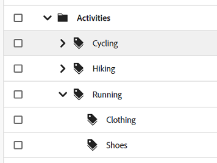
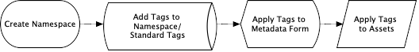
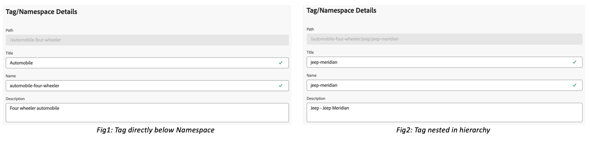
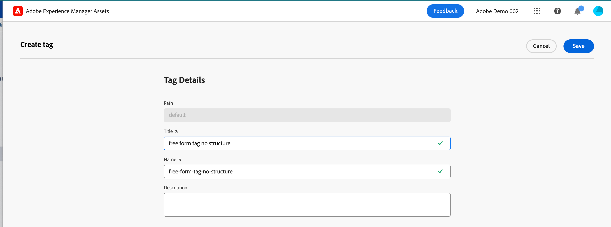
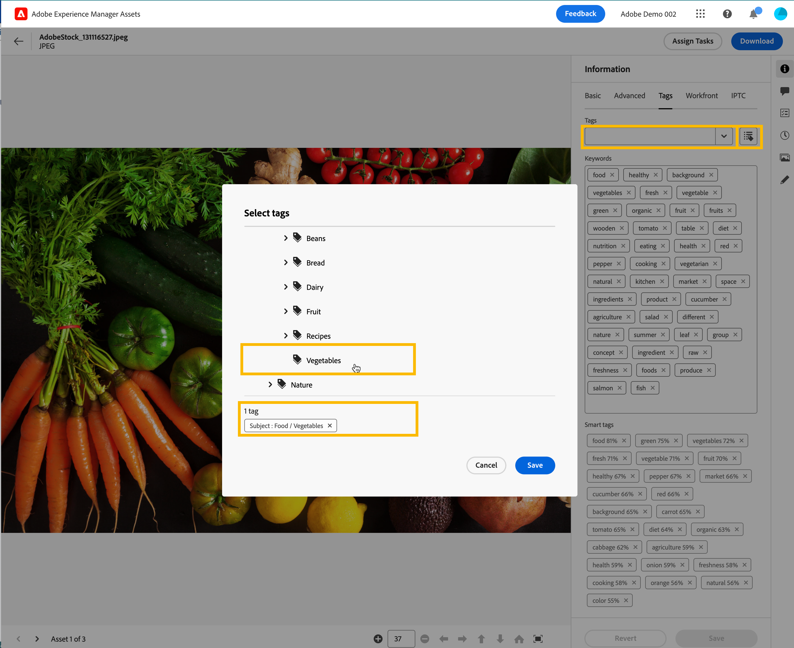
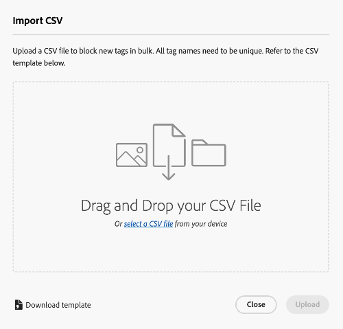

# Manage tags in Assets view {#view-assets-and-details}

<table>
    <tr>
        <td>
            <i>New</i> <a href="/help/assets/dynamic-media/dm-prime-ultimate.md"><b>Dynamic Media Prime and Ultimate</b></a>
        </td>
        <td>
            <i>New</i> <a href="/help/assets/assets-ultimate-overview.md"><b>AEM Assets Ultimate</b></a>
        </td>
        <td>
            <i>New</i> <a href="/help/assets/integrate-aem-assets-edge-delivery-services.md"><b>AEM Assets integration with Edge Delivery Services</b></a>
        </td>
        <td>
            <i>New</i> <a href="/help/assets/aem-assets-view-ui-extensibility.md"><b>UI Extensibility</b></a>
        </td>
          <td>
            <i>New</i> <a href="/help/assets/dynamic-media/enable-dynamic-media-prime-and-ultimate.md"><b>Enable Dynamic Media Prime and Ultimate</b></a>
        </td>
    </tr>
    <tr>
        <td>
            <a href="/help/assets/search-best-practices.md"><b>Search Best Practices</b></a>
        </td>
        <td>
            <a href="/help/assets/metadata-best-practices.md"><b>Metadata Best Practices</b></a>
        </td>
        <td>
            <a href="/help/assets/product-overview.md"><b>Content Hub</b></a>
        </td>
        <td>
            <a href="/help/assets/dynamic-media-open-apis-overview.md"><b>Dynamic Media with OpenAPI capabilities</b></a>
        </td>
        <td>
            <a href="https://developer.adobe.com/experience-cloud/experience-manager-apis/"><b>AEM Assets developer documentation</b></a>
        </td>
    </tr>
</table>

>[!CONTEXTUALHELP]
>id="assets_taxonomy_management"
>title="Manage Tags"
>abstract="Tags help you categorize assets that can be browsed and searched more efficiently. Administrators can use the hierarchical tagging structure, which facilitates applying relevant metadata, categorizing assets, supporting search, reusing tags, improving discoverability, and so on."

Tags help you categorize assets that can be browsed and searched more efficiently. Tagging helps in propagating the appropriate taxonomy to other users and workflows.

Flat lists of controlled vocabularies can become unmanageable over time. Administrators can use the hierarchical tagging structure, which facilitates applying relevant metadata, categorizing assets, supporting search, reusing tags, improving discoverability, and so on.

You can create a namespace at the root-level and create a hierarchical structure of subtags within the namespace. For example, you can create an `Activities` namespace at the root-level and have `Cycling`, `Hiking`, and `Running` tags within the namespace. You can have further subtags `Clothing` and `Shoes` within `Running`.

Tagging provides many benefits, such as:

* Tagging allows authors to easily organize dissimilar assets through a common taxonomy. Authors can quickly search and organize assets by common tags.

* Hierarchical tags are extremely flexible and are an excellent way of organizing terms in a logical way. Through namespaces, tags, and sub-tags, entire taxonomic systems can be represented.

* Tags may evolve over time as an organizational vocabulary changes.

* Tags managed in Admin view remain in sync with the tags managed in Assets view, which ensures metadata governance and integrity.

To be able to apply tags to assets, you must first create a namespace and then create and add tags to it. You can also create tags and add them to an existing namespace. Any tags that you create at the root-level are automatically added to the Standard Tags namespace. You can then add the Tags field to the metadata form so that it displays on the Asset details page. After configuring these settings, you can start applying tags to assets.

>[!NOTE]
>
>You need to add the Tags field to the metadata form only if you are not using the default metadata form.

Additional capabilities beyond what is mentioned in this article including merging, renaming, localizing, and publishing tags are available in the Admin view. 

## Create a Namespace {#create-a-namespace}

A Namespace is a container for tags that can exist only at the root-level. You can start setting up the hierarchical structure of tags by first defining a logical name for the Namespace. If you do not add a tag to any of the existing Namespaces, the tag moves to Standard Tags automatically. 

Execute the following steps to create a Namespace:

1. Go to `Taxonomy Management` under `Settings` to view the list of existing Namespaces. You can also view the last modified date, the user who modified the Namespace or tags under it, and the number of times the tag is used in an asset.
1. Click `Create Namespace`.
1. Add `Title`, `Name`, and `Description` for the Namespace. The input that you specify in the `Title` field gets displayed at the top of the hierarchy. For example, in the following image, **Activities** refers to the title of the Namespace.

    

1. Click `Save`.

## Add Tags to a Namespace {#add-tags-to-namespace}

Execute the following steps to add tags to a Namespace:

1. Go to **[!UICONTROL Taxonomy Management]**.
1. Select the Namespace and click `Create` to create the tag at the top level under the Namespace. If you need to create a subtag under a tag that exists in a Namespace, select the tag and then click `Create`. 
  

    In this example, the image on the left represents the tag directly under the Namespace `automobile-four-wheeler` displayed in the `Path` field. The image on the right is an example of subtags added within a tag, as there are more tag names, `jeep` and `jeep-meridian`, displayed in the `Path` field in addition to the Namespace.
1. Specify the title, name, and description for the tag and click `Save`.

    >[!NOTE]
    >
    >* The `Title` and `Name` fields are mandatory while the `Description` field is optional. 
    >* By default, the tool copies the text that you type in the Title field, removes the blank spaces or special characters (. & / \ : * ? [ ] | " %), and stores it as the Name. 
    >* You can update the `Title` field later but the `Name` field is read-only.

## Add Tags to Standard Tags {#add-tags-to-standard-tags}

Unstructured Tags or the tags that do no have any hierarchy are stored under `Standard Tags` namespace. Moreover, when you want to add additional descriptive terms without affecting governed taxonomy, you can store that value under `Standard Tags`. You can move these values under structured namespaces over time. Furthermore, you can use the `Standard Tags` namespace as a free form entry for keywords.

To create a standard tag, click `Create Tag` at the root-level. Specify title, name, and description and then click `Save`.

>[!NOTE]
>
>If you delete `Standard Tags` namespace using Assets as a Cloud Service, the tags created at the root-level do not display in the list of available tags. 

## Move Tags {#move-tags}

In case you store your tags under the wrong hierarchy or your taxonomy changes over the time, you can move the selected tags to maintain data integrity. The following conditions must be considered while moving tags:

* Tags can only move beneath existing namespaces or within an existing tag hierarchy.
* Tags cannot be moved to the root to become a namespace.
* Moving a parent tag also moves all child tags stored in the hierarchy.

Perform the following steps to move tags from one location to another:

1. Select the tag or the entire hierarchy of tags under the appropriate namespace and click `Move`.
1. On the Move dialog, select the new destination tag or Namespace using the `Select Tag` section.
1. Click `Save`. The tag displays at its new location.

## Edit Tags {#edit-tags}

To edit the title of the tag, select the tag and click `Edit`. Specify the new title and click `Save`.

>[!NOTE]
>
>* The `Name` of a tag cannot be updated. The root path for a tag is also based on the name of the tag. The path remains the same even if you update the `Title` field. 
>* Additional operations such as merge, localize, and publish are available in Assets as a Cloud Service.

## Delete Tags {#delete-tags}

You can delete multiple Namespaces or tags simultaneously. The delete operation cannot be undone. 

Perform the following steps to delete tags:

1. Select the Namespace or tag and click `Delete`.
1. Click `Confirm`.

>[!NOTE]
>
>* Deleting the parent tag or Namespace also deletes the subtags stored in the hierarchy. If you need to delete or update the parent Namespace, it is recommended to [move your tags](#moving-tags) to the new destination before deleting the parent hierarchy.
>* Deleting a tag also deletes all its references from assets.
>* You cannot delete Standard Tags that exist at the root level.

## Add Tags component to the Metadata form {#add-tags-to-metadata-form}

The tags component gets added to the `default` metadata form automatically. You can design a [Metadata form](https://experienceleague.adobe.com/docs/experience-manager-assets-essentials/help/metadata.html?lang=en#metadata-forms) either by using a template or from scratch. If you are not using an existing Metadata form template, then you can modify your Metadata form  and add the tags component. The metadata property mapping is filled in automatically and cannot be modified at this time. [!DNL Assets as a Cloud Service] users can update the mapping to store tag values using custom namespaces and expose only subsets of hierarchies using root paths.

Watch this quick video to see how to add the Tags component to your metadata form:

>[!VIDEO](https://video.tv.adobe.com/v/3420452)

### Add Tags to Assets {#add-tags-to-assets}

1. Go to Asset details page and navigate to the `Tags` section of Metadata form.
1. Select the tag picker icon which is next to the Tags field or start typing in a tag name to see suggested results. 

    

1. Select one or more tags. The subtag is selected automatically along with the parent tag or namespace.
Tags modified in the Assets Essentials are applied in Assets as a Cloud Service as well.

## Add tags to blocklist {#blocklist-essentials}

[!DNL Assets view] enables you to configure a blocklist that includes words that should not be added as Smart Tags to assets when they are uploaded to the repository. This capability helps you to maintain brand compliance and reduces effort to moderate Smart Tags.
<!--
### Block smart tags for single asset {#block-smart-tags-for-single-asset}

-->

### Block smart tags for all assets {#block-smart-tags-for-all-assets}

[!DNL Assets view] allows an admin to block smart tags for the existing and the newly added assets. To block tags, execute the following steps:

1. Navigate to **[!UICONTROL Blocked Tags]** under **[!UICONTROL Settings]**.
1. Click **[!UICONTROL Add blocked tag]**.
1. Type the tags in the textbox that you need to block and click **[!UICONTROL Enter]**.
1. Once you are done with adding tags, click **[!UICONTROL Add]**. The entered tags get listed in the blocked tags list.

   >[!NOTE]
   >
   >You can add a maximum of 25 tags to the list at once. Repeat the steps to add more tags to the blocklist.

You can also block smart tags for a single asset. Navigate to the details of an asset. Under **[!UICONTROL Tags]** tab, remove the unwanted smart tags and click **[!UICONTROL Save]**. The tags are listed in the blocklist for the selected asset.

### Actions performed on blocklist {#blocklist-actions}

* **Remove tags:** You can also remove the tags from blocklist. To do this, select one or more tags that you want to remove. Click **[!UICONTROL Remove]**. You can remove a maximum of 25 tags from the list at once.
* **Select all:** Select the checkbox adjacent to **Tag Name** to select all the tags in the blocklist.
* **Sorting:** You can sort the blocklist in either ascending or descending order. To do this, click arrow adjacent to **Tag Name**.

   

  >[!NOTE]
  >
  >Do not use special characters while adding a tag in the blocklist. Characters such as a-z, A-Z, 0-9, and - can be used.

### Export blocklist{#export-blocklist}

Assets view allows you to export the listed blocked tags into CSV format. To export blocklist, execute the steps below:

1. Click **[!UICONTROL Export as CSV]**.
1. Choose the appropriate location to save the CSV file. You can also rename the file as per the requirement.
1. Click **[!UICONTROL Save]**. The exported list in CSV format gets downloaded at the selected location.

### Import blocklist{#import-blocklist}

Assets view provides the ability to import blocked tags from a data source (CSV). To import blocklist, execute the steps below:

1. Click **[!UICONTROL Import as CSV]**.
1. Choose the CSV file from your device. Click **[!UICONTROL select a file]** to navigate to the file from your device. Alternatively, you can drag and drop the CSV file from your device.
1. Click **[!UICONTROL Upload]**. The tags from the CSV file are listed in the blocked tags list.

    

In case you want to download a blocked tags template, follow the steps below: 

1. Click **[!UICONTROL Download Template]**. 
1. Choose the appropriate location to save the CSV file. You can also rename the file as per the requirement. 
1. Click **[!UICONTROL Save]**. Block tags template in CSV format are downloaded at the selected location.
