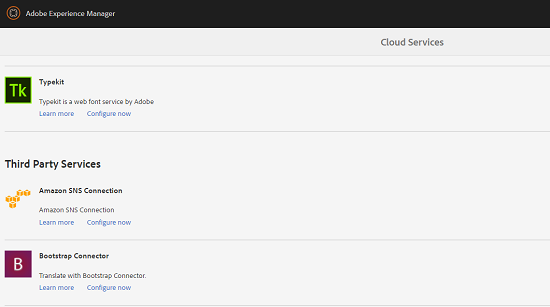

# Translate assets in AEM {#multilingual-assets}

| [Search Best Practices](/help/assets/search-best-practices.md) |[Metadata Best Practices](/help/assets/metadata-best-practices.md)|[Content Hub](/help/assets/product-overview.md)|[Dynamic Media with OpenAPI capabilities](/help/assets/dynamic-media-open-apis-overview.md)|[AEM Assets developer documentation](https://developer.adobe.com/experience-cloud/experience-manager-apis/)|
| ------------- | --------------------------- |---------|----|-----|

| Version | Article link |
| -------- | ---------------------------- |
| AEM 6.5  |    [Click here](https://experienceleague.adobe.com/docs/experience-manager-65/assets/using/multilingual-assets.html?lang=en)                  |
| AEM as a Cloud Service     | This article         |

Multilingual assets means assets with binaries, metadata, and tags in multiple languages. Generally, binaries, metadata, and tags for assets exist in one language, which are then translated to other languages for use in multilingual projects. Adobe Experience Manager Assets lets you automate workflows to translate assets (including binaries, metadata, and tags) to generate assets in other languages for use in multilingual projects.

To automate AEM asset translation, you integrate translation service providers with Experience Manager and create projects for translating assets into multiple languages. Experience Manager supports human and machine translation workflows.

Human asset translation in AEM: The translated assets are returned and imported into Experience Manager. When your translation provider is integrated with Experience Manager, assets are automatically sent between Experience Manager and the translation provider.

Machine asset translation in AEM: The machine translation service immediately translates the metadata and tags for assets.

<!--
We have multiple articles around translation of assets. For now, dumping all content in this article to remove others and create only ONE UBER article.

https://experienceleague.adobe.com/docs/experience-manager-65/assets/managing/translation-projects.html
https://experienceleague.adobe.com/docs/experience-manager-65/assets/managing/preparing-assets-for-translation.html
[Apply translation cloud services to folders](https://experienceleague.adobe.com/docs/experience-manager-65/assets/managing/transition-cloud-services.html)

One of these articles is a copy of [Preparing Content for Translation](https://experienceleague.adobe.com/docs/experience-manager-65/administering/introduction/tc-prep.html

-->

<!-- 
Translating assets includes the following:

1. [Connecting Experience Manager with the translation service provider](/help/sites-administering/tc-tic.md#connecting-to-a-translation-service-provider)
1. [Creating translation integration framework configurations](/help/sites-administering/tc-tic.md)
1. [Preparing assets for translation](prepare-assets-for-translation.md)
1. [Applying translation cloud services to folders](transition-cloud-services.md)
1. [Create translation projects](translation-projects.md)

If your translation service provider does not provide a connector to integrate with Experience Manager, use an [alternative process](/help/sites-administering/tc-manage.md#exporting-a-translation-job).

Also see, [Creating translation projects for content fragments](creating-translation-projects-for-content-fragments.md).

-->

## Prepare to translate assets {#prepare-to-translate-assets}

Multilingual assets means assets with binaries, metadata, and tags in multiple languages. Generally, binaries, metadata, and tags for assets exist in one language, which are then translated to other languages for use in multilingual projects.

In Adobe Experience Manager Assets, multilingual assets are included in folders, where each folder contains the assets in a different language.

Each language folder is called a language copy. The root folder of a language copy, known as the language root, identifies the language of the content in the language copy. For example, `/content/dam/it` is the Italian language root for the Italian language copy. Language copies must use a [correctly configured language root](#create-a-language-root) so that the correct language is targeted when translations of source assets are performed.

The language copy for which you originally add assets is the language primary. The language primary is the source that is translated into other languages. A sample folder hierarchy includes several language roots:

```shell
/content
    /- dam
        |- en
        |- fr
        |- de
        |- es
        |- it
        |- ja
        |- zh
```

Perform the following steps for preparing to translate assets:

1. Create the language root of your language primary. For example, the language root of the English language copy in the sample folder hierarchy is `/content/dam/en`. Ensure that the language root is correctly configured according to the information in [Create a language root](#create-a-language-root).

1. Add assets to your language primary.
1. Create the language root of each target language for which you require a language copy.

### Create a Language Root {#create-a-language-root}

To create the language root, you create a folder and use an ISO language code as the value for the Name property. After you create the language root, you can create a language copy at any level within the language root.

For example, the root page of the Italian language copy of the sample hierarchy has `it` as the Name property. The Name property is used as the name of the asset node in the repository, and therefore determines the path of the assets. (*&lt;server&gt;:&lt;port&gt;/assets.html/content/dam/it/*)

1. From the Assets console, select **[!UICONTROL Create]** and choose **[!UICONTROL Folder]** from the menu.
1. In the Name field type the country code in the format of `<language-code>`.
1. Select **[!UICONTROL Create]**. The language root is created in the Assets console.

### View language roots {#view-language-roots}

The touch-optimized UI provides a References panel that shows a list of language roots that have been created within [!DNL Assets].

1. In the Assets console, select the language primary for which you want to create language copies.
1. Select the GlobalNav icon, and choose **[!UICONTROL References]** to open the Reference pane.
1. In the References pane, select **[!UICONTROL Language Copies]**. The Language Copies panel shows the language copies of the assets.

### Create a new translation project {#create-a-new-translation-project}

If you use this option, assets to be translated are copied to the language root of the language to which you want to translate. Depending upon the options you choose, a translation project is created for the assets in the Projects console. Depending on the settings, the translation project can be started manually or runs automatically as soon as the translation project is created.

1. In the Assets UI, select the source folder for which you want to create a Language copy.
1. Open the **[!UICONTROL References]** pane and select **[!UICONTROL Language Copies]** under **[!UICONTROL Copies]**.
1. Select **[!UICONTROL Create & Translate]** at the bottom.
1. From the **[!UICONTROL Target Languages]** list, select the languages for which you want to create a folder structure.
1. From the **[!UICONTROL Project]** list, select **[!UICONTROL Create a new translation project]**.
1. In the **[!UICONTROL Project Title]** field, enter a title for the project.
1. Select on **[!UICONTROL Create]**. Assets from the source folder are copied to the target folders for the locales you selected in step 4.
1. To navigate to the folder, select the language copy, and click **[!UICONTROL Reveal in Assets]**.
1. Navigate to the Projects console. The translation folder is copied to the Projects console.
1. Open the folder to view the translation project.
1. Select the project to open the details page.
1. To view the status of the translation job, click the ellipsis at the bottom of the **[!UICONTROL Translation Job]** tile. <!-- For more details around job statuses, see [Monitoring the Status of a Translation Job](/help/sites-administering/tc-manage.md#monitoring-the-status-of-a-translation-job). -->
1. In the Assets user interface, open the Properties page for each of the translated assets to view the translated metadata.

>[!NOTE]
>
>This feature is available both for assets and folders. When an asset is selected instead of a folder, the entire hierarchy of folders up to the language root is copied to create a language copy for the asset.

### Add to an existing translation project {#add-to-existing-translation-project}

If you use this option, the translation workflow runs for assets that you add to the source folder after running a previous translation workflow. Only the newly added assets are copied to the target folder that contains previously translated assets. No new translation project is created in this case.

1. In the Assets UI, navigate to the source folder that contains untranslated assets.
1. Select an asset you want to translate, and open the **[!UICONTROL Reference pane]**. The **[!UICONTROL Language Copies]** section displays the number of translation copies that are currently available.
1. Select **[!UICONTROL Language Copies]** under **[!UICONTROL Copies]**. A list of available translation copies is displayed.
1. Select **[!UICONTROL Create & Translate]** at the bottom.
1. From the **[!UICONTROL Target Languages]** list, select the languages for which you want to create a folder structure.
1. From the **[!UICONTROL Project]** list, select **[!UICONTROL Add to existing translation project]** to run the translation workflow on the folder.
   >[!NOTE]
   >
   >If you choose the **[!UICONTROL Add to existing translation project]** option, your translation project is added to a pre-existing project only if your project settings exactly match the settings of the pre-existing project. Otherwise, a new project is created.
1. From the **[!UICONTROL Existing translation project]** list, select a project to add the asset for translation.
1. Select **[!UICONTROL Create]**. The assets to be translated are added to the target folder. The updated folder is listed under the **[!UICONTROL Language Copies]** section.
1. Navigate to the Projects console, and open the existing translation project you added to.
1. Select the translation project view the project details page.
1. Select the ellipsis at the bottom of the **Translation Job** tile to view the assets in the translation workflow. The translation job list also displays entries for asset metadata and tags. These entries indicate that the metadata and tags for the assets are also translated.

   >[!NOTE]
   >
   >* If you delete the entry for tags or metadata, no tags or metadata are translated for any of the assets.
   >* If you use Machine Translation, asset binaries aren't translated.
   >* If the asset you add to the translation job includes subassets, select the subassets and remove them for the translation to proceed without any glitches.

1. To start the translation for the assets, select the arrow on the **[!UICONTROL Translation Job]** tile and select **[!UICONTROL Start]** from the list. A message notifies the commencement of the translation job.
1. To view the status of the translation job, select the ellipsis at the bottom of the **[!UICONTROL Translation Job]** tile. <!-- For more details, see [Monitoring the Status of a Translation Job](/help/sites-administering/tc-manage.md#monitoring-the-status-of-a-translation-job). -->
1. After the translation completes, the status changes to Ready to Review. Navigate to the Assets UI, and open the Properties page for each of the translated assets to view the translated metadata.

### Update language copies {#update-language-copies}

Run this workflow to translate any additional set of assets and include it in a language copy for a particular locale. In this case, the translated assets are added to the target folder that already contains previously translated assets. Depending on the choice of options, a translation project is created or an existing translation project is updated for the new assets. The Update language copies workflow includes the following options:

* Create a new translation project
* Add to existing translation project

### Add to existing translation project {#add-to-existing-translation-project-1}

If you use this option, the set of assets are added to an existing translation project to update the language copy for the locale you choose.

1. From the Assets UI, select the source folder where you added an asset folder.
1. Open the **[!UICONTROL References pane]**, and select **[!UICONTROL Language Copies]** under **[!UICONTROL Copies]** to display the list of language copies.
1. Select the check box before **[!UICONTROL Language Copies]**, which selects all language copies. Unselect other copies except the language copy (copies) corresponding to the locale(s) to which you want to translate.
1. Select **[!UICONTROL Update language copies]** at the bottom.
1. From the **[!UICONTROL Project]** list, choose **[!UICONTROL Add to existing translation project]**.
1. From the **[!UICONTROL Existing translation project]** list, select a project to add the asset for translation.
1. Select **[!UICONTROL Start]**.
1. See steps 9-14 of [Add to existing translation project](#add-to-existing-translation-project) to complete the rest of the procedure.

### Create temporary language copies {#creating-temporary-language-copies}

When you run a translation workflow to update a language copy with edited versions of original assets, the existing language copy is preserved until you approve the translated assets. [!DNL Assets] stores the newly translated assets at a temporary location and updates the existing language copy after you explicitly approve the assets. If you reject the assets, the language copy remains unchanged.

1. Select the source root folder under **[!UICONTROL Language Copies]** for which you already created a language copy, and then select **[!UICONTROL Reveal in Assets]** to open the folder in [!DNL Assets].
1. From the Assets UI, select an asset you already translated and select the **[!UICONTROL Edit]** icon from the toolbar to open the asset in edit mode.
1. Edit the asset and then save the changes.
1. Perform steps 2-14 of the [Add to existing translation project](#add-to-existing-translation-project) procedure to update the language copy.
1. Select the ellipsis at the bottom of the **[!UICONTROL Translation Job]** tile. From the list of assets in the **[!UICONTROL Translation Job]** page, you can clearly view the temporary location where the translated version of the asset is stored.
1. Select the checkbox next to **[!UICONTROL Title]**.
1. From the toolbar, select **[!UICONTROL Accept Translation]** and then select **[!UICONTROL Accept]** in the dialog to overwrite the translated asset in the target folder with the translated version of the edited asset.

   >[!NOTE]
   >
   >To enable the translation workflow to update the destination assets, accept both the asset and metadata.

   Select **[!UICONTROL Reject Translation]** to retain the originally translated version of the asset in the target locale root and reject the edited version.

1. Navigate to the Assets console, and open the Properties page for each of the translated assets to view the translated metadata.

<!-- TBD: Possibly this blog was not migrated. Still try to find from the author. Old one is archived at https://web.archive.org/web/20180423042713/https://blogs.adobe.com/experiencedelivers/experience-management/translate_aemassets_metadata/

For tips on translating metadata for assets efficiently, see [5 Steps to efficiently translate metadata](https://blogs.adobe.com/experiencedelivers/experience-management/translate_aemassets_metadata/). 
-->

## Create translation projects {#creating-translation-projects}

To create a language copy, trigger one of the following language copy workflows available under the References rail in the Assets UI:

**Create and translate**

In this workflow, assets to be translated are copied to the language root of the language to which you want to translate. In addition, depending upon the options you choose, a translation project is created for the assets in the Projects console. Depending on the settings, the translation project can be started manually or allowed to run automatically as soon as the translation project is created.

**Update language copies**

You run this workflow to translate an additional group of assets and include it in a language copy for a particular locale. In this case, the translated assets are added to the target folder that already contains previously translated assets.

>[!NOTE]
>
>Asset binaries are translated only if the translation service provider supports the translation of binaries.

>[!NOTE]
>
>If you launch a translation workflow for complex assets, such as PDF files and Adobe InDesign files, their subassets or renditions (if any) are not submitted for translation.

### Create and translate workflow {#create-and-translate-workflow}

You use the create and translate workflow to generate language copies for a particular language for the first time. The workflow provides the following options:

* Create structure only
* Create a new translation project
* Add to existing translation project

### Create structure only {#create-structure-only}

Use the **Create structure only** option to create a target folder hierarchy within the target language root to match the hierarchy of the source folder within the source language root. In this case, source assets are copied to the destination folder. However, no translation project is generated.

1. In the Assets UI, select the source folder for which you want to create a structure in the target language root.
1. Open the **[!UICONTROL References]** pane and select **[!UICONTROL Language Copies]** under **[!UICONTROL Copies]**.
1. Select **[!UICONTROL Create & Translate]** at the bottom.
1. From the **[!UICONTROL Target Languages]** list, select the language for which you want to create a folder structure.
1. From the **[!UICONTROL Project]** list, choose **[!UICONTROL Create structure only]**.
1. Select **[!UICONTROL Create]**. The new structure for the target language is listed under **[!UICONTROL Language Copies]**.
1. Select the structure from the list, and then select **[!UICONTROL Reveal in Assets]** to navigate to the folder structure within the target language.

## Apply translation cloud services to folders {#applying-translation-cloud-services-to-folders}

Adobe Experience Manager lets you avail cloud-based translation services from the translation provider of your choice to ensure your assets are translated based on your requirements.

You can apply the translation cloud service directly to your asset folder so they can be utilized during translation workflows.

### Apply the translation services {#applying-the-translation-services}

Applying translation cloud services directly to your asset folder eliminates the need to configure translation services when you create or update translation workflows.

1. From the Assets user interface, select the folder to which you want to apply translation services.
1. From the toolbar, select the **[!UICONTROL Properties]** icon to display the **[!UICONTROL Folder Properties]** page.

   

1. Navigate to the **[!UICONTROL Cloud Services]** tab.
1. From the Cloud Service Configurations list, choose the desired translation provider. For example, if you want to avail translation services from Microsoft, choose **[!UICONTROL Microsoft Translator]**.

   

1. Choose the connector for the translation provider.

   

1. From the toolbar, select **[!UICONTROL Save]**, and then click **[!UICONTROL OK]** to close the dialog.The translation service is applied to the folder.

### Apply custom translation connector {#applying-custom-translation-connector}

If you want to apply a custom connector for the translation services you want to use in translation workflows. To apply a custom connector, first install the connector from [Package Manager](/help/implementing/developing/tools/package-manager.md). Then, configure the connector from the Cloud Services console. After you configure the connector, it is available in the list of connectors in the Cloud Services tab described in [Applying the translation services](#applying-the-translation-services). After you apply the custom connector and run translation workflows, the **[!UICONTROL Translation Summary]** tile of the translation project displays the connector details under the heads **[!UICONTROL Provider]** and **[!UICONTROL Method]**.

1. Install the connector from [Package Manager](/help/implementing/developing/tools/package-manager.md).
1. Select the Experience Manager logo, and navigate to **[!UICONTROL Tools > Deployment > Cloud Services]**.
1. Locate the connector you installed under **[!UICONTROL Third Party Services]** in the **[!UICONTROL Cloud Services]** page.

   

1. Select the **[!UICONTROL Configure now]** link to open the **[!UICONTROL Create Configuration]** dialog.

   

1. Specify a title and a name for the connector, and then select **[!UICONTROL Create]**. The custom connector is available in the list of connectors in the **[!UICONTROL Cloud Services]** tab described in step 5 of [Applying the translation services](#applying-the-translation-services).
1. Run any translation workflow described in creating translation projects after you apply the custom connector. Verify the details of the connector in the **[!UICONTROL Translation Summary]** tile of the translation project in the **[!UICONTROL Projects]** console.

   

**See also**

* [Assets HTTP API](mac-api-assets.md)
* [Assets supported file formats](file-format-support.md)
* [Search assets](search-assets.md)
* [Connected assets](use-assets-across-connected-assets-instances.md)
* [Asset reports](asset-reports.md)
* [Metadata schemas](metadata-schemas.md)
* [Download assets](download-assets-from-aem.md)
* [Manage metadata](manage-metadata.md)
* [Search facets](search-facets.md)
* [Manage collections](manage-collections.md)
* [Bulk metadata import](metadata-import-export.md)
* [Publish Assets to AEM and Dynamic Media](/help/assets/publish-assets-to-aem-and-dm.md)
