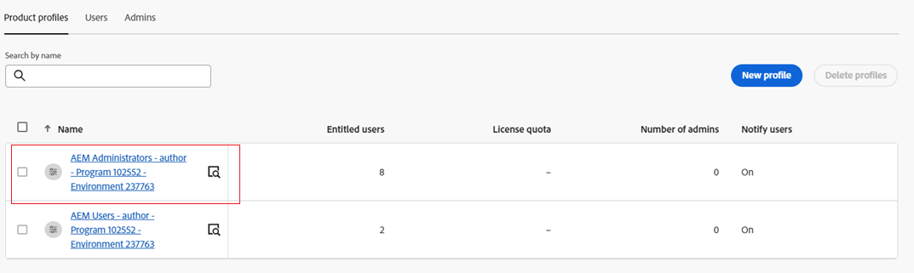

# Upgrade to [!DNL Assets] as a Cloud Service Ultimate package  {#assets-upgrade-ultimate-package}

| [Search Best Practices](/help/assets/search-best-practices.md) |[Metadata Best Practices](/help/assets/metadata-best-practices.md)|[Content Hub](/help/assets/product-overview.md)|[Dynamic Media with OpenAPI capabilities](/help/assets/dynamic-media-open-apis-overview.md)|[AEM Assets developer documentation](https://developer.adobe.com/experience-cloud/experience-manager-apis/)|
| ------------- | --------------------------- |---------|----|-----|

Assets as a Cloud Service Ultimate package enables you to perform various key DAM capabilities, such as, advanced asset management operations, including, custom schema, metadata translations, custom processing profiles, Custom workflow management, API-driven UI extensibility, advanced reporting, integrations with adobe and non-adobe applications, and many more. See [Assets as a Cloud Service Ultimate package](/help/assets/user-types-privileges.md) for the complete list.

This article provides an end-to-end workflow to either enable the Ultimate package for new users or upgrade your Assets as a Cloud Service environment to the Ultimate package, for existing users.

## Enable Assets as a Cloud Service Ultimate package for new users {#enable-assets-ultimate-package-new-users}

The new Assets as a Cloud Service users must first enable the Assets Ultimate package while creating the new program using Cloud Manager. Execute the following steps:

1. Log on to Cloud Manager. Ensure that you select the right organization while logging in.

1. [Create a new program](/help/journey-onboarding/create-program.md) and [add environments](/help/journey-onboarding//create-environments.md) to it.

   While creating the new program, in **[!UICONTROL Solutions & Add-ons]** tab, select **[!UICONTROL Assets Ultimate]**. You can also expand **[!UICONTROL Assets Ultimate]** and select **[!UICONTROL Content Hub]** to enable [Content Hub](/help/assets/product-overview.md) for asset distribution.

   

1. Click **[!UICONTROL Create]** to create the program. Assets Ultimate package is now enabled for Experience Manager Assets as a Cloud Service.

Your AEM as a Cloud Service instance on Admin Console comprises the following product profiles:

* AEM Administrators

* AEM Users

* AEM Assets Collaborator Users

* AEM Assets Power Users

If you have enabled Content Hub for Assets as a Cloud Service, there is a new instance created within AEM Assets as a Cloud Service on Admin Console with `delivery` as the suffix:

>[!NOTE]
>
>If you have provisioned Content Hub before August 14, 2024, the new instance is created with `contenthub` as the suffix.

Note that there is no `author` or `publish` in the instance name for Content Hub.

Click the instance name to view the `AEM Assets Limited Users` Content Hub product profile.

>[!NOTE]
>
>If you have provisioned Content Hub before August 14, 2024, the Content Hub product profile has `contenthub` mentioned after `Limited Users` instead of `delivery`.

## Enable Assets as a Cloud Service Ultimate package for existing users {#enable-assets-ultimate-package-existing-users}

Existing Assets as a Cloud Service users can upgrade to Assets ultimate by executing two simple steps. You can navigate to the Assets as a Cloud Service program in Cloud Manager and see upgrade status on the Program card based on the availability of credits. If there are enough credits available for upgrade to Assets Ultimate, you can see the status as `Assets license upgrade available`, as depicted in the following image:

In case of, the upgrade status can also display `Assets license upgrade required`.

### Prerequisites for upgrade {#prerequisites-assets-upgrade}

Latest AEM as a Cloud Service release version or a minimum of x release version. If you do not meet the minimum requirements, contact Adobe support to switch to the required AEM release version.

### Upgrade to Assets Ultimate {#upgrade-assets-ultimate}

Execute the following steps:

1. After switching to the minimum requirements for the AEM release version, click the program name. An Upgrade card displays just above **[!UICONTROL Environments]** section, as depicted in the following image:

   

1. Click **[!UICONTROL Add Product Profiles]**. Cloud Manager displays options to add new product profiles to all environments available in the program or individual environments.

   

1. Click **[!UICONTROL All Environments]** to add the new product profiles to all environments in the program or **[!UICONTROL Individual Environments]** to add the new product profiles to selected environments.

   Clicking **[!UICONTROL Individual Environments]** displays the list of all environments available in the program.

1. Click the More Options icon corresponding to an environment and select **[!UICONTROL Add Product Profiles]** to add the new product profiles to the selected environment.

   

   You can also add product profiles to selected environments by navigating to the **[!UICONTROL Environments]** section, clicking the More Options icon corresponding to an environment, and selecting **[!UICONTROL Add Product Profiles]**.

   

   The status of the environment displays `Updating Product Profiles` while the new product profiles are being added and subsequently displays `Running` when the process id=s complete.

1. Click **[!UICONTROL Upgrade]**. 

   

   The upgrade process is complete and you have successfully upgraded your Assets as a Cloud Service to Assets Ultimate. The status of the program displays `Assets Ultimate`.

   

## Step 2: Onboard Assets as a Cloud Service administrator {#onboard-administrator}

Content Hub administrators can access the [Configuration User Interface](/help/assets/configure-content-hub-ui-options.md) on Content Hub in addition to accessing brand-approved assets, uploading assets to Content Hub, Adobe Express integration to edit images (if you have Adobe Express entitlements). 

To onboard the Content Hub administrator:

1. [Access and click the Content Hub user product profile](#content-hub-instance-product-profile).

1. Click **[!UICONTROL Add users]** to add users or user groups to the product profile.

1. Click **[!UICONTROL Save]** to save the changes.

1. After adding the user to the Content Hub product profile, access Experience Manager Assets product profiles by clicking the AEM as a Cloud Service product name in the list of products on Admin Console.

1. Click the production author instance for AEM as a Cloud Service:
   

   Admin Console displays two product profiles for AEM as a Cloud Service: Administrators and Users.
1. Click the Administrators product profile and click **[!UICONTROL Add users]** to add the user to the product profile.
   

1. Click **[!UICONTROL Save]** to save the changes.

## Step 4: Onboard AEM Assets Collaborator users {#onboard-collaborator-users}

AEM Assets Collaborator users can work with assets from Experience manager via integrations of Assets available to your organization in other Adobe products and non-Adobe applications, create and edit assets using built-in Adobe Express and Firefly leveraging professionally designed templates, brand kits, Adobe Stock assets, and so on, and access and leverage approved assets from your organization using AEM Assets Content Hub portal.

To onboard Collaborator users:

1. Access Experience Manager Assets product profiles by clicking the AEM as a Cloud Service product name in the list of products on Admin Console.

1. Click the production author instance for AEM as a Cloud Service:
   

1. Click the Collaborators users product profile and click **[!UICONTROL Add users]** to add the user to the product profile.
   

1. Click **[!UICONTROL Save]** to save the changes.

## Step 4: Onboard AEM Assets Power users {#onboard-power-users}

AEM Assets Power users can access all AEM Assets capabilities including managing assets, permissions, metadata and the overall governance and automation around digital assets, work with assets from Experience manager via integrations of Assets available to your organization in other Adobe and non-Adobe applications, create and edit assets using built-in Adobe Express and Firefly leveraging professionally designed templates, brand kits, Adobe Stock assets, and so on, and access and leverage approved assets from your organization using AEM Assets Content Hub portal.

To onboard Power users:

1. Access Experience Manager Assets product profiles by clicking the AEM as a Cloud Service product name in the list of products on Admin Console.

1. Click the production author instance for AEM as a Cloud Service:
   

1. Click the Power users product profile and click **[!UICONTROL Add users]** to add the user to the product profile.
   

1. Click **[!UICONTROL Save]** to save the changes.
