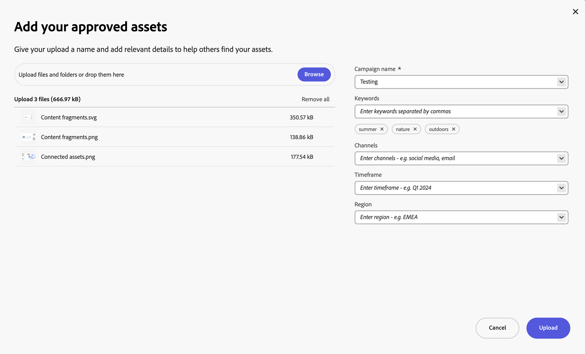
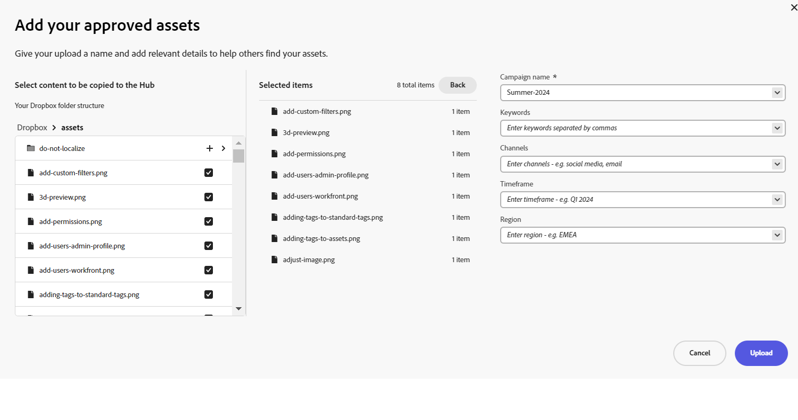

# Upload brand approved assets to Content Hub {#upload-brand-approved-assets-content-hub}

>[!CONTEXTUALHELP]
>id="upload_assets_content_hub"
>title="Upload brand approved assets to Content Hub"
>abstract="Add approved assets to Content Hub either from local file system or import assets from OneDrive or Dropbox data sources. All assets display at the top-level in Content Hub irrespective of the folder structure to enhance search capabilities."

| [Search Best Practices](/help/assets/search-best-practices.md) |[Metadata Best Practices](/help/assets/metadata-best-practices.md)|[Content Hub](/help/assets/product-overview.md)|[Dynamic Media with OpenAPI capabilities](/help/assets/dynamic-media-open-apis-overview.md)|[AEM Assets developer documentation](https://developer.adobe.com/experience-cloud/experience-manager-apis/)|
| ------------- | --------------------------- |---------|----|-----|

>[!AVAILABILITY]
>
>Content Hub guide is now available in PDF format. Download the entire guide and use Adobe Acrobat AI Assistant to answer your queries. 
>
>[!BADGE Content Hub Guide PDF]{type=Informative url="https://helpx.adobe.com/content/dam/help/en/experience-manager/aem-assets/content-hub.pdf"}

[Content Hub users with rights to add assets](/help/assets/deploy-content-hub.md#onboard-content-hub-users-add-assets) can add assets to the Content Hub either from local file system or import assets from OneDrive or Dropbox data sources. All assets display at the top-level in Content Hub irrespective of the folder structure available on your local file system or OneDrive and Dropbox data sources to enhance the search capabilities.

The assets marked as `Approved` in Assets as a Cloud Service are automatically available in Content Hub. For more information, see [Approve assets for Content Hub](/help/assets/approve-assets-content-hub.md).

To further enhance asset search, Content Hub allows you to:

* Define key details relevant to your asset upload, such as campaign name, keywords, channels, and so on. 

* Automatically generate more properties for each asset upon successful upload, such as, file size, format, resolution, and some other properties.

* Use the artificial intelligence provided by [Adobe Sensei](https://www.adobe.com/sensei.html) to automatically apply relevant tags to all your uploaded assets. These tags, aptly named Smart Tags, increase the content velocity of your projects by helping you find relevant assets quickly.

Ensure that you only upload your [brand approved assets to the Content Hub](/help/assets/approve-assets.md).

## Prerequisites {#prerequisites-add-assets}

[Content Hub users with rights to add assets](/help/assets/deploy-content-hub.md#onboard-content-hub-users-add-assets) can upload assets to Content Hub.

## Add assets to Content Hub from local file system {#add-assets-local-file-system}

To add assets to Content Hub, perform the following steps:

1. Click **[!UICONTROL Add Assets]** to view the **[!UICONTROL Add your approved assets]** dialog box that enables you to create an upload.

1. In the **[!UICONTROL Drag files or folders here]** section available in the right pane, you can either drag the assets from the local file system or click **[!UICONTROL Browse]** to manually select files or folders available on the local file system. This list of files that are part of your upload are available as a list. 

   
   You can also preview selected images using the thumbnails and click the X icon to remove any particular image from the list. The X icon displays only when you hover your mouse over the image name or size. You can also click **[!UICONTROL Remove all]** to delete all items from your upload list.

   To finish the upload process and enable the **[!UICONTROL Upload button]**, you must group your assets under a Campaign name.
   
   

1. Define the name for your upload using the **[!UICONTROL Campaign name]** field. You can use an existing name or create a new one. The Content Hub provides you with more options as you type the name. <!--You can define multiple Campaign names for your upload. While you are typing a name, either click anywhere else within the dialog box or press the `,` (Comma) key to register the name.-->

   As a best practice, Adobe recommends specifying values in the rest of the fields as well as it creates an enhanced search experience for your uploaded assets.

1. Similarly, define values for the **[!UICONTROL Keywords]**, **[!UICONTROL Channels]**, **[!UICONTROL Timeframe]**, and **[!UICONTROL Region]** fields. Tagging and grouping assets by keywords, channels, and location enables everyone who uses your approved company content to find these assets and keep it organized.

1. Click **[!UICONTROL Upload]** to upload assets to the Content Hub. [!UICONTROL Review details] confirmation box appears. Click [!UICONTROL Continue].

1. Assets start uploading. Click [!UICONTROL New Upload] to restart the upload procedure. Click [!UICONTROL Done] to complete uploading.

Administrators can also configure the mandatory and optional fields that display while uploading assets, such as Campaign name, Keywords, Channels, and so on. For more information, see [Configure the Content Hub user interface](configure-content-hub-ui-options.md#configure-upload-options-content-hub).

## Add assets to Content Hub from OneDrive or Dropbox data sources {#add-assets-onedrive-dropbox}

To add assets to Content Hub from OneDrive or Dropbox data sources:

1. Click **[!UICONTROL Add Assets]** to view the **[!UICONTROL Add your approved assets]** dialog box that enables you to import assets from OneDrive or Dropbox.

1. Click **[!UICONTROL OneDrive]** or **[!UICONTROL Dropbox]** to start the import process. Content Hub prompts you to log on to your OneDrive or Dropbox account and then displays your OneDrive or Dropbox folder structure in the left pane.

1. Click the + icon adjacent to the file or the folder name to view the item in the list of Selected items. After selecting all the files that you need to add to the Content Hub portal, repeat steps 3 to 6 of [Add assets to Content Hub from the local file system](#add-assets-local-file-system) to complete the upload process.

   

Administrators can also configure the mandatory and optional fields that display while uploading assets, such as Campaign name, Keywords, Channels, and so on. For more information, see [Configure the Content Hub user interface](configure-content-hub-ui-options.md#configure-upload-options-content-hub).

## Manage assets uploaded using Content Hub {#manage-assets-uploaded-using-content-hub}

[Content Hub users with rights to add assets](/help/assets/deploy-content-hub.md#onboard-content-hub-users-add-assets) can [add assets to the Content Hub](/help/assets/upload-brand-approved-assets.md) either from local file system or import assets from OneDrive or Dropbox data sources. All assets display at the top-level in Content Hub irrespective of the folder structure available on your local file system or OneDrive and Dropbox data sources to enhance the search capabilities.

The display of assets uploaded using Content Hub depends on if you have [enabled the Auto-approval toggle](/help/assets/configure-content-hub-ui-options.md#configure-import-options-content-hub):

* If the **[!UICONTROL Auto-approval]** toggle is enabled, the assets that you upload using Content Hub are automatically available.

* If the **[!UICONTROL Auto-approval]** toggle is disabled, the assets that you upload using Content Hub do not display automatically. The assets are available in the `hydrated-assets` folder of your Assets as a Cloud Service environment. Navigate to the folder and [bulk edit](#bulk-approve-assets-content-hub) the status of those assets to `Approved` for those assets to display in Content Hub.

