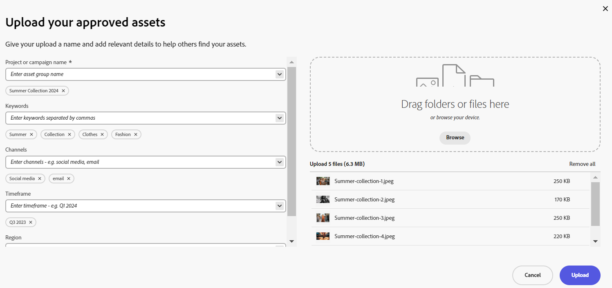

# Upload brand approved assets to Adobe GenStudio {#upload-brand-approved-assets-genstudio}

Add assets to the Content module of Adobe GenStudio either from your local file system or while creating assets using Adobe Express and saving it to Adobe GenStudio using the Express-add on. All assets display at the top-level in Content module of Adobe GenStudio irrespective of the folder structure available on your local file system to enhance the search capabilities.

To further enhance asset search, Content module of Adobe GenStudio allows you to:

* Define key details relevant to your asset upload, such as Project or campaign name, keywords, channels, and so on. 

* Automatically generate more properties for each asset upon successful upload, such as, file size, format, resolution, and some other properties.

* Use artificial intelligence provided by [Adobe Sensei](https://www.adobe.com/sensei.html) to automatically apply relevant tags to all your uploaded assets. These tags, aptly named Smart Tags, increase the content velocity of your projects by helping you find relevant assets quickly.

Ensure that you only upload your brand approved assets to the Content module of Adobe GenStudio.

## Add assets to Content module of Adobe GenStudio {#add-assets-genstudio}

To add assets to Content module of Adobe GenStudio, perform the following steps:

1. Click **[!UICONTROL Add Assets]** to view the **[!UICONTROL Upload your approved assets]** dialog box that enables you to create an upload.

1. In the **[!UICONTROL Drag files or folders here]** section available in the right pane, you can either drag the assets from the local file system or click **[!UICONTROL Browse]** to manually select files or folders available on the local file system. This list of files that are part of your upload are available as a list. 

   
   You can also preview selected images using the thumbnails and click the X icon to remove any particular image from the list. The X icon displays only when you hover your mouse over the image name or size. You can also click **[!UICONTROL Remove all]** to delete all items from your upload list.

   To finish the upload process and enable the **[!UICONTROL Upload button]**, you must group your assets under a Project or Campaign name
   
   

1. Define the name for your upload using the **[!UICONTROL Project or campaign name]** field. You can use an existing name or create a new one. Adobe GenStudio provides you with more options as you type the name. You can define multiple Project or Campaign names for your upload. While you are typing a name, either click anywhere else within the dialog box or press the `,` (Comma) key to register the name.

   As a best practice, Adobe recommends specifying values in the rest of the fields as well as it creates an enhanced search experience for your uploaded assets.
1. Similarly, define values for the **[!UICONTROL Keywords]**, **[!UICONTROL Channels]**, **[!UICONTROL Timeframe]**, and **[!UICONTROL Region]** fields. Tagging and grouping assets by keywords, channels, and location enables everyone who uses your approved company content find these assets and keep it organized.

1. Click **[!UICONTROL Upload]** to upload assets to the Content module of Adobe GenStudio.

