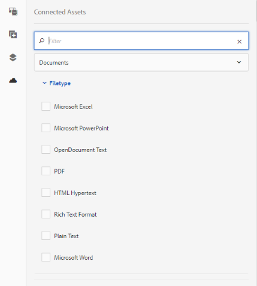
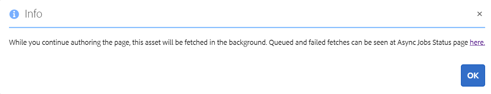
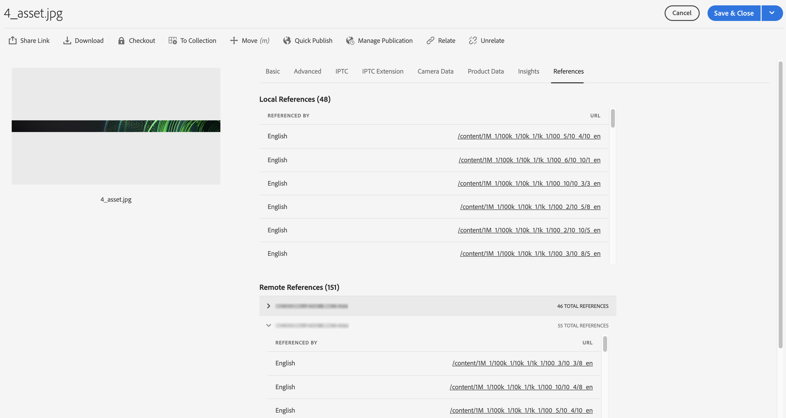
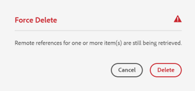
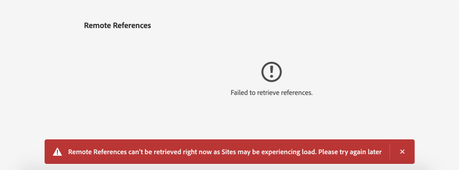

# Use Connected [!DNL Assets] to share DAM assets in [!DNL Experience Manager Sites] {#use-connected-assets-to-share-dam-assets-in-aem-sites}

| Version | Article link |
| -------- | ---------------------------- |
| AEM 6.5  |    [Click here](https://experienceleague.adobe.com/docs/experience-manager-65/assets/using/use-assets-across-connected-assets-instances.html)                  |
| AEM as a [!DNL Cloud Service]     | This article         |

**Connected [!DNL Assets]** integrates [!DNL Experience Manager] **[!DNL Sites]** and [!DNL Experience Manager] **[!DNL Assets]** so authors can build web pages using **Digital Asset Management (DAM)** assets that live in a separate **[!DNL Assets]** deployment. In large enterprises, the infrastructure used to build websites is often distributed across multiple deployments, with website creation capabilities and digital assets residing in different environments.

## Why enterprises run distributed deployments

Website authoring capabilities and the digital assets that power those websites frequently sit in separate deployments. Two common causes drive this separation:

- **Geographically distributed deployments** that must work together across regions. Because teams and content are spread across locations, existing deployments are required to interoperate rather than being consolidated.
- **Acquisitions that produce heterogeneous infrastructure.** Mergers and acquisitions commonly leave a parent company operating a mix of environments — including different [!DNL Experience Manager] versions — that the parent company wants to use together instead of migrating everything to a single platform.

>[!NOTE]
>
>Adobe recommends leveraging [!DNL Dynamic Media] with OpenAPI capabilities to connect AEM [!DNL Assets] as a [!DNL Cloud Service] and AEM [!DNL Sites]. See [Integrate remote AEM [!DNL Assets] with AEM [!DNL Sites]](/help/assets/integrate-remote-approved-assets-with-sites.md).

## What Connected [!DNL Assets] does

Connected [!DNL Assets] supports these use cases by integrating [!DNL Experience Manager Sites] with [!DNL Experience Manager Assets]. Authors create web pages in **[!DNL Sites]** using digital assets sourced from a separate **[!DNL Assets]** deployment. As a result, teams reuse a centralized DAM library across deployments without duplicating assets, which helps maintain consistency and avoids redundant asset management.

## When to configure Connected [!DNL Assets]

>[!NOTE]
>
>Configure Connected [!DNL Assets] only when you need to use the assets available on a remote **DAM** deployment on a separate **[!DNL Sites]** deployment for authoring web pages.

## Overview of Connected [!DNL Assets] {#overview-of-connected-assets}

**Connected [!DNL Assets]** enables [!DNL Sites] authors to seamlessly search, browse, and embed assets from a separate [!DNL Assets] deployment directly within the **[!UICONTROL Page Editor]**, without leaving their authoring environment. The Page Editor acts as the target destination, while a different deployment of [!DNL Experience Manager] with [!DNL Assets] capability acts as the source of assets. This connection lets teams reuse a centralized, governed asset library across authoring workflows.

### How Connected [!DNL Assets] Works {#how-connected-assets-works}

Administrators establish the connection once, and authors then benefit from it continuously. The setup involves:

- A **one-time integration** created by administrators between a deployment of [!DNL Experience Manager] with **[!DNL Sites]** capability and another deployment of [!DNL Experience Manager] with **[!DNL Assets]** capability.
- Seamless search and access to remote assets directly on the **Site Editor**.
- **Read-only local asset** behavior: Connected [!DNL Assets] presents the remote assets to [!DNL Sites] authors as read-only local assets, so the source library remains the single, governed system of record.

### [!DNL Dynamic Media] Support {#dynamic-media-support}

Connected [!DNL Assets] also supports **[!DNL Dynamic Media]** images in [!DNL Sites] web pages, giving authors access to [!DNL Dynamic Media] functionalities without duplicating assets. Supported capabilities include:

- **Smart crop** — automatically frames the most relevant portion of an image across different aspect ratios, which reduces manual cropping effort and delivers consistent, responsive imagery.
- **Image presets** — applies predefined rendering settings so images are delivered in the correct size, format, and quality for each placement.

These functionalities allow authors to publish optimized, device-appropriate imagery directly from the connected source, improving both authoring efficiency and page performance.

### When to Use Bulk Migration Instead {#when-to-use-bulk-migration-instead}

Connected [!DNL Assets] is designed for on-demand search and access to remote assets from within the Site Editor. For any other use case that requires the complete asset-corpus to be available natively on [!DNL Sites], migrate the assets in bulk instead of relying on Connected [!DNL Assets]. Bulk migration is the better fit because it makes the entire asset library fully resident and locally manageable within the [!DNL Sites] deployment, rather than accessible only as read-only remote references.

### Prerequisites and supported deployments {#prerequisites}

Connected [!DNL Assets] is supported across [!DNL Adobe Experience Manager] as a [!DNL Cloud Service] and [!DNL Experience Manager] 6.5 deployments, provided the compatibility requirements below are met. Before administrators use or configure this Connected [!DNL Assets] capability, ensure the following prerequisites are satisfied:

* **User group membership:** The users are part of the appropriate user groups on each deployment. This ensures that only authorized users can access and configure the connected asset instances.
* **Supported deployment combinations:** For [!DNL Adobe Experience Manager] deployment types, one of the supported deployment-compatibility combinations shown in the matrix below is met. **[!DNL Experience Manager] as a [!DNL Cloud Service] [!DNL Assets]** works with **[!DNL Experience Manager] 6.5**. For more information about how this functionality works in [!DNL Experience Manager] 6.5, see [Connected [!DNL Assets] in [!DNL Experience Manager] 6.5 [!DNL Assets]](https://experienceleague.adobe.com/docs/experience-manager-65/assets/using/use-assets-across-connected-assets-instances.html).

  | |[!DNL Sites] as a [!DNL Cloud Service] | [!DNL Experience Manager] 6.5 [!DNL Sites] on [!DNL Adobe Managed Services] (AMS)| [!DNL Experience Manager] 6.5 [!DNL Sites] on-premise|
  |---|---|---|---|
  |**[!DNL Experience Manager Assets] as a [!DNL Cloud Service]**| Supported | Supported | Supported |
  |**[!DNL Experience Manager] 6.5 [!DNL Assets] on [!DNL Adobe Managed Services] (AMS)** | Supported | Supported | Supported |
  |**[!DNL Experience Manager] 6.5 [!DNL Assets] on-premise** | Not Supported |Not Supported | Not Supported |

The matrix identifies which combinations of an [!DNL Assets] deployment (rows) and a [!DNL Sites] deployment (columns) can be connected. A cell marked **Supported** indicates that the corresponding [!DNL Assets]-to-[!DNL Sites] pairing works with Connected [!DNL Assets], while **Not Supported** indicates the pairing cannot be used. As shown, **[!DNL Experience Manager] 6.5 [!DNL Assets] on-premise** is not supported with any of the listed [!DNL Sites] deployments, whereas both the [!DNL Cloud Service] and [!DNL Adobe Managed Services] (AMS) [!DNL Assets] deployments are supported across all three [!DNL Sites] deployment types.

### Supported file formats {#mimetypes}

Authors locate images and supported document types directly in **Content Finder** and drag the searched assets onto the page in **Page Editor**, streamlining the process of placing approved media into web content. Each asset is mapped to the component that matches its type: **documents are added to the `Download` component**, and **images are added to the `Image` component**. This mapping ensures that each asset renders and behaves correctly according to its media type, so downloadable files present as download links while images display inline.

Authors may also add remote assets to any custom **[!DNL Adobe Experience Manager] (AEM)** component that extends the default `Download` or `Image` components. This extensibility means teams are not limited to out-of-the-box components; custom components inheriting from these base components automatically support the same searched-and-dragged asset workflow, enabling tailored authoring experiences without sacrificing format compatibility.

**The supported formats are:**

* **Image formats**: The formats supported by the [Image component](file-format-support.md#image-formats). These cover the standard image types available for inline placement within page content.
* **Document formats**: See the [supported document formats](file-format-support.md#document-formats). These define the document types that can be attached and delivered through the `Download` component.

### Users and groups involved {#users-and-groups-involved}

Configuring the Connected [!DNL Assets] integration in [!DNL Adobe Experience Manager] requires **specific roles**, each mapped to a **capability** and a **corresponding user group**. The roles, their scopes, user groups, and responsibilities are defined below.

#### Scope definitions

The integration operates across two distinct scopes that separate the authoring environment from the asset-hosting environment:

- **Local scope** applies to the deployment where a [!DNL Sites] author creates a web page.
- **Remote scope** applies to the **Digital Asset Management (DAM)** deployment that hosts the required assets.

The [!DNL Sites] author fetches these remote assets into the local environment, because this scope separation lets an authoring team reuse a centrally managed asset library without duplicating storage. This design keeps assets governed in one remote DAM while still enabling authors to consume them in local [!DNL Sites] pages.

| Role | Scope | User group | Descriptions |
|------|--------|-----------|----------|
| [!DNL Sites] administrator | Local | [!DNL Experience Manager] `administrators` | Set up [!DNL Experience Manager] and configure integration with the remote [!DNL Assets] deployment. |
| DAM user | Local | `Authors` | Used to view and duplicate the fetched assets at `/content/DAM/connectedassets/`. |
| [!DNL Sites] author | Local | <ul><li>`Authors` (with read access on the remote DAM and author access on local [!DNL Sites]) </li> <li>`dam-users` on local [!DNL Sites]</li></ul> | End users are [!DNL Sites] authors who use this integration to improve their content velocity. Authors can search and browse assets in remote DAM using [!UICONTROL Content Finder] and using the required images in local web pages.|
| [!DNL Assets] administrator | Remote | [!DNL Experience Manager] `administrators` | Configure Cross-Origin Resource Sharing (CORS). |
| DAM user | Remote | `Authors` | Author role on the remote [!DNL Experience Manager] deployment. Search and browse assets in Connected [!DNL Assets] using the [!UICONTROL Content Finder]. |
| DAM distributor (technical user) | Remote | <ul> <li> [!DNL Sites] `Authors`</li> <li> `connectedassets-assets-techaccts` </li> </ul> | This user present on the remote deployment is used by [!DNL Experience Manager] local server (not the [!DNL Sites] author role) to fetch the remote assets, on behalf of [!DNL Sites] author. |
| [!DNL Sites] technical user | Local | `connectedassets-sites-techaccts` | Allows [!DNL Assets] deployment to search for references to assets in the [!DNL Sites] web pages. |

### Connected [!DNL Assets] architecture {#connected-assets-architecture}

[!DNL Adobe Experience Manager] supports a **one-to-many** relationship between a remote Digital Asset Management (DAM) deployment and [!DNL Sites] deployments: a single remote DAM can serve as the asset source for **multiple** [!DNL Experience Manager Sites] deployments. In the reverse direction, however, the relationship is strictly **one-to-one** — each [!DNL Sites] deployment can connect to **only one remote DAM deployment**.

#### Connection rules

- A single remote DAM deployment can be connected as a source to **multiple [!DNL Experience Manager Sites] deployments**.
- Each [!DNL Experience Manager Sites] deployment can be connected to **only one remote DAM deployment**.

This topology centralizes asset management in one remote DAM while allowing several distributed [!DNL Sites] instances to consume those assets, which is the basis of the Connected [!DNL Assets] architecture.

![Connected [!DNL Assets] architecture](assets/connected-assets-architecture.png)

#### Scaling guidance

Evaluate the optimal number of [!DNL Sites] instances to connect to a single remote DAM deployment before scaling out. Adobe recommends connecting [!DNL Sites] instances **incrementally** and validating after each new connection that the remote DAM experiences no performance impact. This step-by-step approach is important because each connected [!DNL Sites] instance adds to the data traffic handled by the remote DAM, and cumulative traffic can degrade the remote DAM's performance as more instances are attached. Incremental connection lets you isolate and identify the point at which additional load begins to affect responsiveness, so you can right-size the deployment before it reaches production scale.

![Connected [!DNL Assets] architecture](assets/connected-assets-architecture-unsupported.png)

#### Supported and unsupported topologies

- **Supported:** One remote DAM deployment connected as the source to multiple [!DNL Sites] deployments (the one-to-many pattern). The following diagrams illustrate these supported scenarios.
- **Unsupported:** A single [!DNL Sites] deployment connected to more than one remote DAM deployment. Because a [!DNL Sites] deployment can source assets from only one remote DAM, this multi-DAM-to-one-[!DNL Sites] configuration is not supported. The following diagram illustrates this unsupported scenario.

## Configure a connection between [!DNL Sites] and [!DNL Assets] deployments {#configure-a-connection-between-sites-and-assets-deployments}

An [!DNL Experience Manager] administrator can create this integration. Once created, the permissions that are required to use it are established via user groups. The user groups are defined on the [!DNL Sites] deployment and on the Digital Asset Management (DAM) deployment.

To configure Connected [!DNL Assets] and local [!DNL Sites] connectivity, follow these steps:

1. Access an existing [!DNL Sites] deployment. This [!DNL Sites] deployment is used for web page authoring, say at `https://<sites_server_fqdn>:[port]`. As the page authoring happens on [!DNL Sites] deployment, let's call the [!DNL Sites] deployment as local from the page authoring perspective.

1. Access an existing [!DNL Assets] deployment. This [!DNL Assets] deployment is used to manage digital assets, say at `https://[assets_servername]:port`.

1. Ensure that the users and roles with the appropriate scope exist on the [!DNL Sites] deployment and on the [!DNL Assets] deployment on [!DNL Adobe Managed Services] (AMS). Create a technical user on [!DNL Assets] deployment and add to the user group mentioned in [users and groups involved](/help/assets/use-assets-across-connected-assets-instances.md#users-and-groups-involved).

1. Access the local [!DNL Sites] deployment at `https://[sites_servername]:port`. Click **[!UICONTROL Tools]** > **[!UICONTROL Assets]** > **[!UICONTROL Connected Assets Configuration]** and provide the following values:

    1. A **[!UICONTROL Title]** of the configuration.
    1. **[!UICONTROL Remote DAM URL]** is the URL of the [!DNL Assets] location in the format `https://[assets_servername]:[port]`.
    1. Credentials of a DAM distributor (technical user).
    1. In the **[!UICONTROL Mount Point]** field, enter the local [!DNL Experience Manager] path where [!DNL Experience Manager] fetches the assets. For example, `connectedassets` folder. The assets fetched from DAM are stored in this folder on the [!DNL Sites] deployment, keeping remote assets organized in a single, predictable location.
    1. **[!UICONTROL Local Sites URL]** is the location of the [!DNL Sites] deployment. [!DNL Assets] deployment uses this value to maintain references to the digital assets fetched by this [!DNL Sites] deployment.
    1. Credentials of [!DNL Sites] technical user.
    1. The value of **[!UICONTROL Original Binary transfer optimization Threshold]** field specifies whether the original assets (including their renditions) are transferred synchronously. This setting controls transfer behavior based on file size. [!DNL Assets] with smaller file size can be fetched readily while assets with relatively larger file size are best synchronized asynchronously. The value depends on your network capabilities.
    1. Select **[!UICONTROL Datastore Shared with Connected Assets]**, if you use a datastore to store your assets and the Datastore is shared between both deployments. In this case, the threshold limit does not matter as actual asset binaries are available on the datastore and are not transferred.

    ![A typical configuration for Connected [!DNL Assets] functionality](assets/connected-assets-typical-config.png)

    *Figure: A typical configuration for Connected [!DNL Assets] functionality.*

1. The existing digital assets on [!DNL Assets] deployment are already processed and the renditions are generated. Because these renditions are fetched directly through Connected [!DNL Assets], there is no need to regenerate them. As a result, you must disable the workflow launchers to prevent unnecessary regeneration of renditions. Adjust the launcher configurations on the ([!DNL Sites]) deployment to exclude the `connectedassets` folder (the assets are fetched in this folder).

    1. On [!DNL Sites] deployment, click **[!UICONTROL Tools]** > **[!UICONTROL Workflow]** > **[!UICONTROL Launchers]**.

    1. Search for Launchers with workflows as **[!UICONTROL DAM Update Asset]** and **[!UICONTROL DAM Metadata Writeback]**.

    1. Select the workflow launcher and click **[!UICONTROL Properties]** on the action bar.

    1. In the [!UICONTROL Properties] wizard, change the **[!UICONTROL Path]** fields as the following mappings to update their regular expressions to exclude the mount point **[!UICONTROL connectedassets]**.

   | Before  |   After |
   | ------ | ------------ |
   | `/content/dam(/((?!/subassets).)*/)renditions/original` | `/content/dam(/((?!/subassets)(?!connectedassets).)*/)renditions/original` |
   | `/content/dam(/.*/)renditions/original` | `/content/dam(/((?!connectedassets).)*/)renditions/original` |
   | `/content/dam(/.*)/jcr:content/metadata` | `/content/dam(/((?!connectedassets).)*/)jcr:content/metadata` |

   >[!NOTE]
   >
   >All renditions that are available on the remote deployment are fetched, when authors fetch an asset. If you want to create more renditions of a fetched asset, skip this configuration step. The [!UICONTROL DAM Update Asset] workflow gets triggered and creates more renditions. These renditions are available only on the local [!DNL Sites] deployment and not on the remote DAM deployment.

### Configure connectivity between [!DNL Sites] and [!DNL Assets] deployments

Establish a trusted connection between your [!DNL Adobe Experience Manager Sites] and [!DNL Assets] deployments by completing the following two configuration steps:

1. Add the [!DNL Sites] deployment as an allowed origin in the Cross-Origin Resource Sharing (CORS) configuration on the [!DNL Assets] deployment. This permits the browser to load [!DNL Assets] content from the [!DNL Sites] domain. By default, web browsers block cross-origin requests as a security measure, so the [!DNL Sites] origin must be explicitly listed before the [!DNL Assets] deployment will accept requests from it. For more information, see [understand CORS](https://experienceleague.adobe.com/docs/experience-manager-learn/foundation/security/understand-cross-origin-resource-sharing.html).

1. Configure [same site cookie support](/help/security/same-site-cookie-support.md). Same-site cookie support governs whether authentication and session cookies are transmitted with cross-site requests. Configuring this support ensures that the credentials required to authenticate between the [!DNL Sites] and [!DNL Assets] deployments are sent correctly, which is necessary because the two deployments operate on different origins.

After completing both configuration steps, verify connectivity between the configured [!DNL Sites] deployments and the [!DNL Assets] deployment using the built-in connection test. The connection test confirms that the CORS and same-site cookie settings are correctly applied and that the [!DNL Sites] deployment can successfully reach the Connected [!DNL Assets] configured on the [!DNL Assets] deployment. A successful result indicates the two deployments are ready to exchange asset content.

![Connection test of Connected [!DNL Assets] configured [!DNL Sites]](assets/connected-assets-multiple-config.png)

*Figure: Connection test of Connected [!DNL Assets] configured [!DNL Sites].*

<!-- TBD: Check if Launchers are to be disabled on CS instances. Is this option even available to the users on CS? -->

## Use [!DNL Dynamic Media] assets {#dynamic-media-assets}

With Connected [!DNL Assets], you can use image assets processed by [!DNL Dynamic Media] from a remote Digital Asset Management (DAM) deployment on [!DNL Sites] pages, and apply [!DNL Dynamic Media] functionalities, including **smart crop** and **image presets**. This lets [!DNL Sites] authors reuse centrally managed, [!DNL Dynamic Media]-optimized assets without duplicating or re-processing them locally.

To use [!DNL Dynamic Media] with Connected [!DNL Assets], complete the following configuration steps:

1. Configure [!DNL Dynamic Media] on the remote DAM deployment with **Sync mode enabled**, so that assets are actively published and processed at the source.
1. Configure [Connected [!DNL Assets]](#configure-a-connection-between-sites-and-assets-deployments).
1. Configure [!DNL Dynamic Media] on the [!DNL Sites] instance with the same company name as configured on the remote DAM. The [!DNL Sites] deployment must have **read-only access** to the [!DNL Dynamic Media] account to work with connected assets. Because the [!DNL Sites] instance only consumes—and does not publish—these assets, you must **disable Sync mode** in the [!DNL Dynamic Media] configuration on the [!DNL Sites] instance. This ensures the [!DNL Sites] deployment does not attempt to re-process or overwrite assets that are already managed and synced from the remote DAM.
   
>[!CAUTION]
>
>With Connected [!DNL Assets] and [!DNL Dynamic Media] configuration, you cannot use [!DNL Dynamic Media] to process local assets available on the [!DNL Sites] deployment.

## Configure [!DNL Dynamic Media] {#configure-dynamic-media}

Configuring [!DNL Dynamic Media] across [!DNL Assets] and [!DNL Sites] deployments requires coordinating a local [!DNL Sites] instance with a remote [!DNL Assets] deployment so that both reference the same [!DNL Dynamic Media] account. Complete the following steps in order:

1. Create the Connected [!DNL Assets] configuration as described above. When configuring the functionality, select the **[!UICONTROL Fetch original rendition for Dynamic Media Connected Assets]** option so that original renditions are retrieved for [!DNL Dynamic Media] processing.

2. Configure [!DNL Dynamic Media] on the local [!DNL Sites] and remote [!DNL Assets] deployments. Follow the instructions to [configure [!DNL Dynamic Media]](/help/assets/dynamic-media/config-dm.md#configuring-dynamic-media-cloud-services). Apply these settings consistently:

   * Use the same company name in all configurations. This ensures both deployments map to the same [!DNL Dynamic Media] account.
   * On local [!DNL Sites], in **[!UICONTROL Dynamic Media sync mode]**, select **[!UICONTROL Disabled by default]**. The [!DNL Sites] deployment must have read-only access to the [!DNL Dynamic Media] account, which prevents the local [!DNL Sites] instance from overwriting or altering assets managed by the remote [!DNL Assets] deployment.
   * On local [!DNL Sites], in the **[!UICONTROL Publish Assets]** option, select **[!UICONTROL Selective Publish]**. Do not select **[!UICONTROL Sync All Content]**, because selective publishing limits synchronization to the specific assets required rather than the entire content set.
   * On the remote [!DNL Assets] deployment, in **[!UICONTROL Dynamic Media sync mode]**, select **[!UICONTROL Enabled by default]**. This makes the remote [!DNL Assets] deployment the authoritative source that synchronizes content with [!DNL Dynamic Media].

3. Enable [Dynamic Media support in the Image Core Component](https://experienceleague.adobe.com/docs/experience-manager-core-components/using/components/image.html#dynamic-media). As a result, the default [Image component](https://www.aemcomponents.dev/content/core-components-examples/library/core-content/image.html) renders [!DNL Dynamic Media] images automatically whenever authors use [!DNL Dynamic Media] images in webpages on the local [!DNL Sites] deployment.

## Use remote assets {#use-remote-assets}

Website authors use **Content Finder** to connect to the remote **Digital Asset Management (DAM)** deployment. From within Content Finder, authors work with remote assets directly inside a component. Author capabilities include:

- **Browse** remote assets stored on the connected DAM deployment.
- **Search** for specific remote assets by keyword or tag.
- **Drag and drop** remote assets straight into a component on the page.

Authors can use assets from both the **local DAM** and the **remote DAM** deployment on a single web page. **Content Finder** lets authors switch between searching the local DAM and searching the remote DAM, so both asset libraries are accessible from one interface.

### Authenticate to the remote DAM

To authenticate to the remote DAM, keep the credentials provided by the DAM administrator (if any) handy. These credentials establish the trusted connection required before Content Finder can retrieve remote assets.

### How remote asset tags are matched

Content Finder fetches only those remote asset tags that have an **exact corresponding tag with the same taxonomy hierarchy** on the local [!DNL Sites] deployment. Because tag matching depends on this taxonomy alignment, any remote tag without an exact match on the local deployment is discarded. This ensures that tags surfaced in the local environment remain consistent with the local taxonomy and do not introduce mismatched or orphaned metadata.

For searching, authors can query remote assets using **all the tags present on the remote [!DNL Experience Manager] deployment**, because the remote deployment offers **full-text search**. As a result, search coverage on the remote side is not limited to the taxonomy-matched tags, even though only matched tags are carried over locally.

### Walk-through of usage {#walk-through-of-usage}

Use the above setup to try the authoring experience and understand how the functionality works. Use documents or images of your choice on the remote Digital Asset Management (DAM) deployment.

1. Navigate to the [!DNL Assets] interface on the remote deployment by accessing **[!UICONTROL Assets]** > **[!UICONTROL Files]** from the [!DNL Experience Manager] workspace. Alternatively, access `https://[assets_servername_ams]:[port]/assets.html/content/dam` in a browser. Upload the assets of your choice.

1. On the [!DNL Sites] deployment, in the profile activator in the upper-right corner, click **[!UICONTROL Impersonate as]**. Specify the user name, select the option provided, and click **[!UICONTROL OK]**.

1. Open a [!DNL Sites] page and edit the page.

   Click **[!UICONTROL Toggle Side Panel]** on the upper-left corner of the page.

1. Open the [!UICONTROL Assets] tab (Remote Content Finder) and click **[!UICONTROL Log in to Connected Assets]**.

1. Specify the credentials to log on to Connected [!DNL Assets]. This user must have **authoring permissions on both [!DNL Experience Manager] deployments**, because authoring across the connection requires access to both the [!DNL Sites] and the remote DAM environments.

1. Search for the asset that you added to DAM. The remote assets are displayed in the left panel. Filter for images or documents, and further filter for the specific types of supported documents. Drag images onto an `Image` component and documents onto a `Download` component.

   **The fetched assets are read-only on the local [!DNL Sites] deployment.** You can still use the options provided by your [!DNL Sites] components to edit the fetched asset. The editing performed by components is **non-destructive**, which means the original asset on the remote DAM remains unaltered while the component-level adjustments apply only to the local rendition.

   

   *Figure: Options to filter document types and images when searching assets on remote DAM.*

1. [!DNL Experience Manager] notifies the site author when an asset's original is fetched asynchronously and when any fetch task fails. While authoring, or even after authoring, authors can see detailed information about fetch tasks and errors in the [asynchronous jobs](/help/operations/asynchronous-jobs.md) user interface.

   

   *Figure: Notification about asynchronous fetching of assets that happens in the background.*

1. When publishing a page, [!DNL Experience Manager] displays a complete list of the assets used on the page. Ensure that the remote assets are fetched successfully at the time of publishing. To check the status of each fetched asset, see the [asynchronous jobs](/help/operations/asynchronous-jobs.md) user interface.

   >[!NOTE]
   >
   >Even if one or more remote assets are not fetched completely, the page is still published. As a result, the [!DNL Experience Manager] notification area displays a notification for any errors that appear on the asynchronous jobs page.

>[!CAUTION]
>
>Once used in a web page, the fetched remote assets become **searchable and usable by anyone who has permissions to access the local folder**. The fetched assets are stored in the local folder (`connectedassets` in the above walk-through). The assets are also searchable and visible in the local repository via [!UICONTROL Content Finder].

The fetched assets can be used as any other local asset, except that the associated metadata cannot be edited.

### Check use of an asset across webpages {#asset-usage-references}

[!DNL Adobe Experience Manager] enables Digital Asset Management (DAM) users to check all references to an asset across webpages. The **[!UICONTROL References]** tab in an asset's **[!UICONTROL Properties]** page lists both the **local** and **remote** references of the asset, providing a single, consolidated view of where the asset is used.

#### Why check asset references

This capability helps DAM users understand and manage the usage of an asset in remote [!DNL Sites] and in compound assets. Many authors of webpages on an [!DNL Experience Manager Sites] deployment can use an asset from a remote DAM across different webpages. To simplify asset management and prevent broken references, DAM users must check the use of an asset across local and remote webpages. Because a single asset can be referenced in multiple pages simultaneously, moving or deleting it without first reviewing its references can break the pages that depend on it.

#### View and manage references on the [!DNL Assets] deployment

To view and manage references on the [!DNL Assets] deployment, follow these steps:

1. Select an asset in the [!DNL Assets] Console and click **[!UICONTROL Properties]** from the toolbar.
1. Click the **[!UICONTROL References]** tab. See **[!UICONTROL Local References]** for use of the asset on the [!DNL Assets] deployment. See **[!UICONTROL Remote References]** for use of the asset on the [!DNL Sites] deployment, where the asset was fetched using **Connected [!DNL Assets]** functionality.

   

1. The references for [!DNL Sites] pages display the total count of references for each local [!DNL Sites] instance. [!DNL Experience Manager] may require some time to locate all references and display the total count.
1. The list of references is interactive, and DAM users can click a reference to open the referencing page. If [!DNL Experience Manager] cannot fetch remote references, it displays a notification informing the user of the failure.
1. Users can move or delete the asset. When moving or deleting an asset, [!DNL Experience Manager] displays the total number of references of all the selected assets and folders in a warning dialog. When deleting an asset for which the references are not yet retrieved, [!DNL Experience Manager] displays a warning dialog, ensuring the user is alerted before the action completes.

   

### Manage updates to assets in remote DAM {#handling-updates-to-remote-assets}

#### Supported operations and update propagation

After [configuring a connection](#configure-a-connection-between-sites-and-assets-deployments) between a remote Digital Asset Management (DAM) repository and [!DNL Adobe Experience Manager] (AEM) [!DNL Sites] deployments, the assets on remote DAM are made available on the [!DNL Sites] deployment. [!DNL Sites] authors and administrators can then perform the following operations on remote DAM assets or folders:

- **Update** — modify an existing asset on remote DAM.
- **Delete** — remove an asset from remote DAM.
- **Rename** — change the name of a remote DAM asset.
- **Move** — relocate an asset to a different location within remote DAM.

These changes propagate automatically to the [!DNL Sites] deployment, with some delay. In addition, when an asset on remote DAM is used on a local [!DNL Experience Manager Sites] page, AEM displays the updated asset on the [!DNL Sites] page automatically. This ensures the [!DNL Sites] page always reflects the current state of the source asset in the remote DAM repository.

#### Move assets and adjust references

While moving an asset from one location to another, [adjust references](manage-digital-assets.md) so that the asset continues to display on the [!DNL Sites] page. Because the [!DNL Sites] deployment resolves each asset by its reference path, moving an asset to a location that is not accessible from the local [!DNL Sites] deployment breaks that reference. As a result, the asset fails to display on the [!DNL Sites] deployment. Verify that the destination location remains accessible to the local [!DNL Sites] deployment before completing the move.

#### Update asset metadata

[!DNL Sites] authors can also update the metadata properties for an asset on remote DAM, and those changes become available on the local [!DNL Sites] deployment. This keeps descriptive metadata—such as titles, tags, and other properties—synchronized between the remote DAM repository and the connected [!DNL Sites] deployment.

#### Preview and republish updates

[!DNL Sites] authors can preview the available updates on the [!DNL Sites] deployment and then republish the changes to make them available on the AEM publish instance. Previewing before republishing allows authors to confirm that the updated asset appears correctly on the page prior to making the change live.

#### Expired asset status in Remote [!DNL Assets] Content Finder

[!DNL Experience Manager] displays an **`expired`** status visual indicator on assets in the **Remote [!DNL Assets] Content Finder** to stop site authors from using the asset on a [!DNL Sites] page. If an asset with an **`expired`** status is used on a [!DNL Sites] page, the asset fails to display on the [!DNL Experience Manager] publish instance. This indicator therefore acts as a safeguard, preventing authors from publishing pages that reference assets no longer valid for delivery.

## Frequently Asked Questions {#frequently-asked-questions}

+++**Should you configure Connected [!DNL Assets] if you need to use assets available on your [!DNL Sites] deployment?**

Configuring Connected [!DNL Assets] is not required in this scenario. Users can directly use the assets already available on the [!DNL Sites] deployment without any additional setup.

+++

+++**When do you need to configure the Connected [!DNL Assets] feature?**

Configure the Connected [!DNL Assets] feature only when you need to use assets that reside on a **remote Digital Asset Management (DAM) deployment** within a [!DNL Sites] deployment. In all other cases, no configuration is necessary.

+++

+++**Can you connect multiple [!DNL Sites] deployments to a remote DAM deployment after configuring Connected [!DNL Assets]?**

Yes. **Multiple [!DNL Sites] deployments can connect to a single remote DAM deployment** after configuring Connected [!DNL Assets]. This many-to-one model allows several [!DNL Sites] environments to share a common asset repository. For more information, see [Connected [!DNL Assets] architecture](#connected-assets-architecture).

+++

+++**How many remote DAM deployments can you connect to a [!DNL Sites] deployment after configuring Connected [!DNL Assets]?**

You can connect **exactly one remote DAM deployment to a [!DNL Sites] deployment** after configuring Connected [!DNL Assets]. A single [!DNL Sites] deployment sources its remote assets from one DAM deployment only. For more information, see [Connected [!DNL Assets] architecture](#connected-assets-architecture).

+++

+++**Can you use [!DNL Dynamic Media] assets from your [!DNL Sites] deployment after configuring Connected [!DNL Assets]?**

After configuring Connected [!DNL Assets], [!DNL Dynamic Media] assets on the [!DNL Sites] deployment are available in **read-only mode**. Because these assets are read-only, [!DNL Dynamic Media] cannot process assets on the [!DNL Sites] deployment. Asset processing must occur on the source deployment instead. For more information, see [Configure a connection between [!DNL Sites] and [!DNL Dynamic Media] deployments](#dynamic-media-assets).

+++

+++**Can you use assets of Image and Document format types from the remote DAM deployment on the [!DNL Sites] deployment after configuring Connected [!DNL Assets]?**

Yes. **Image and Document format assets** from the remote DAM deployment are usable on the [!DNL Sites] deployment after configuring Connected [!DNL Assets].

+++

+++**Can you use content fragments and video assets from the remote DAM deployment on the [!DNL Sites] deployment after configuring Connected [!DNL Assets]?**

No. **Content fragments and video assets** from the remote DAM deployment cannot be used on the [!DNL Sites] deployment after configuring Connected [!DNL Assets]. Only supported asset types propagate to the [!DNL Sites] deployment.

+++

+++**Can you use [!DNL Dynamic Media] assets from the remote DAM deployment on the [!DNL Sites] deployment after configuring Connected [!DNL Assets]?**

Yes. You can configure and use **[!DNL Dynamic Media] image assets** from the remote DAM deployment on the [!DNL Sites] deployment after configuring Connected [!DNL Assets]. For more information, see [Configure a connection between [!DNL Sites] and [!DNL Dynamic Media] deployments](#dynamic-media-assets).

+++

+++**After configuring Connected [!DNL Assets], can you perform the update, delete, rename, and move operations on the remote DAM assets or folders?**

Yes. After configuring Connected [!DNL Assets], you can perform **update, delete, rename, and move operations** on the remote DAM assets or folders. These changes propagate automatically to the [!DNL Sites] deployment through synchronization, becoming available with some delay so that the linked [!DNL Sites] environment reflects the current state of the remote DAM. For more information, see [Manage updates to assets in remote DAM](#handling-updates-to-remote-assets).

+++

+++**After configuring Connected [!DNL Assets], can you add or modify assets on your [!DNL Sites] deployment and make them available on remote DAM deployment?**

You can add assets to the [!DNL Sites] deployment. However, those assets **cannot be made available to the remote DAM deployment**. Asset propagation flows in one direction only, from the remote DAM deployment to the [!DNL Sites] deployment.

+++

## Limitations and best practices {#tip-and-limitations}

Follow these best practices and observe the following limitations when working with connected assets:

* To gain insights about **asset usage**, configure the [Assets Insight](/help/assets/assets-insights.md) functionality on the [!DNL Sites] instance. Enabling **[!DNL Assets] Insight** allows teams to track how and where connected assets are used across pages, which supports better content governance and reuse decisions.

* The **path browser** in authoring components is not supported for connected assets. Because connected assets are served remotely rather than from the local repository, path-based selection through the authoring component path browser is unavailable.

* Authors cannot drag the **remote asset** onto the [Image Component Configure dialog](https://experienceleague.adobe.com/docs/experience-manager-core-components/using/wcm-components/image.html?lang=en#configure-dialog). As a workaround, you can instead drag the **remote asset** directly onto the image component on the [!DNL Sites] page without clicking **[!UICONTROL Configure]**. This provides a reliable alternative path for adding remote assets to the image component, ensuring authors can still place connected assets even though the Configure dialog does not accept them directly.

### Permissions and asset management {#permissions-and-managing-assets}

* **Local assets are read-only copies.** [!DNL Experience Manager] components perform only **non-destructive edits** on these assets, ensuring the source asset remains unaltered. No other edits are permitted.
* Locally fetched assets are available for **authoring purposes only**. Asset update workflows cannot be applied, and metadata cannot be edited on the fetched copies.
* When using **[!DNL Dynamic Media]** in [!DNL Sites] pages, the original asset is not fetched or stored on the local deployment. Instead, the `dam:Asset` node, the metadata, and the renditions generated by the [!DNL Assets] deployment are all fetched on the [!DNL Sites] deployment.
* Only images and the listed document formats are supported. **[!DNL Content Fragments] and [!DNL Experience Fragments] are not supported.**
* [!DNL Experience Manager] does not fetch the metadata schemas. As a result, some of the fetched metadata is not displayed, because the schema that governs its presentation is absent on the [!DNL Sites] deployment. If the schema is separately updated on the [!DNL Sites] deployment, then all the metadata properties are displayed.
* **All [!DNL Sites] authors have read permissions** on the fetched copies, even if those authors cannot access the remote **Digital Asset Management (DAM)** deployment.
* There is **no Application Programming Interface (API) support** to customize the integration.
* The functionality supports **seamless search and use of remote assets**. To make a large volume of remote assets available on the local deployment in a single operation, migrate the assets rather than fetching them individually.
* A remote asset cannot be used as a page thumbnail on the [!UICONTROL Page Properties] user interface. Authors set a thumbnail of a web page in the [!UICONTROL Page Properties] user interface from the [!UICONTROL Thumbnail] field by clicking [!UICONTROL Select Image].

### Set up and licensing {#setup-licensing}

The following setup requirements and licensing conditions apply when connecting an [!DNL Adobe Experience Manager] (AEM) [!DNL Sites] deployment to a separate [!DNL Assets] deployment. This split-authoring architecture separates the repository that stores digital assets from the deployment where authors build and manage [!DNL Sites] content:

* **[!DNL Adobe Managed Services] (AMS) deployment is supported.** [!DNL Adobe Experience Manager] (AEM) [!DNL Assets] supports deployment on **[!DNL Adobe Managed Services] (AMS)**.
* **Single [!DNL Assets] connection per [!DNL Sites] deployment.** Each [!DNL Sites] deployment connects to a single [!DNL Assets] deployment at a time. This one-to-one connection establishes a clear, unambiguous source of truth for assets, ensuring that content authored in [!DNL Sites] references a single, consistent asset repository.
* **A license of [!DNL Assets] working as the remote repository is required.** The [!DNL Assets] deployment acts as the **remote repository**, serving as the central store where digital assets are managed, versioned, and delivered to the connected [!DNL Sites] deployment.
* **One or more licenses of [!DNL Sites] working as the local authoring deployment are required.** Each [!DNL Sites] deployment functions as a **local authoring deployment**, where authors create and edit web content while consuming assets from the connected remote [!DNL Assets] repository.

Because the two deployments are licensed separately — [!DNL Assets] as the remote repository and [!DNL Sites] as the local authoring deployment — organizations must maintain a valid license for each role. This dual-license model allows a single [!DNL Assets] repository to serve as the authoritative asset source, while one or more [!DNL Sites] deployments handle authoring against that shared repository.

### Usage {#usage}

The following usage rules define exactly how authors can work with remote assets, along with the operational limits, timeouts, and read-only constraints that govern this feature.

* Users can search for remote assets and drag those onto a local page when authoring. **No other functionality is supported.**
* The **fetch operation times out after 5 seconds.** Authors may fail to fetch assets when network issues interrupt the request. To recover, authors can reattempt the fetch by dragging the remote asset from [!UICONTROL Content Finder] to [!UICONTROL Page Editor].
* Simple edits that are non-destructive and supported via the `Image` component can be performed on fetched assets. Beyond these supported edits, fetched assets are **read-only**, because the source of truth for each asset remains in the DAM.
* The only method to re-fetch an asset is to drag it onto a page. **There is no API support or other method to re-fetch an asset to update it.**
* If assets are decommissioned from the Digital Asset Manager (DAM), those decommissioned assets continue to be in use on [!DNL Sites] pages.
* The remote reference entries of an asset are fetched **asynchronously**. Because the references and the total count are not real-time, a temporary discrepancy in the reported references and total count can occur if a [!DNL Sites] author uses the asset while a DAM user is viewing the reference. DAM users can refresh the page and try again in a few minutes to obtain the accurate total count.

## Troubleshoot issues {#troubleshoot}

To troubleshoot common errors when working with remote assets, follow the steps for the relevant scenario below.

* **Unable to search for remote assets from the Content Finder:** If you are unable to search for remote assets from the [!UICONTROL Content Finder], ensure that the required roles and permissions are in place. Missing or insufficient roles are the most common cause of failed remote searches.

* **Asset fetched from the remote DAM does not publish on a web page:** An asset fetched from the remote Digital Asset Management (DAM) system may fail to publish on a web page. This occurs when one of the following conditions is true:
  * The asset no longer exists on the remote server.
  * The appropriate permissions to fetch the asset are missing.
  * A network failure interrupts the transfer.

  To resolve this issue, complete the following checks:
  1. Ensure that the asset has not been removed from the remote DAM.
  2. Ensure that the appropriate permissions are in place and that all prerequisites are met.
  3. Retry adding the asset to the page and republish.
  4. Check the [list of asynchronous jobs](/help/operations/asynchronous-jobs.md) for errors that occurred during asset fetching.

* **Unable to access the remote DAM deployment from the local [!DNL Sites] deployment:** If you cannot access the remote DAM deployment from the local [!DNL Sites] deployment, ensure that cross-site cookies are allowed and that [same site cookie support](/help/security/same-site-cookie-support.md) is configured. Because [!DNL Experience Manager] deployments authenticate through cross-site cookies, blocking these cookies prevents authentication between the deployments. For example, [!DNL Google Chrome] in Incognito mode may block third-party cookies. To allow cookies in the [!DNL Chrome] browser, follow these steps:

  1. Click the 'eye' icon in the address bar.
  2. Navigate to **Site Not Working** > **Blocked**.
  3. Select the Remote DAM URL.
  4. Allow the login-token cookie.

  ![Cookie error in [!DNL Chrome] browser in Incognito mode](assets/chrome-cookies-incognito-dialog.png)

  Alternately, see [how to enable third-party cookies](https://support.google.com/chrome/answer/95647).

* **Remote references are not retrieved and result in an error message:** If remote references are not retrieved and result in an error message, verify that the [!DNL Sites] deployment is available and check for network connectivity issues. Retry later, because transient availability or network issues often resolve on their own. The [!DNL Assets] deployment attempts twice to establish a connection with the [!DNL Sites] deployment before it reports a failure.

  

**See also**

* [Translate [!DNL Assets]](/help/assets/translate-assets.md)
* [Assets HTTP API](/help/assets/mac-api-assets.md)
* [Assets supported file formats](/help/assets/file-format-support.md)
* [Search assets](/help/assets/search-assets.md)
* [Connected assets](/help/assets/use-assets-across-connected-assets-instances.md)
* [Asset reports](/help/assets/asset-reports.md)
* [Metadata schemas](/help/assets/metadata-schemas.md)
* [Download assets](/help/assets/download-assets-from-aem.md)
* [Manage metadata](/help/assets/manage-metadata.md)
* [Manage [!DNL Dynamic Media] templates](/help/assets/dynamic-media/manage-dynamic-media-templates.md)
* [Manage reports in [!DNL Assets] view](/help/assets/manage-reports-assets-view.md)
* [Search facets](/help/assets/search-facets.md)
* [Manage collections](/help/assets/manage-collections.md)
* [Bulk metadata import](/help/assets/metadata-import-export.md)
* [Publish [!DNL Assets] to AEM and [!DNL Dynamic Media]](/help/assets/publish-assets-to-aem-and-dm.md)
