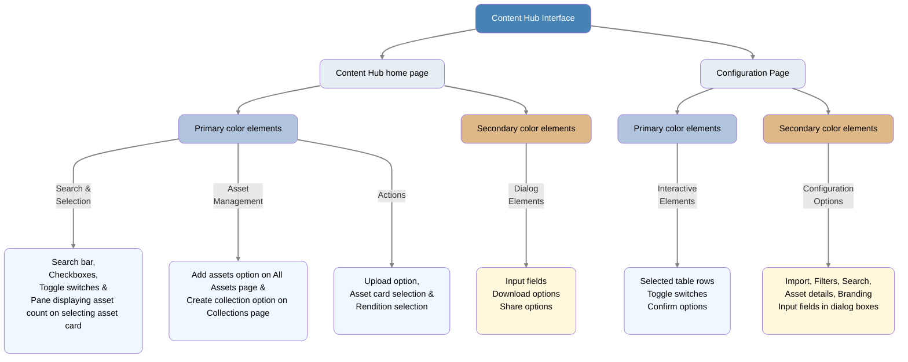

Customize your [!DNL Content Hub] UI as per your brand's theme. To do the customization, navigate to your [!DNL Content Hub] home page, select the user icon in the top right corner, click **[!UICONTROL Configurations]** and select  **[!UICONTROL Branding]** on the **[!UICONTROL Configuration]** page to display **[!UICONTROL Banner]**, **[!UICONTROL Colors]** and **[!UICONTROL Banner image]** sections on the Page. Execute the following customizations from these section: 
1. [Change the banner image from [!UICONTROL Banner image] section](#Change-the-banner-image)
1. [Update the title and body text on the banner and change the text color from the [!UICONTROL Banner] section](#Add-title-and-body-text-to-your-banner-and-change-the-text-color)
1. [Change the primary and secondary color from the [!UICONTROL Colors] section](#Change-the-primary-and-secondary-color)

Select **[!UICONTROL Reset Defaults]** option to revert your changes and restore the default theme.

# Change the banner image{#Change-the-banner-image}

On the  **[!UICONTROL Branding]** page, execute the following steps to change the banner image of your [!DNL Content Hub]:

1. Click  **[!UICONTROL Select from gallery]** to select a banner image from the asset selector dialog box.
1. Select the image and click **[!UICONTROL Select]** to make it the header banner of your [!DNL Content Hub].

# Add title and body text to your banner and change the text color{#Add-title-and-body-text-to-your-banner-and-change-the-text-color}

Add title and body texts to your banner using the respective fields in the **[!UICONTROL Banner]** section available on the  **[!UICONTROL Branding]** page. 
Click the square box next to the **[!UICONTROL Banner text color]** to select a text color from the color picker for your banner text or specify the color's hex code in the field next to the color picker square box.

# Change the primary and secondary color{#Change-the-primary-and-secondary-color}

On the  **[!UICONTROL Branding]** page, use the **[!UICONTROL Colors]** section to set primary and secondary colors. These colors customize the background, text, and icon colors of UI elements in your [!DNL Content Hub]. The selected colors also highlight certain elements when selected.

See the following table for information on where both these colors apply:

<table style="border-collapse: separate; border-spacing: 0; width: 100%; border-radius: 8px; overflow: hidden;">
  <tr style="background-color: #4682B4;">
    <th style="padding: 12px; color: white; font-weight: bold; text-align: left;">Location</th>
    <th style="padding: 12px; color: white; font-weight: bold; text-align: left;">Color</th>
    <th style="padding: 12px; color: white; font-weight: bold; text-align: left;">UI Element</th>
    <th style="padding: 12px; color: white; font-weight: bold; text-align: left;">Navigation Path</th>
  </tr>
  <tr>
    <td rowspan="13" style="padding: 12px; border: 1px solid #d0d0d0; background-color: #E6EEF4; font-weight: bold;">[!DNL Content Hub] home page</td>
    <td rowspan="11" style="padding: 12px; border: 1px solid #d0d0d0; background-color: #B0C4DE;">Primary</td>
    <td style="padding: 12px; border: 1px solid #d0d0d0; background-color: #F0F8FF;">
        Magnifying glass icon in search bar
    </td>
    <td style="padding: 12px; border: 1px solid #d0d0d0; background-color: #F5F5F5;">Across [!DNL Content Hub] home page</td>
  </tr>
  <tr>
    <td style="padding: 12px; border: 1px solid #d0d0d0; background-color: #F0F8FF;">Border color of the search bar when selected</td>
    <td style="padding: 12px; border: 1px solid #d0d0d0; background-color: #F5F5F5;">Across [!DNL Content Hub] home page</td>
  </tr>
  <tr>
    <td style="padding: 12px; border: 1px solid #d0d0d0; background-color: #F0F8FF;">
        Selection checkboxes after selection
    </td> 
    <td style="padding: 12px; border: 1px solid #d0d0d0; background-color: #F5F5F5;">Across [!DNL Content Hub] home page</td>
  </tr>
  <tr>
    <td style="padding: 12px; border: 1px solid #d0d0d0; background-color: #F0F8FF;">
        Toggle switches and date input fields
    </td>
    <td style="padding: 12px; border: 1px solid #d0d0d0; background-color: #F5F5F5;">[!DNL Content Hub] home page > Filters or relevant places</td>
  </tr>
  <tr>
    <td style="padding: 12px; border: 1px solid #d0d0d0; background-color: #F0F8FF;">
        <b>[!UICONTROL Add assets]</b> option
    </td>
    <td style="padding: 12px; border: 1px solid #d0d0d0; background-color: #F5F5F5;">[!DNL Content Hub] home page > <b>[!UICONTROL All Assets]</b></td>
  </tr>
  <tr>
    <td style="padding: 12px; border: 1px solid #d0d0d0; background-color: #F0F8FF;">
        <b>[!UICONTROL Create collection]</b> option
    </td>
    <td style="padding: 12px; border: 1px solid #d0d0d0; background-color: #F5F5F5;">[!DNL Content Hub] home page > <b>[!UICONTROL Collections]</b></td>
  </tr>
  <tr>
    <td style="padding: 12px; border: 1px solid #d0d0d0; background-color: #F0F8FF;">Selected asset cards</td>
    <td style="padding: 12px; border: 1px solid #d0d0d0; background-color: #F5F5F5;">[!DNL Content Hub] home page > <b>[!UICONTROL All Assets]</b>  > Select asset card</td>
  </tr>
  <tr>
    <td style="padding: 12px; border: 1px solid #d0d0d0; background-color: #F0F8FF;">Selected collection tiles</td>
    <td style="padding: 12px; border: 1px solid #d0d0d0; background-color: #F5F5F5;">[!DNL Content Hub] home page > Select  available on the asset card or select <b>[!UICONTROL Add to collection]</b> after selecting one or more asset cards > select the collection tile from <b>[!UICONTROL Add asset to collection]</b> dialog box. You can also click asset thumbnail > Select  > select the collection tile from the panel.</td>
  </tr>
  <tr>
    <td style="padding: 12px; border: 1px solid #d0d0d0; background-color: #F0F8FF;"><b>[!UICONTROL Upload]</b> option</td>
    <td style="padding: 12px; border: 1px solid #d0d0d0; background-color: #F5F5F5;">[!DNL Content Hub] home page >  <b>[!UICONTROL Add assets]</b> > select <b>[!UICONTROL Upload]</b> from <b>[!UICONTROL Add approved assets]</b> dialog box.</td>
  </tr>
  <tr>
    <td style="padding: 12px; border: 1px solid #d0d0d0; background-color: #F0F8FF;">Selected assets count pane</td>
    <td style="padding: 12px; border: 1px solid #d0d0d0; background-color: #F5F5F5;">[!DNL Content Hub] home page > Select asset card from <b>[!UICONTROL All Assets]</b> page or <b>[!UICONTROL Collections]</b> page.</td>
  </tr>
  <tr>
    <td style="padding: 12px; border: 1px solid #d0d0d0; background-color: #F0F8FF;"> Hovering or selecting renditions
    </td>
    <td style="padding: 12px; border: 1px solid #d0d0d0; background-color: #F5F5F5;">[!DNL Content Hub] home page > click asset thumbnail > select .</td>
  </tr>
  <tr>
    <td rowspan="2" style="padding: 12px; border: 1px solid #d0d0d0; background-color: #DEB887;">Secondary</td>
    <td style="padding: 12px; border: 1px solid #d0d0d0; background-color: #FFF8DC;">Input fields in dialog boxes, excluding those in the <b>[!UICONTROL Add approved assets]</b> dialog box.</td>
    <td style="padding: 12px; border: 1px solid #d0d0d0; background-color: #F5F5F5;">[!DNL Content Hub] home page > Any dialog box</td>
  </tr>
  <tr>
    <td style="padding: 12px; border: 1px solid #d0d0d0; background-color: #FFF8DC;">Options such as, <b>[!UICONTROL Download]</b>, <b>[!UICONTROL Generate share link]</b>, 
        <b>[!UICONTROL Add to collection]</b> available in various dialog boxes.
    </td>
    <td style="padding: 12px; border: 1px solid #d0d0d0; background-color: #F5F5F5;">[!DNL Content Hub] home page > Dialog options</td>
  </tr>
  <tr>
    <td rowspan="6" style="padding: 12px; border: 1px solid #d0d0d0; background-color: #E6EEF4; font-weight: bold;">[!DNL Content Hub] [!UICONTROL configuration] page</td>
    <td rowspan="3" style="padding: 12px; border: 1px solid #d0d0d0; background-color: #B0C4DE;">Primary</td>
    <td style="padding: 12px; border: 1px solid #d0d0d0; background-color: #F0F8FF;">Selected table rows</td>
    <td style="padding: 12px; border: 1px solid #d0d0d0; background-color: #F5F5F5;">[!DNL Content Hub]<b> [!UICONTROL Configuration] page</b> > Select configuration option > select row</td>
  </tr>
  <tr>
    <td style="padding: 12px; border: 1px solid #d0d0d0; background-color: #F0F8FF;">
        Toggle switches
    </td>
    <td style="padding: 12px; border: 1px solid #d0d0d0; background-color: #F5F5F5;">[!DNL Content Hub] > <b>[!UICONTROL Configuration]</b> > Toggle switches across all configuration pages.</td>
  </tr>
  <tr>
    <td style="padding: 12px; border: 1px solid #d0d0d0; background-color: #F0F8FF;"><b>[!UICONTROL Confirm]</b> option</td>
    <td style="padding: 12px; border: 1px solid #d0d0d0; background-color: #F5F5F5;">[!DNL Content Hub] > <b>[!UICONTROL Configuration]</b> > Edit dialog box on all configuration pages.</td>
  </tr>
  <tr>
    <td rowspan="3" style="padding: 12px; border: 1px solid #d0d0d0; background-color: #DEB887;">Secondary</td>
    <td style="padding: 12px; border: 1px solid #d0d0d0; background-color: #FFF8DC;">
        <b>[!UICONTROL Import]</b>, 
        <b>[!UICONTROL Filters]</b>, 
        <b>[!UICONTROL Asset details]</b>,
        <b>[!UICONTROL Asset Card]</b>,
        <b>[!UICONTROL Search]</b>,
        <b>[!UICONTROL Branding]</b>,
        <b>[!UICONTROL Expired Assets]</b>,
       <b>[!UICONTROL Renditions]</b>, and
        <b>[!UICONTROL Custom Links]</b>
    </td>
    <td style="padding: 12px; border: 1px solid #d0d0d0; background-color: #F5F5F5;">[!DNL Content Hub] > <b>[!UICONTROL Configuration]</b></td>
  </tr>
  <tr>
    <td style="padding: 12px; border: 1px solid #d0d0d0; background-color: #FFF8DC;"><b>[!UICONTROL Add filters]</b> on 
        <b>[!UICONTROL Filters]</b> page, <b>[!UICONTROL Add link]</b> on 
        <b>[!UICONTROL Custom Links]</b> page and <b>[!UICONTROL Add metadata]</b> on 
        <b>[!UICONTROL Import]</b>,  <b>[!UICONTROL Asset details]</b>,  <b>[!UICONTROL Asset Card]</b>, and  <b>[!UICONTROL Search]</b> pages
    </td>
    <td style="padding: 12px; border: 1px solid #d0d0d0; background-color: #F5F5F5;">[!DNL Content Hub] > <b>[!UICONTROL Configuration]</b> > Respective pages</td>
  </tr>
  <tr>
    <td style="padding: 12px; border: 1px solid #d0d0d0; background-color: #FFF8DC;">Input fields in <b>[!UICONTROL Add metadata]</b>, <b>[!UICONTROL Add link]</b> and <b>[!UICONTROL Add filters]</b> dialog boxes.</td>
    <td style="padding: 12px; border: 1px solid #d0d0d0; background-color: #F5F5F5;">[!DNL Content Hub] > <b>[!UICONTROL Configuration]</b> > <b>[!UICONTROL Dialog boxes]</b></td>
  </tr>
</table>

See [Detailed color application guide](#primary-and-secondary-color-on-the-content-hub-home-page) for a detailed breakdown of where these colors are applied across different pages and UI elements:

<strong>Detailed color application guide</strong>

See the following sections to know the places on the [[!DNL Content Hub] home page](#primary-and-secondary-color-on-the-content-hub-home-page) and [[!UICONTROL Configuration]](#primary-and-secondary-color-on-the-content-hub-configuration-page) page where both these colors apply:

## Apply primary and secondary color on the [!DNL Content Hub] home page{#primary-and-secondary-color-on-the-content-hub-home-page}

Primary color apply to the following places on the [!DNL Content Hub] home page: 

* Magnifying glass  inside the search bar.
* Border color of the search bar when selected.
* Selection checkboxes  after selection.
* Toggle switches  and date input fields.
* UI options such as  **[!UICONTROL Add assets]** on the **[!UICONTROL All Assets]** page and  **[!UICONTROL Create collection]** on the  **[!UICONTROL Collections]** page.
* selecting Asset cards from the **[!UICONTROL All Assets]** page. 
* Selecting collection tiles from the **[!UICONTROL Add aaset to collection]** dialog box or **[!UICONTROL Add to collection]** panel. **[!UICONTROL Add aaset to collection]** dialog box displays when you select  available on the asset card or select  **[!UICONTROL Add to collection]** after selecting one or more asset cards. **[!UICONTROL Add to collection]** panel displays when you click asset thumbnail on an asset card and select  from the menu options in the right pane.
* The **[!UICONTROL Upload]** option in the **[!UICONTROL Add approved assets]** dialog box. **[!UICONTROL Add approved assets]** dialog box displays when you select  **[!UICONTROL Add assets]** available on the **[!UICONTROL All Assets]** page.
* The pane displaying the count of selected assets after selecting an asset card from the **[!UICONTROL All Assets]** or  **[!UICONTROL Collections]** page.
* Hovering over or selecting a rendition from the **[!UICONTROL Download]** panel. **[!UICONTROL Download]** panel displays when you click asset thumbnail on an asset card and select  from the menu options in the right pane. 

Secondary color apply to the following places on the [!DNL Content Hub] home page: 

* Input fields in dialog boxes, excluding those in the **[!UICONTROL Add approved assets]** dialog box. **[!UICONTROL Add approved assets]** dialog box displays on clicking  **[!UICONTROL Add assets]** available on the **[!UICONTROL All Assets]** page.
* Options such as **[!UICONTROL Download]**, **[!UICONTROL Generate share link]**, and  **[!UICONTROL Add to collection]** available in various dialog boxes, excluding the **[!UICONTROL Upload]** option in the **[!UICONTROL Add approved assets]** dialog box.

## Apply primary and secondary color on the [!DNL Content Hub] [!UICONTROL configuration] page{#primary-and-secondary-color-on-the-content-hub-configuration-page}

Secondary color apply to the following places on the [!DNL Content Hub] **[!UICONTROL configuration]** page:

* All configuration options including  **[!UICONTROL Import]**,  **[!UICONTROL Filters]**,  **[!UICONTROL Asset details]**,  **[!UICONTROL Asset Card]**,  **[!UICONTROL Search]**,  **[!UICONTROL Branding]**,  **[!UICONTROL Expired Assets]**, **[!UICONTROL Renditions]** and  **[!UICONTROL Custom Links ]** available on the configuration page.
* Options including **[!UICONTROL Add filters]** on **[!UICONTROL Filters]** page, **[!UICONTROL Add link]** on  **[!UICONTROL Custom Links]** page and **[!UICONTROL Add metadata]** on  **[!UICONTROL Import]**,  **[!UICONTROL Asset details]**,  **[!UICONTROL Asset Card]** and  **[!UICONTROL Search]** pages.  
* Input fields in the **[!UICONTROL Add metadata]**, **[!UICONTROL Add link]** and **[!UICONTROL Add filters]** dialog boxes.

Primary color apply to the following places on the [!DNL Content Hub] [!UICONTROL configuration] page:

* Selecting a row from the table on the configuration pages.
* Toggle color across all configuration pages.
* The **[!UICONTROL Confirm]** option in the Edit dialog boxes on all configuration pages.

