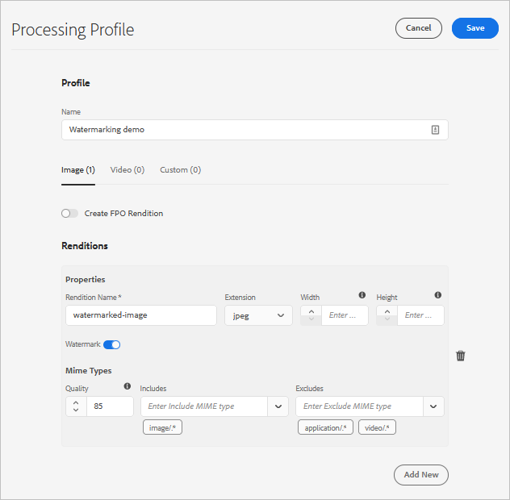

# Watermark your assets {#watermark-assets}

[!DNL Adobe Experience Manager Assets] lets you add a digital watermark to images. [!DNL Assets] supports applying an image as a watermark to other image files. Watermarks can help users verify the authenticity and copyright ownership of the assets. Also, a watermark can be used to indicate a document's state like confidential, draft, validity, and so on.

To configure [!DNL Experience Manager] to watermark assets follow these steps:

1. A PNG file is applied as a watermark. Upload this file in your DAM repository.

1. Access the [!DNL Cloud Manager] Git repository associated with your environment. Commit a file named `com.adobe.cq.assetcompute.impl.profile.WatermarkingProfileServiceImpl.cfg.json` in the repository with the following contents. For instructions, see [how to do OSGi configuration in [!DNL Experience Manager] as a [!DNL Cloud Service]](/help/implementing/deploying/configuring-osgi.md).

   ```json
   {
   "watermark": "/content/dam/<path-to-watermark-image.png>",
    "width": 100
   }
   ```

1. [Create a processing profile](/help/assets/asset-microservices-configure-and-use.md#create-custom-profile) to leverage asset microservices to apply the watermark.

   

1. [Apply the processing profiles to a folder](/help/assets/asset-microservices-configure-and-use.md#use-profiles) to create watermarked assets.

## Tips and limitations {#tips-limitations-bestpractices}

* You can use a single configuration to watermark all your assets. Only one image is used for watermarking and its width is fixed.
* You can place the watermark at the center without tiling.
* Text-based watermarks are not supported.

>[!MORELIKETHIS]
>
>* [Asset microservices overview](/help/assets/asset-microservices-overview.md).
>* [Use asset microservices with processing profiles](/help/assets/asset-microservices-configure-and-use.md).
