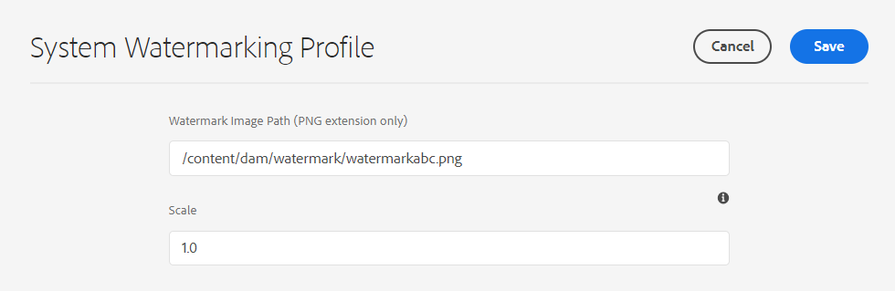

# Watermark your assets {#watermark-assets}

[!DNL Adobe Experience Manager Assets] lets you add a digital watermark to images. [!DNL Assets] supports applying an image as a watermark to other image files. Watermarks can help users verify the authenticity and copyright ownership of the assets. Also, a watermark can be used to indicate a document's state like confidential, draft, validity, and so on.

To configure [!DNL Experience Manager] to watermark assets:

1. A PNG file is applied as a watermark. Upload this file to your DAM repository.

1. Navigate to **[!UICONTROL Tools > Assets > Assets Configurations]**.

1. Click **[!UICONTROL System Watermarking Profile]**.

1.  On the [!UICONTROL System Watermarking Profile page], specify the image path uploaded  to your DAM repository in step 1.

1. Specify the watermark scale, ranging from 0.0 to 1.0, relative to rendition width, in the **[!UICONTROL Scale]** field.

1. Click **[!UICONTROL Save]**.
   
   

   >[!NOTE]
   >
   >If you have configured System Watermarking Profile using `com.adobe.cq.assetcompute.impl.profile.WatermarkingProfileServiceImpl.cfg.json` configuration file (OSGi configuration), you can continue to use it, however, Adobe recommends to use the new method.

   
1. [Create a processing profile](/help/assets/asset-microservices-configure-and-use.md#create-custom-profile) to leverage asset microservices to apply the watermark.

   

   Ensure that you enable the **[!UICONTROL Watermark]** toggle while creating the processing profile.

1. [Apply the processing profiles to a folder](/help/assets/asset-microservices-configure-and-use.md#use-profiles) to create watermarked assets.

## Tips and limitations {#tips-limitations-bestpractices}

* You can use a single configuration to watermark all your assets. Only one image is used for watermarking and its width is fixed.
* You can place the watermark at the center without tiling.
* Text-based watermarks are not supported.

>[!MORELIKETHIS]
>
>* [Asset microservices overview](/help/assets/asset-microservices-overview.md).
>* [Use asset microservices with processing profiles](/help/assets/asset-microservices-configure-and-use.md).
