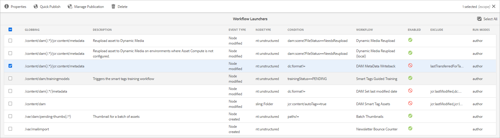

# XMP metadata {#xmp-metadata}

| [Search Best Practices](/help/assets/search-best-practices.md) |[Metadata Best Practices](/help/assets/metadata-best-practices.md)|[Content Hub](/help/assets/product-overview.md)|[Dynamic Media with OpenAPI capabilities](/help/assets/dynamic-media-open-apis-overview.md)|[AEM Assets developer documentation](https://developer.adobe.com/experience-cloud/experience-manager-apis/)|
| ------------- | --------------------------- |---------|----|-----|

| Version | Article link |
| -------- | ---------------------------- |
| AEM 6.5  |    [Click here](https://experienceleague.adobe.com/docs/experience-manager-65/assets/administer/xmp-writeback.html)                  |
| AEM as a Cloud Service     | This article         |

XMP (Extensible Metadata Platform) is the metadata standard used by Experience Manager Assets for all metadata management. XMP provides a standard format for the creation, processing, and interchange of metadata for a wide variety of applications.

Aside from offering universal metadata encoding that can be embedded into all file formats, XMP provides a rich [content model](#xmp-core-concepts) and is [supported by Adobe](#advantages-of-xmp) and other companies, so that users of XMP in combination with [!DNL Assets] have a powerful platform to build upon.

## XMP overview and ecosystem {#xmp-ecosystem}

[!DNL Assets] natively supports the XMP metadata standard. XMP is a standard for processing and storing standardized and proprietary metadata in digital assets. XMP is designed to be the common standard that allows multiple applications to work effectively with metadata.

Production professionals, for example, use the built-in XMP support within Adobe's applications to pass information across multiple file formats. The [!DNL Assets] repository extracts the XMP metadata and uses it to manage the content lifecycle and offers the ability to create automation workflows.

XMP standardizes how metadata is defined, created, and processed by providing a data model, a storage model, and schemas. All of these concepts are covered in this section.

All legacy metadata from EXIF, ID3, or Microsoft Office is automatically translated to XMP, which can be extended to support customer-specific metadata schema, such as product catalogs.

Metadata in XMP consists of a set of properties. These properties are always associated with a specific entity referred to as a resource; that is, the properties are "about" the resource. In the case of XMP, the resource is always the asset.

XMP defines a [metadata](https://en.wikipedia.org/wiki/Metadata) model that can be used with any defined set of metadata items. XMP also defines particular [schemas](https://en.wikipedia.org/wiki/XML_schema) for basic properties useful for recording the history of a resource as it passes through multiple processing steps, from being photographed, [scanned](https://en.wikipedia.org/wiki/Image_scanner), or authored as text, through photo editing steps (such as [cropping](https://en.wikipedia.org/wiki/Cropping_%28image%29) or color adjustment), to assembly into a final image. XMP allows each software program or device along the way to add its own information to a digital resource, which can then be retained in the final digital file.

XMP is most commonly serialized and stored using a subset of the [W3C](https://en.wikipedia.org/wiki/World_Wide_Web_Consortium) [Resource Description Framework](https://en.wikipedia.org/wiki/Resource_Description_Framework) (RDF), which is in turn expressed in [XML](https://en.wikipedia.org/wiki/XML).

### Advantages of XMP {#advantages-of-xmp}

XMP has the following advantages over other encoding standards and schemata:

* XMP-based metadata is very powerful and fine-grained.
* XMP lets you have multiple values for one property.
* XMP has standardized encoding, which lets you easily exchange metadata.
* XMP is extensible. You can add additional information into your assets.

The XMP standard is designed to be extensible, allowing you to add custom types of metadata into the XMP data. EXIF, on the other hand, does not - it has a fixed list of properties that cannot be extended.

>[!NOTE]
>
>XMP generally does not allow binary data types to be embedded. To carry binary data in XMP, for example, thumbnail images, they must be encoded in an XML-friendly format such as `Base64`.

### XMP core concepts {#xmp-core-concepts}

**Namespaces and schemata** 

An XMP schema is a set of property names in a common XML namespace that includes
the data type and descriptive information. An XMP schema is identified by its XML namespace URI. Using namespaces prevents conflicts between properties in different schemas that have the same name but a different meaning.

For example, the **Creator** property in two independently designed schemas might mean the person who created the asset or it could mean the application that created the asset (for example, Adobe Photoshop).

**XMP properties and values**

XMP may include properties from one or more of the schemas. For example, a typical subset used by many Adobe applications might include the following:

* Dublin core schema: `dc:title`, `dc:creator`, `dc:subject`, `dc:format`, `dc:rights`
* XMP basic schema: `xmp:CreateDate`, `xmp:CreatorTool`, `xmp:ModifyDate`, `xmp:metadataDate`
* XMP rights management schema: `xmpRights:WebStatement`, `xmpRights:Marked`
* XMP media management schema: `xmpMM:DocumentID`

**Language alternatives**

XMP offers you the ability to add an `xml:lang` property to text properties to specify the language of the text.

## XMP writeback to renditions {#xmp-writeback-to-renditions}

This XMP writeback feature in [!DNL Adobe Experience Manager Assets] replicates the metadata changes to the renditions of the original asset. 
When you change the metadata for an asset from within [!DNL Assets] or while uploading the asset, the changes are initially stored in the metadata node in the asset hierarchy. The writeback feature lets you propagate the metadata changes to all or specific renditions of the asset. The feature writes back only those metadata properties that use `jcr` namespace, that is, a property named `dc:title` is written back but a property named `mytitle` is not.

For example, consider a scenario where you modify the [!UICONTROL Title] property of the asset titled `Classic Leather` to `Nylon`.

In this case, [!DNL Assets] saves the changes to the **[!UICONTROL Title]** property in the `dc:title` parameter for the asset metadata stored in the asset hierarchy.

>[!IMPORTANT]
>
>The writeback feature is not enabled by default in [!DNL Assets]. See how to [enable metadata writeback](#enable-xmp-writeback). MSM for digital assets does not work with metadata writeback enabled. Upon writeback, the inheritance breaks.

### Enable XMP writeback {#enable-xmp-writeback}

[!UICONTROL DAM Metadata Writeback] workflow is used to writeback the metadata of an asset. To enable writeback, follow any of the following three methods:

* Use Launchers.
* Manually start `DAM MetaData Writeback` workflow.
* Configure workflow to be part of the post-processing.

To use Launchers, follow these steps:

1. As an administrator, access **[!UICONTROL Tools]** > **[!UICONTROL Workflow]** > **[!UICONTROL Launchers]**.
1. Select the [!UICONTROL Launcher] for which the **[!UICONTROL Workflow]** column displays **[!UICONTROL DAM MetaData Writeback]**. Click **[!UICONTROL Properties]** from the toolbar.

   

1. Select **[!UICONTROL Activate]** on the **[!UICONTROL Launcher Properties]** page. Click **[!UICONTROL Save & Close]**.

To manually apply the workflow to an asset just once, apply [!UICONTROL DAM Metadata Writeback] workflow from the left rail.

To apply the workflow to all the uploaded assets, add the workflow to a post-processing profile.

<!-- Commenting for now. Need to document how to enable metadata writeback. See CQDOC-17254.

### Enable XMP writeback {#enable-xmp-writeback}

To enable the metadata changes to be propagated to the renditions of the asset when uploading it, modify the **[!UICONTROL Adobe CQ DAM Rendition Maker]** configuration in Configuration Manager.

1. To open Configuration Manager, access `https://[aem_server]:[port]/system/console/configMgr`.
1. Open the **[!UICONTROL Adobe CQ DAM Rendition Maker]** configuration.
1. Select the **[!UICONTROL Propagate XMP]** option, and then save the changes.

### Enable XMP write-back for specific renditions {#enable-xmp-writeback-for-specific-renditions}

To let the XMP write-back feature propagate metadata changes to select renditions, specify these renditions to the [!UICONTROL XMP Writeback Process] workflow step of DAM Metadata WriteBack workflow. By default, this step is configured with the original rendition.

For the XMP write-back feature to propagate metadata to the rendition thumbnails 140.100.png and 319.319.png, perform these steps.

1. Select the Experience Manager logo, and then navigate to **[!UICONTROL Tools]** &gt; **[!UICONTROL Workflow]** &gt; **[!UICONTROL Models]**.
1. From the Models page, open the **[!UICONTROL DAM Metadata Writeback]** workflow model.
1. In the **[!UICONTROL DAM Metadata Writeback]** properties page, open the **[!UICONTROL XMP Writeback Process]** step.
1. In the **[!UICONTROL Step Properties]** dialog box, select the **[!UICONTROL Process]** tab.
1. In the **[!UICONTROL Arguments]** box, add `rendition:cq5dam.thumbnail.140.100.png,rendition:cq5dam.thumbnail.319.319.png`, and then select **[!UICONTROL OK]**.

   

1. Save the changes.
1. To regenerate the Pyramid TIFF (PTIFF) renditions for Dynamic Media images with the new attributes, add the **[!UICONTROL Dynamic Media Process Image Assets]** step to the DAM Metadata write-back workflow. PTIFF renditions are only created and stored locally in a Dynamic Media Hybrid implementation.

1. Save the workflow.

The metadata changes are propagated to the renditions renditions thumbnail.140.100.png and thumbnail.319.319.png of the asset, and not the others.
-->

**See also**

* [Translate Assets](translate-assets.md)
* [Assets HTTP API](mac-api-assets.md)
* [Assets supported file formats](file-format-support.md)
* [Search assets](search-assets.md)
* [Connected assets](use-assets-across-connected-assets-instances.md)
* [Asset reports](asset-reports.md)
* [Metadata schemas](metadata-schemas.md)
* [Download assets](download-assets-from-aem.md)
* [Manage metadata](manage-metadata.md)
* [Search facets](search-facets.md)
* [Manage collections](manage-collections.md)
* [Bulk metadata import](metadata-import-export.md)
* [Publish Assets to AEM and Dynamic Media](/help/assets/publish-assets-to-aem-and-dm.md)
