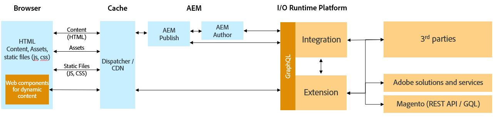

# AEM and non-Magento/3rd Party Integration using Commerce Integration Framework

Enterprise businesses may require additional 3rd party solutions in addition to a Commerce backend to power their storefront. The Commerce Integration Framework (CIF) can be used in such integration scenarios where in addition to Magento, a 3rd party solution also needs to be integrated with AEM. CIF provides elements such as an accelerator storefront, commerce core components and authoring tools that work with Magento out-of-the-box. To integrate AEM and a 3rd party solution and re-use these CIF elements, some additional development is needed. 

## Architecture

The overall architecture is as follows:

The main difference between the integration architecure for AEM - Magento and AEM - 3rd Party is the addition of an integration layer as shown in the image above. The integration layer needs to be hosted on the Adobe I/O Runtime platform which is Adobe's serverless platform. You can learn more about Adobe I/O Runtime [here](https://www.adobe.io/apis/experienceplatform/runtime.html). 

The purpose of this integration layer is to map a non-Magento or a 3rd-party's APIs against Adobe Commerce APIs (Magento GraphQL APIs). This mapping allows the [AEM CIF Core Components](https://github.com/adobe/aem-core-cif-components) and [AEM CIF Connector](https://github.com/adobe/commerce-cif-connector) to retrieve data from the non-Magento solution. With this approach, the integration layer encapsulates the integration logic and creates a separation of concern between AEM and the 3rd party solution. This allows the usage of the CIF elements in an agnostic way with various 3rd party solutions. The advantages of using CIF elements in your project have been described in the [AEM-Magento Integration using CIF](integrations/02-AEM-Magento.md) 

To help you get started on building the required integration layer to integrate a non-Magento/3rd party solution with AEM, we have created a [reference implementation](https://github.com/adobe/commerce-cif-graphql-integration-reference) to demonstrate this. This reference can be used as a starting point in your project.

You can request for an I/O Runtime trial license [here](https://github.com/AdobeDocs/adobeio-runtime/blob/master/overview/request_a_trial.md)
