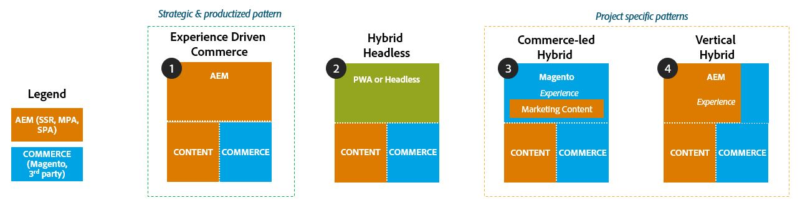

# Commerce Integration Framework Introduction

Adobe’s Commerce Integration Framework (CIF) is Adobe's recommended pattern to integrate and extend commerce services from Magento and other third party commerce solutions with the Experience Cloud. This enables Adobe Customers to deliver extraordinary and personalized omnichannel shopping experience based on state-of-the-art technology. 

The Commerce Integration Framework is an add-on module for AEM and provides a set of authoring tools, components, and a reference storefront to accelerate integrations between AEM and commerce solutions. 

## CIF Benefits

The main benefits are:

- The integration is an abstraction layer to standardize and encapsulate integrations with multiple systems. 

- CIF supports headless/omnichannel experiences:

    - Single Page applications and Multi Page Applications
    - GraphQL endpoints
   
- CIF provides serverless, microservice-based process and business logic layer for customization and extension of commerce services   

- CIF provides out-of-the-box integrations with Adobe solutions such as AEM, and Magento

## CIF on Adobe I/O Runtime

The CIF on Adobe I/O Runtime enables two use-cases: 1. Third party integrations via microservice layer and 2. Extensibility of microservices. This architecture is based on [OpenWhisk](https://openwhisk.apache.org) & [Adobe I/O Runtime](https://www.adobe.io/apis/cloudplatform/runtime.html). The main building blocks of the commerce services are serverless functions (OpenWhisk actions). These actions run on Adobe I/O Runtime inside an isolated container, stateless and serverless interacting with the commerce backend system or other endpoints via their APIs. 

## CIF Elements

#### AEM CIF Cloud Connector

The connector connects AEM with Magento Cloud GraphQL endpoint or Adobe I/O Runtime GraphQL. The connector allows AEM to retrieve commerce data.

#### AEM CIF Core Components

The AEM components are server-side and client-side rendered components with Magento GraphQL support. They're used to create static, cacheable and SEO-friendly commerce storefornt based on AEM technologies.

#### AEM CIF Archetype with AEM Venia Storefront

The AEM CIF Archetype is a Maven project to provide a starting point for AEM commerce projects. It provides a B2C storefront for AEM (Author, Preview, Deploy) and supports Adobe Commerce GraphQL endpoints. It uses [AEM CIF Core Components](https://github.com/adobe/aem-core-cif-components) & [AEM Sites Core Components](https://github.com/adobe/aem-core-wcm-components). 

#### CIF Extension Layer

The CIF extension layer is a middle layer to host complex business logic. It runs on the Adobe I/O Runtime platform which is Adobe's serverless platform. It allows you to extend end-to-end service calls by injecting business and process logic on a microservice level. Business logic would be for example to use location and channel to determine an inventory strategy. Process logic would be for example to retrieve personalized information. 

#### CIF Integration Layer

The CIF integration layer is used to standardize integrations with other commerce solutions. It runs on the Adobe I/O Runtime platform which is Adobe's serverless platform and enables integrations at a microservice level by mapping third party APIs against the Adobe Commerce APIs. To help you get started on building third party integrations with AEM, we have created a [reference implementation](https://github.com/adobe/commerce-cif-graphql-integration-reference) to demonstrate how a non-Magento commerce backend can be integrated with the AEM CIF Cloud Connector and AEM CIF Core Components via Adobe Commerce APIs (Magento GraphQL APIs). 

#### Campaign Integration

The [Campaign integration](https://github.com/adobe/commerce-cif-cart-abandonment) provides extensible microservices on I/O Runtime that enriches _cart abandonment_ events with live data before calling Campaign. It calls Magento to get cart details and calls Campaign's APIs to provide data. This is a reference to showcase Campaign-Magento integration using I/O Runtime.

## AEM-Commerce Integration Patterns

Some of the commonly implemented AEM-Commerce integration patterns are shown below.

#### Integration Pattern 1

This is our recommended integration pattern where AEM owns the entire glass and integrates commerce services via Adobe Commerce GraphQL APIs. This pattern unlocks AEM's full flexibility to tailor rich media site designs across devices. This integration pattern is supported by CIF as an out-of-the-box solution.

#### Integration Pattern 2

This pattern depicts a fully headless way of delivering content and commerce. The delivery is fully client-side. In this pattern content is delivered via API and HTML and Commerce data is delivered via GraphQL. This pattern is currently not supported by CIF out-of-the-box.
 

#### Integration Pattern 3

In this pattern, Magento owns the glass and embeds AEM authored content. The AEM authored content can be delivered via Experience Fragments or Content Fragments. This integration pattern will require project-specific work and cannot be implemented out-of-the-box with CIF.

#### Integration Pattern 4

This is a common integration pattern where the glass or presentation layer is split between AEM and a Commerce solution. Usually, the Commerce solution delivers the non-marketing pages such as checkout and my account and AEM delivers the marketing pages and store front catalog experience. In this pattern, you need to ensure that carts and user sessions are handled properly between the two systems to avoid a disjointed user experience. For e.g. Magento stores the cart & user session in a cookie, which can be shared between AEM & Magento. This pattern will require project-specific work and cannot be implemented out-of-the-box with CIF.

