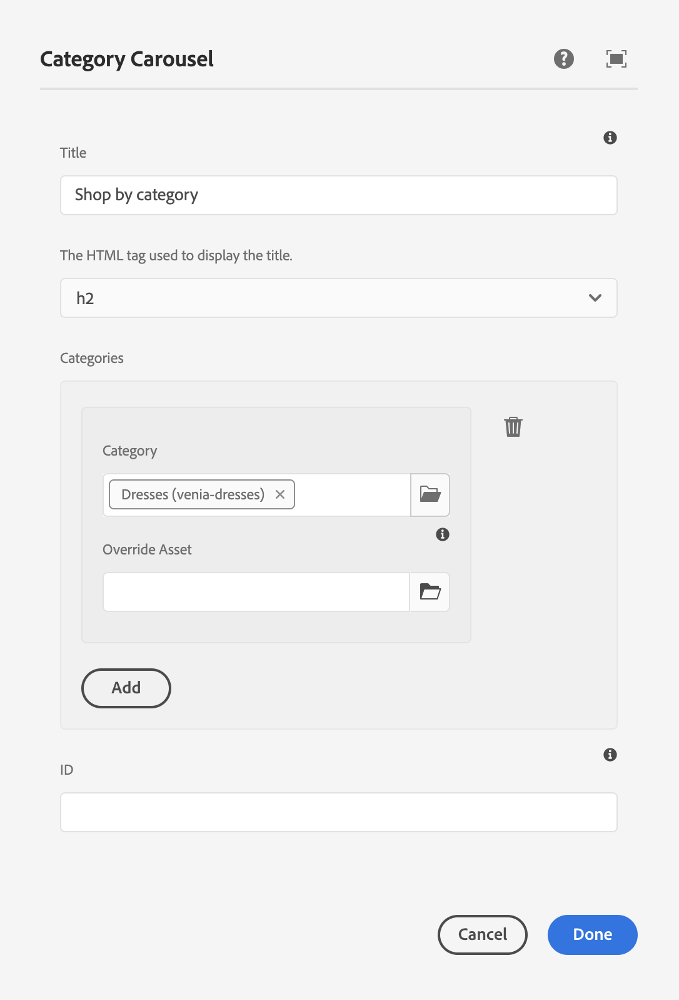

# Authoring Commerce Experiences {#authoring-commerce-experiences}

## Overview {#overview}

The CIF add-on extends AEM authoring with commerce-specific capabilities. This enables authors to build and managed commerce-related experiences efficiently by getting access to product data and content without leaving the context.

## Pickers {#pickers}

Product and category pickers are modal UI dialogs that offer a comfortable way for AEM authors to find and select products or categories when needed. Core Components, content association and product templates are the typical areas with configurations that require product catalog data. Pickers support various configuration options, such as multi-selection, variation-selection, and pre-selection of values.

### Product Picker {#product-picker}

This picker offers browsing through the catalog structure or full-text search to find the product. Products with variation offer a folder icon in the column 'Type'. Clicking on the folder icon opens the variations of the selected product.

Clicking on the parent category will take the author back to the product level.

**Example product teaser**

The configuration dialog of this component requires a product. CIF uses the SKU as the product identifier. Authors can either enter the sku by hand or click the folder icon to open the product picker. After selecting and closing the picker, the component dialog shows the name of the selected product

### Category Picker {#category-picker}

This picker offers browsing through the catalog structure to find the category.

**Example category carousel**

The configuration dialog of this component requires 1 : n categories. CIF uses the UID / ID as the category identifier. Authors can either enter the UID by hand or click the folder icon to open the category picker. After selecting and closing the picker, the component dialog shows the name of the selected category.

## Page Editor {#page-editor}

The Page Editor in AEM is extended with capabilities to access the real-time product data and associated product content.

### Accessing Product Data {#access-product-data}

The 'Assets' tab in the editor's Side panel offers access to product data by selecting the type 'Products'. The data is fetched live from the configured commerce endpoint. The filter is a full-text search on the commerce endpoint to find specific products.

Analog to assets, products can be dnd on a page (Which creates a product teaser component as default) or components (Currently supported are product teaser and product carousel).

### Adding Links in Textfields Using RTE {#rte}

CIF product catalog pages are virtual pages that get rendered on the fly. Thus, embedding hyperlinks like for regular AEM pages is not possible. CIF adds a new action "Commerce Links" to the RTE (Rich Text Editor). This action works exactly like the regular "Hyperlink" action, but allows authors to select either a product or category using the pickers.

>[!NOTE]
>
> If both category and product gets selected, the product is taken.

This creates a placeholder link that gets replaced with a real link when the page gets rendered.

### Accessing Associated Product Content {#associated-content}

If the Editor recognizes 1:n products on a page, the side panel will automatically show the tab "Associated Commerce Content". This tab allows authors to quickly access AEM content that was tagged with the product (See [enrich product data with associated AEM content](./enrich-product-associated-content.md) for more information). This tab offers drop-down lists to filter for content type and specific products if multiple products are on the page. Using the content works exactly like using content from the "Assets" tab.

### Preview Staged Product Data {#staged-data}

The Timewarp mode in the editor allows authors to preview and browse an AEM experience with staged product catalog data based on the Timewarp date.

Components will show a visual indicator if the date used is staged.

## Omnisearch {#omnisearch}

Using Omnisearch is an easy way for practitioners to find AEM content and product catalog data using full-text search. Omnisearch will run full-text search in AEM and the commerce backend to find product catalog objects in the commerce backend and AEM content. AEM results also include content that was tagged with product / category data.

The result is grouped by type.

>[!NOTE]
>
> Full-text search in Omnisearch does not support associated Content Fragments. Use SKU or UID to find associated Content Fragments.
