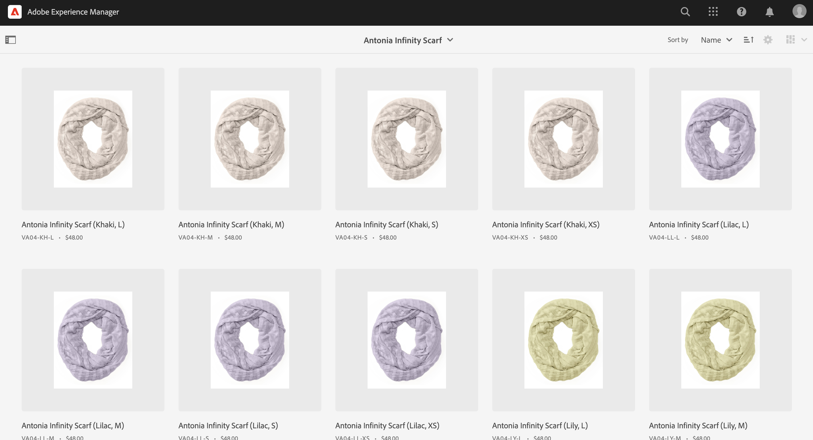
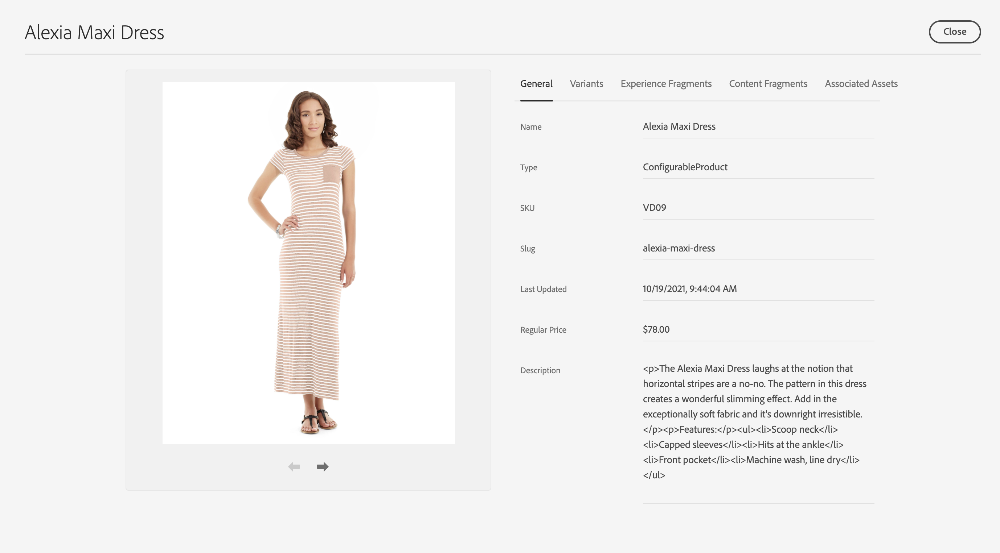

# Product Cockpit {#product-cokpit}

## Overview {#overview}

The Product Cockpit provides a unified overview of linked product catalogs and associated content. All associated content have links to quickly access it from the cockpit. 

Staged product data includes any mutation in the future such as new cateogries, products, or updated properties.

>[!NOTE]
>
>The term product catalog is interchangable with commerce store, store view, and similar expressions.

## Configuration {#configuration}

Product catalogs need to be configured in AEM. See [configuring store and catalogs](https://experienceleague.adobe.com/docs/experience-manager-cloud-service/content-and-commerce/storefront/getting-started.html?#catalog) for more information.

Enabling staged catalog features require authentication. See [Getting Started](https://experienceleague.adobe.com/docs/experience-manager-cloud-service/content-and-commerce/storefront/getting-started.html) for more information.

>[!NOTE]
>
>Staged catalog features are only available with Adobe Commerce and 3rd party connectors that support token-based authentication.

## Opening the Product Cockpit {#opening-product-cockpit}

Easiest way to access the Product Cockpit isvia the 'Commerce' menu in AEM's main menu. It is also possible to use Omnisearch (search for Commerce) or opening `https://<yourAEMInstance>/commerce.html`.

## Browsing product catalogs {#browsing-product-catalogs}

The Product Cockpit is organized in a hierarchical way following the product catalog structure. The first level shows the catalog root level of all configured poduct catalogs including meta information of the commerce backend.

Clicking on a category will load the children of the clicked category.

Clicking on a product will load product varations if available.

>[!NOTE]
>
>Product catalog data in AEM is data that is retrieved in real-time via the configured commerce endpoint. No product catalog data is store in AEM.

## Searching product catalogs {#searching-product-catalog}

A full-text search over the full product catalog is provided in the left filter tab to quickly find products.

## Browsing staged product catalog {#staged-product-catalogs}

By default, the product cockpit shows live product catalog data. Using the "STAGED CATALOG" in the left filter tab will load the product catalog for any selecte date.

## Product catalog properties

Clicking on the properties icon of a product or category will open the property view of the selected object. Open properties of a product variant is equal to open the main product properties.

### Commerce tabs

The general and variant tabs show pre-defined commerce properties that come from the commerce backend. This data (incl. variants) is read-only data in AEM as the system of record is the commerce backend. The variant tab only appears for products with variants and shows a list of all variants.

### AEM Content tabs

These tabs, grouped by AEM content types (Experience Fragments, Content Fragments, Associated Assets), show AEM content that is associated with the commerce object. The action 'View Details' opens a new browser tab with the selected content.

