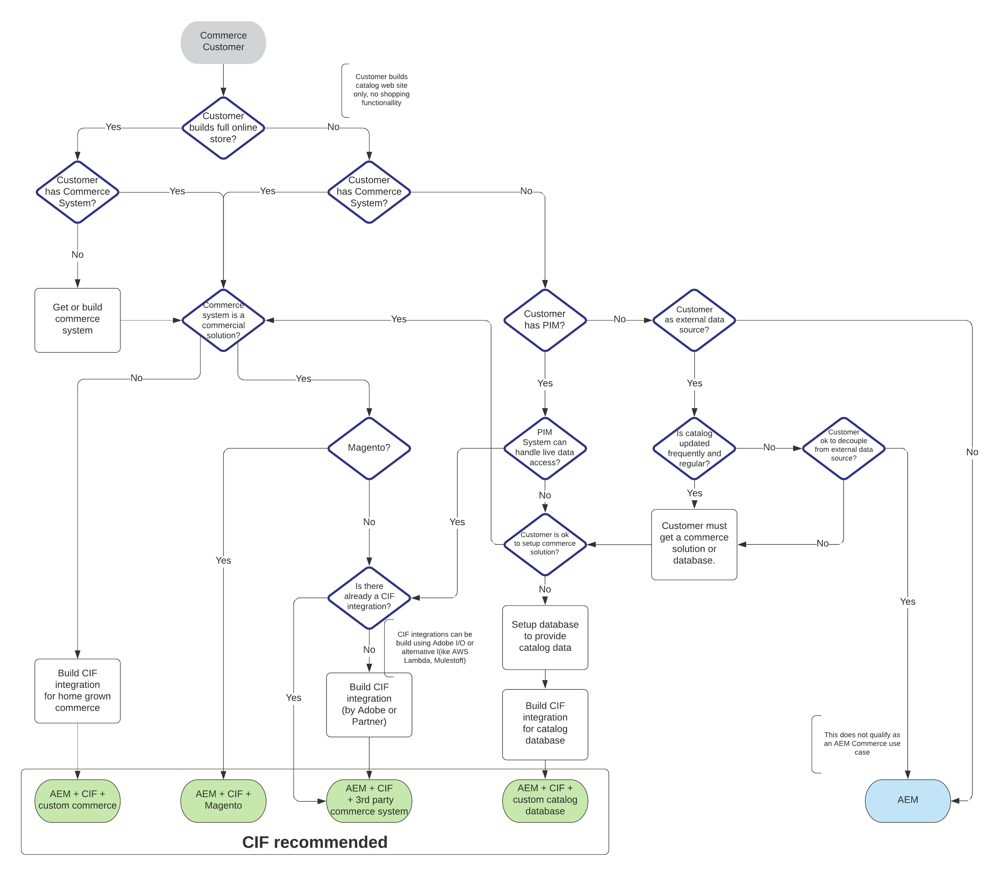

# Introducing AEM Commerce Integration Framework (CIF) {#cif-intro}

Content and commerce projects are complex projects due to the nature of their requirements:

* Integration of a complex and dynamic ecosystem (example product catalogs)
* Business needs to manage product content with its own lifecycle in an efficient and omnichannel way
* Building complex and personalized shopping journeys
* Ability to quickly adapt and innovate on the back- and front-end
* Running a scaleable and stable E2E infrastructure that is built for peak performance (Flash sale, Black Friday, ...). This includes unified search and cache management.

## CIF successfully supporting customers since 2013

Experience Manager Commerce Integration Framework (CIF) is Adobe's recommended way for creating extraordinary content & commerce projects. It is an add-on that extends the Experience Manager with commerce capabilities for content creators and developers.

With over 200 customers, CIF has established itself as the out-of-the-box integration framework that is deeply integrated with the Experience Manager to seamlessly leverage and extends its capabilities. This provides a lot of value to IT and business today and for the future. Recent customer projects describe CIF as a “Great accelerator and a huge time saver with a lot of value”.

## CIF Benefits {#cif-benefits}

### Experiences

Powerful CIF tools in AEM enable content creators to rapidly build rich and personalized commerce experiences in a scalable and delivery agnostic way to capitalize on business opportunities.

### Time-To-Value (TTV)

Accelerates project development with [AEM Core Components](https://www.aemcomponents.dev/), [AEM Venia reference storefront](https://github.com/adobe/aem-cif-guides-venia), [AEM Project Archetype](https://docs.adobe.com/content/help/en/experience-manager-core-components/using/developing/archetype/overview.html), and integration patterns for PWAs (Headless content & commerce).

CIF is built for continuous innovation with an always up-to-date add-on, allowing customer to access new and improved features.

### Integrations

Connect your ecosystem (e.g. commerce solution) with the Experience Cloud using  [Adobe I/O Runtime](https://www.adobe.io/apis/experienceplatform/runtime.html), a micro-service based server-less PaaS, and [CIF's reference implementation](https://github.com/adobe/commerce-cif-graphql-integration-reference).

## Which projects should use CIF?

The following decision tree will guide you based on the use-cases if CIF is recommended for a project. A detailed evaluation helps you to determine what parts should be used.

## Proven pattern and best practices

CIF incorporates patterns and best practices that supports customers with their current situation and future requirements:

* Eliminates typical challenges around product catalog integrations that may occure in the future. Examples:
  * Performance issues with increased catalog volume or complexity
  * No support for changed requirements such as access to staged data or real-time data.
* Patterns and accelerators for successful storefront integrations
* Access to existing product experience management features to enrich product data and experiences
