# Manage product catalog pages and templates {#product-catalog}

Get to know how to manage product catalog pages and templates.

## The Story So Far {#story-so-far}

In the previous document of the AEM Content and Commerce authoring journey, [Getting Started with AEM CIF authoring basics](getting-started.md), you learned the basic of CIF authoring.

This article builds on those fundamentals.

## Objective {#objective}

This document helps you understand how to manage product catalog pages and templates. After reading you should:

* understand the concepts of catalog templates
* how generic templates work
* have created an individual template

## The Basic Concept {#basic-concept}

Venia storefront comes with a typical product catalog experience with navigation, and landing, category (PLP), & product detail pages (PDP).

Catalog pages are built dynamically using an AEM CIF catalog template and real-time product data that is fetched from the commerce endpoint when needed. Every catalog has a generic template for product and category pages.
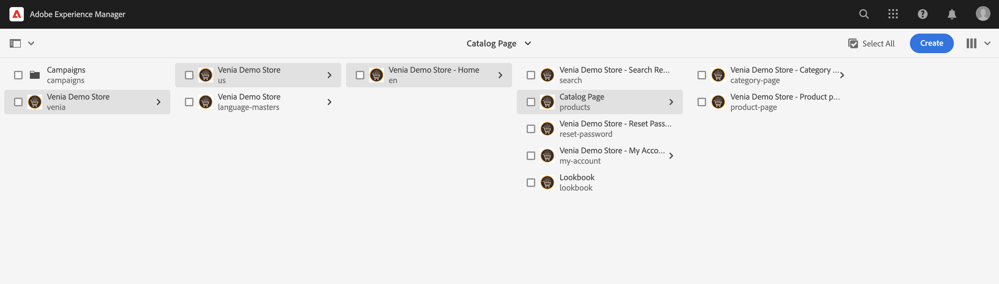

The navigation component shows content and catalog pages. It is possible to show either the catalog landing page or the first level categories in the navigation. Hovering over a category will show second level categories as a second line.
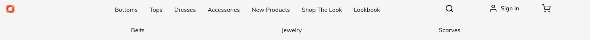

Clicking on a category will open the category page (or product list page).

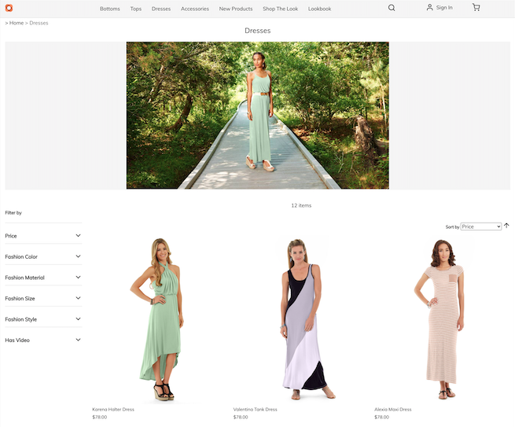

Clicking on a product will open the product detail page.

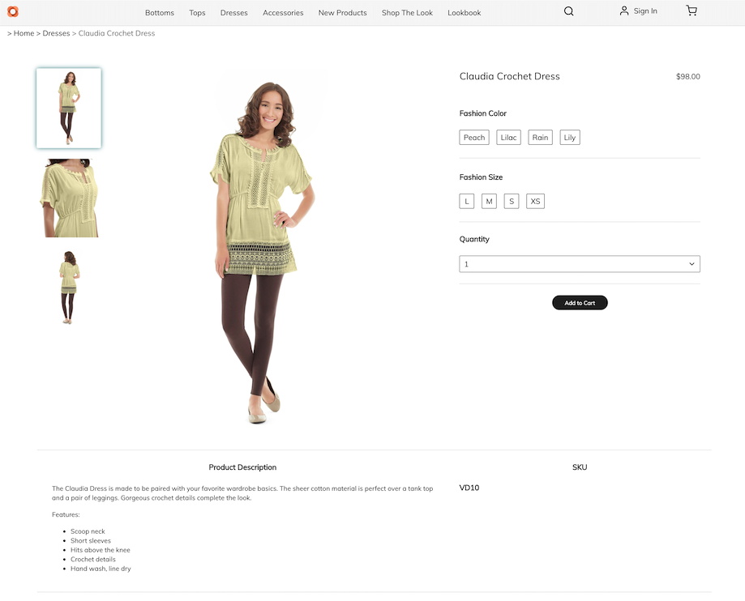

## The Templates {#templates}

### Generic templates {#generic}

The generic Venia catalog template uses the Product List Core Component. This component displays the category image if available and products from the category.
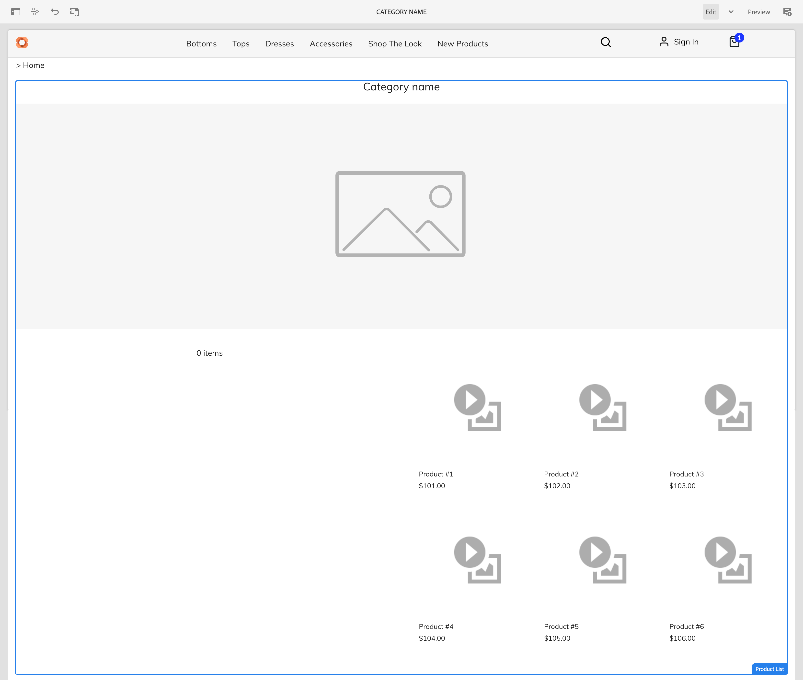

The generic Venia product template uses the Product Detail Core Component. This component displays product information for various product types and add-to-cart action.
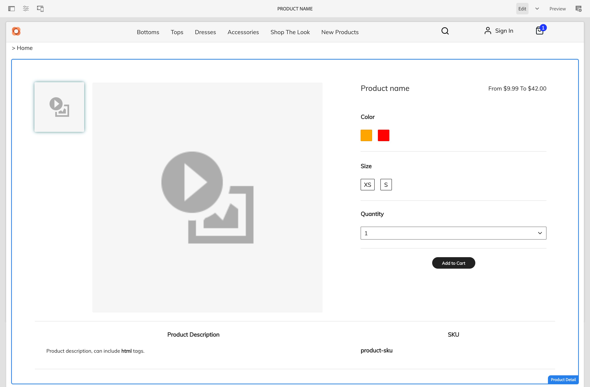

### Edit Templates {#edit-templates}

Templates can be edited either by opening directly the template page or by switching into edit mode while browsing a product catalog page. Keep in mind that changing the page will change the template and not just the specific page of the product / category.

### Category or Product Specific Templates {#specific}

CIF supports multiple templates in just a few clicks. To create another template, select the generic template from the respective category and create a new page using the **Create** action.

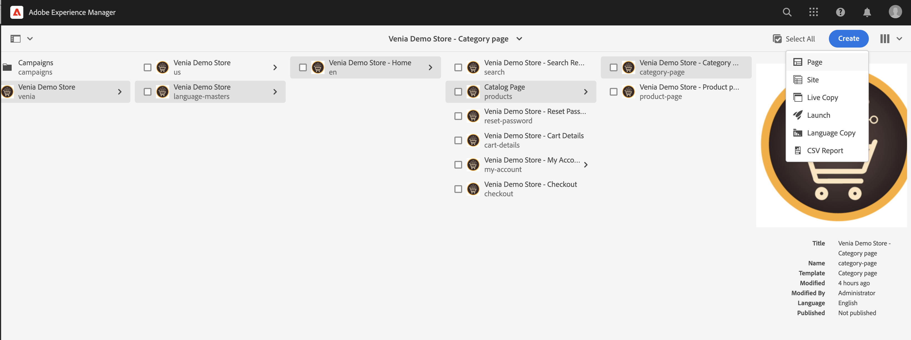

Select the respective product or category template.

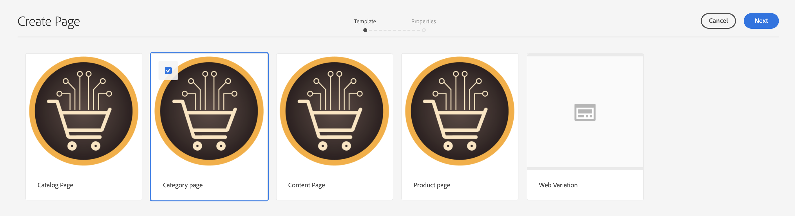

Enter the title and create the page.

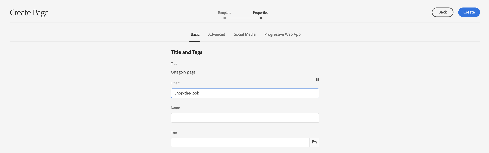

Notice that you have now a specific template under the generic one.

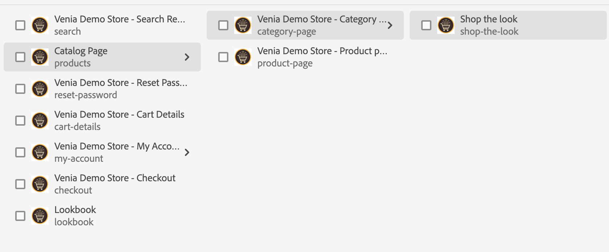

Open the template. It looks exactly like the generic category template.

Add any image on top of the page.

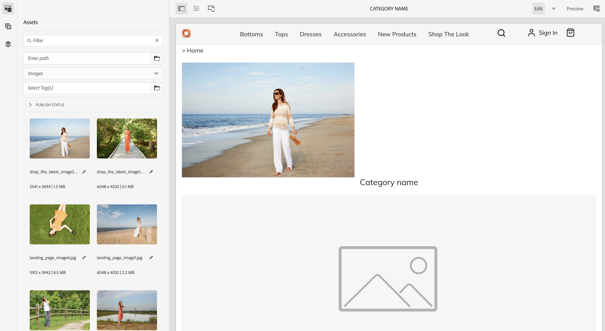

The template can be previewed with any category / product. Open **Page Information** and then select **View with category / product**. Select the product / category from the picker to get a preview with this product / category. Select **Shop The Look** category to get a preview of the updated template.

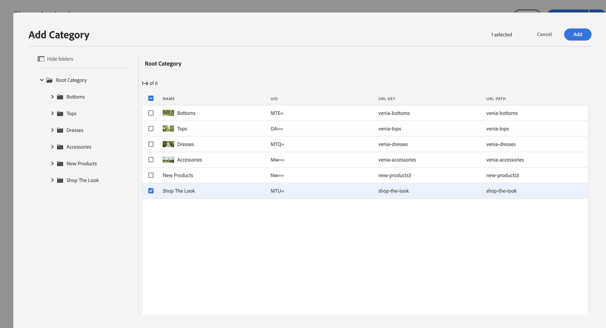

Now we have to assign this template to the specific category. Open properties in the **Page Information** menu and switch to the commerce tab. Click on the folder icon to select the **Shop The Look** category from the category picker. It is possible to assign multiple categories to a template and also including sub-categories by enabling the checkbox.

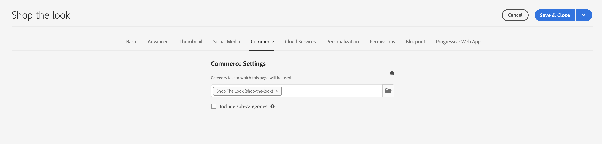

Go back to the main homepage and click on **Shop The Look** category to see the specific template. All the other categories still use the generic template.

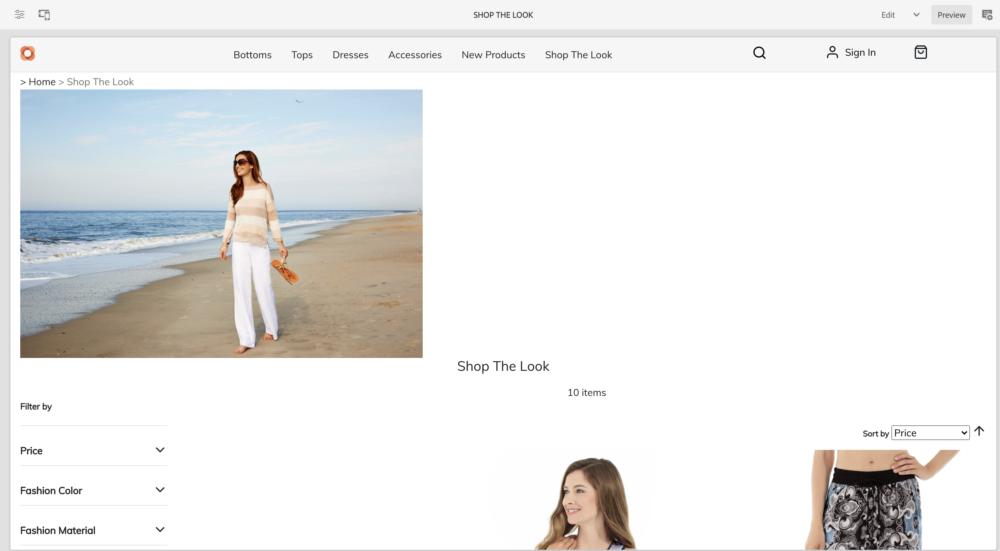

The same workflow can be applied to create individual product templates.

## What's Next {#what-is-next}

Now that you have completed this part of the journey you should:

* understand the concepts of catalog templates
* how generic templates work
* have created an individual template

Build on this knowledge and continue your journey by next reviewing the document [Manage staged product catalog experiences](staged-catalog.md), where you will learn how to work with staged product data and AEM Launches.

## Additional Resources {#additional-resources}

While it is recommended that you move on to the next part of the journey by reviewing the document [Manage staged product catalog experiences](staged-catalog.md), the following are some additional, optional resources that do a deeper dive on some concepts mentioned in this document, but they are not required to continue on the headless journey:

* [Creating Multiple Category and Product Pages](/help/commerce-cloud/authoring/multi-template-usage.md)
* [Migration guide for the Experience Manager Cloud Service](/help/commerce-cloud/migration.md) - How to migrate to the AEM Commerce Integration Framework (CIF) add-on from an old version
