# Getting Started with AEM CIF Authoring {#getting-started}

Get to know about AEM CIF Authoring.

## The Story So Far {#story-so-far}

In the previous document of this AEM Content and Commerce journey, [Learn about AEM Content and Commerce](/help/commerce-cloud/introduction.md), you learned the basic theory of what a headless CMS is and you should now understand the basic concepts of AEM Content and Commerce.

This article builds on those fundamentals.

## Objective {#objective}

This document helps you understand how to use CIF for Content and Commerce specific authoring. After reading, you should:

* Understand the concepts of CIF authoring using the Universal Editor
* How to access product catalog data in AEM using product and category pickers
* How to access content and commerce data using the product cockpit and AEM Omnisearch

## CIF Authoring in the Universal Editor {#cif-authoring}

CIF extends the Universal Editor with capabilities to access the real time product data without leaving the context:

Open the side panel and select 'Products' from the dropdown.
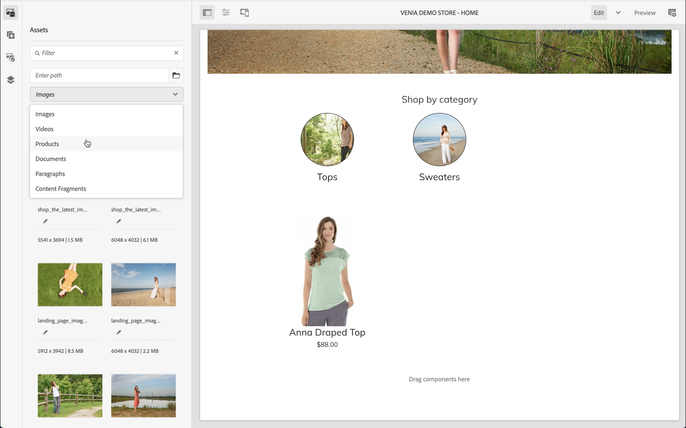

You can  browse the product catalog or use the full-text search field to find products.

Products can be dropped on components that support product drops (example product teaser, product carousel) on directly on the page which automatically creates a product teaser component.

## Product and Category Pickers {#pickers}

If product and category data is required in commerce components or AEM back-office dialogs, AEM authors can use pickers which are UI elements to comfortably search and select product catalog data.

### Product Picker

Clicking on the folder icon will open picker modal UI (for example product teaser)
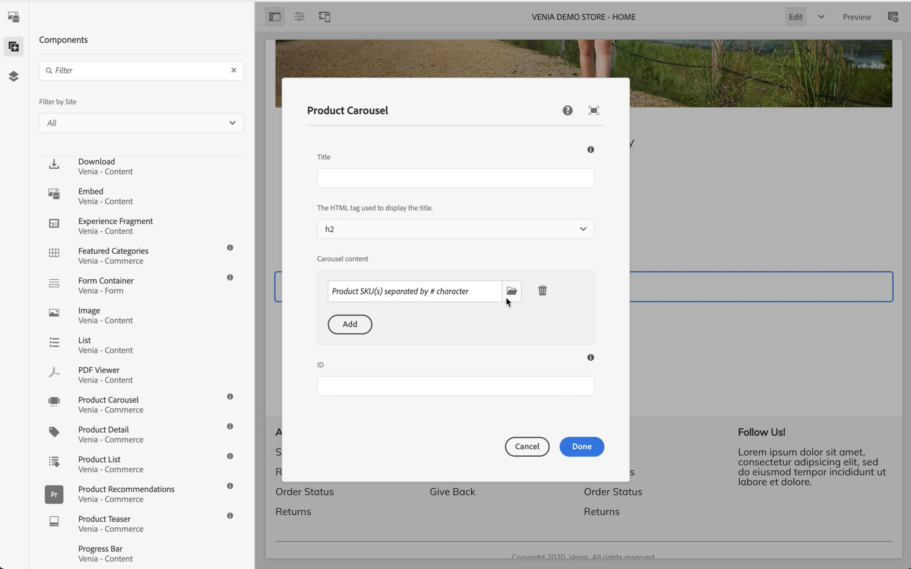

Products can be found either by browsing through the catalog structure on the left or search. Full-text search will respect the selected category and limit the search results to this category.
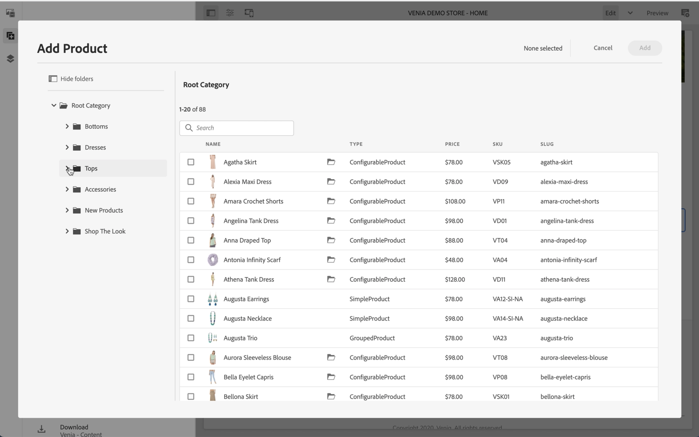

Products with variations are marked with a folder icon that can be clicked to show all variations.
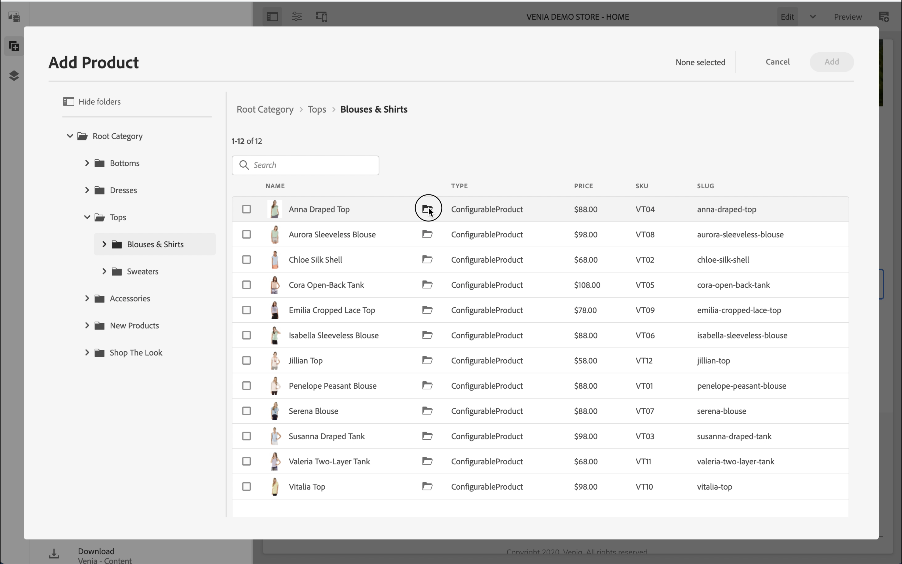
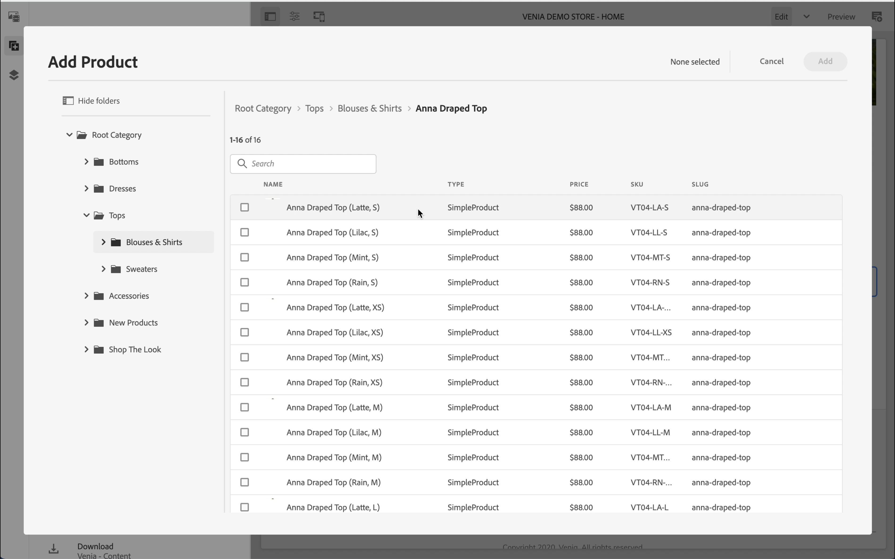

### Category Picker

Works like a product picker. Clicking on the folder icon will open picker modal UI (for example category carousel)
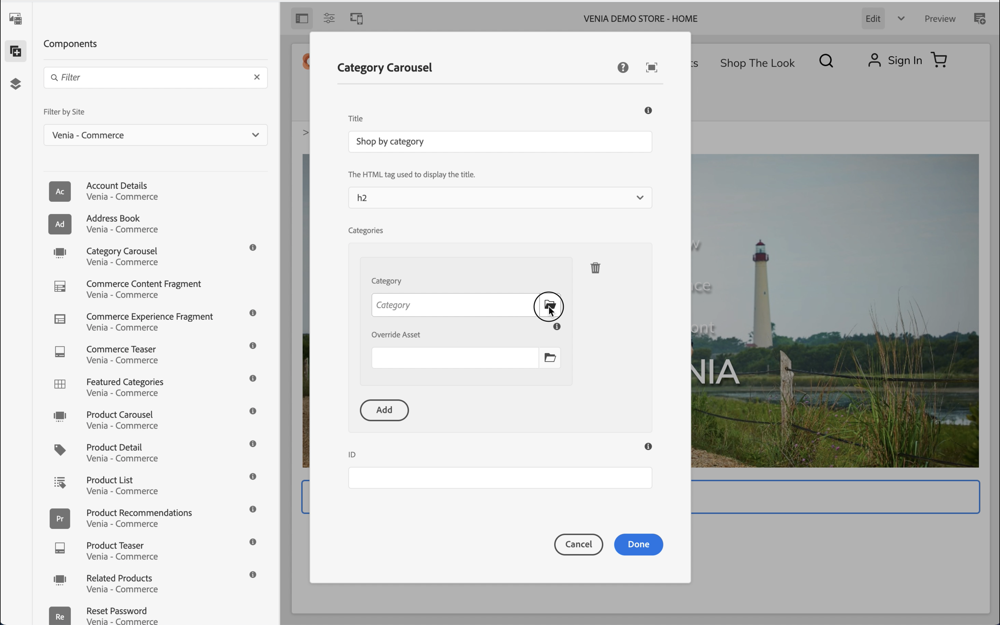

Browse the catalog structure on the left and select the category.

## Product Cockpit {#cockpit}

The product cockpit is a central place to quickly access product catalog with all its enriched content. You will learn in one of the next modules how to enrich product data with content. For now, let's focus on accessing product data.

From the main menu, click on commerce to see a list of all attached product catalogs.
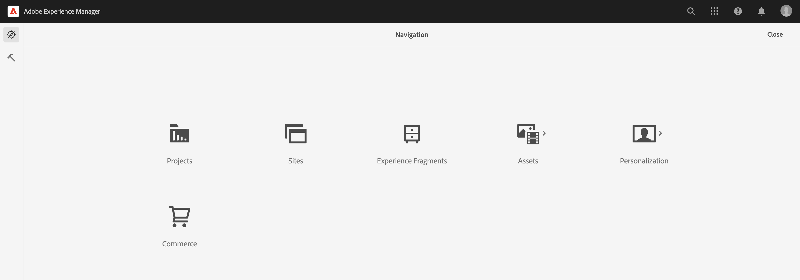

This shows a list of all connect product catalogs.
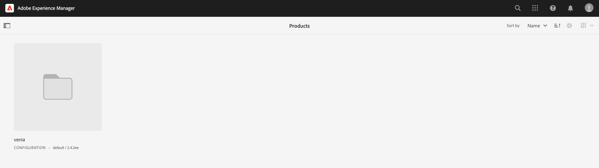

The product catalog shows per default all 1st level categories with all products. Clicking on a category will open that category with all related products and sub categories including their products.
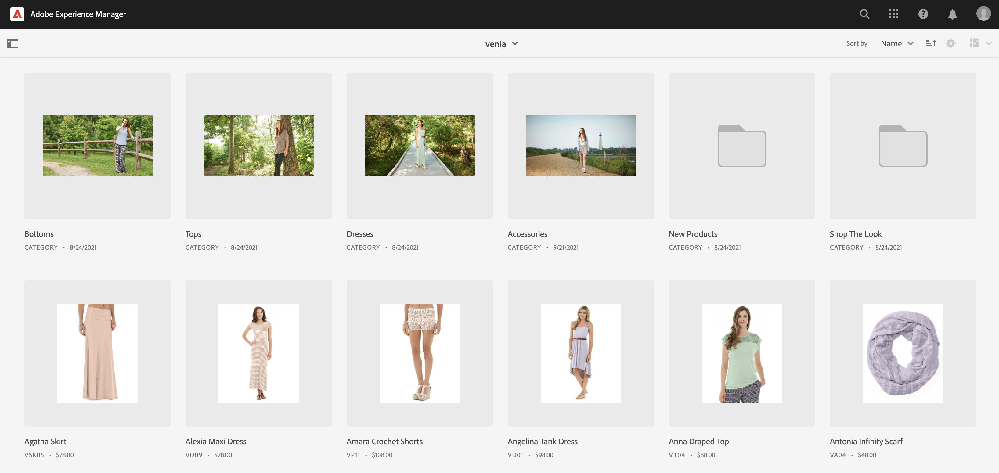

You can open the product properties by clicking on the property icon. The icon appears by hovering over a product tile.
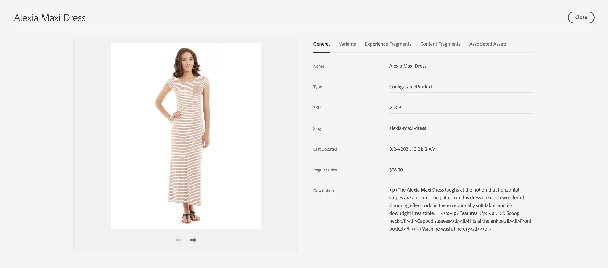

All the product properties are read-only because the data gets loaded in real time from the connected backend. Changing product properties must be done in the backend system which is the system of record. The tab **Variants** will only appear if the product has variations. Clicking on the tab will display all variations with its attributes.
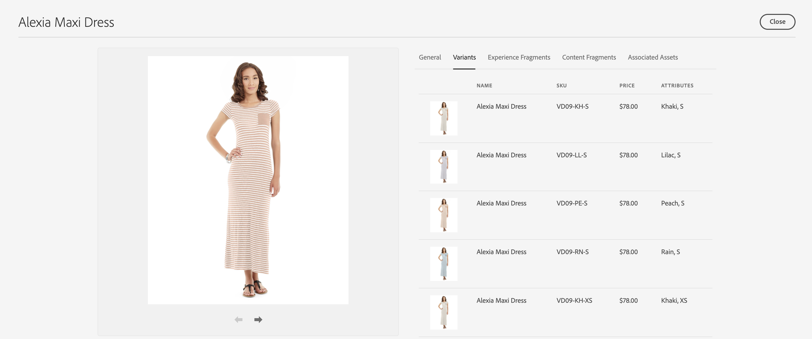

The remaining tabs show all AEM content that is associated with the product. We will discuss these tabs in one of the next modules.

## AEM Omnisearch {#omnisearch}

Using Omnisearch is an easy way to find AEM content using full-text search. CIF extends Omnisearch with full-text search of product catalogs with its associated AEM content.
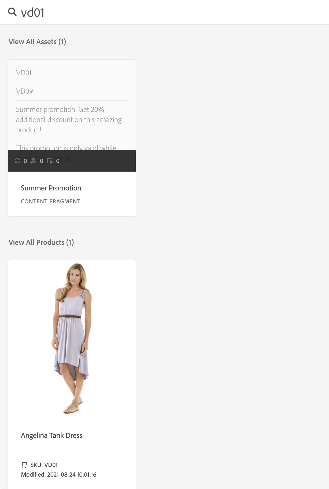

Omnisearch will run a full-text search in the commerce backend to find all related products. The result is listed under **View All Products**. Omnisearch will also search AEM for content that is associated to the searched product. The results will be listed under the respective AEM categories. In this example, one Content Fragment is related to the product.

## What's Next {#what-is-next}

Now that you have completed this part of journey you should:

* Understand the concepts of CIF authoring using the Universal Editor
* How to access product catalog in AEM using product & category pickers
* How to access content and commerce data using the product cockpit and AEM Omnisearch

Build on this knowledge and continue your journey by next reviewing the document [Manage Product Catalog Pages and Templates](catalog-templates.md), where you will learn how to build and customize your first product catalog experience.

## Additional Resources {#additional-resources}

While it is recommended that you move on to the next part of the journey by reviewing the document [Manage Product Catalog Pages and Templates](catalog-templates.md), the following are some additional, optional resources that do a deeper dive on some concepts mentioned in this document, but they are not required to continue on the journey.

* [Configuring Stores and Catalogs](/help/commerce-cloud/getting-started.md#catalog)
