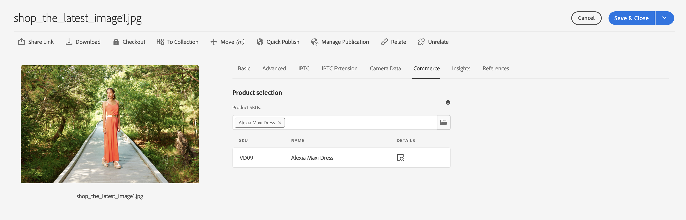
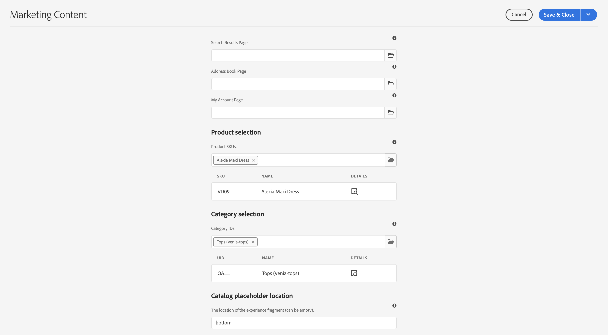
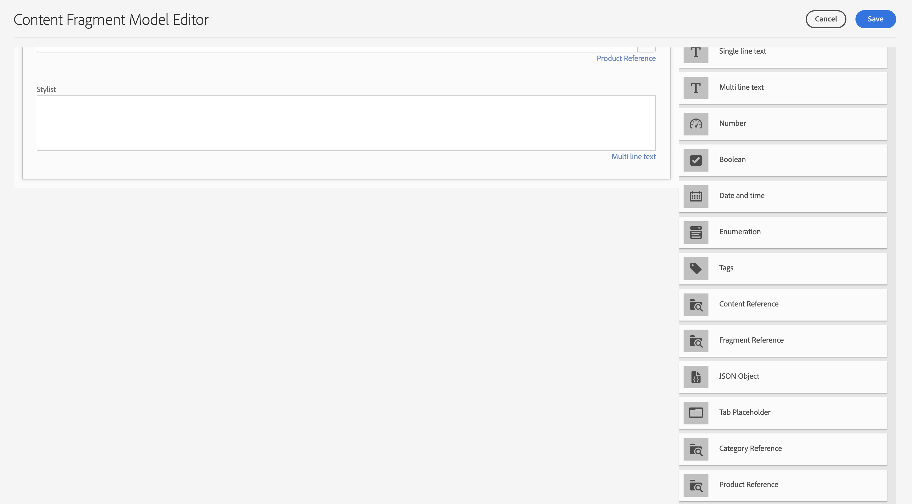
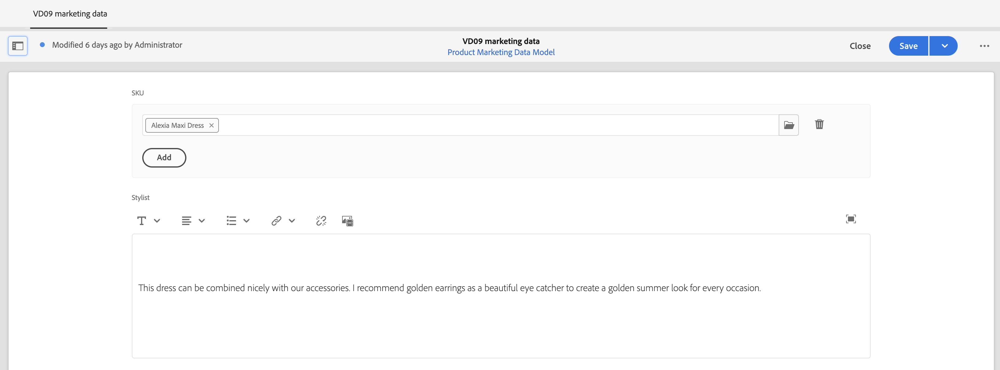
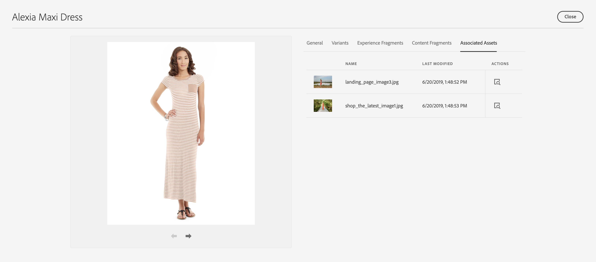
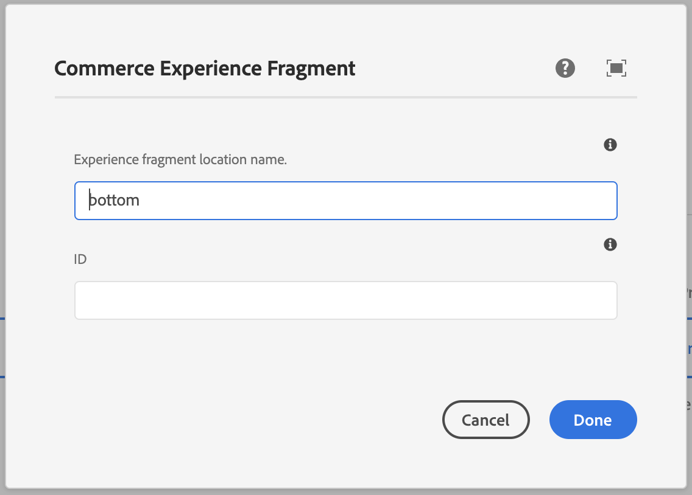
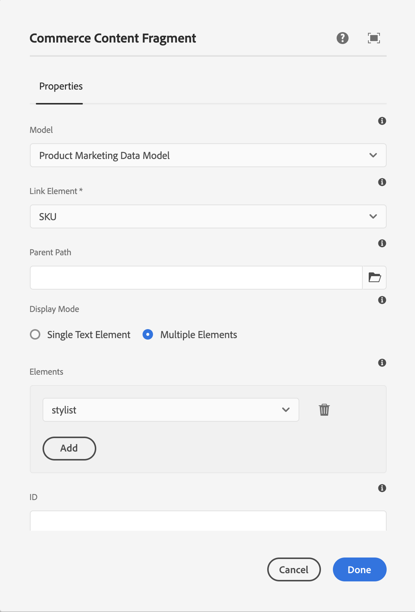
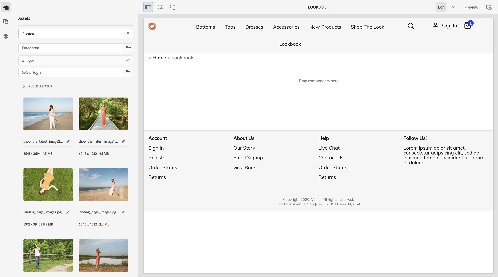
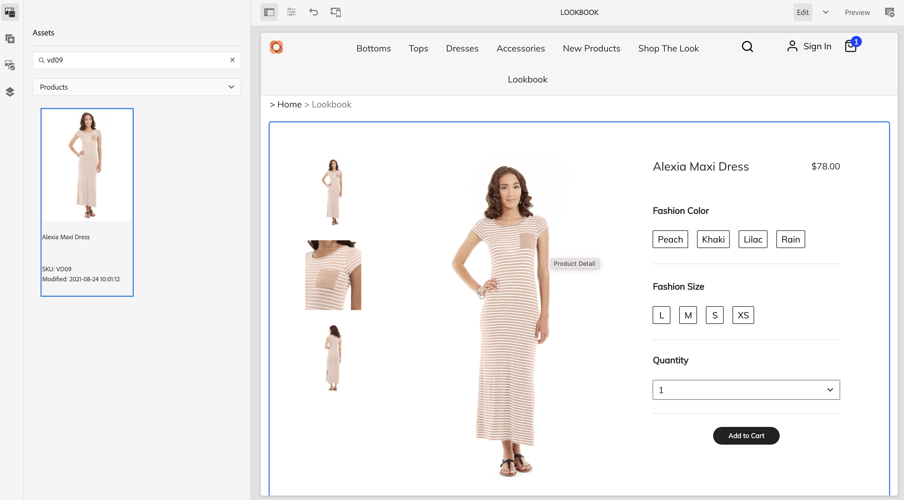
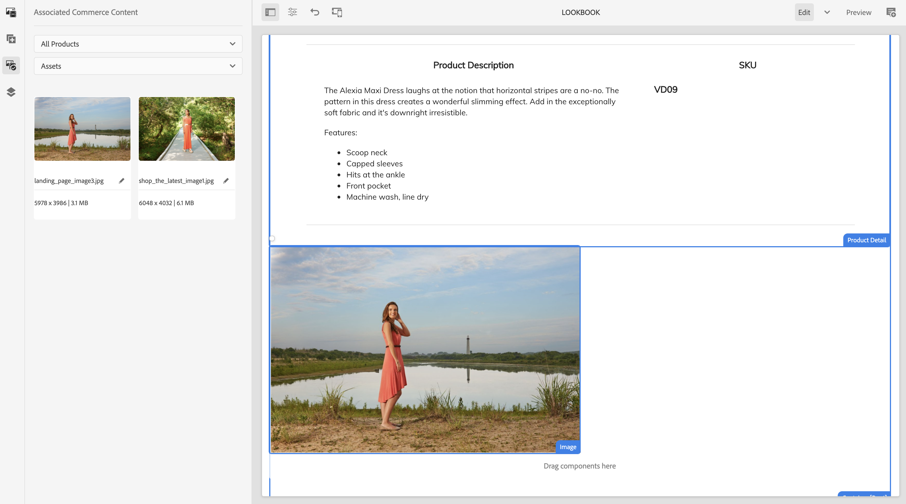

# Building Product Experiences {#building-experiences}

Learn how to manage product experiences.

## The Story So Far {#story-so-far}

In the previous document of the AEM Content and Commerce journey, [Manage staged product catalog experiences](staged-catalog.md), you learned how to manage staged product catalog experiences.

## Objective {#objective}

This document helps you understand how to build product content and experiences.

## Product Experience Management {#management}

Product Experience Management is the discipline to decorate product data (that is owned by a PIM or commerce solution) with marketing content in AEM. This enriched product data with content can then be used in various channels to create an immersive shopping experience.

In AEM, you can create various types of content and link them to the product catalog. Associated content can easily be discovered and used which leads to a high productivity.

### Assets {#assets}

On a high level, there are two types of assets related to products: product & marketing. Product assets are usually managed by merchants and focus on showing the product (mostly in front of a neutral background). The assets are either managed in the commerce solution or in AEM Assets (with an Assets integration to the commerce / pim solution).

Marketing assets are related to promoting and using the product which is usually owned by marketing. Examples are showing multiple products ("shop the look"), in a specific context ("outdoor fall collection"), or how-to pdfs. CIF provides an easy way to link any AEM asset with product catalog object.

Open the asset properties and switch to the **Commerce** tab. This tab allows you to manage the association with products. The table below the picker provides additional information for the linked objects (only visible with a selection). Click on the details icon to get a full view in the product cockpit. To associate a new object, click on the product picker icon (folder icon), select an object and close the picker.

### Experience Fragments {#experience-fragments}

Experience Fragments are a great way to create re-usable or individual product content at scale. The association works similar to an asset. Open properties and switch to the **Commerce** tab. This tab allows you to manage the association with products and categories. The tables below the pickers provide additional information for the linked objects (only visible with a selection). Click on the details icon to get a full view in the product cockpit. To associate a new object, click on the product picker icon (folder icon), select an object and close the picker.

### Content Fragments {#content-fragments}

Content Fragments are the best content type for any structured content. This can be used to augment external product data with additional marketing data or to create content in a headless way. The association of a Content Fragment with a product catalog object happens via the product or category reference types in the Content Fragment Model Editor. Simply drag and drop the right reference type on the model and configure the field. These types support single or multi selection.

If you create a new Content Fragment based on this model, these reference types provide you an easy way to select the right object by using the respective picker.

### Product Cockpit {#product-cockpit}

We have introduced the product cockpit (or console) in one of the pervious modules. The cockpit is an easy way not only to browse the product catalog, but also to see all associated AEM content in one place. Go to the product console and open the properties of a product that has associated content. Switch to the respective tab to see the associated content.

Clicking on the action icon will open that piece of content in a new browser tab.

## Enriching Individual Product & Category Pages {#enrich}

In the previous modules you have learned how to work with multiple product catalog templates. Multiple templates are a great way to create different templates but not needed in many cases. In many cases, the same template can be used in combination with placeholders for individual content. CIF supports placeholders for Content Fragments and Experience Fragments.

Let's start with the Experience Fragment placeholder. Open a product template in the AEM editor. Drag and drop the **Commerce Experience Fragment** component on the template, then open the config dialog.

Open the component's dialog and enter a name for this placeholder. Placeholder name is required and allows you to add as many placeholders as you need.

Open the Experience Fragment you have associated to a product in the previous step. Open properties and switch to the commerce tab. Enter the same placeholder name under **Catalog placeholder location**.

Now drag and drop the **Commerce Content Fragment** component on the template and open the config dialog.

This dialog is re-using the Core Component Content Fragment dialog. Find more information under additional resources. The only difference is the **Link Element** property which configures the identifier field (product SKU or category UID) in the Content Fragment model.

Preview now a product page that has either an associated Content Fragment and / or Experience Fragment. When AEM renders a page, it will do a lookup for every placeholder based on the type (Content or Experience Fragment), identifier and placeholder name for Experience Fragments. AEM uses a URL resolver to get the identifier (SKU for products, UID for categories). If an Experience or Content Fragment is returned, it will be rendered into the placeholder location, otherwise the placeholder gets ignored.

## Making Content Shoppable {#making-shoppable}

It is also possible to make a regular AEM page shoppable by adding commerce components. Create a new content page in AEM and open the empty page in the editor.

First, drag and drop a product detail component on the page. Then switch to the Assets sidebar, switch to products and select a product. Drag and drop that product on the product component. This will show a regular product component on a content page.

If you have created associated content for that product, switch in the Assets sidebar to **Associated Commerce Content**. This tab shows you all AEM content that was associated to this product. This allows you now to  embellish the  pages with any associated content quickly. 

## End of the Journey? {#end-of-journey}

Congratulations! You have completed the AEM Content and Commerce Developer journey! You should now:

* understand how you can associate any AEM content to product catalog objects
* use placeholders to individually enrich product and category pages
* know how to make content shoppable and use the associated content tab

You are now ready to manage product experiences using AEM Content and Commerce. However AEM Content and Commerce have many additional options available. Check out some of the additional resources available in the [Additional Resources section](#additional-resources) to learn more about the features you saw in this journey.

## Additional Resources {#additional-resources}

* [Authoring Commerce Experiences](/help/commerce-cloud/authoring/authoring-commerce-experiences.md)
* [Product Cockpit](/help/commerce-cloud/authoring/product-cockpit.md)
* [Content Fragment component](https://experienceleague.adobe.com/docs/experience-manager-core-components/using/components/content-fragment-component.html?lang=en)
