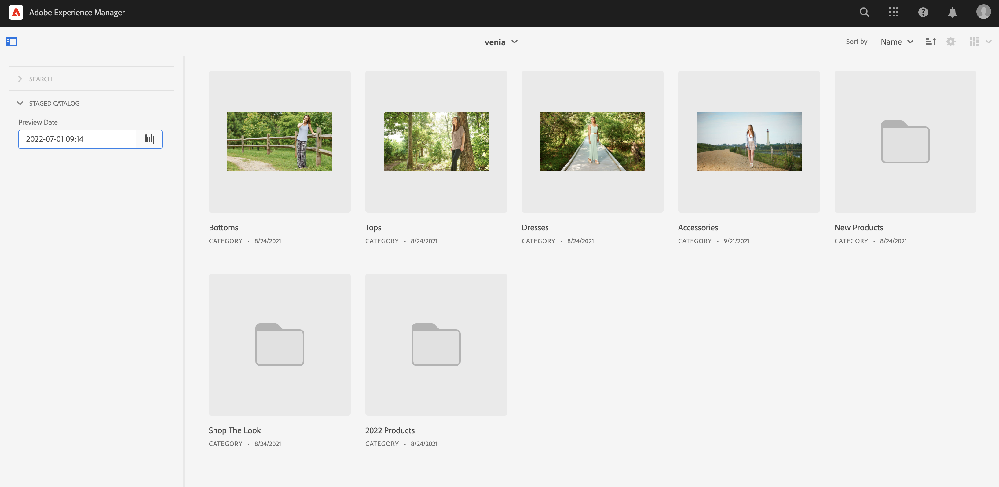
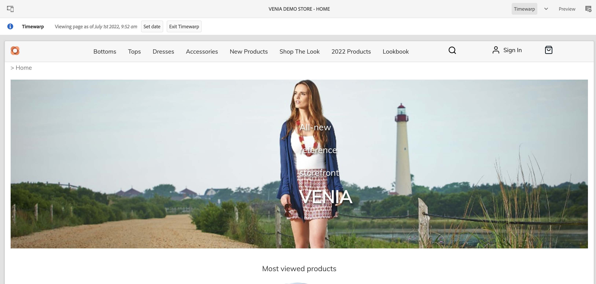
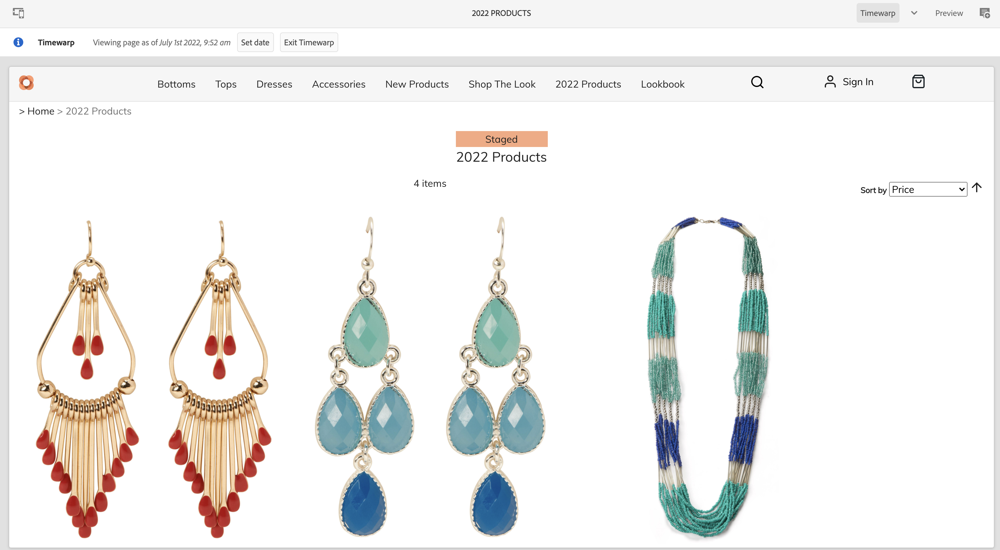
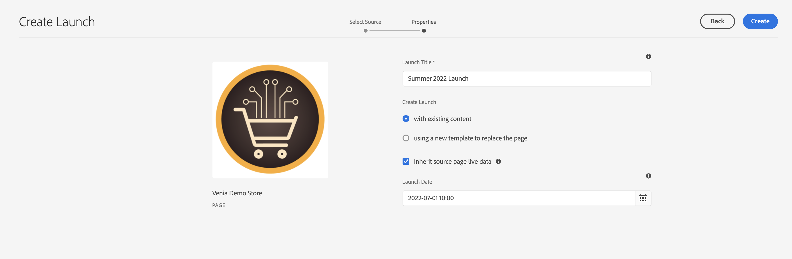
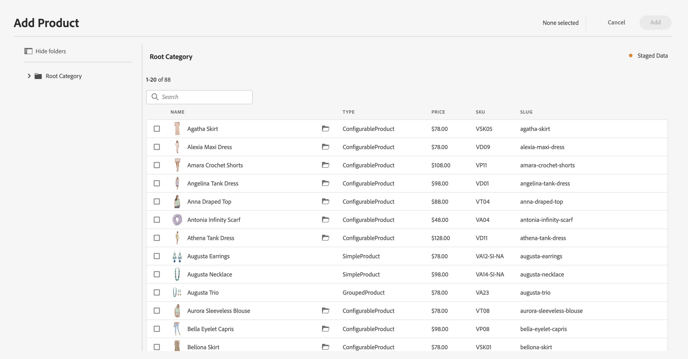

# Building Staged Product Catalog Experiences {#building-experiences}

Learn how to manage staged product catalog experiences.

## The Story So Far {#story-so-far}

In the previous document of the AEM Content and Commerce journey, [Manage Product Catalog Pages and Templates](catalog-templates), you learned how to manage and build product catalog experiences based on templates.

This article builds on those fundamentals.

## Objective {#objective}

This document helps you understand how to manage product catalog experience based on staged product data and AEM Launches. Many times, authors have to prepare in parallel an upcoming product launch (e.g. a new apparel collection). This requires access to staged product data (= not live yet) and the ability to prepare the content. This new content will go live with the product launch.

    >[!NOTE]
    >
    >This feature is only available with Adobe Commerce or Cloud Edition and 3rd party connectors that support token-based authentication. See [Getting Started](https://experienceleague.adobe.com/docs/experience-manager-cloud-service/content-and-commerce/storefront/getting-started.html) for additional information.

First, let's see how authors can access staged product data with CIF.

## Working with staged product data

One way to access staged product data is using the product cokpit. Open up the product catalog by clicking on the Commerce icon in the main AEM menu. This will give you access to live product data. Open the filter tab on the left and expand "STAGED CATALOG". Using the preview data, you can now access staged product data for any point in time. Staged data includes new cateogries, products, or updated fields like price.

Previewing a storefront with staged data is possible using the timewarp view. Open the editor and switch the mode to timewarp. Select any future date. Notice the information on top of the editor that you are viewing the page for a certain date.

You can now browse the catalog with the staged data. If you open a staged category or product page, the editor will show a visual indicator.

    >[!NOTE]
    >
    >Omnisearch does not have a context and thus will only return live product catalog data

## AEM Launches

AEM Launches enables you to create content for staged product data. If you are not familiar with Launches, follow the documenation link under the [Additional Resources section](#additional-resources). The Launch Date is then used to access staged product data.

Notice that the pickers respect the launch date with the staged indicator on the right side.

## End of the Journey? {#end-of-journey}

Congratulations! You have completed the AEM Content and Commerce Developer journey! You should now:

* understand the concepts of staged product catalog and content with Launches
* be able to access staged product catalog data via product cockpit and editor

You are now ready to manage [product experiences](product-experience-management.md). However, AEM Content and Commerce have many additional options available. Check out some of the additional resources available in the [Additional Resources section](#additional-resources) to learn more about the features you saw in this journey.

## Additional Resources {#additional-resources}

* [Getting Started](https://experienceleague.adobe.com/docs/experience-manager-cloud-service/content-and-commerce/storefront/getting-started.html)
* [Launches] (https://experienceleague.adobe.com/docs/experience-manager-cloud-service/sites/authoring/launches/overview.html?lang=en)
