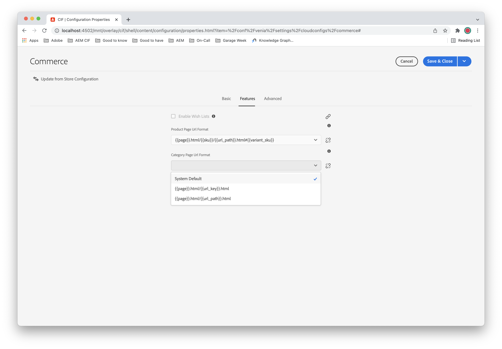

# Advanced URL Configurations {#url}

>[!NOTE]
>
> Search Engine Optimization (SEO) has become a key concern for many marketers. As a result, SEO concerns must be addressed on many projects on Adobe Experience Manager (AEM) as a Cloud Service. See [SEO and URL Management Best Practices](https://experienceleague.adobe.com/docs/experience-manager-cloud-service/content/overview/seo-and-url-management.html) for additional information.

[AEM CIF Core Components](https://github.com/adobe/aem-core-cif-components) provides advanced configurations to customize the URLs for product and category pages. Many implementations customize these URLs for search engine optimization (SEO) purposes. The following video details how to configure the `UrlProvider` Service and features of [Sling Mapping](https://sling.apache.org/documentation/the-sling-engine/mappings-for-resource-resolution.html) to customize the URLs for product and category pages.

>[!VIDEO](https://video.tv.adobe.com/v/34350/?quality=12)

## Configuration {#configuration}

To configure the `UrlProvider` service according to the SEO requirements and needs, a project must provide an OSGI configuration for the _CIF URL Provider configuration_.

>[!NOTE]
>
> Since release 2.0.0 of the AEM CIF Core Components, the URL Provider configuration only provides pre-defined URL formats, instead of the free-text configureable formats known from 1.x releases. Furthermore the use of selectors to pass data in URLs has been replaced with suffixes.

### Product Page URL Format {#product}

Configures the URLs of the product pages and supports the following options:

* `{{page}}.html/{{sku}}.html#{{variant_sku}}` (default)
* `{{page}}.html/{{sku}}/{{url_key}}.html#{{variant_sku}}`
* `{{page}}.html/{{sku}}/{{category}}/{{url_key}}.html#{{variant_sku}}`
* `{{page}}.html/{{sku}}/{{url_path}}.html#{{variant_sku}}` 
* `{{page}}.html/{{url_key}}.html#{{variant_sku}}`
* `{{page}}.html/{{category}}/{{url_key}}.html#{{variant_sku}}`
* `{{page}}.html/{{url_path}}.html#{{variant_sku}}`

If there is the [Venia Reference store](https://github.com/adobe/aem-cif-guides-venia):

* `{{page}}` is replaced by `/content/venia/us/en/products/product-page`
* `{{sku}}` is replaced by the product's SKU, for example, `VP09`
* `{{url_key}}` is replaced by the product's `url_key` property, for example, `lenora-crochet-shorts`
* `{{url_path}}` is replaced by the product's `url_path`, for example, `venia-bottoms/venia-pants/lenora-crochet-shorts`
* `{{variant_sku}}` is replaced by the currently selected variant, for example, `VP09-KH-S`

Since the `url_path` got deprecated, the pre-defined product URL formats use a product's `url_rewrites` and pick the one with the most path segments as alternative if the `url_path` is not available.

With the above example data, a product variant URL formatted using the default URL format looks like `/content/venia/us/en/products/product-page.html/VP09.html#VP09-KH-S`.

### Category Page URL Format {#product-list}

Configures the URLs of the category or product list pages and supports the following options:

* `{{page}}.html/{{url_path}}.html` (default)
* `{{page}}.html/{{url_key}}.html`

If there is the [Venia Reference store](https://github.com/adobe/aem-cif-guides-venia):

* `{{page}}` is replaced by `/content/venia/us/en/products/category-page`
* `{{url_key}}` is replaced by the category's `url_key` property
* `{{url_path}}` is replaced by the category's `url_path`

With the above example data, a category page URL formatted using the default URL format looks like `/content/venia/us/en/products/category-page.html/venia-bottoms/venia-pants.html`.

>[!NOTE]
> 
> The `url_path` is a concatenation of the `url_keys` of a product or category's ancestors and the product or category's `url_key` separated by `/` slash. Each `url_key` is considered unique within a given store.

### Store-specific Configuration {#store-specific-urlformats}

The system-wide category and product page URL formats set by the _CIF URL Provider configuration_ can be changed for each store.

In the CIF Configuration, an editor can select an alternative product or category page URL format. If nothing is selected there, the implementation falls back to the system-wide configuration.

Changing the URL format of a live website may have a negative impact on the organic traffic of your site. See [Best Practices](#best-practices) below and carefully plan the change of the URL format in advance.



>[!NOTE]
>
> The store-specific configuration of the URL formats requires [CIF Core Components 2.6.0](https://github.com/adobe/aem-core-cif-components/releases/tag/core-cif-components-reactor-2.6.0) and the latest version of the Adobe Experience Manager Content and Commerce add-on.

## Category-Aware Product Page URLs {#context-aware-pdps}

Since it is possible to encode category information in a product URL, products that are in multiple categories may be addressed with multiple product URLs as well.

The default URL formats select one of the possible alternatives using the following scheme:

* if the `url_path` is defined by the e-commerce backend use it (deprecated)
* from the `url_rewrites` use those URLs that end with the product's `url_key` as alternatives
* form these alternatives use the one with the most path segments
* if there are multiple, take the first one in the order given by the e-commerce backend

This scheme selects the `url_path` with the most ancestors, based on the assumption that a child category is more specific than its parent category. The selected `url_path` is considered _canonical_ and is always used as the canonical link on product pages or in the product sitemap.

However, when a shopper navigates from a category page to a product page, or from one product page to another related product page in the same category, it is worthwhile to retain the current category context. In this case, the `url_path` selection should prefer alternatives that are within the current category context over the _canonical_ selection described above.

This feature must be enabled in the _CIF URL Provider configuration_. If enabled the selection scores alternatives higher, when

* they match parts of a given category's `url_path` from the beginning (fuzzy prefix matching)
* or they match a given category's `url_key` anywhere (exact partial matching)

For example, consider the response for a [products query](https://devdocs.magento.com/guides/v2.4/graphql/queries/products.html) below. Given the following:

* the user is on the "New Products / New in Summer 2022" category page
* the store uses the default category page URL format

The alternative "new-products/new-in-summer-2022/gold-cirque-earrings.html" matches two of the context's path segments from the beginning. That is, "new-products" and "new-in-summer-2022". If the store uses a category page URL format that only contains the category `url_key`, the same alternative would still be selected as it matches the context's `url_key` anywhere. In both cases, the product page URL is created for the "new-products/new-in-summer-2022/gold-cirque-earrings.html" `url_path`.

```
{
  "data": {
    "products": {
      "items": [
        {
          "sku": "VA18-GO-NA",
          "url_key": "gold-cirque-earrings",
          "url_rewrites": [
            {
              "url": "gold-cirque-earrings.html"
            },
            {
              "url": "venia-accessories/gold-cirque-earrings.html"
            },
            {
              "url": "venia-accessories/venia-jewelry/gold-cirque-earrings.html"
            },
            {
              "url": "new-products/gold-cirque-earrings.html"
            },
            {
              "url": "new-products/new-in-summer-2022/gold-cirque-earrings.html"
            }
          ]
        }
      ]
    }
  }
}
```

>[!NOTE]
>
> Category aware product URLs require [CIF Core Components 2.6.0](https://github.com/adobe/aem-core-cif-components/releases/tag/core-cif-components-reactor-2.6.0) or newer.

## Specific Category and Product Pages {#specific-pages}

It is possible to create [multi-category and product pages](../authoring/multi-template-usage.md) for only a specific subset of categories or products of a catalog. 

### Selection Criteria {#specific-pages-selection}

The selection of a specific category page is straight forward, based on the category's `url_path` or `url_key`. Matching subcategories is supported only for URL formats that contain the full category `url_path`. Otherwise only an exact matching of the `url_key` is possible.

Specific product pages are selected either by the product's SKU or category. The latter requires some category information to be encoded in the product URL. This functionality is only available for some of the default URL formats. See the following table for a comparison which URL format supports specific page selection by SKU or category.


| URL Format                                            | by SKU | by category      |
| ----------------------------------------------------- | ------ | ---------------- |
| `{{page}}.html/{{url_key}}.html`                      | no     | no               |
| `{{page}}.html/{{category}}/{{url_key}}.html`         | no     | exact match only |
| `{{page}}.html/{{url_path}}.html`                     | no     | yes              |
| `{{page}}.html/{{sku}}.html`                          | yes    | no               |
| `{{page}}.html/{{sku}}/{{url_key}}.html`              | yes    | no               |
| `{{page}}.html/{{sku}}/{{category}}/{{url_key}}.html` | yes    | exact match only |
| `{{page}}.html/{{sku}}/{{url_path}}.html`             | yes    | yes              |

{style="table-layout:auto"}

>[!NOTE]
>
> Selecting specific product pages by category requires [CIF Core Components 2.6.0](https://github.com/adobe/aem-core-cif-components/releases/tag/core-cif-components-reactor-2.6.0) or newer.

### Deep Linking {#specific-pages-deep-linking}

The `UrlProvider` is pre-configured to generate deep links to specific category and product pages on author tier instances. This ability is useful to editors, that browse a site using Preview mode, navigate to a specific product or category page and switch back to Edit mode to edit the page.

On publish tier instances on the other hand, catalog page URLs should be kept stable to not lose gains on search engine rankings for example. Because of that publish tier, instances do not render deep links to specific catalog pages per default. To change this behavior, the _CIF URL Provider Specific Page Strategy_ can be configured to always generate specific page URLs.

### Multiple Catalog Pages {#multiple-product-pages}

When editors want to have full control of the top-level navigation of a site, using a single catalog page to render the top-level categories of a catalog may not be desired. Instead editors can create multiple catalog pages, one for each category of the catalog they want to include in the top-level navigation.

For that use case, each of the catalog pages may have a reference to a product and category page specific to the category configured for the catalog page. The `UrlProvider` uses these connections to create links for the pages and categories in the configured category. However, for performance reasons only the direct catalog page children of a Site's navigation root / landing page are considered.

It is recommended that the product and category pages of a catalog page are descendant to that catalog page, otherwise components like the Navigation or Breadcrumb may not work correctly. 

>[!NOTE]
>
> Full support for multiple catalog pages requires [CIF Core Components 2.10.0](https://github.com/adobe/aem-core-cif-components/releases/tag/core-cif-components-reactor-2.10.0) or newer.

## Customizations {#customization}

### Custom URL Formats {#custom-url-format}

To provide a custom URL format, a project can implement either the [`ProductUrlFormat`](https://javadoc.io/doc/com.adobe.commerce.cif/core-cif-components-core/latest/com/adobe/cq/commerce/core/components/services/urls/ProductUrlFormat.html) or the [`CategoryUrlFormat`](https://javadoc.io/doc/com.adobe.commerce.cif/core-cif-components-core/latest/com/adobe/cq/commerce/core/components/services/urls/CategoryUrlFormat.html) service interface and register the implementation as OSGI service. Those implementations, if available, replace the configured, pre-defined format. If there are multiple implementations registered, the one with the higher service ranking replaces the ones with the lower service ranking.

The custom URL format implementations must implement a pair of methods to build a URL from given parameters, and to parse a URL to return the same parameters respectively.

### Combine with Sling Mappings {#sling-mapping}

In addition to the `UrlProvider`, it is also possible to configure [Sling Mappings](https://sling.apache.org/documentation/the-sling-engine/mappings-for-resource-resolution.html) to rewrite and process URLs. The AEM Archetype project also provides [an example configuration](https://github.com/adobe/aem-cif-project-archetype/tree/master/src/main/archetype/samplecontent/src/main/content/jcr_root/etc/map.publish) to configure some Sling Mappings for port 4503 (publish) and 80 (Dispatcher).

### Combine with AEM Dispatcher {#dispatcher}

URL rewrites can also be achieved by using AEM Dispatcher HTTP server with `mod_rewrite` module. The [AEM Project Archetype](https://github.com/adobe/aem-project-archetype) provides a reference AEM Dispatcher config which already includes basic [rewrite rules](https://github.com/adobe/aem-project-archetype/tree/master/src/main/archetype/dispatcher.cloud) for the generated size.

## Best Practices {#best-practices}

### Choose the best URL Format {#choose-url-format}

As mentioned before selecting one of the available default formats, or even implementing a custom format, highly depends on the needs and requirements of a store. The following suggestions may help to make an educated decision.

_**Use a product page URL format that contains the SKU.**_

The CIF Core Components use the SKU as primary identifier in all components. If the product page URL format does not contain the SKU, a GraphQL query is necessary to resolve it. This resolution may impact the time-to-first-byte. Also, it may be desired, that shoppers can find products by SKU using search engines.

_**Use a product page URL format that contains the category context.**_

Some features of the CIF URL Provider are only available when using product URL formats, that encode the category context, like the category `url_key` or the category `url_path`. Even if those features may not be required for a new store, using one of these URL formats in the beginning helps to reduce migration efforts in the future.

_**Balance between URL length and encoded information.**_

Depending on the catalog size, in particular the size and depth of the category tree, it may not be reasonable to encode the full `url_path` of categories into the URL. In that case, the URL length could be reduced by including only the category's `url_key` instead. This method supports most of the features that are available when using the category `url_path`.

Also, use [Sling Mappings](#sling-mapping) to combine the SKU with the product `url_key`. In most e-commerce systems, the SKU follows a particular format and separating the SKU from the `url_key` for incoming requests should easily be possible. With that in mind, it should be possible to rewrite a product page URL to `/p/{{category}}/{{sku}}-{{url_key}}.html`, and a category URL to `/c/{{url_key}}.html` respectively. The `/p` and `/c` prefix are still necessary to distinguish product and category pages from other content pages.

### Migrating to a new URL Format {#migrate-url-formats}

Many of the default URL formats are somehow compatible with each other, meaning that URLs formatted by one may be parsed by another one. That helps migrating between URL formats.

On the other hand, search engines need time to recrawl all catalog pages with the new URL format. To support this process and also to improve the end-user experience, it is recommended to provide redirects that forward the user from the old URLs to the new ones.

One approach for that could be, to connect a stage environment to the production e-commerce backend and configure it to use the new URL format. Afterwards obtain the [product sitemap generated by CIF products sitemap generator](../../overview/seo-and-url-management.md) for both the stage and the production environment, and use them to create an [Apache httpd rewrite map](https://httpd.apache.org/docs/2.4/rewrite/rewritemap.html). This rewrite map can then be deployed to the Dispatcher together with the rollout of the new URL format.

## Example {#example}

The [Venia Reference store](https://github.com/adobe/aem-cif-guides-venia) project includes sample configurations to demonstrate the usage of custom URLs for product and category pages. This configuration allows each project to set up individual URL patterns for product and category pages according to their SEO needs. A combination of CIF `UrlProvider` and Sling Mappings as described above is used.

>[!NOTE]
>
>This configuration must be adjusted with the external domain used by the project. The Sling Mappings are working based on the hostname and domain. Therefore this configuration is disabled by default and must be enabled before deployment. To do so, rename the Sling Mapping `hostname.adobeaemcloud.com` folder in `ui.content/src/main/content/jcr_root/etc/map.publish/https` according to the used domain name and enable this config by adding `resource.resolver.map.location="/etc/map.publish"` to the `JcrResourceResolver` config of the project.

## Additional Resources {#additional}

* [Venia Reference store](https://github.com/adobe/aem-cif-guides-venia)
* [AEM Resource Mapping](https://experienceleague.adobe.com/docs/experience-manager-65/deploying/configuring/resource-mapping.html)
* [Sling Mappings](https://sling.apache.org/documentation/the-sling-engine/mappings-for-resource-resolution.html)
