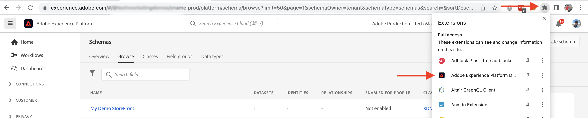

# AEM-CIF core components and Adobe Experience Platform integration {#aem-cif-aep-integration}

The [Commerce Integration Framework (CIF)](https://github.com/adobe/aem-core-cif-components) core components provide seamless integration with [Adobe Experience Platform](https://experienceleague.adobe.com/docs/experience-platform/landing/platform-overview.html?lang=en) to forward storefront events and their data from client-side interactions such as __add to cart__.

The [AEM CIF Core Components](https://github.com/adobe/aem-core-cif-components) project provides a JavaScript library called [Experience Platform Connector](https://github.com/adobe/aem-core-cif-components/tree/master/extensions/experience-platform-connector) to collect event data from your Commerce storefront. That event data is sent to the Experience Platform where it is used in other Adobe Experience Cloud products, such as Adobe Analytics and Adobe Target to build a 360-degree profile that covers a customer journey. By connecting Commerce data to other products in the Adobe Experience Cloud, you can perform tasks like analyze user behavior on your site, perform AB testing, and create personalized campaigns.

Learn more about the [Experience Platform Data Collection](https://experienceleague.adobe.com/docs/experience-platform/collection/home.html) suite of technologies that allow you to collect customer experience data from client-side sources.

## Send `addToCart` event data to Experience Platform {#send-addtocart-to-aep}

The following steps show how to send the `addToCart` event data from AEM-rendered product pages to the Experience Platform using the CIF - Experience Platform Connector. By using the [Adobe Experience Platform Debugger](https://experienceleague.adobe.com/docs/experience-platform/debugger/home.html?lang=en) browser extension you can test and review the submitted data.


## Prerequisites {#prerequisites}

You must use a local development environment to complete this demo. This includes a running instance of AEM that is configured and connected to an Adobe Commerce instance. Review the requirements and steps for [setting up local development with AEM as a Cloud Service SDK](../develop.md).

You also need access to [Adobe Experience Platform](https://experienceleague.adobe.com/docs/experience-platform/landing/platform-ui/ui-guide.html) and permissions to create the schema, dataset, and datastreams for data collection. For more information, see [Permission management](https://experienceleague.adobe.com/docs/experience-platform/collection/permissions.html).

## AEM Commerce as a Cloud Service setup {#aem-setup}

To have a working __AEM Commerce as a Cloud Service__ local environment with the necessary code and config, complete the following steps.

### Local setup

Follow the [Local Setup](https://experienceleague.adobe.com/docs/experience-manager-cloud-service/content/content-and-commerce/storefront/developing/develop.html?#local-setup) steps to have a working AEM Commerce as a Cloud Service environment.

### Project setup

Follow the [AEM Project Archetype](https://experienceleague.adobe.com/docs/experience-manager-cloud-service/content/content-and-commerce/storefront/developing/develop.html?#project) steps to create a brand new AEM Commerce (CIF) project. 

>[!TIP]
>
>In the following example, the AEM Commerce project is named: `My Demo Storefront`, however, you can choose your own project name.


Build and deploy the newly created AEM Commerce project to the local AEM SDK by running the following command from the project's root directory.

```bash
$ mvn clean install -PautoInstallSinglePackage
```

The locally deployed `My Demo StoreFront` commerce site with default code and content looks like below.


### Install Peregrine and CIF-AEP connector dependencies

In order to collect and send the events data from the category, and product pages of this AEM Commerce site we need to install the key `npm` packages into the `ui.frontend` the module of the AEM Commerce project.

Navigate to `ui.frontend` module and install required packages by running the following commands on the terminal.

```bash
npm i --save lodash.get@^4.4.2 lodash.set@^4.3.2
npm i --save apollo-cache-persist@^0.1.1
npm i --save redux-thunk@~2.3.0
npm i --save @adobe/apollo-link-mutation-queue@~1.1.0
npm i --save @magento/peregrine@~12.5.0
npm i --save @adobe/aem-core-cif-react-components --force
npm i --save-dev @magento/babel-preset-peregrine@~1.2.1
npm i --save @adobe/aem-core-cif-experience-platform-connector --force
```

>[!IMPORTANT]
>
>The `--force` argument is required sometimes as [PWA Studio](https://developer.adobe.com/commerce/pwa-studio/) is restrictive with the supported peer dependencies. Usually, this should not cause any issues.


### Configure Maven to use `--force` argument

As part of Maven builds the npm clean install (using `npm ci`) is triggered, thus it also needs the `--force` argument. 

Navigate to the project's root POM file `pom.xml` and locate the `<id>npm ci</id>` execution block, and update it to look like the below.

```xml
<execution>
    <id>npm ci</id>
    <goals>
    <goal>npm</goal>
    </goals>
    <configuration>
    <arguments>ci --force</arguments>
    </configuration>
</execution>
```

### Change Babel configuration format

Switch from the default `.babelrc` file relative configuration file format to `babel.config.js` format. This is a project-wide configuration format and allows the plugins and presets to be applied to the `node_module` with greater control.

-   Navigate to `ui.frontend` module, delete the existing `.babelrc` file.

-   Create a `babel.config.js` file that uses the `peregrine` preset.

    ```javascript
    const peregrine = require('@magento/babel-preset-peregrine');
    
    module.exports = (api, opts = {}) => {
        const config = {
            ...peregrine(api, opts),
            sourceType: 'unambiguous'
        } 
    
        config.plugins = config.plugins.filter(plugin => plugin !== 'react-refresh/babel');
    
        return config;
    }
    ```

### Configure webpack to use Babel

To transpile the JavaScript files using Babel loader (`babel-loader`) and webpack, tweak the `webpack.common.js` file.

Navigate to `ui.frontend` module, and update the `webpack.common.js` file to have the following rule inside the `module` property value.

```javascript
{
    test: /\.jsx?$/,
    exclude: /node_modules\/(?!@magento\/)/,
    loader: 'babel-loader'
}
```

### Configure Apollo Client

The [Apollo Client](https://www.apollographql.com/docs/react/) is used to manage both local and remote data with GraphQL. It also stores the results of GraphQL queries in a local, normalized, in-memory cache. 

For [`InMemoryCache`](https://www.apollographql.com/docs/react/caching/cache-configuration/) to work effectively a `possibleTypes.js` file is needed, and to generate it automatically see [Generating possibleTypes automatically](https://www.apollographql.com/docs/react/data/fragments/#generating-possibletypes-automatically). Also, see the [PWA Studio reference implementation](https://github.com/magento/pwa-studio/blob/1977f38305ff6c0e2b23a9da7beb0b2f69758bed/packages/pwa-buildpack/lib/Utilities/graphQL.js#L106-L120), and an example [`possibleTypes.js`](../assets/possibleTypes.js) file from here can be used.


-   Navigate to `ui.frontend` module, and save the file as `./src/main/possibleTypes.js`

-   Update the `webpack.common.js` file's `DefinePlugin` section to replace required static variables during build time.

    ```javascript
    const { DefinePlugin } = require('webpack');
    const { POSSIBLE_TYPES } = require('./src/main/possibleTypes');

    ...

    plugins: [
        ...
        new DefinePlugin({
            'process.env.USE_STORE_CODE_IN_URL': false,
            POSSIBLE_TYPES
        })
    ]
    ```

### Initialize Peregrine and CIF core components

To initialize the React based Peregrine and CIF core components create the required configuration and JavaScript files.

-   Navigate to `ui.frontend` module, and create a folder `src/main/webpack/components/commerce/App`

-   Create `config.js` file with the below content

    ```javascript

    // get and parse the CIF store configuration from the <head>
    const storeConfigEl = document.querySelector('meta[name="store-config"]');
    const storeConfig = storeConfigEl ? JSON.parse(storeConfigEl.content) : {};
    
    // the following global variables are needed for some of the peregrine features
    window.STORE_VIEW_CODE = storeConfig.storeView || 'default';
    window.AVAILABLE_STORE_VIEWS = [
        {
            code: window.STORE_VIEW_CODE,
            base_currency_code: 'USD',
            default_display_currency_code: 'USD',
            id: 1,
            locale: 'en',
            secure_base_media_url: '',
            store_name: 'My Demo StoreFront'
        }
    ];
    window.STORE_NAME = window.STORE_VIEW_CODE;
    window.DEFAULT_COUNTRY_CODE = 'en';
    
    export default {
        storeView: window.STORE_VIEW_CODE,
        graphqlEndpoint: storeConfig.graphqlEndpoint,
        // Can be GET or POST. When selecting GET, this applies to cache-able GraphQL query requests only.
        // Mutations will always be executed as POST requests.
        graphqlMethod: storeConfig.graphqlMethod,
        headers: storeConfig.headers,
    
        mountingPoints: {
            // TODO: define the application specific mount points as they may be used by <Portal> and <PortalPlacer>
        },
        pagePaths: {
            // TODO: define the application specific paths/urls as they may be used by the components
            baseUrl: storeConfig.storeRootUrl
        },
        eventsCollector: {
            // Enable the Experience Platform Connector and define the org and datastream to use
            aep: {
                orgId: // TODO: add your orgId
                datastreamId: // TODO: add your datastreamId
            }
        }
    };

    ```

    >[!IMPORTANT]
    >
    >You might be already familiar with this [`config.js`](https://github.com/adobe/aem-cif-guides-venia/blob/main/ui.frontend/src/main/components/App/config.js) file from __AEM Guides - CIF Venia Project__, however, please pay attention to the __TODO__ comments and `eventsCollector` property, and inside the `eventsCollector > aed` object add correct values to `orgId` and `datastreamId` properties, [see](./aep.md#add-aep-values-to-aem).

-   Next, create `App.js` file with the below content. This file resembles to a typical React application-starting point file and contains React and custom hooks, React Context usage to facilitate the Experience Platform integration. 

    ```javascript

    import config from './config';
    
    import React, { useEffect } from 'react';
    import ReactDOM from 'react-dom';
    import { IntlProvider } from 'react-intl';
    import { BrowserRouter as Router } from 'react-router-dom';
    import { combineReducers, createStore } from 'redux';
    import { Provider as ReduxProvider } from 'react-redux';
    import { createHttpLink, ApolloProvider } from '@apollo/client';
    import { ConfigContextProvider, useCustomUrlEvent, useReferrerEvent, usePageEvent, useDataLayerEvents, useAddToCartEvent } from '@adobe/aem-core-cif-react-components';
    import { EventCollectorContextProvider, useEventCollectorContext } from '@adobe/aem-core-cif-experience-platform-connector';
    import { useAdapter } from '@magento/peregrine/lib/talons/Adapter/useAdapter';
    import { customFetchToShrinkQuery } from '@magento/peregrine/lib/Apollo/links';
    import { BrowserPersistence } from '@magento/peregrine/lib/util';
    import { default as PeregrineContextProvider } from '@magento/peregrine/lib/PeregrineContextProvider';
    import { enhancer, reducers } from '@magento/peregrine/lib/store';
    
    const storage = new BrowserPersistence();
    const store = createStore(combineReducers(reducers), enhancer);
    
    storage.setItem('store_view_code', config.storeView);
    
    const App = () => {
        const [{ sdk: mse }] = useEventCollectorContext();
    
        // trigger page-level events
        useCustomUrlEvent({ mse });
        useReferrerEvent({ mse });
        usePageEvent({ mse });
        // listen for add-to-cart events and enable forwarding to the magento storefront events sdk
        useAddToCartEvent(({ mse }));
        // enable CIF specific event forwarding to the Adobe Client Data Layer
        useDataLayerEvents();
        
        useEffect(() => {
            // implement a proper marketing opt-in, for demo purpose we hard-set the consent cookie
            if (document.cookie.indexOf('mg_dnt') < 0) {
                document.cookie += '; mg_dnt=track';
            }
        }, []);
    
        // TODO: use the App to create Portals and PortalPlaceholders to mount the CIF / Peregrine components to the server side rendered markup
        return <></>;
    };
    
    const AppContext = ({ children }) => {
        const { storeView, graphqlEndpoint, graphqlMethod = 'POST', headers = {}, eventsCollector } = config;
        const { apolloProps } = useAdapter({
            apiUrl: new URL(graphqlEndpoint, window.location.origin).toString(),
            configureLinks: (links, apiBase) =>
                // reconfigure the HTTP link to use the configured graphqlEndpoint, graphqlMethod and storeView header

                links.set('HTTP', createHttpLink({
                    fetch: customFetchToShrinkQuery,
                    useGETForQueries: graphqlMethod !== 'POST',
                    uri: apiBase,
                    headers: { ...headers, 'Store': storeView }
                }))
        });
    
        return (
            <ApolloProvider {...apolloProps}>
                <IntlProvider locale='en' messages={{}}>
                    <ConfigContextProvider config={config}>
                        <ReduxProvider store={store}>
                            <PeregrineContextProvider>
                                <EventCollectorContextProvider {...eventsCollector}>
                                    {children}
                                </EventCollectorContextProvider>
                            </PeregrineContextProvider>
                        </ReduxProvider>
                    </ConfigContextProvider>
                </IntlProvider>
            </ApolloProvider>
        );
    };
    
    window.onload = async () => {
        const root = document.createElement('div');
        document.body.appendChild(root);
    
        ReactDOM.render(
            <Router>
                <AppContext>
                    <App />
                </AppContext>
            </Router>,
            root
        );
    };
    ```

    The `EventCollectorContext` exports the React Context which

    - loads the magento-storefront-events-sdk and magento-storefront-event-collector library,
    - initializes them with a given configuration for Experience Platform and/or ACDS
    - subscribes to all events from Peregrine and forwards them to the events SDK

    You can review the implementation details of the `EventCollectorContext` [here](https://github.com/adobe/aem-core-cif-components/blob/3d4e44d81fff2f398fd2376d24f7b7019f20b31b/extensions/experience-platform-connector/src/events-collector/EventCollectorContext.js).

### Build and deploy the updated AEM project

To make sure the above package installation, code, and config changes are correct go ahead and re-build, deploy the updated AEM Commerce project using the Maven command `$ mvn clean install -PautoInstallSinglePackage`.

## Experience Platform setup {#aep-setup}

To receive and store the event data coming from the AEM Commerce pages such as category, and product, follow the below steps.

>[!AVAILABILITY]
>
>Make sure you are part of the correct __Product Profiles__ under __Adobe Experience Platform__ and __Adobe Experience Platform Data Collection__. If needed work with your System administrator to create, update or assign __Product Profiles__ under the [Admin Console](https://adminconsole.adobe.com/).

### Create Schema with Commerce field group

To define the structure for commerce event data, we have to create an Experience Data Model (XDM) schema. A schema is a set of rules that represent and validate the structure and format of data.

-   In the browser, navigate to the __Adobe Experience Platform__ product Home Screen(for example, <https://experience.adobe.com/#/@YOUR-ORG-NAME/sname:prod/platform/home>)

-   Locate the __Schemas__ menu in the left navigation section, click __Create Schema__ button from the top-right section, and select __XDM ExperienceEvent__

    

-   Name your schema using __Schema Properties > Display name__ field, and add Field group by using __Composition > Field groups > Add__ button.

    

-   In, __Add Field groups__ dialog, search for `Commerce`, select the __Commerce Details__ checkbox, and click __Add Field groups__.

    


>[!TIP]
>
>See the [Basics of schema composition](https://experienceleague.adobe.com/docs/experience-platform/xdm/schema/composition.html) for more information.

### Create Dataset

To store the event data, we have to create a Dataset and this Dataset conforms to the schema definition. A dataset is a storage and management construct for a collection of data, typically a table, that contains a schema (columns) and fields (rows). 

-   In the browser, navigate to the __Adobe Experience Platform__ product Home Screen(for example, <https://experience.adobe.com/#/@YOUR-ORG-NAME/sname:prod/platform/home>)

-   Locate the __Datasets__ menu in the left navigation section, and click __Create dataset__ button from the top-right section.

    

-   On new screen, select __Create dataset from schema__ card. 

    

-   On the new screen, __search and select__ the schema you created in the previous step, and click the __Next__ button.

    

-   Name your Dataset using __Configure dataset > Name__ field and click the __Finish__ button.

    

>[!TIP]
>
>See the [Datasets overview](https://experienceleague.adobe.com/docs/experience-platform/catalog/datasets/overview.html) for more information.


### Create Datastream

Follow the below steps to create a Datastream in the Experience Platform.

-   In the browser, navigate to the __Adobe Experience Platform__ product Home Screen(for example, <https://experience.adobe.com/#/@YOUR-ORG-NAME/sname:prod/platform/home>)

-   Locate the __Datastreams__ menu in the left navigation section, and click the __New Datastream__ button from the top-right section.

    

-   Name your Datastream using the __Name__ required field, and under the __Event Schema__ field select the newly created schema and click __Save__.

    

-   Open the newly created Datastream, and click __Add Service__.

        

-   Under, the __Service__ field select the __Adobe Experience Platform__ option, and under __Event Dataset__ field select the dataset name from the previous step and click __Save__.

        

>[!TIP]
>
>See the [Datastream overview](https://experienceleague.adobe.com/docs/experience-platform/edge/datastreams/overview.html) for more information.

## Add datastream value into AEM Commerce configuration {#add-aep-values-to-aem}

After completing the above Experience Platform setup, you should have `datastreamId` in the left rail of the Datastream details and `orgId` in the top-right corner __Profile Picture > Account info > User Information__ modal.

    

-   In the AEM Commerce project's `ui.frontend` module, update the `config.js` file and specifically the `eventsCollector > aep` object properties.

-   Build and deploy the updated AEM Commerce project


## Trigger `addToCart` event and verify data collection {#event-trigger-verify}

The above steps complete the AEM Commerce and Experience Platform setup. You are ready to trigger an `addToCart` event and verify data collection using the Experience Platform debugger and dataset __Metrics and graphs__ toggle in the product UI. 

To trigger the event, that you can use AEM author or publish service from your local setup. To keep things simple for the demo, here Author service is used by logging-in.

-   From Sites screen, select the __My Demo StoreFront > us > en__ page and click __Edit__ in top action bar

-   From the top action bar click __View as Published__, then click on any preferred category from the storefront's navigation.

-   Click on any preferred product card, in the __Product Page__ then select __color, size__ to enable the __Add to Cart__ button. 


-   Open the __Adobe Experience Platform Debugger__ extension from the browser's extension panel and select __Experience Platform Wed SDK__ in the left rail. 

    


-   Back in the __Product Page__, click __Add to Cart__ button and this sends data to the Experience Platform. The __Adobe Experience Platform Debugger__ extension shows the event details.

    


-   Within Experience Platform product UI, navigate to the __Datasets > My Demo StoreFront__, under the __Dataset activity__ tab if the __Metrics and graphs__ toggle is enabled, the event-data stats are seen.

    


## Implementation Details {#implementation-details}

The [CIF Experience Platform Connector](https://github.com/adobe/aem-core-cif-components/tree/master/extensions/experience-platform-connector) is built on top of the [Experience Platform Connector for Adobe Commerce](https://marketplace.magento.com/magento-experience-platform-connector.html), which is part of the [PWA Studio](https://developer.adobe.com/commerce/pwa-studio/) project.

 The PWA Studio project lets you to create Progressive Web Application (PWA) storefronts powered by Adobe Commerce or Magento Open Source. The project also contains a component library called [Peregrin](https://developer.adobe.com/commerce/pwa-studio/api/peregrine/) for adding logic to visual components. The [Peregrin library](https://developer.adobe.com/commerce/pwa-studio/api/peregrine/) also provides the custom React hooks that are used by [Experience Platform Connector](https://github.com/adobe/aem-core-cif-components/tree/master/extensions/experience-platform-connector) to integrate with Experience Platform seamlessly. 


## Supported Events {#supported-events}

As of now, the following events are supported:

- addToCart
- pageView
- customUrl
- referrerUrl

## Additional Resources {#additional-resources}

For more information, refer to the following resources:

- [PWA Studio](https://developer.adobe.com/commerce/pwa-studio/)
- [Experience Platform connector overview](https://experienceleague.adobe.com/docs/commerce-merchant-services/experience-platform-connector/overview.html)
- [Adobe Experience Platform overview](https://experienceleague.adobe.com/docs/experience-platform/landing/home.html)

