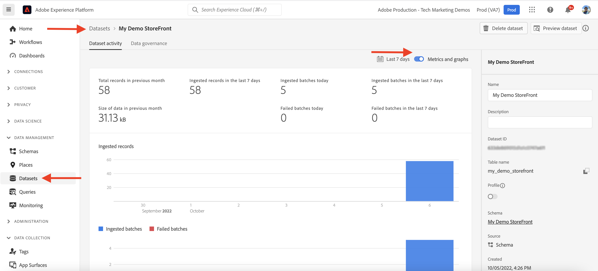

# AEM-CIF core components and Adobe Experience Platform integration {#aem-cif-aep-integration}

The [Commerce Integration Framework (CIF)](https://github.com/adobe/aem-core-cif-components) core components provide seamless integration with [Adobe Experience Platform](https://experienceleague.adobe.com/docs/experience-platform/landing/platform-overview.html?lang=en) to forward storefront events and their data from client-side interactions such as __add to cart__.

The [AEM CIF Core Components](https://github.com/adobe/aem-core-cif-components) project provides a JavaScript library called [Adobe Experience Platform connector for Adobe Commerce](https://github.com/adobe/aem-core-cif-components/tree/master/extensions/experience-platform-connector) to collect event data from your Commerce storefront. That event data is sent to the Experience Platform where it is used in other Adobe Experience Cloud products, such as Adobe Analytics and Adobe Target to build a 360-degree profile that covers a customer journey. By connecting Commerce data to other products in the Adobe Experience Cloud, you can perform tasks like analyze user behavior on your site, perform AB testing, and create personalized campaigns.

Learn more about the [Experience Platform Data Collection](https://experienceleague.adobe.com/docs/experience-platform/collection/home.html) suite of technologies that allow you to collect customer experience data from client-side sources.

## Send `addToCart` event data to Experience Platform {#send-addtocart-to-aep}

The following steps show how to send the `addToCart` event data from AEM-rendered product pages to the Experience Platform using the CIF - Experience Platform Connector. By using the Adobe Experience Platform Debugger browser extension, you can test and review the submitted data.


## Prerequisites {#prerequisites}

Use a local development environment to complete this demo. This includes a running instance of AEM that is configured and connected to an Adobe Commerce instance. Review the requirements and steps for [setting up local development with AEM as a Cloud Service SDK](../develop.md).

You also need access to [Adobe Experience Platform](https://experienceleague.adobe.com/docs/experience-platform/landing/platform-ui/ui-guide.html) and permissions to create the schema, dataset, and datastreams for data collection. For more information, see [Permission management](https://experienceleague.adobe.com/docs/experience-platform/collection/permissions.html).

## AEM Commerce as a Cloud Service setup {#aem-setup}

To have a working __AEM Commerce as a Cloud Service__ local environment with the necessary code and config, complete the following steps.

### Local setup

Follow the [Local Setup](https://experienceleague.adobe.com/docs/experience-manager-cloud-service/content/content-and-commerce/storefront/developing/develop.html?#local-setup) steps so you can have a working AEM Commerce as a Cloud Service environment.

### Project setup

Follow the [AEM Project Archetype](https://experienceleague.adobe.com/docs/experience-manager-cloud-service/content/content-and-commerce/storefront/developing/develop.html?#project) steps so you can create a brand new AEM Commerce (CIF) project. 

>[!TIP]
>
>In the following example, the AEM Commerce project is named: `My Demo Storefront`, however, you can choose your own project name.


Build and deploy the created AEM Commerce project to the local AEM SDK by running the following command from the project's root directory.

```bash
$ mvn clean install -PautoInstallSinglePackage
```

The locally deployed `My Demo StoreFront` commerce site with default code and content looks like the following:


### Install Peregrine and CIF-AEP connector dependencies

To collect and send the event data from the category and product pages of this AEM Commerce site, install the key `npm` packages into the `ui.frontend` module of the AEM Commerce project.

Navigate to the `ui.frontend` module and install the required packages by running the following commands from the command line.

```bash
npm i --save lodash.get@^4.4.2 lodash.set@^4.3.2
npm i --save apollo-cache-persist@^0.1.1
npm i --save redux-thunk@~2.3.0
npm i --save @adobe/apollo-link-mutation-queue@~1.1.0
npm i --save @magento/peregrine@~12.5.0
npm i --save @adobe/aem-core-cif-react-components --force
npm i --save-dev @magento/babel-preset-peregrine@~1.2.1
npm i --save @adobe/aem-core-cif-experience-platform-connector --force
```

>[!IMPORTANT]
>
>The `--force` argument is required sometimes as [PWA Studio](https://developer.adobe.com/commerce/pwa-studio/) is restrictive with the supported peer dependencies. Usually, this should not cause any issues.


### Configure Maven to use `--force` argument

As part of the Maven build process, the npm clean install (using `npm ci`) is triggered. This also requires the `--force` argument. 

Navigate to the project's root POM file `pom.xml` and locate the `<id>npm ci</id>` execution block. Update the block so it looks like the following:

```xml
<execution>
    <id>npm ci</id>
    <goals>
    <goal>npm</goal>
    </goals>
    <configuration>
    <arguments>ci --force</arguments>
    </configuration>
</execution>
```

### Change Babel configuration format

Switch from the default `.babelrc` file relative configuration file format to `babel.config.js` format. This is a project-wide configuration format and allows the plugins and presets to be applied to the `node_module` with greater control.

1. Navigate to the `ui.frontend` module and delete the existing `.babelrc` file.

1. Create a `babel.config.js` file that uses the `peregrine` preset.

    ```javascript
    const peregrine = require('@magento/babel-preset-peregrine');
    
    module.exports = (api, opts = {}) => {
        const config = {
            ...peregrine(api, opts),
            sourceType: 'unambiguous'
        } 
    
        config.plugins = config.plugins.filter(plugin => plugin !== 'react-refresh/babel');
    
        return config;
    }
    ```

### Configure webpack to use Babel

To transpile the JavaScript files using Babel loader (`babel-loader`) and webpack, edit the `webpack.common.js` file.

Navigate to the `ui.frontend` module and update the `webpack.common.js` file so you can have the following rule inside the `module` property value:

```javascript
{
    test: /\.jsx?$/,
    exclude: /node_modules\/(?!@magento\/)/,
    loader: 'babel-loader'
}
```

### Configure Apollo Client

The [Apollo Client](https://www.apollographql.com/docs/react/) is used to manage both local and remote data with GraphQL. It also stores the results of GraphQL queries in a local, normalized, in-memory cache. 

For [`InMemoryCache`](https://www.apollographql.com/docs/react/caching/cache-configuration/) to work effectively, you need a `possibleTypes.js` file. To generate this file, see [Generating possibleTypes automatically](https://www.apollographql.com/docs/react/data/fragments/#generating-possibletypes-automatically). Also, see the [PWA Studio reference implementation](https://github.com/magento/pwa-studio/blob/1977f38305ff6c0e2b23a9da7beb0b2f69758bed/packages/pwa-buildpack/lib/Utilities/graphQL.js#L106-L120) and an example of a [`possibleTypes.js`](../assets/aep-integration/possibleTypes.js) file.


1. Navigate to the `ui.frontend` module and save the file as `./src/main/possibleTypes.js`

1. Update the `webpack.common.js` file's `DefinePlugin` section so you can replace the required static variables during build time.

    ```javascript
    const { DefinePlugin } = require('webpack');
    const { POSSIBLE_TYPES } = require('./src/main/possibleTypes');

    ...

    plugins: [
        ...
        new DefinePlugin({
            'process.env.USE_STORE_CODE_IN_URL': false,
            POSSIBLE_TYPES
        })
    ]
    ```

### Initialize Peregrine and CIF core components

To initialize the React-based Peregrine and CIF core components, create the required configuration and JavaScript files.

1. Navigate to the `ui.frontend` module and create the following folder: `src/main/webpack/components/commerce/App`

1. Create a `config.js` file with the following content:

    ```javascript

    // get and parse the CIF store configuration from the <head>
    const storeConfigEl = document.querySelector('meta[name="store-config"]');
    const storeConfig = storeConfigEl ? JSON.parse(storeConfigEl.content) : {};
    
    // the following global variables are needed for some of the peregrine features
    window.STORE_VIEW_CODE = storeConfig.storeView || 'default';
    window.AVAILABLE_STORE_VIEWS = [
        {
            code: window.STORE_VIEW_CODE,
            base_currency_code: 'USD',
            default_display_currency_code: 'USD',
            id: 1,
            locale: 'en',
            secure_base_media_url: '',
            store_name: 'My Demo StoreFront'
        }
    ];
    window.STORE_NAME = window.STORE_VIEW_CODE;
    window.DEFAULT_COUNTRY_CODE = 'en';
    
    export default {
        storeView: window.STORE_VIEW_CODE,
        graphqlEndpoint: storeConfig.graphqlEndpoint,
        // Can be GET or POST. When selecting GET, this applies to cache-able GraphQL query requests only.
        // Mutations will always be executed as POST requests.
        graphqlMethod: storeConfig.graphqlMethod,
        headers: storeConfig.headers,
    
        mountingPoints: {
            // TODO: define the application specific mount points as they may be used by <Portal> and <PortalPlacer>
        },
        pagePaths: {
            // TODO: define the application specific paths/urls as they may be used by the components
            baseUrl: storeConfig.storeRootUrl
        },
        eventsCollector: {
            eventForwarding: {
                acds: true,
                aep: false,
            }
        }
    };

    ```

    >[!IMPORTANT]
    >
    >While you might already be familiar with the [`config.js`](https://github.com/adobe/aem-cif-guides-venia/blob/main/ui.frontend/src/main/components/App/config.js) file from __AEM Guides - CIF Venia Project__, there are a few changes you must make to this file. First, review any __TODO__ comments. Then, inside the `eventsCollector` property, find the `eventsCollector > aep` object and update the `orgId` and `datastreamId` properties to the correct values. [Learn more](./aep.md#add-aep-values-to-aem).

1.  Create an `App.js` file with the following content. This file resembles a typical React application-starting point file and contains React and custom hooks and React Context usage to facilitate the Experience Platform integration. 

    ```javascript

    import config from './config';
    
    import React, { useEffect } from 'react';
    import ReactDOM from 'react-dom';
    import { IntlProvider } from 'react-intl';
    import { BrowserRouter as Router } from 'react-router-dom';
    import { combineReducers, createStore } from 'redux';
    import { Provider as ReduxProvider } from 'react-redux';
    import { createHttpLink, ApolloProvider } from '@apollo/client';
    import { ConfigContextProvider, useCustomUrlEvent, useReferrerEvent, usePageEvent, useDataLayerEvents, useAddToCartEvent } from '@adobe/aem-core-cif-react-components';
    import { EventCollectorContextProvider, useEventCollectorContext } from '@adobe/aem-core-cif-experience-platform-connector';
    import { useAdapter } from '@magento/peregrine/lib/talons/Adapter/useAdapter';
    import { customFetchToShrinkQuery } from '@magento/peregrine/lib/Apollo/links';
    import { BrowserPersistence } from '@magento/peregrine/lib/util';
    import { default as PeregrineContextProvider } from '@magento/peregrine/lib/PeregrineContextProvider';
    import { enhancer, reducers } from '@magento/peregrine/lib/store';
    
    const storage = new BrowserPersistence();
    const store = createStore(combineReducers(reducers), enhancer);
    
    storage.setItem('store_view_code', config.storeView);
    
    const App = () => {
        const [{ sdk: mse }] = useEventCollectorContext();
    
        // trigger page-level events
        useCustomUrlEvent({ mse });
        useReferrerEvent({ mse });
        usePageEvent({ mse });
        // listen for add-to-cart events and enable forwarding to the magento storefront events sdk
        useAddToCartEvent(({ mse }));
        // enable CIF specific event forwarding to the Adobe Client Data Layer
        useDataLayerEvents();
        
        useEffect(() => {
            // implement a proper marketing opt-in, for demo purpose you hard-set the consent cookie
            if (document.cookie.indexOf('mg_dnt') < 0) {
                document.cookie += '; mg_dnt=track';
            }
        }, []);
    
        // TODO: use the App to create Portals and PortalPlaceholders to mount the CIF / Peregrine components to the server side rendered markup
        return <></>;
    };
    
    const AppContext = ({ children }) => {
        const { storeView, graphqlEndpoint, graphqlMethod = 'POST', headers = {}, eventsCollector } = config;
        const { apolloProps } = useAdapter({
            apiUrl: new URL(graphqlEndpoint, window.location.origin).toString(),
            configureLinks: (links, apiBase) =>
                // reconfigure the HTTP link to use the configured graphqlEndpoint, graphqlMethod and storeView header

                links.set('HTTP', createHttpLink({
                    fetch: customFetchToShrinkQuery,
                    useGETForQueries: graphqlMethod !== 'POST',
                    uri: apiBase,
                    headers: { ...headers, 'Store': storeView }
                }))
        });
    
        return (
            <ApolloProvider {...apolloProps}>
                <IntlProvider locale='en' messages={{}}>
                    <ConfigContextProvider config={config}>
                        <ReduxProvider store={store}>
                            <PeregrineContextProvider>
                                <EventCollectorContextProvider {...eventsCollector}>
                                    {children}
                                </EventCollectorContextProvider>
                            </PeregrineContextProvider>
                        </ReduxProvider>
                    </ConfigContextProvider>
                </IntlProvider>
            </ApolloProvider>
        );
    };
    
    window.onload = async () => {
        const root = document.createElement('div');
        document.body.appendChild(root);
    
        ReactDOM.render(
            <Router>
                <AppContext>
                    <App />
                </AppContext>
            </Router>,
            root
        );
    };
    ```

    The `EventCollectorContext` exports the React Context which:

    - loads the commerce-events-sdk and commerce-events-collector library,
    - initializes them with a given configuration for Experience Platform and/or ACDS
    - subscribes to all events from Peregrine and forwards them to the events SDK

    You can review the implementation details of  `EventCollectorContext`. See [aem-core-cif-components on GitHub](https://github.com/adobe/aem-core-cif-components/blob/3d4e44d81fff2f398fd2376d24f7b7019f20b31b/extensions/experience-platform-connector/src/events-collector/EventCollectorContext.js).

### Build and deploy the updated AEM project

To make sure the above package installation, code, and config changes are correct, rebuild, and deploy the updated AEM Commerce project using the following Maven command: `$ mvn clean install -PautoInstallSinglePackage`.

## Experience Platform setup {#aep-setup}

To receive and store the event data coming from the AEM Commerce pages such as category and product, complete the following steps:

>[!AVAILABILITY]
>
>Make sure you are part of the correct __Product Profiles__ under __Adobe Experience Platform__ and __Adobe Experience Platform Data Collection__. If needed, work with your system administrator to create, update, or assign __Product Profiles__ under the [Admin Console](https://adminconsole.adobe.com/).

### Create Schema with Commerce field group

To define the structure for commerce event data, you must create an Experience Data Model (XDM) schema. A schema is a set of rules that represent and validate the structure and format of data.

1. In the browser, navigate to the __Adobe Experience Platform__ product Home page. For example, <https://experience.adobe.com/#/@YOUR-ORG-NAME/sname:prod/platform/home>.

1. Locate the __Schemas__ menu in the left navigation section, click the __Create Schema__ button from the top-right section, and select __XDM ExperienceEvent__.

    

1. Name your schema using the __Schema Properties > Display name__ field and add Field groups by using the  __Composition > Field groups > Add__ button.

    

1. In the __Add Field groups__ dialog, search for `Commerce`, select the __Commerce Details__ checkbox, and click __Add Field groups__.

    


>[!TIP]
>
>See the [Basics of schema composition](https://experienceleague.adobe.com/docs/experience-platform/xdm/schema/composition.html) for more information.

### Create Dataset

To store the event data, you must create a Dataset that conforms to the schema definition. A dataset is a storage and management construct for a collection of data&ndash; typically a table&ndash;that contains a schema (columns) and fields (rows). 

1. In the browser, navigate to the __Adobe Experience Platform__ product Home page. For example, <https://experience.adobe.com/#/@YOUR-ORG-NAME/sname:prod/platform/home>.

1. Locate the __Datasets__ menu in the left navigation section and click the __Create dataset__ button from the top-right section.

    

1. On the new page, select __Create dataset from schema__ card. 

    

    On the new page, __search and select__ the schema you created in the previous step, and click the __Next__ button.

    

1. Name your Dataset using the __Configure dataset > Name__ field and click the __Finish__ button.

    

>[!TIP]
>
>See the [Datasets overview](https://experienceleague.adobe.com/docs/experience-platform/catalog/datasets/overview.html) for more information.


### Create Datastream

Complete the following steps so you can create a Datastream in the Experience Platform.

1. In the browser, navigate to the __Adobe Experience Platform__ product Home page. For example, <https://experience.adobe.com/#/@YOUR-ORG-NAME/sname:prod/platform/home>.

1. Locate the __Datastreams__ menu in the left navigation section and click the __New Datastream__ button from the top-right section.

    

1. Name your Datastream using the __Name__ required field. Under the __Event Schema__ field, select the created schema and click __Save__.

    

1. Open the created Datastream, and click __Add Service__.

        

1. Under the __Service__ field, select the __Adobe Experience Platform__ option. Under __Event Dataset__ field, select the dataset name from the previous step and click __Save__.

        

>[!TIP]
>
>See the [Datastream overview](https://experienceleague.adobe.com/docs/experience-platform/datastreams/overview.html) for more information.

## Add datastream value into AEM Commerce configuration {#add-aep-values-to-aem}

After completing the above Experience Platform setup, you should have `datastreamId` in the left rail of the Datastream details and `orgId` in the top-right corner of the __Profile Picture > Account info > User Information__ modal.

    

1. In the AEM Commerce project's `ui.frontend` module, update the `config.js` file and specifically the `eventsCollector > aep` object properties.

1. Build and deploy the updated AEM Commerce project


## Trigger `addToCart` event and verify data collection {#event-trigger-verify}

The above steps complete the AEM Commerce and Experience Platform setup. You can now trigger an `addToCart` event and verify data collection using the Google Chrome extension _Snowplow Inspector_ and dataset __Metrics and graphs__ toggle in the product UI.

To trigger the event, you can use AEM author or the publish service from your local setup. For this example, use AEM author by logging in to your account.

1. From Sites page, select the __My Demo StoreFront > us > en__ page and click __Edit__ in top action bar.

1. From the top action bar, click __View as Published__, then click any preferred category from the storefront's navigation.

1. Click any preferred product card in the __Product Page__, then select __color, size__ to enable the __Add to Cart__ button. 


1. Open the __Snowplow Inspector__ extension from the browser's extension panel and select __Experience Platform Wed SDK__ in the left rail. 


1. Return to the __Product Page__ and click __Add to Cart__ button. This sends data to the Experience Platform. The __Adobe Experience Platform Debugger__ extension shows the event details.

    


1. Within Experience Platform product UI, navigate to __Datasets > My Demo StoreFront__, under the __Dataset activity__ tab. If __Metrics and graphs__ is enabled, the event-data stats are displayed.

    


## Implementation Details {#implementation-details}

The [CIF Experience Platform Connector](https://github.com/adobe/aem-core-cif-components/tree/master/extensions/experience-platform-connector) is built on top of the [Data Connection for Adobe Commerce](https://commercemarketplace.adobe.com/magento-experience-platform-connector.html), which is part of the [PWA Studio](https://developer.adobe.com/commerce/pwa-studio/) project.

 The PWA Studio project lets you create Progressive Web Application (PWA) storefronts powered by Adobe Commerce or Magento Open Source. The project also contains a component library called [Peregrin](https://developer.adobe.com/commerce/pwa-studio/api/peregrine/) for adding logic to visual components. The [Peregrin library](https://developer.adobe.com/commerce/pwa-studio/api/peregrine/) also provides the custom React hooks that are used by [CIF Experience Platform Connector](https://github.com/adobe/aem-core-cif-components/tree/master/extensions/experience-platform-connector) to integrate with Experience Platform seamlessly. 


## Supported Events {#supported-events}

As of now, the following events are supported:

__Experience XDM Events:__

1. Add to Cart (AEM)
1. View Page (AEM)
1. View Product (AEM)
1. Search Request sent (AEM)
1. Search Response received (AEM)

When [Peregrine components](https://developer.adobe.com/commerce/pwa-studio/guides/packages/peregrine/) are reused in the AEM Commerce project: 

__Experience XDM Events:__

1. Remove from Cart
1. Open Cart
1. View Cart 
1. Instant Purchase
1. Start Checkout
1. Complete checkout

__Profile XDM Events:__

1. Sign in
1. Create Account
1. Edit Account


## Additional Resources {#additional-resources}

For more information, see the following resources:

- [PWA Studio](https://developer.adobe.com/commerce/pwa-studio/)
- [[!DNL Data Connection] overview](https://experienceleague.adobe.com/docs/commerce-merchant-services/data-connection/overview.html)
- [[!DNL Data Connection] Events](https://experienceleague.adobe.com/docs/commerce-merchant-services/data-connection/event-forwarding/events.html)
- [Adobe Experience Platform overview](https://experienceleague.adobe.com/docs/experience-platform/landing/home.html)
