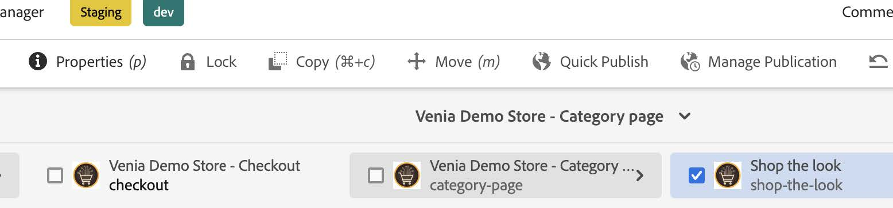

# Live Search {#live-search}

Live Search for Adobe Commerce delivers a fast, relevant, and intuitive search experience at no additional cost. Live Search powered by Adobe Sensei uses artificial intelligence and machine-learning algorithms to perform a deep analysis of aggregated visitor data. This data, when combined with your Adobe Commerce catalog, results in a relevant and personalized shopping experiences.

Live Search offers a UI widget with client-side rendering that can be integrated in the AEM storefront for the following use-cases:

## Search with Popover {#popover}

The widget will replace the out-of-the-box [Search Core Component](https://www.aemcomponents.dev/content/core-components-examples/library/commerce/search.html) with search field, faceted filtering, and product list.

### Setting Up AEM Local Environment {#set-up-env}

Follow the AEM + CIF setup video on experienceleague:

* The video has dated build options for aem-cif-guides-venia; use:
mvn clean install -PautoInstallSinglePackage
* run locally using on of our LS cloud instances (can set up COMMERCE_ENDPOINT as an environment variable instead also, like the video says):
COMMERCE_ENDPOINT=https://<magento-server-domain>/graphql
* for vscode, install vscode-aem-sync extension for auto-update on code change. setting-> "{ aemsync.autopush: true }"
* CRXDE can also be used to see the changes http://localhost:4502/crx/de/index.jsp

### Introduction to Building AEM CIF Components (Optional) {#intro-build-components}

Have a look at [Project Setup](https://experienceleague.adobe.com/docs/experience-manager-learn/getting-started-wknd-tutorial-develop/project-archetype/project-setup.html):

* CIF is basically three things: CIF add-on (authoring tools, Commerce endpoint configuration & GraphQL client), CIF components and a sample store (AEM Venia).
* CIF components are the same like normal AEM components, just with added functionality to integrate it with Commerce (for example you can make GraphQL requests).

### Installing the Search Bar (Popover) to AEM Store as a CIF Component {#install-popover}

* Have a look at the [CIF livesearch popover](https://github.com/adobe/aem-cif-guides-venia/pull/319) pull request. It shows which file is needed to change for Live Search popover.
   * Not every step is listed below, please look at the branch and compare what file is changed.
* Have a look at this [Example of Live Search searchbar branch](https://github.com/adobe/aem-cif-guides-venia/tree/cif-livesearch-popover) implemented in Venia. 
   * Refer to this [searchbar.js](https://github.com/adobe/aem-cif-guides-venia/blob/cif-livesearch-popover/ui.apps/src/main/content/jcr_root/apps/venia/components/commerce/searchbar/clientlibs/js/searchbar.js) file.
* Custom searchbar implementation requires use of clientlibs (css/js) inside '''/searchbar'''
* Requires magento/module-data-services-graphql module to the cloud instance to retrieve store data (environment_id, others...)
* Have a look at an [example of popover + AEM implementations](https://github.com/adobe/aem-cif-guides-venia/pull/319).
   * under '''ui.apps/src/main/content/jcr_root/apps/venia/components''' directory, below are basic files that are needed:
   
   * Layout: '''searchbar.html''' is the layout of the searchbar
   * '''.contents.xml''' are required two places both under searchbar and clientlibs, tells AEM that this is a component file.
   * resourceSupertype will need to be removed for custom component. (refer to branch)
* Clientlibs - custom css/js directory, requires js.txt, css.txt tells where the css/js files are located.
* Styling: clientlibs/css/searchbar.css. You may modify any style here and it will be injected during the build process. Javascript: clientlibs/js/
searchbar.js, it injects LiveSearchAutocomplete.js from cdn and other store events js contents.
   * Any other custom logic can be put inside the searchbar.js file.
   * environmentId, websiteCode, storeCode, storeViewCode will be retrieved from graphql query after magento/moduledata-
services-graphql is installed.
   * Below are all required config for LS Popover (refer to branch for complete setup):

   '''   // initialize live-search
   const storeConfig = JSON.parse(
   document.querySelector("meta[name='store-config']").getAttribute("content")
   );
   const { storeRootUrl } = storeConfig;
   const redirectUrl = storeRootUrl.split(".html")[0];
   new window.LiveSearchAutocomplete({
   environmentId: dataServicesStorefrontInstanceContext.environment_id,
   websiteCode: dataServicesStorefrontInstanceContext.website_code,
   storeCode: dataServicesStorefrontInstanceContext.store_code,
   storeViewCode: dataServicesStorefrontInstanceContext.store_view_code,
   config: {
   pageSize: 8,
   minQueryLength: "2",
   currencySymbol: "$",
   currencyRate: "1",
   displayOutOfStock: true,
   allowAllProducts: false,
   },
   context: {
   customerGroup: dataServicesStorefrontInstanceContext.customer_group,
   },
   route: ({ sku }) => {
   return `${redirectUrl}.cifproductredirect.html/${sku}`;
   },
   searchRoute: {
   route: `${redirectUrl}/search.html`,
   query: "search_query",
   }, '''

   * By replacing existing searchbar.html with above structures and once you export to AEM or rebuild process, you will notice searchbar is now replaced with live-search searchbar.

   

## Product Listing Page (PLP) {#plp}

The widget will replace the out-of-the-box [Product List Core Component](https://www.aemcomponents.dev/content/core-components-examples/library/commerce/productlist.html) with category filtered product list and faceted filtering.

### Prerequisites for Widget {#prerequisite-plp}

* AEM/CIF + Popover is required to setup before setting up widget.
* Widget relies on '''WIDGET_STOREFRONT_INSTANCE_CONTEXT'''s from session_storage which is set from cif-livesearch-popover branch in
searchbar.js.

### Installing Widget to AEM Store as CIF Component {#installing-widget}

* Example of branch for reference to follow cif-livesearch-widget https://github.com/adobe/aem-cif-guides-venia
   * This branch contains cif-livesearch-popover changes since it's branched off from this branch.
   * (Not every step is listed below, please look at the branch and compare what file is changed).
* https://github.com/adobe/aem-cif-guides-venia/pull/320 PR shows which file is needed to change for widget.
* For widget/plp, productlist and search component needs to be updated, and few minor change to (searchbar)
   * Most change will be in productlist, which is plp component of AEM.
   * For search , only sling:resourceType="venia/components/commerce/productlist" will need to be updated. search
component is what shows when user search (View all / on Enter).
      * This tells AEM to use productlist (widget) component instead of default search component.
* Update .content.xml clientlibs/clientlib-cif/.content.xml to add core.cif.productlist.v1
* Productlist update is similar to popover which relies /clientlibs (css/js)
* Styling: clientlibs/css/productlist.css
   * Widget uses tailwind css framework, which will have some conflict css to previous store so those will need to be updated manually inside
css/productlist.css (Refer to branch)
* Below are all required config for widget (refer to branch for complete setup)

'''
// clientlibs/js/productlist.js,
const storeDetails = {
environmentId: dataServicesStorefrontInstanceContext.environment_id,
environmentType: dataServicesStorefrontInstanceContext.environment,
apiKey: dataServicesStorefrontInstanceContext.api_key,
websiteCode: dataServicesStorefrontInstanceContext.website_code,
storeCode: dataServicesStorefrontInstanceContext.store_code,
storeViewCode: dataServicesStorefrontInstanceContext.store_view_code,
config: {
pageSize: "8",
perPageConfig: {
pageSizeOptions: "12,24,36,48",
defaultPageSizeOption: "12",
},
minQueryLength: "2",
currencySymbol: "LBP",
currencyRate: "1",
displayOutOfStock: "1",
allowAllProducts: "1",
locale: "en_US",
currentCategoryUrlPath: categoryUrlPath,
categoryName,
displayMode: "", // Keep as "" string.
},
context: {
customerGroup: dataServicesStorefrontInstanceContext.customer_group,
},
route: ({ sku }) => {
return `${
this.getStoreConfigMetadata().redirectUrl
}.cifproductredirect.html/${sku}`;
},
searchQuery: "search_query",
};
'''

### Category/Catalog Page (Non-PLP) {#category-catalog}

* For AEM, author/developer will need to go thru the steps of setting up the catalog page.
   * displayMode: "" will result render every category as Widget(PLP) page. On Luma store, this value comes from extension whether
it's "" or "PAGE" (catalog) to differentiate whether its PLP or not. For AEM this must be done manually as below.
   * Without choosing catagory-page for specific category, it will render plp page as default. This will result wrong behavior on some page
(showing facet/filter with zero product)
* Step 1: From author, choose catalog page category shop-the-look or create new page for desired category.

* Step2: After choosing page or creating new page, choose which category will need to render the page. Choose Properties from top.

* From Commerce setting, choose which category id to render category-page. (May take few minutes to reflect update):

## Additional Resources {#additional-resources}

* [Live Search documentation](https://experienceleague.adobe.com/docs/commerce-merchant-services/live-search/guide-overview.html?lang=en)

