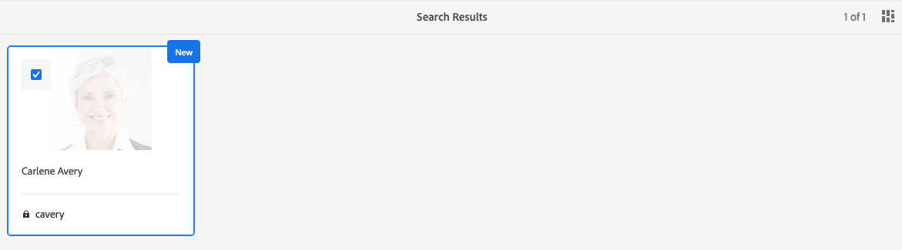

# Adobe Experience Manager as a Cloud Service Foundation Readiness for Data Protection and Data Privacy Regulations {#aem-foundation-readiness-for-data-protection-and-data-privacy-regulations}

>[!WARNING]
>
>The contents of this document do not constitute legal advice and are not meant as a substitute for legal advice. 
>
>Please consult your company's legal department for advice concerning Data Protection and Data Privacy regulations. 

>[!NOTE]
>
>For more information about Adobe's response to privacy issues, and what this means for you as an Adobe customer, see [Adobe's Privacy Center](https://www.adobe.com/privacy.html). 

## AEM Foundation Data Privacy and Protection support {#aem-foundation-data-privacy-and-protection-support}

At the AEM Foundation level, the Personal Data that is stored is held in the User Profile. Therefore, the information in this article primarily addresses how to access and delete user profiles, to address the access and delete requests respectively.

## Accessing a User Profile {#accessing-a-user-profile}

### Manual Steps {#manual-steps}

1. Open the User Administration console, by browsing to **[!UICONTROL Tools - Security - Users]** or by browsing directly to `https://<serveraddress>:<serverport>/security/users.html`

<!--
   
-->

1. Then, search for the user in question by typing the name in the search bar at the top of the page:

   

1. Finally, open the user profile by clicking it, then check under the **[!UICONTROL Details]** tab.

   

### HTTP API {#http-api}

As mentioned, Adobe provides APIs for accessing user data, in order to facilitate automation. There are several types of APIs which you can use:

**UserProperties API**

```shell
curl -u user:password http://localhost:4502/libs/granite/security/search/profile.userproperties.json\?authId\=cavery
```

**Sling API**

**Discovering the user home:**

```xml
curl -g -u user:password 'http://localhost:4502/libs/granite/security/search/authorizables.json?query={"condition":[{"named":"cavery"}]}'
     {"authorizables":[{"type":"user","authorizableId_xss":"cavery","authorizableId":"cavery","name_xss":"Carlene Avery","name":"Carlene Avery","home":"/home/users/we-retail/DSCP-athB1NYLBXvdTuN"}],"total":1}
```

**Retrieving user data:**

Using the node path from the home property of the JSON payload returned from the above command:

```shell
curl -u user:password  'http://localhost:4502/home/users/we-retail/DSCP-athB1NYLBXvdTuN/profile.-1.json'
```

```shell
curl -u user:password  'http://localhost:4502/home/users/we-retail/DSCP-athB1NYLBXvdTuN/profiles.-1.json'
```

## Disabling a User and Deleting the Associated Profiles {#disabling-a-user-and-deleting-the-associated-profiles}

### Disable User {#disable-user}

1. Open the User Administration console and search for the user in question, as described above.
2. Hover over the user and click the select icon. The profile will turn grey indicating that it is selected.  

3. Press the **Disable** button in the upper menu to disable the user:

   

4. Finally, confirm the action.

   The user interface will then indicate that the user account has been deactivated by greying out and adding a lock to the profile card:

   

### Delete User Profile Information {#delete-user-profile-information}

>[!NOTE]
>
>For AEM as a Cloud Service there is no manual procedure available from the UI for the deletion of a user profile, as CRXDE is not accessible.

### HTTP API {#http-api-1}

The following procedures use the `curl` command line tool to illustrate how to disable the user with the **[!UICONTROL cavery]** `userId` and delete her profiles available at the default location.

**Discovering the user home:**

```shell
curl -g -u user:password 'http://localhost:4502/libs/granite/security/search/authorizables.json?query={"condition":[{"named":"cavery"}]}'
     {"authorizables":[{"type":"user","authorizableId_xss":"cavery","authorizableId":"cavery","name_xss":"Carlene Avery","name":"Carlene Avery","home":"/home/users/we-retail/DSCP-athB1NYLBXvdTuN"}],"total":1}
```

**Disabling the user:**

Using the node path from the home property of the JSON payload returned from the above command:

```shell
curl -X POST -u user:password -FdisableUser="describe the reasons for disabling this user (Data Privacy in this case)" 'http://localhost:4502/home/users/we-retail/DSCP-athB1NYLBXvdTuN.rw.userprops.html'
```

**Deleting user profile(s)**

Using the node path from the home property of the JSON payload returned from the account discovery command and the known out of the box profile node locations:

```shell
curl -X POST -u user:password -H "Accept: application/json,**/**;q=0.9" -d ':operation=delete' 'http://localhost:4502/home/users/we-retail/DSCP-athB1NYLBXvdTuN/profile'
```

```shell
curl -X POST -u user:password -H "Accept: application/json,**/**;q=0.9" -d ':operation=delete' 'http://localhost:4502/home/users/we-retail/DSCP-athB1NYLBXvdTuN/profile'
```
