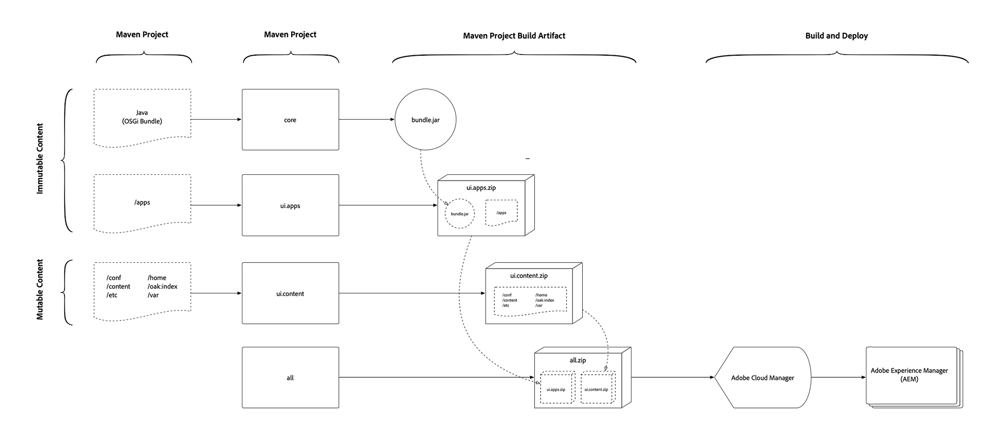

# Understand an AEM Project's Content Package Structure
 
AEM application deployments must be comprised of a single AEM package. This package should in turn contain sub-packages that comprise everything required by the application to function, including code, configuration and any supporting baseline content.

AEM requires a separation of __content__ and __code__, which means a single content package __cannot__ deploy to **both** `/apps` and runtime-writable areas (`/content`, `/conf`, `/home`, etc. - in short, anything not `/apps`) of the repository, instead, the application must separate code and content into discrete packages for deployment into AEM.

The package structure outlined in this document is compatible with **both** local development deployments and AEM Cloud Service deployments.

## Mutable vs. Immutable Areas of the Repository

`/apps` and `/libs` are considered **immutable** areas of AEM as they cannot be changed (create, update, delete) after AEM starts (ie. at runtime). Any attempt to change an immutable area at runtime, the action will fail.

Everything else in the repository, `/content`, `/conf`, `/var`, `/home`, `/etc`, `/oak:index`, `/system`, `/tmp`, etc. are all **mutable** areas, meaning they can be changed at runtime.

>[!WARNING]
>
> `/libs` remains off-limits. Only Adobe Experience Manager product code may deploy to `/libs`.

## Recommended Package Structure



This diagram provides an overview of the recommended project structure and package deployment artifacts.

The recommended application deployment structure is as follows:

+ The `ui.apps` package, or Content Package, contains all the code to be deployed and only deploys to `/apps`. Common elements of the `ui.apps` package include, but are not limited to:
  + OSGi bundles
    + `/apps/my-app/install`
  + OSGi configurations
    + `/apps/my-app/config`
  + HTL scripts
    + `/apps/my-app/components`
  + JavaScript and CSS (via Client Libraries)
    + `/apps/my-app/clientlibs`
  + Overlays of /libs
    + `/apps/cq`, `/apps/dam/`, etc.
  + Fallback context-aware configurations
    + `/apps/settings`
  + ACLs (permissions)
    + Any `rep:policy` for any path under `/apps`
+ The `ui.content` package, or Code Package, contains all content and configuration. Common elements of the `ui.content` package include, but are not limited to:
  + Context-aware configurations
    + `/conf`
  + Baseline content structures (Asset folders, Sites root pages)
    + `/content`, `/content/dam`, etc.
  + Governed tagging taxonomies
    + `/content/cq:tags`
  + Service users
    + `/home/users`
  + User groups
    + `/home/groups`  
  + Oak indexes
    + `/oak:indexes`
  + Etc legacy nodes
    + `/etc`
  + ACLs (permissions)
    + Any `rep:policy` for any path **not** under `/apps`
+ The `all` package is a container package that ONLY includes the `ui.apps` and `ui.content` packages as embeds. The `all` package must not have _any_ content of its own, but rather delegate all deployment to the repository to its sub-packages.

  Packages are now included using the Maven [File Vault plugin's embeddeds configuration](#embeddeds), rather than the `<subPackages>` configuration.

  For complex AEM deployments, it may be desirable to create multiple `ui.apps` and `ui.content` projects/packages that represent specific sites or tenants in AEM. If this is done, ensure the split between mutable and immutable content is respected, and the required content packages are added as sub-packages in the `all` container content package.

  For example, a complex deployment content package structure may look like this:

  + `all` content package embeds the following packages, to create a singular deployment artifact
    + `ui.apps.common` deploys code required by __both__ Site A and Site B
    + `ui.apps.site-a` deploys code required by Site A
    + `ui.content.site-a` deploys content and configuration required by Site A
    + `ui.apps.site-b` deploys code required by Site B
    + `ui.content.site-b` deploys content and configuration required by Site B

## Package Types#{package-types}

Packages are to be marked with their declared package type.

+ Container packages must not have a `packageType` set.
+ Code (immutable) packages must set their `packageType` to `application`.
+ Content (mutable) packages must set their `packageType` to `content`.

For more information see [Apache Jackrabbit FileVault - Package Maven Plugin documentation](https://jackrabbit.apache.org/filevault-package-maven-plugin/package-mojo.html#packageType) and the [FileVault Maven configuration snippet](#declaring-package-types) below.

# Embedding Packages

Content or Code packages can be targeted for installation on either AEM Author, AEM Publish or Both.

Common use-cases include:

+ ACLs/permissions that differ between AEM Author users and AEM Publish users
+ Configurations that are used to support activities only on AEM Author
+ Code such as integrations with back-office systems, only required to run on AEM Author.

To target AEM Author, AEM Publish or Both, the package is embedded in the `all` Container package in a special folder-location, in the following format:

  `/apps/<app-name>/(content|application)/install.*`

Breaking this format down:

+ The 1st-level folder __must__ be `/apps`.
+ The 2nd-level folder represents the application. Often there is only a single 2nd-level folder all sub-packages are embedded under, however any number of 2nd-level folders can be created to best represent the application's logical structure:
  + `/apps/my-app`
  + `/apps/my-other-app`
  + `/apps/vendor`
+ The 3rd-level folder must be either `application` or `content`
  + The `application` folder holds Code packages
  + The `content` folder golds Content packages
  This folder name must correspond to the [Package Types](#package-types) of the packages it contains.
+ The 4th-level folder contains the sub-packages, and must be one of:
  + `install` to install on __both__ AEM Author and AEM Publish
  + `install.author` to __only__ install on AEM Author
  + `install.publish` to __only__ install on AEM Publish
  Note that only `install.author` and `install.publish` are supported targets. Other run modes are __not__ supported.

For example, a deployment that contains AEM Author and Publish specific packages may look like:

+ `all` Container package embeds the following packages, to create a singular deployment artifact
  + `ui.apps` embedded in `/apps/my-app/application/install` deploys code to both AEM Author and AEM Publish
  + `ui.apps.author` embedded in `/apps/my-app/application/install.author` deploys code to only AEM Author
  + `ui.content` embedded in `/apps/my-app/content/install` deploys content and configuration to both AEM Author and AEM Publish
  + `ui.content.publish` embedded in `/apps/my-app/content/install.publish` deploys content and configuration to only AEM Publish

### Package Filtering

It is __critical__ to ensure the package filters between the Container package and the Code packages do not remove/overwrite each other.

+ The Container package's filter should explicitly include ONLY the package install folders it uses.
+ Any Code packages' filters should explicitly __exclude__ any package install folders.

If this split is not respected, cycling package installation can occur.

See below, for example [filter definitions](#filter-definitions).

## Package Dependency Management

In order to ensure proper installation of the packages, it is recommended inter-package dependencies are established.

The general rule is packages containing mutable content (`ui.content`) should depend on the immutable content (`ui.apps`) that supports the rendering and use of the mutable content.

The common patterns for content package dependencies are:

### Simple Deployment Package Dependencies

The simple case sets the `ui.content` mutable Content package to depend on the `ui.apps` immutable Code package.

+ `all` has no dependencies
  + `ui.apps` has no dependencies
  + `ui.content` depends on `ui.apps`

### Complex Deployment Package Dependencies

Complex deployments expand on the simple case, and set dependencies between the corresponding mutable Content and immutable Code packages. As required, dependencies can be established between immutable Code packages as well.

+ `all` has no dependencies
  + `ui.apps.common` has no dependencies
  + `ui.apps.site-a` depends on `ui.apps.common`
  + `ui.content.site-a` depends on `ui.apps.site-a`
  + `ui.apps.site-b` depends on `ui.apps.common`
  + `ui.content.site-b` depends on `ui.apps.site-b`

## Local Development and Deployment

The project structures and organization outlined in this article is fully compatible local development AEM instances.

## pom.xml Configuration Snippets

The following are Maven `pom.xml` configuration snippets that can be added to Maven projects to align to the above recommendations.

### Declaring Package Types{#declaring-package-types}

Code and content packages, which are deployed as sub-packages, must declare a package type of __application__ or __content__, depending on what they contain.

#### Container Package Types

The container `all/pom.xml` project does __not__ declare a `<packageType>`.

#### Code (Immutable) Package Types

Code packages must set their `packageType` to `application`.

In the `ui.apps/pom.xml`, the `<packageType>application</packageType>` build configuration directives of the `filevault-package-maven-plugin` plugin declaration declares its package type.

```
...
<build>
  <plugins>
    <plugin>
      <groupId>org.apache.jackrabbit</groupId>
      <artifactId>filevault-package-maven-plugin</artifactId>
      <extensions>true</extensions>
      <configuration>
        <group>${project.groupId}</group>
        <name>${my-app.ui.apps}</name>
        <packageType>application</packageType>
        <accessControlHandling>merge</accessControlHandling>
      </configuration>
    </plugin>
    ...
```

#### Content (Mutable) Package Types

Content packages must set their `packageType` to `content`.

In the `ui.content/pom.xml`, the `<packageType>content</packageType>` build configuration directive of the `filevault-package-maven-plugin` plugin declaration declares its package type.

```
...
<build>
  <plugins>
    <plugin>
      <groupId>org.apache.jackrabbit</groupId>
      <artifactId>filevault-package-maven-plugin</artifactId>
      <extensions>true</extensions>
      <configuration>
        <group>${project.groupId}</group>
        <name>${my-app.ui.content}</name>
        <packageType>content</packageType>
        <accessControlHandling>merge</accessControlHandling>
      </configuration>
    </plugin>
    ...
```

### Package Filter Definitions

#### Container Package Filter Definition

In the `all` project's `filter.xml`, only and explicitly __include__ the sub-package folders to deploy:

```
<filter root="/apps">
    <include pattern="/apps/<my-app>/application/install(/.*)?"/>
    <include pattern="/apps/<my-app>/content/install(/.*)?"/>
</filter>
```

#### Code Packages Filter Definition

In the Code project's `filter.xml`, usually `ui.apps` but you may have multiple, explicitly __exclude__ the nearest the `application` and `content` folder. The exclude pattern must reference the 1st folder level past the filter root to ensure they do not get accidentally removed when the Code package is installed.

```
<filter root="/apps/<my-app>">
    <exclude pattern="/apps/<my-app>/application(/.*)?"/>
    <exclude pattern="/apps/<my-app>/content(/.*)?"/>
</filter>
```

### Embedding Sub-packages to the `all` Package{#embeddeds}

In the `all/pom.xml`, add the following `<embeddeds>` directives to the `filevault-package-maven-plugin` plugin declaration. Remember, do NOT use the `<subPackages>` configuration, as this will include the sub-pacakges in `/etc/packages` rather than `/apps/my-app/<application|content>/install.*`.

```
...
<plugin>
  <groupId>org.apache.jackrabbit</groupId>
  <artifactId>filevault-package-maven-plugin</artifactId>
  <extensions>true</extensions>
  <configuration>
      ...
      <embeddeds>
                
          <!-- Include the application's ui.apps and ui.content packages -->
          <!-- Ensure the artifactIds are correct -->

          <!-- Code package that deploys to BOTH AEM Author and AEM Publish -->
          <embedded>
              <groupId>${project.groupId}</groupId>
              <artifactId>my-app.ui.apps</artifactId>
              <type>zip</type>
              <filter>true</filter>
              <target>/apps/my-app/application/install</target>
          </embedded>

          <!-- Code package that deploys ONLY to AEM Author -->
          <embedded>
              <groupId>${project.groupId}</groupId>
              <artifactId>my-app.ui.apps.author</artifactId>
              <type>zip</type>
              <filter>true</filter>
              <target>/apps/my-app/application/install.author</target>
          </embedded>

          <!-- Content package that deploys to BOTH AEM Author and AEM Publish -->
          <embedded>
              <groupId>${project.groupId}</groupId>
              <artifactId>my-app.ui.content</artifactId>
              <type>zip</type>
              <filter>true</filter>
              <target>/apps/my-app/content/install</target>
          </embedded>

          <!-- Content package that deploys ONLY to AEM Author -->
          <embedded>
              <groupId>${project.groupId}</groupId>
              <artifactId>my-app.ui.content.author-only</artifactId>
              <type>zip</type>
              <filter>true</filter>
              <target>/apps/my-app/content/install.publish</target>
          </embedded>

          <!-- Include any other extra packages such as AEM WCM Core Components -->
          <embedded>
              <groupId>com.adobe.cq</groupId>
              <!-- Not to be confused; WCM Core Components' Code package's artifact is named `.content` -->
              <artifactId>core.wcm.components.content</artifactId>
              <type>zip</type>
              <filter>true</filter>
              <target>/apps/core-components/application/install</target>
          </embedded>

          <embedded>
              <groupId>com.adobe.cq</groupId>
              <!-- Not to be confused; WCM Core Components' Content package's artifact is named `.conf` -->
              <artifactId>core.wcm.components.conf</artifactId>
              <type>zip</type>
              <filter>true</filter>
              <target>/apps/core-components/content/install</target>
          </embedded>
      <embeddeds>
  </configuration>
</plugin>
...
```

### Establishing a Dependency between the `ui.apps` from `ui.content` Packages

In the `ui.content/pom.xml`, add the following `<dependencies>` directives to the `filevault-package-maven-plugin` plugin declaration.

```
...
<plugin>
  <groupId>org.apache.jackrabbit</groupId>
  <artifactId>filevault-package-maven-plugin</artifactId>
  <extensions>true</extensions>
  <configuration>
     <group>my/package/group</group>

      ...
      <dependencies>
        <!-- Declare the content package dependency in the ui.content/pom.xml on the ui.apps project -->
        <dependency>
            <!-- The group refers to the content package group, NOT the maven project groupId -->
            <group>my/package/group</group>
            <!-- Ensure the correct package name is listed -->
            <name>my-app.ui.apps</name>
            <version>${project.version}</version>
        </dependency>
      </dependencies>
    ...
  </configuration>
</plugin>
...
```
