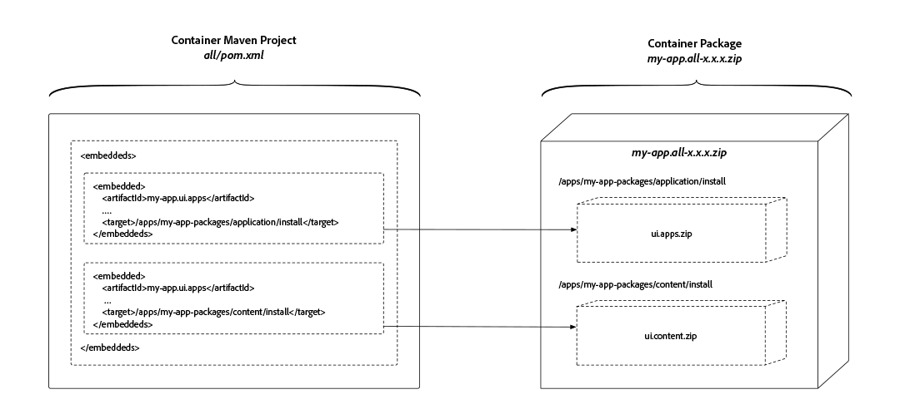

# Understand an Adobe Experience Manager as a Cloud Service Project's Content Package Structure

>![TIP]
>
> Familiarize yourself with basic [Experience Manager Maven Archetype use, and the FileVault Content Maven Plug-in](https://helpx.adobe.com/experience-manager/6-5/sites/developing/using/vlt-mavenplugin.html) as this article builds upon these learnings and concepts.

This article outlines the changes required to Experience Manager Maven projects to be Experience Manager as a Cloud Service compatible, ensuring they respect the split of mutable and immutable content, ensuring requisite dependencies are established to create non-conflicting, determinisitic deployments, and ensuring they are packaged in a deployable structure.

Adobe Experience Manager application deployments must be comprised of a single Experience Manager package. This package should in turn contain sub-packages that comprise everything required by the application to function, including code, configuration and any supporting baseline content.

Experience Manager requires a separation of __content__ and __code__, which means a single content package __cannot__ deploy to **both** `/apps` and runtime-writable areas (`/content`, `/conf`, `/home`, etc. - in short, anything not `/apps`) of the repository, instead, the application must separate code and content into discrete packages for deployment into Experience Manager.

The package structure outlined in this document is compatible with **both** local development deployments and Experience Manager as a Cloud Service deployments.

>![TIP]
>
> The configurations outlined in this document are provided by [AEM Project Maven Archetype 21 or later](https://github.com/adobe/aem-project-archetype/releases).

## Mutable vs. Immutable Areas of the Repository{#mutable-vs-immutable}

`/apps` and `/libs` are considered **immutable** areas of Experience Manager as they cannot be changed (create, update, delete) after Experience Manager starts (ie. at runtime). Any attempt to change an immutable area at runtime, the action will fail.

Everything else in the repository, `/content`, `/conf`, `/var`, `/home`, `/etc`, `/oak:index`, `/system`, `/tmp`, etc. are all **mutable** areas, meaning they can be changed at runtime.

>[!WARNING]
>
> `/libs` remains off-limits. Only Experience Manager product code may deploy to `/libs`.

## Recommended Package Structure


This diagram provides an overview of the recommended project structure and package deployment artifacts.

The recommended application deployment structure is as follows:

+ The `ui.apps` package, or Content Package, contains all the code to be deployed and only deploys to `/apps`. Common elements of the `ui.apps` package include, but are not limited to:
  + OSGi bundles
    + `/apps/my-app/install`
  + OSGi configurations
    + `/apps/my-app/config`
  + HTL scripts
    + `/apps/my-app/components`
  + JavaScript and CSS (via Client Libraries)
    + `/apps/my-app/clientlibs`
  + Overlays of /libs
    + `/apps/cq`, `/apps/dam/`, etc.
  + Fallback context-aware configurations
    + `/apps/settings`
  + ACLs (permissions)
    + Any `rep:policy` for any path under `/apps`
+ The `ui.content` package, or Code Package, contains all content and configuration. Common elements of the `ui.content` package include, but are not limited to:
  + Context-aware configurations
    + `/conf`
  + Baseline content structures (Asset folders, Sites root pages)
    + `/content`, `/content/dam`, etc.
  + Governed tagging taxonomies
    + `/content/cq:tags`
  + Service users
    + `/home/users`
  + User groups
    + `/home/groups`  
  + Oak indexes
    + `/oak:indexes`
  + Etc legacy nodes
    + `/etc`
  + ACLs (permissions)
    + Any `rep:policy` for any path **not** under `/apps`
+ The `all` package is a container package that ONLY includes the `ui.apps` and `ui.content` packages as embeds. The `all` package must not have _any_ content of its own, but rather delegate all deployment to the repository to its sub-packages.

  Packages are now included using the Maven [FileVault Package Maven plugin's embeddeds configuration](#embeddeds), rather than the `<subPackages>` configuration.

  For complex Experience Manager deployments, it may be desirable to create multiple `ui.apps` and `ui.content` projects/packages that represent specific sites or tenants in AEM. If this is done, ensure the split between mutable and immutable content is respected, and the required content packages are added as sub-packages in the `all` container content package.

  For example, a complex deployment content package structure may look like this:

  + `all` content package embeds the following packages, to create a singular deployment artifact
    + `ui.apps.common` deploys code required by __both__ Site A and Site B
    + `ui.apps.site-a` deploys code required by Site A
    + `ui.content.site-a` deploys content and configuration required by Site A
    + `ui.apps.site-b` deploys code required by Site B
    + `ui.content.site-b` deploys content and configuration required by Site B

## Package Types#{package-types}

Packages are to be marked with their declared package type.

+ Container packages must not have a `packageType` set.
+ Code (immutable) packages must set their `packageType` to `application`.
+ Content (mutable) packages must set their `packageType` to `content`.

For more information see [Apache Jackrabbit FileVault - Package Maven Plugin documentation](https://jackrabbit.apache.org/filevault-package-maven-plugin/package-mojo.html#packageType) and the [FileVault Maven configuration snippet](#declaring-package-types) below.

## Code Packages and Repository Structure Packages

Code Packages require configuring the FileVault maven plug-in's configuration to reference a special Adobe-provided `<repositoryStructurePackage>` that enforces correctness of structural dependencies (to ensure one code package doesn't install over another).

This is __only__ required for Code packages, meaning any Package marked with `<packageType>application</packageType>`.

To learn how to create a Repository Structure Package for your application, see [Develop a Repository Structure Package](./develop-a-repository-structure-package.md)

Note that Content packages (`<packageType>content</packageType>`) do __not__ require this Repository Structure Package.

## Embedding Packages{#embedding-packages}

Content or Code packages are placed in a special "side-car" folder and can be targeted for installation on either AEM Author, AEM Publish or Both, using the FileVault Maven plug-in's `<embeddeds>` configuration. Note that the `<subPackages>` configuration should not be used.

Common use-cases include:

+ ACLs/permissions that differ between AEM Author users and AEM Publish users
+ Configurations that are used to support activities only on AEM Author
+ Code such as integrations with back-office systems, only required to run on AEM Author



To target AEM Author, AEM Publish or Both, the package is embedded in the `all` Container package in a special folder-location, in the following format:

  `/apps/<app-name>-packages/(content|application)/install(.author|.publish)?`

Breaking this folder structure down:

+ The 1st-level folder __must__ be `/apps`.
+ The 2nd-level folder represents the application with `-packages` post-fixed to the folder name. Often there is only a single 2nd-level folder all sub-packages are embedded under, however any number of 2nd-level folders can be created to best represent the application's logical structure:
  + `/apps/my-app-packages`
  + `/apps/my-other-app-packages`
  + `/apps/vendor-packages`
  >![WARNING]
  > By convention, sub-package embedded folders are named with the post-fix of `-packages`. This ensures that the deployment Code and Content packages are __not__ deployed the target folder(s) of any sub-package `/apps/<app-name>/...`  which results in destructive and cyclic installation behavior.
+ The 3rd-level folder must be either `application` or `content`
  + The `application` folder holds Code packages
  + The `content` folder golds Content packages
  This folder name must correspond to the [Package Types](#package-types) of the packages it contains.
+ The 4th-level folder contains the sub-packages, and must be one of:
  + `install` to install on __both__ AEM Author and AEM Publish
  + `install.author` to __only__ install on AEM Author
  + `install.publish` to __only__ install on AEM Publish
  Note that only `install.author` and `install.publish` are supported targets. Other run modes are __not__ supported.

For example, a deployment that contains AEM Author and Publish specific packages may look like:

+ `all` Container package embeds the following packages, to create a singular deployment artifact
  + `ui.apps` embedded in `/apps/my-app-packages/application/install` deploys code to both AEM Author and AEM Publish
  + `ui.apps.author` embedded in `/apps/my-app-packages/application/install.author` deploys code to only AEM Author
  + `ui.content` embedded in `/apps/my-app-packages/content/install` deploys content and configuration to both AEM Author and AEM Publish
  + `ui.content.publish` embedded in `/apps/my-app-packages/content/install.publish` deploys content and configuration to only AEM Publish

## Embedding 3rd-party Packages

All packages must be available via the [Adobe's public Maven artifact repository](https://repo.adobe.com/nexus/content/groups/public/com/adobe/) or an accessible public, referencable 3rd party Maven artifact repository.

If the 3rd party packages are in __Adobe's public Maven artifact repository__, no further configuration is needed for Adobe Cloud Manager to resolve the artifacts.

If the 3rd party packages are in a __public 3rd party Maven artifact repository__, this repository must be registered in the project's `pom.xml` and embedded following the method [outlined above](#embedding-packages). If the 3rd party application/connector requires both Code and Content packages, each must be embedded into the correct locations in your Container (`all`) package.

[See the XML snippet for embedding a public 3rd party Maven repository](#3rd-party-maven-repositories)

Dependencies follows standard Maven practices, and embedding of 3rd party artifacts (Code and Content packages) are [outlined above](#embedding-packages).

## Package Dependency Management

In order to ensure proper installation of the packages, it is recommended inter-package dependencies are established.

The general rule is packages containing mutable content (`ui.content`) should depend on the immutable content (`ui.apps`) that supports the rendering and use of the mutable content.

The common patterns for content package dependencies are:

### Simple Deployment Package Dependencies

The simple case sets the `ui.content` mutable Content package to depend on the `ui.apps` immutable Code package.

+ `all` has no dependencies
  + `ui.apps` has no dependencies
  + `ui.content` depends on `ui.apps`

### Complex Deployment Package Dependencies

Complex deployments expand on the simple case, and set dependencies between the corresponding mutable Content and immutable Code packages. As required, dependencies can be established between immutable Code packages as well.

+ `all` has no dependencies
  + `ui.apps.common` has no dependencies
  + `ui.apps.site-a` depends on `ui.apps.common`
  + `ui.content.site-a` depends on `ui.apps.site-a`
  + `ui.apps.site-b` depends on `ui.apps.common`
  + `ui.content.site-b` depends on `ui.apps.site-b`

## Local Development and Deployment

The project structures and organization outlined in this article is fully compatible local development AEM instances.

## pom.xml Configuration Snippets

The following are Maven `pom.xml` configuration snippets that can be added to Maven projects to align to the above recommendations.

### Declaring Package Types{#declaring-package-types}

Code and content packages, which are deployed as sub-packages, must declare a package type of __application__ or __content__, depending on what they contain.

#### Container Package Types

The container `all/pom.xml` project does __not__ declare a `<packageType>`.

#### Code (Immutable) Package Types

Code packages must set their `packageType` to `application`.

In the `ui.apps/pom.xml`, the `<packageType>application</packageType>` build configuration directives of the `filevault-package-maven-plugin` plugin declaration declares its package type.

```xml
...
<build>
  <plugins>
    <plugin>
      <groupId>org.apache.jackrabbit</groupId>
      <artifactId>filevault-package-maven-plugin</artifactId>
      <extensions>true</extensions>
      <configuration>
        <group>${project.groupId}</group>
        <name>${my-app.ui.apps}</name>
        <packageType>application</packageType>
        <accessControlHandling>merge</accessControlHandling>
      </configuration>
    </plugin>
    ...
```

#### Content (Mutable) Package Types

Content packages must set their `packageType` to `content`.

In the `ui.content/pom.xml`, the `<packageType>content</packageType>` build configuration directive of the `filevault-package-maven-plugin` plugin declaration declares its package type.

```xml
...
<build>
  <plugins>
    <plugin>
      <groupId>org.apache.jackrabbit</groupId>
      <artifactId>filevault-package-maven-plugin</artifactId>
      <extensions>true</extensions>
      <configuration>
        <group>${project.groupId}</group>
        <name>${my-app.ui.content}</name>
        <packageType>content</packageType>
        <accessControlHandling>merge</accessControlHandling>
      </configuration>
    </plugin>
    ...
```

### Repository Structure Package{#repository-structure-package}

In the `ui.apps/pom.xml` and any other `pom.xml` that declares a Code package (`<packageType>application</packageType>`), add the following Adobe-provided Repository Structure Package configuration to the FileVault Maven plug-in.

```xml
...
<build>
  <plugins>
    <plugin>
      <groupId>org.apache.jackrabbit</groupId>
      <artifactId>filevault-package-maven-plugin</artifactId>
      <extensions>true</extensions>
      <configuration>
        ...
        <repositoryStructurePackages>
          <repositoryStructurePackage>
              <groupId>${project.groupId}</groupId>
              <artifactId>repository-structure-pkg</artifactId>
              <version>${project.version}</version>
          </repositoryStructurePackage>
        </repositoryStructurePackages>
      </configuration>
    </plugin>
    ...
```

### Package Filter Definitions

#### Container Package Filter Definition

In the `all` project's `filter.xml`, __include__ any `-packages` folders that contain sub-packages to deploy:

```xml
<filter root="/apps/<my-app>-packages"/>
```

### Embedding Sub-packages in the `all` Package{#embeddeds}

In the `all/pom.xml`, add the following `<embeddeds>` directives to the `filevault-package-maven-plugin` plugin declaration. Remember, do NOT use the `<subPackages>` configuration, as this will include the sub-packages in `/etc/packages` rather than `/apps/my-app-packages/<application|content>/install(.author|.publish)?`.

```xml
...
<plugin>
  <groupId>org.apache.jackrabbit</groupId>
  <artifactId>filevault-package-maven-plugin</artifactId>
  <extensions>true</extensions>
  <configuration>
      ...
      <embeddeds>

          <!-- Include the application's ui.apps and ui.content packages -->
          <!-- Ensure the artifactIds are correct -->

          <!-- Code package that deploys to BOTH AEM Author and AEM Publish -->
          <embedded>
              <groupId>${project.groupId}</groupId>
              <artifactId>my-app.ui.apps</artifactId>
              <type>zip</type>
              <target>/apps/my-app-packages/application/install</target>
          </embedded>

          <!-- Code package that deploys ONLY to AEM Author -->
          <embedded>
              <groupId>${project.groupId}</groupId>
              <artifactId>my-app.ui.apps.author</artifactId>
              <type>zip</type>
              <target>/apps/my-app-packages/application/install.author</target>
          </embedded>

          <!-- Content package that deploys to BOTH AEM Author and AEM Publish -->
          <embedded>
              <groupId>${project.groupId}</groupId>
              <artifactId>my-app.ui.content</artifactId>
              <type>zip</type>
              <target>/apps/my-app-packages/content/install</target>
          </embedded>

          <!-- Content package that deploys ONLY to AEM Author -->
          <embedded>
              <groupId>${project.groupId}</groupId>
              <artifactId>my-app.ui.content.publish-only</artifactId>
              <type>zip</type>
              <target>/apps/my-app-packages/content/install.publish</target>
          </embedded>

          <!-- Include any other extra packages such as AEM WCM Core Components -->
          <embedded>
              <groupId>com.adobe.cq</groupId>
              <!-- Not to be confused; WCM Core Components' Code package's artifact is named `.content` -->
              <artifactId>core.wcm.components.content</artifactId>
              <type>zip</type>
              <target>/apps/vendor-packages/application/install</target>
          </embedded>

          <embedded>
              <groupId>com.adobe.cq</groupId>
              <!-- Not to be confused; WCM Core Components' Content package's artifact is named `.conf` -->
              <artifactId>core.wcm.components.conf</artifactId>
              <type>zip</type>
              <target>/apps/vendor-packages/content/install</target>
          </embedded>
      <embeddeds>
  </configuration>
</plugin>
...
```

### 3rd Party Maven Repositories{#3rd-party-maven-repositories}

In the Reactor project's `pom.xml`, add any necessary 3rd party public Maven repository directives. The full `<repository>` configuration should be available from the 3rd party repository provider.

```xml
<repositories>
  ...
  <repository>
      <id>3rd-party-repository</id>
      <name>Public 3rd Party Repository</name>
      <url>https://repo.3rdparty.example.com/...</url>
      <releases>
          <enabled>true</enabled>
          <updatePolicy>never</updatePolicy>
      </releases>
      <snapshots>
          <enabled>false</enabled>
      </snapshots>
  </repository>
  ...
</repositories>

```

### Establishing a Dependency between the `ui.apps` from `ui.content` Packages

In the `ui.content/pom.xml`, add the following `<dependencies>` directives to the `filevault-package-maven-plugin` plugin declaration.

```xml
...
<plugin>
  <groupId>org.apache.jackrabbit</groupId>
  <artifactId>filevault-package-maven-plugin</artifactId>
  <extensions>true</extensions>
  <configuration>
      ...
      <dependencies>
        <!-- Declare the content package dependency in the ui.content/pom.xml on the ui.apps project -->
        <dependency>
            <groupId${project.groupId}</groupId>
            <artifactId>my-app.ui.apps</artifactId>
            <version>${project.version}</version>
        </dependency>
      </dependencies>
    ...
  </configuration>
</plugin>
...
```

## Additional Resources

+ [Managing Packages Using Maven](https://helpx.adobe.com/experience-manager/6-5/sites/developing/using/vlt-mavenplugin.html)
+ [FileVault Content Package Maven Plug-in](http://jackrabbit.apache.org/filevault-package-maven-plugin/)
