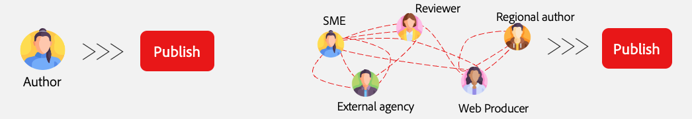
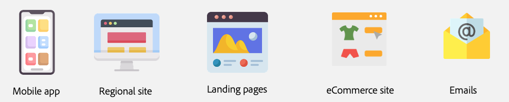
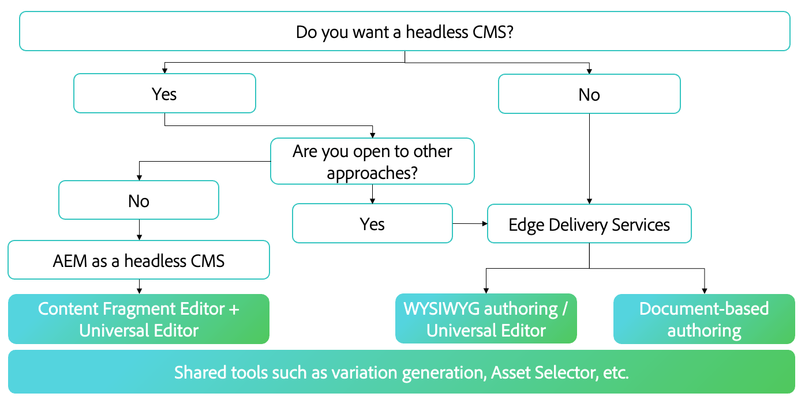
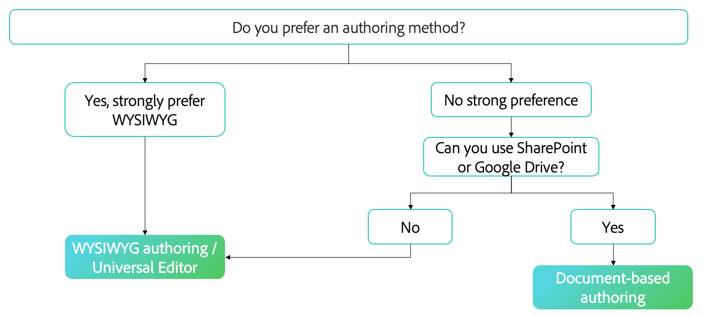

# Choosing an Authoring Method {#authoring-methods}

Learn important considerations when deciding on how you author your content in AEM to help you make the best decision for your content authors.

## Overview of Considerations {#overview}

AEM's flexibility ensures that your authoring needs are covered regardless of if you choose document-based authoring or WYSIWYG authoring. Keep the following facts in mind as you begin your considerations.

* **Always involve your content authors in the decision.** - Your content authors are your experts and their insight is vital.
* **Multiple authoring methods can be implemented.** - Although Adobe recommends starting simple and layering on complexity as the need arises, multiple authoring methods can work together in one project.
* **You can always change your authoring method after-the-fact.** - Whatever you decide you are not locked in. Changing from one method to another is straight-forward with the assistance of Adobe's automated migration tools.
* **You mustn't decide before the implementation, but rather as part of the implementation.** - AEM is one unified product, so this important decision doesn't have to be part of contract negotiations. When you buy AEM, you get all of them. Rather this is a decision during implementation.

Adobe can help you determine what method (or methods) best fit your requirements as part of the implementation.

## One Size Doesn't Fit All {#one-size}

Every implementation of AEM has its own workflows and goals. One project may involve a simple authoring model with content authors responsible for their own publications. Whereas another might have a complex network of contributors and approvals.

Different projects may have different (and multiple) use cases.

Adobe understands this and therefore does not offer a one-size-fits-all approach. AEM is your single solution that offers different approaches for content delivery as well as content creation to best fit your needs.

To determine the best approach, you need to consider four items.

1. [Do you have a content delivery preference?](#content-delivery)
1. [Do you have a content authoring preference?](#content-authoring)
1. [What is your project goal?](#project-goals)
1. [What authoring challenges are you facing today?](#authoring-challenges)

## Content Delivery Preferences {#content-delivery}

Your first consideration should be how you want to deliver your content. Edge Delivery Services offers lightning-fast sites, but perhaps your focus is on headless delivery. The following decision tree can help you consider your options.

This can help you decide if you need:

* [AEM as a headless CMS](/help/headless/introduction.md) using the Content Fragment Editor and/or Universal Editor.
* AEM Edge Delivery Services using the [document-based editing](/help/edge/docs/authoring.md) or [WYSIWYG authoring with the Universal Editor](/help/edge/wysiwyg-authoring/authoring.md).

## Content Authoring Preferences {#content-authoring}

Your next consideration should be how you want to author your content. The following decision tree can help you consider your options.

This can help you decide if you need:

* AEM Edge Delivery Services using the [document-based editing](/help/edge/docs/authoring.md).
* [WYSIWYG authoring with the Universal Editor](/help/edge/wysiwyg-authoring/authoring.md).

## Project Goals {#project-goals}

What does authoring success look like to you? How do you define success for your project?

* Maybe you need to enable more people to create content, but want to avoid training on a new tool set. (Think document-based authoring.)
* Maybe you need to increase the amount of content you generate. (Think document-based authoring.)
* Maybe you need to focus on visual content layout, but minimize the need for coding knowledge. (Think WYSIWYG authoring.)

Clearly-stated project goals at the outset of your implementation will help you make a well-informed decision on your authoring method.

## Authoring Challenges {#authoring-challenges}

Finally consider the specific challenges you face today authoring your content.

* Perhaps you face duplication of work with content created outside of your CMS, which then needs to be imported or copy-and-pasted. (Think document-based authoring.)
* Perhaps you need to cut the time required training authors on how to use a CMS. (Think document-based authoring.)
* Maybe your authors need to often edit the visual layout of your content, requiring constant developer support. (Think WYSIWYG authoring.)
