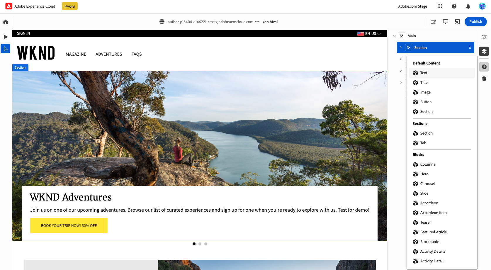
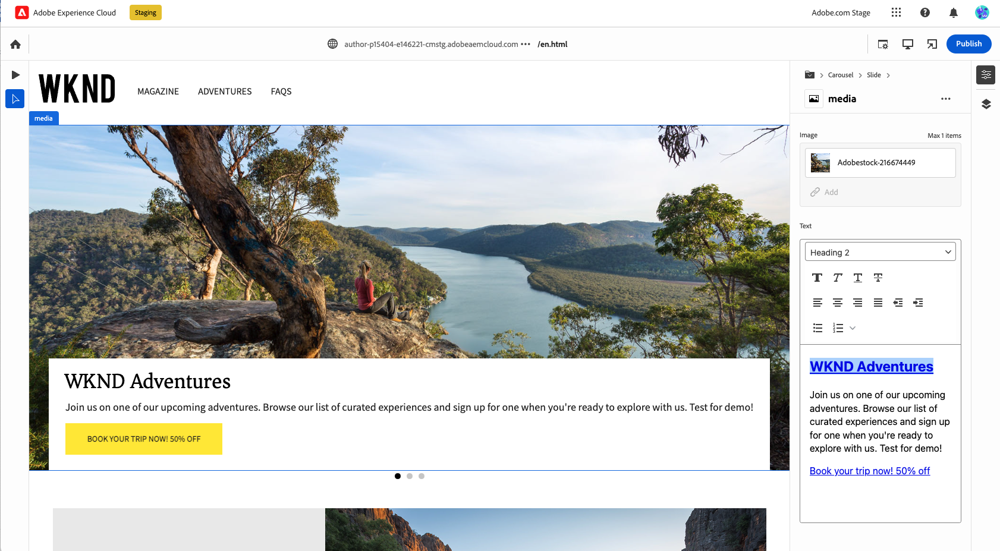

# Authoring Content for Edge Delivery Services {#authoring-edge}

With Edge Delivery Services, authoring is easy, fast, and flexible. You have two options to author content for Edge Delivery Services:

* [Document-based authoring](#document-based) - Such as Microsoft Word or Google Docs
* [Universal Editor](#universal-editor) - A modern UI for authoring content within AEM

## Document-Based Authoring {#document-based}

In the case of document-based authoring, you can work with a variety of sources such as Microsoft Word and Google Docs. Documents from these sources become pages on your website. Headings, lists, images, font elements, videos can all be transferred from the initial source into your website. You can add metadata for SEO purposes or use blocks to work with structured content and add functionality.

For further details on document-based authoring, please refer to [this document in the Edge Delivery Services documentation.](https://www.aem.live/docs/authoring)

## Universal Editor Authoring {#universal-editor}

Blocks are fundamental components of a page delivered by Edge Delivery Services. Authors can choose from default blocks provided as standard by Adobe or from blocks customized for your project by your developers.

The Universal Editor provides a modern and intuitive GUI for authoring your content by dragging-and-dropping blocks.

Details of the blocks can then be configured in the Properties rail.

For details on how to author using the Universal Editor, please see the document [Authoring Content with the Universal Editor.](/help/implementing/universal-editor/authoring.md)
