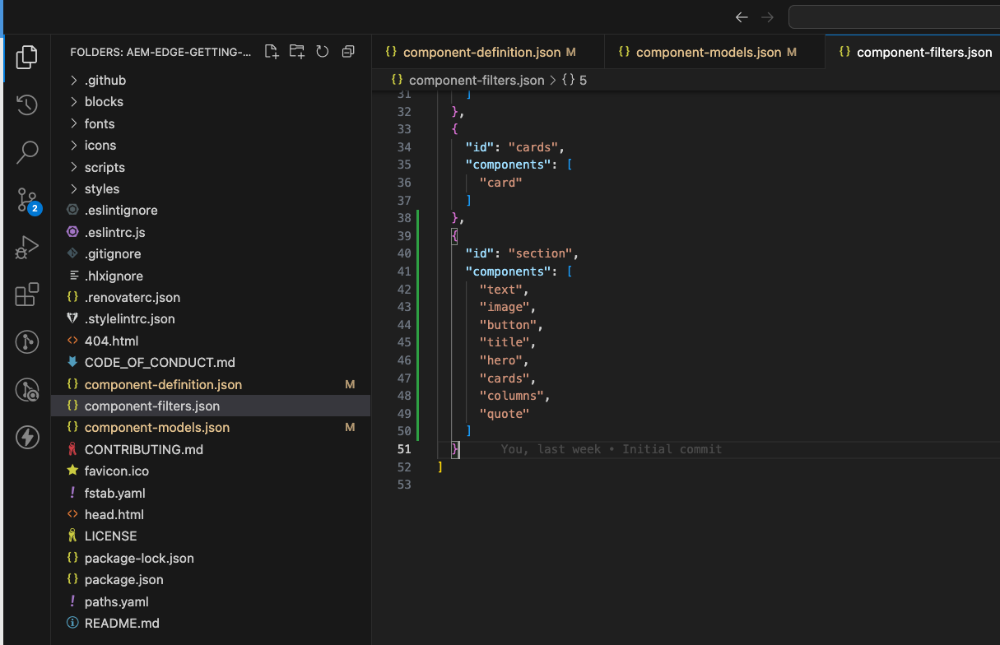
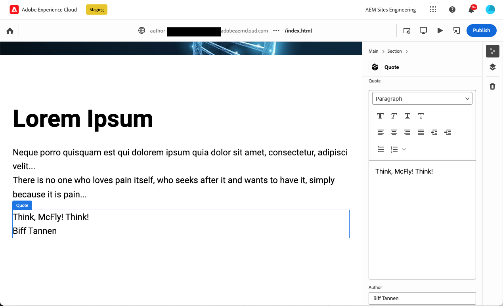
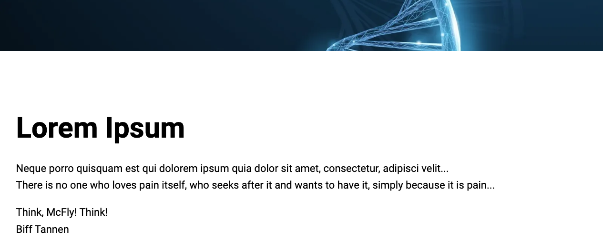
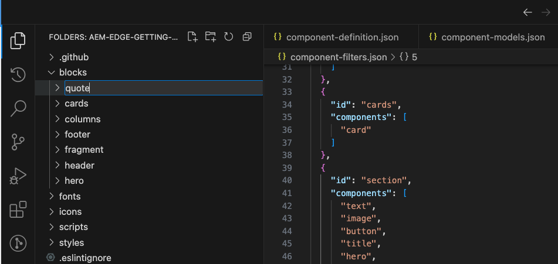
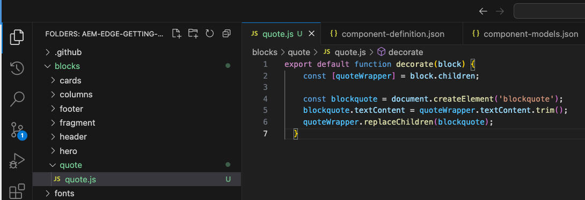

# Creating Blocks Instrumented for use with the Universal Editor {#create-block}

Learn how to create new blocks instrumented for use with the Universal Editor in AEM authoring with Edge Delivery Services projects.

{{aem-authoring-edge-early-access}}

## Prerequisites {#prerequisites}

This guide provides step-by-step instructions on how to create new blocks instrumented for Universal Editor in AEM authoring with Edge Delivery Services projects. It covers adding components, loading component definitions in Universal Editor, publishing pages, implementing block decoration and styles, bringing the changes to production, and verifying them. Following this guide you can effectively create and deploy a new blocks.

This guide necessarily requires existing knowledge of AEM authoring with Edge Delivery Services projects as well as the Universal Editor. Before beginning this guide, you should already have access to Edge Delivery Services and be familiar with its basics including:

* You have completed the [Edge Delivery Service tutorial.](/help/edge/developer/tutorial.md)
* You have access to an [AEM Cloud Service sandbox.](/help/implementing/cloud-manager/getting-access-to-aem-in-cloud/introduction-sandbox-programs.md)
* You have [enabled the Universal Editor on the same sandbox environment.](/help/implementing/universal-editor/getting-started.md)
* You have completed the [Developer Getting Started Guide for AEM Authoring with Edge Delivery Services](/help/edge/edge-dev-getting-started.md) guide.

This guide builds on the work done in the [Developer Getting Started Guide for AEM Authoring with Edge Delivery Services](/help/edge/edge-dev-getting-started.md) guide.

## Add a New Block to Your Project {#add-block}

To simplify this example, all changes are made to the `main` branch of the project repository. Of course for your actual project, [you should follow development best practices](https://www.aem.live/docs/dev-collab-and-good-practices) by developing on a different branch and reviewing all changes via pull request before merging.

Keep this in mind while you follow these steps to build your first block to render a memorable quote on your page.

1. Clone the GitHub project you created in the [Developer Getting Started Guide for AEM Authoring with Edge Delivery Services](/help/edge/edge-dev-getting-started.md) guide and open it in an editor of your choice.

   * Microsoft Code is used here for illustrative purposes.

   

1. Edit the `component-definition.json` file at the root of the project and add the following definition for your new quote block and save the file.

   ```json
   {
     "title": "Quote",
     "id": "quote",
     "plugins": {
       "xwalk": {
         "page": {
           "resourceType": "core/franklin/components/block/v1/block",
           "template": {
             "name": "Quote",
             "model": "quote",
             "quote": "<p>Think, McFly! Think!</p>",
             "author": "Albert Einstein"
           }
         }
       }
     }
   }
   ```

   

1. Edit the `component-models.json`file at the root of the project and add the following model definition for your new quote block and save the file.

   ```json
   {
     "id": "quote",
     "fields": [
        {
          "component": "text-area",
          "name": "quote",
          "value": "",
          "label": "Quote",
          "valueType": "string"
        },
        {
          "component": "text-input",
          "valueType": "string",
          "name": "author",
          "label": "Author",
          "value": ""
        }
      ]
   }
   ```

   

1. Edit the `component-filters.json`file at the root of the project and add the quote block to the filter definition for your project and save the file.

   ```json
   {
     "id": "section",
     "components": [
       "text",
       "image",
       "button",
       "title",
       "hero",
       "cards",
       "columns",
       "quote"
      ]
   }
   ```

   

1. Using git, commit these changes to your `main` branch.

   * Committing to `main` is for illustrative purposes only. [Follow best practices](https://www.aem.live/docs/dev-collab-and-good-practices) and use a PR for actual project work.

## Add Block to Your Page {#add-block}

Now that your basic quote block is defined and committed to the sample project, you can add a quote block to an existing page.

1. In a browser, sign into AEM as a Cloud Service and using the Sites console, navigate to the site that you created in the [Developer Getting Started Guide for AEM Authoring with Edge Delivery Services](/help/edge/edge-dev-getting-started.md) guide and select a page.

   * In this case, `index` is used for illustrative purposes.

   

1. Tap or click **Edit** in the toolbar of the console and the Universal Editor will open.

   * In order to load the page, you may need to tap or click **Sign in with Adobe** to authenticate to AEM in the Universal Editor.

1. Select a section and in the properties rail, tap or click the **Add** icon and then select your new **Quote** block from the menu.

   * The **Add** icon is a plus symbol.
   * You know if you have selected a section if the blue outline of the selected object has a tab labelled **Section**.
   * In this example, tapping or clicking slightly above the **Lorem Ipsum** heading selects a section containing the heading and lorem ipsum text.

   

1. The page is reloaded and the quote block is added to the bottom of the selected section with its default content specified in the `component-definitions.json` file.

   * The quote block can be selected as any other block.
   * The contents of the quote block can be editing either in-place or in the properties rail.
   * Styling will be applied in a further step.

   

1. Once you are satisfied with the content of your quote, you can publish the page by tapping or clicking the **Publish** button in the toolbar of the Universal Editor.

1. Verify that the content was published by navigating to the published page. The link will be similar to `https://<branch>--<repo>--<owner>.hlx.page`

   

## Style the Block {#style-block}

Now that we have a working quote block we can apply styling to it.

1. Return to the editor for your project.

1. Create a `quote` folder under the `blocks` folder.

   

1. In the new `quote` folder, add a `quote.js` file to implement block decoration by adding the following JavaScript.

   ```javascript
   export default function decorate(block) {
     const [quoteWrapper] = block.children;
 
     const blockquote = document.createElement('blockquote');
     blockquote.textContent = quoteWrapper.textContent.trim();
     quoteWrapper.replaceChildren(blockquote);
   }
   ```

   


1. In the `quote` folder, add a `quote.css` file to define the styling for the block by adding the following CSS code.

   ```css
   .block.quote {
       background-color: #ccc;
       padding: 0 0 24px;
       display: flex;
       flex-direction: column;
       margin: 1rem 0;
   }
 
   .block.quote blockquote {
       margin: 16px;
       text-indent: 0;
   }
 
   .block.quote > div:last-child > div {
       margin: 0 16px;
       font-size: small;
       font-style: italic;
       position: relative;
   }
 
   .block.quote > div:last-child > div::after {
       content: "";
       display: block;
       position: absolute;
       left: 0;
       bottom: -8px;
       height: 5px;
       width: 30px;
       background-color: darkgray;
   }
   ```

   

1. Using git, commit these changes to your `main` branch.

   * Committing to `main` is for illustrative purposes only. [Follow best practices](https://www.aem.live/docs/dev-collab-and-good-practices) and use a PR for actual project work.

## Viewing Your Styled Block {#styled-block}

Your quote block is complete! Now you can view it fully styled.

1. Return to your browser tab of the Universal Editor where you were editing the page of your project and reload the page.

1. See the now styled quote block on the page and tap or click the **Publish** button on the Universal Editor toolbar to publish.

   

1. Verify that the content was published by navigating to the published page. The link will be similar to `https://<branch>--<repo>--<owner>.hlx.page`

   

## Using Other Working Branches {#other-branches}

This guide had you commit directly to the `main` branch for simplicity's sake. For experimentation, this is usually not an issue. For actual project work [you should follow development best practices](https://www.aem.live/docs/dev-collab-and-good-practices) by developing on a different branch and reviewing all changes via pull request before merging.

When you are not developing on the `main` branch, you can append `?ref=<branch>` in the Universal Editor location bar to load the page from your branch. `<branch>` is the branch name as it would be used for your project's preview or live URLs, e.g. `https://<branch>--<repo>--<owner>.hlx.page`.

Be aware that publishing content with the new model is currently only supported with the model being merged to the `main`  branch.

Adobe recommends that you develop blocks in a two-phased approach as illustrated above:

1. Create the definition and model, review it, and bring it to production.
1. Create content, preview it, and implement the decoration and styles.


