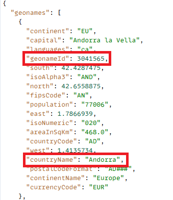
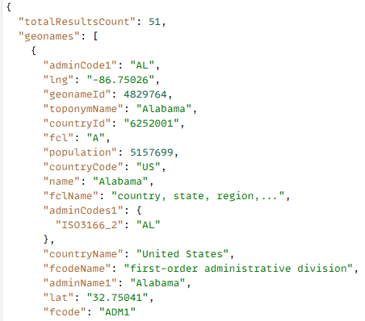
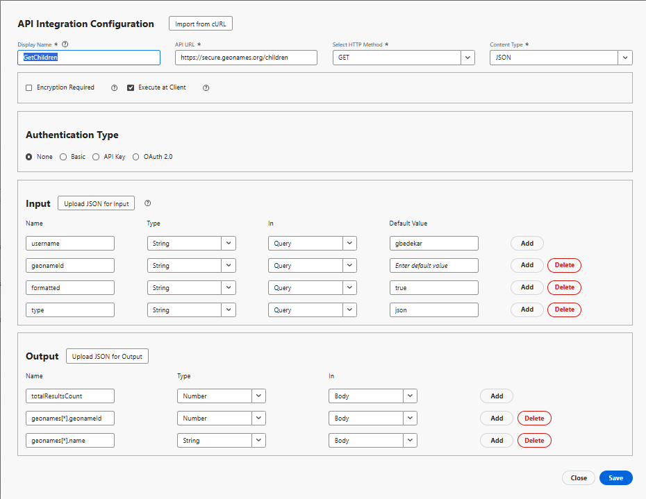

# Create API Integration

In this tutorial, 2 API integrations are created

- GetAllCountries returns a list of countries 
- GetChildren - Return immediate children of the country or state represented by the geonameId

## GetAllCountries - API Integration Configuration

-   API Integration Configuration

    -   Display Name: GetAllCountries → a label for this API in your system.

    -   API URL: `https://secure.geonames.org/countryInfoJSON` - the endpoint you're calling.

    -   HTTP Method: GET - you're making a simple GET request.

    -   Content Type: JSON - response is expected in JSON format.

-   Options:

    -   Encryption Required unchecked -  no encryption layer beyond HTTPS.

    -   Execute at Client checked -  the call is executed from the client/browser, not server-side.
-   Authentication Type
    - None- since the GeoNames API doesn't require OAuth or API keys in headers
-   Input:
    - The input section defines what is sent into the API
    - **username** → type: String, sent in the Query, default: gbedekar.
    - Every request appends ?username=gbedekar to the URL
-   Output
    -   Output defines what fields from the JSON response are to be extracted and used.
    The GeoNames response looks like:

    
    -   Mapped two fields from inside the geonames array:

        geonames[*].geonameId → as a Number

        geonames[*].countryName → as a String

        The [*] means it repeats for each country in the array.
    

## GetChildren

It asks GeoNames for the immediate children of the place whose geonamesId is passed as a query parameter

-   API Integration Configuration

    -   Display Name: GetAllCountries → a label for this API in your system.

    -   API URL: `https://secure.geonames.org/children` → the endpoint you're calling.

    -   HTTP Method: GET → you're making a simple GET request.

    -   Content Type: JSON → response is expected in JSON format.

-   Options:

    -   Encryption Required unchecked → no encryption layer beyond HTTPS.

    -   Execute at Client checked → the call is executed from the client/browser, not server-side.
-   Authentication Type
    - None- since the GeoNames API doesn't require OAuth or API keys in headers
-   Input:
    - Defines what is sent into the API
    - **username** → type: String, sent in the Query, default: gbedekar.
    - Every request appends ?username=gbedekar to the URL
    - **geonameId** -> type: String. Returns the children of the country/state represented by the geonameId
    - **type** =>String. Setting  to json returns the response in JSON format.
-   Output
    -   Defines what fields from the JSON response are to be extracted and used.
    The GeoNames response looks like:

    
    -   Mapped two fields from inside the geonames array:

        geonames[*].geonameId → as a Number

        geonames[*].name → as a String

        The [*] means it repeats for each country in the array.
    

