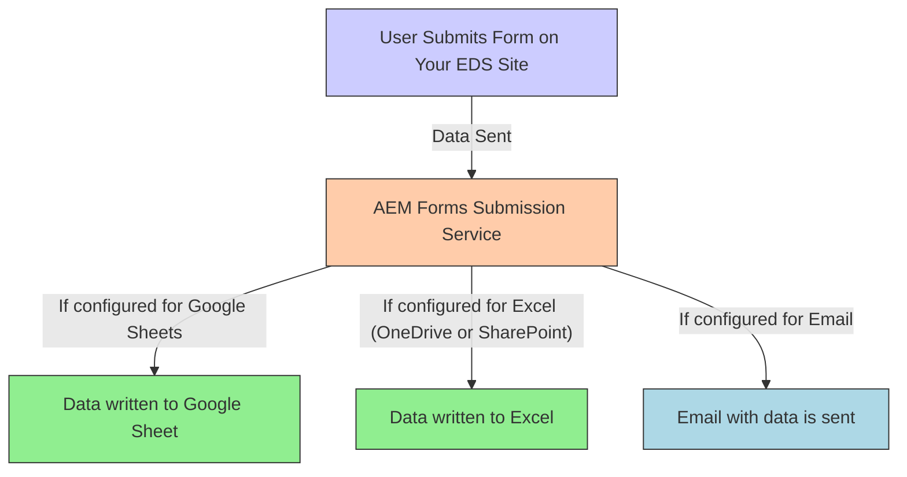
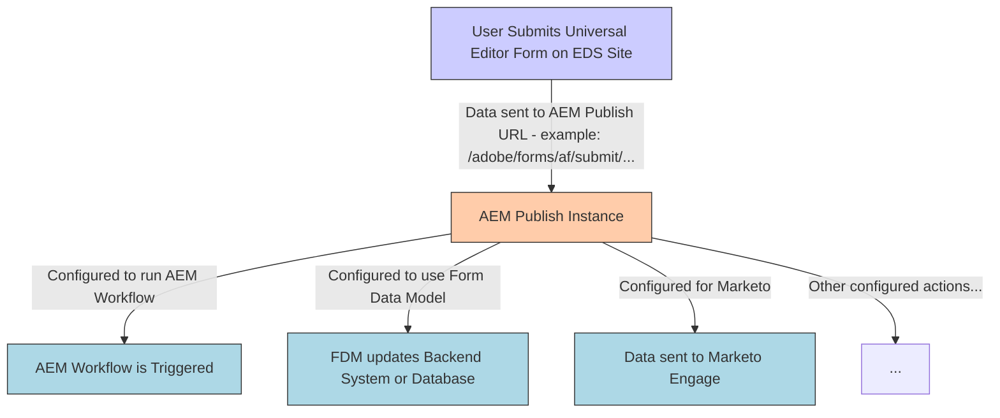
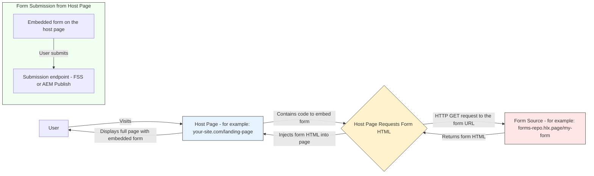
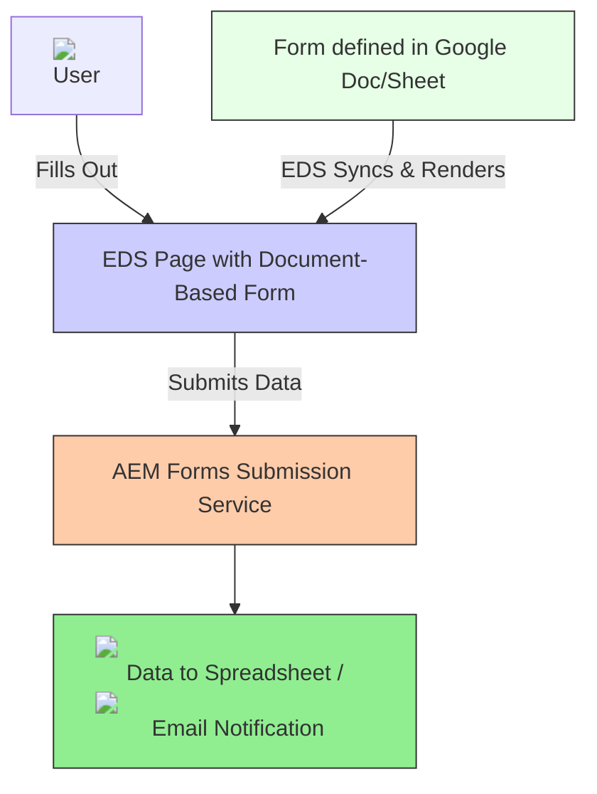

# Configuring Form Submissions: Where Does Your Data Go?

After a user clicks **submit** on your form, you need to tell Edge Delivery Services what to do with that data. You have two main options:

## Method 1: Using the AEM Forms Submission Service (Simplified)

This service is ideal for common, straightforward actions like sending data to a spreadsheet or an email.

**What is It and How Can It Help You?**

The [Forms Submission Service](/help/forms/forms-submission-service.md) is an Adobe-hosted endpoint. When your form submits data to it, this service takes over and performs a pre-configured action. It's designed to be easy to set up. You Can Configure: Submitting to Spreadsheets or Email:

*   **Submit to Spreadsheet:** Automatically add the submitted form data as a new row in a Google Sheet or a Microsoft Excel file (stored on OneDrive or SharePoint).
*   **Send Email:** Send an email containing the form data to one or more email addresses you specify.

#### Important: Setup Requirements 

* **Spreadsheet Access:** To send data to a Google Sheet or an Excel file on OneDrive/SharePoint, the Adobe service account (often `forms@adobe.com`) usually needs **edit permission** on that specific spreadsheet.
* **Early Access Program:** Some features of this service, especially for spreadsheets, might be part of an early access program. You may need to request access by emailing `aem-forms-ea@adobe.com` or filling out a specific Adobe form with your project details. Always check the latest Adobe documentation.

**Forms Submission Service Flowchart**



This flowchart shows how the Forms Submission Service takes submitted data and sends it to a configured spreadsheet or email.

## Method 2: Submitting to Your AEM Publish Instance (Advanced)
    
For more complex needs, [forms (especially those created with the Universal Editor) can send data directly to your AEM as a Cloud Service Publish instance](/help/forms/configure-submit-actions-core-components.md). This unlocks AEM's full backend power.

**When Do You Need to Submit to AEM Publish?**

*   To trigger custom AEM Workflows after submission.
*   To use the AEM Form Data Model (FDM) to integrate with databases or other enterprise systems.
*   To connect with third-party services like Marketo, Microsoft Power Automate, or Adobe Workfront Fusion.
*   To store data in specific locations like Azure Blob Storage or SharePoint lists/document libraries (not just simple spreadsheets).
*   When you have complex server-side validation or data processing logic within AEM.

**Available Submit Actions (AEM Publish Submissions)**

*   [Submit to a REST endpoint](/help/forms/configure-submit-action-restpoint.md)
*   [Send email (using AEM's mail services)](/help/forms/configure-submit-action-send-email.md)
*   [Submit using Form Data Model (FDM)](/help/forms/configure-data-sources.md)
*   [Invoke an AEM Workflow](/help/forms/aem-forms-workflow-step-reference.md)
*   [Submit to SharePoint (as list items or documents)](/help/forms/configure-submit-action-sharepoint.md)
*   [Submit to OneDrive (as documents)](/help/forms/configure-submit-action-onedrive.md)
*   [Submit to Azure Blob Storage](/help/forms/configure-submit-action-azure-blob-storage.md)
*   [Submit to Microsoft Power Automate](/help/forms/forms-microsoft-power-automate-integration.md)
*   [Submit to Adobe Workfront Fusion](/help/forms/submit-adaptive-form-to-workfront-fusion.md)
*   [Submit to Adobe Marketo Engage](/help/forms/submit-adaptive-form-to-marketo-engage.md)

>[!NOTE]
>
> Even if targeting a Google Sheet/Excel from AEM Publish, it involves different configuration steps than the direct Forms Submission Service.

**AEM Publish Submission Flowchart**
    


This flowchart shows a form submitting to AEM Publish, which then handles complex backend tasks.

### Forms Submission Service vs. AEM Publish Submissions

| Feature                 | Forms Submission Service                                 | AEM Publish Submissions                                   |
| :- | :- | :-- |
| **Best For**            | Simple data capture to spreadsheets, email notifications | Complex workflows, enterprise integrations, custom logic  |
| **Form Authoring**      | Good for Document-Based; OK for simple UE forms          | Best for Universal Editor authored forms                  |
| **Setup Effort**        | Low (often simple configuration)                         | Higher (needs AEM Publish, Dispatcher, OSGi, CDN setup)   |
| **Backend System**      | Adobe-hosted service                                     | Your AEM as a Cloud Service Publish instance              |
| **Flexibility**         | Limited to Sheet/Email                                   | Very flexible, full range of AEM Forms actions            |
| **Example**             | Contact form data to a Google Sheet                      | Loan application triggering an AEM approval workflow      |

## How to Embed Forms Across Different Sites or Pages

Sometimes, you want to display a form that's created and managed in one place (e.g., a central "forms site") on a different web page or site.

### Why Would You Embed a Form?

*   You have a standard "Contact Us" form created with Universal Editor that needs to appear on multiple landing pages built with Document-Based Authoring.
*   Your main website content is in Document Authoring (DA), and you need to include a specialized form.
*   You want to reuse a single, well-maintained form across several different EDS projects.

### How Form Embedding Works Technically
    
The page where you want the form to appear (let's call it "Host Page") will contain some code (usually a special block or script). When a user visits the Host Page, this code makes a request to the URL where the actual form is hosted (let's call it "Form Source"). The Form Source then sends back its HTML, which the Host Page injects and displays.

**Embedded Form Architecture**



This diagram shows the Host Page fetching form HTML from the Form Source and displaying it. Submission uses the original form's configured endpoint.

## Setting Up CORS for Embedded Forms
    
[CORS (Cross-Origin Resource Sharing)](https://experienceleague.adobe.com/en/docs/experience-manager-learn/foundation/security/understand-cross-origin-resource-sharing) is a browser security feature. If your Host Page (e.g., `site-a.com`) tries to fetch a form from a different domain (e.g., `forms-site-b.com`), the browser will block it unless `forms-site-b.com` explicitly allows it via CORS headers.

Without correct CORS headers on the **Form Source server**, the browser prevents the Host Page from loading the form, and your embedded form would not appear.

### How to Configure CORS on the Site Serving Your Form?
        
You need to configure the server hosting the **Form Source** to send specific HTTP headers in its response. The exact method depends on your EDS setup (e.g., for Franklin projects, this is often done in a `helix-config.yaml` or similar configuration file in your GitHub repository that controls CDN behavior or edge worker logic).
Key headers to add to the Form Source's responses:

*   `Access-Control-Allow-Origin: <URL_of_Host_Page>` (e.g., `https://your-site.com`). For testing, you might use `*`, but for production, specify the exact domain(s).
*   `Access-Control-Allow-Methods: GET, OPTIONS` (You may need `POST` if the form submission itself is also cross-origin, but typically submissions go to a separate, often same-origin or specifically configured, endpoint).
*   `Access-Control-Allow-Headers: Content-Type` (and any other custom headers your form fetching might use).

**Example (conceptual for a config file):**

```yaml
        # In the configuration for the site HOSTING THE FORM (Form Source)
        headers:
          # Apply to paths where your forms are served, e.g., /forms/**
          - path: /forms/**
            custom:
              Access-Control-Allow-Origin: https://host-page-domain.com
              Access-Control-Allow-Methods: GET, OPTIONS
```

## Additional Considerations: CDNs and Multiple Codebases (Helix 4)

*   **CDN Rules:** Your CDN might offer ways to proxy requests. For example, a request to `host-page.com/embedded-form` could be internally routed by the CDN to fetch content from `form-source.com/actual-form`, making it appear same-origin to the browser. This can be complex to set up.
*   **Multiple Codebases (Helix 4):** If your Host Page and Form Source are in different GitHub repositories (common in Helix 4 setups), ensure that any JavaScript "Form block" needed to render or manage the form is available in the Host Page's codebase, or that the form HTML fetched from the Form Source is self-contained with all its necessary JavaScript. The original documents mention that for "helix4 with different codebases, then you need to add the Form block on both the codebases."

### Common Architectural Setups & Configuration Steps

Here are some common ways you might set up your forms, combining authoring methods with submission strategies, along with key configuration points.

#### Document-Based Form with Spreadsheet/Email Submission

This is the simplest setup. You create your form in Word/Google Docs, and it submits data to a spreadsheet or email via the Forms Submission Service.

1.  Define your form in a Word/Google Doc/Sheet using the specified table structure or form block.
1.  In the document (or related configuration), specify the target spreadsheet URL or email address for the Forms Submission Service.
1.  Ensure `forms@adobe.com` (or the relevant service account) has edit access to your target spreadsheet.
1.  Publish your document to your Edge Delivery site.

**Doc-Based + FSS Architecture**



#### Universal Editor Form with Spreadsheet/Email Submission

You use the visual Universal Editor to build your form, but still use the simple Forms Submission Service for data capture.

1.  Create your form using the Universal Editor in AEM.
1.  Configure the form's submit action in the UE to use the "Submit to Forms Submission Service" option.
1.  Specify the target spreadsheet URL or email address.
1.  If using spreadsheets, ensure `forms@adobe.com` has edit access.
1.  Publish your page containing the form from AEM to your Edge Delivery site.

    **UE + FSS Architecture**

    ```mermaid
    graph TD
    User[User] -->|Fills Out| EDS_Page_UE[EDS Page with Universal Editor Form]
    EDS_Page_UE -->|Submits Data| FSS[AEM Forms Submission Service]
    FSS --> Target[Data sent to Google Sheet and Email Notification]
    AuthoringUE[Form built in Universal Editor - AEM] -->|AEM Publishes to EDS| EDS_Page_UE

    style EDS_Page_UE fill:#ccf,stroke:#333
    style FSS fill:#fca,stroke:#333
    style Target fill:#90ee90,stroke:#333
    style AuthoringUE fill:#e6f3ff,stroke:#333
    ```

#### Universal Editor Form with AEM Publish Submission (Advanced)
    
This setup uses the Universal Editor for form creation and your AEM Publish instance for powerful backend processing (workflows, FDM, etc.). This requires more configuration.
  
1.  **Create Form in UE:** Build your form in the Universal Editor. Configure its submit action to point to an AEM Forms action (e.g., "Invoke an AEM Workflow," "Submit using Form Data Model").
1.  **AEM Dispatcher Configuration (on your AEM Publish tier):**
    *   **No Redirects:** Ensure your Dispatcher rules do *not* redirect requests made to `/adobe/forms/af/submit/...` paths.
    *   **Allow Submissions:** Modify your Dispatcher filters (e.g., in `filters.any`) to explicitly `allow` POST requests to `/adobe/forms/af/submit/...` from your Edge Delivery site's domain or IP addresses.
1.  **OSGi Referrer Filter in AEM (on your AEM Publish tier):**
    *   In the AEM OSGi console (`/system/console/configMgr`), find and configure the "Apache Sling Referrer Filter."
    *   Add your Edge Delivery site's domain(s) (e.g., `https://your-eds-domain.hlx.page`, `https://your-custom-eds-domain.com`) to the "Allow Hosts" or "Allow Hosts RegExp" list. This tells AEM to accept submissions originating from your EDS site.
1.  **CDN Redirect Rule (on your Edge Delivery CDN):**
    *   Your Edge Delivery site (e.g., `your-eds-domain.hlx.page`) needs to correctly route submission requests to your AEM Publish instance.
    *   When the form on your EDS page submits, it might target a relative path like `/adobe/forms/af/submit/...`. You need a rule on your Edge Delivery CDN (or edge worker) that says: "If a request comes to `your-eds-domain.hlx.page/adobe/forms/af/submit/...`, forward (proxy or redirect) it to `your-aem-publish-instance.com/adobe/forms/af/submit/...`."
    *   The exact implementation depends on your CDN provider (e.g., Fastly VCL, Akamai Property Manager, Cloudflare Workers).
1.  **(Optional) `constants.js` for Development (in your EDS project's codebase):**
    *   For local development or if your client-side form scripts need to know the full AEM Publish URL, you might configure this in a `constants.js` or similar configuration file within your Edge Delivery project's GitHub repository. Example:
  
    ```javascript
        // in your-eds-project/scripts/constants.js
         export const AEM_PUBLISH_URL = 'https://publish-p123-e456.adobeaemcloud.com';
                // Your form submission script might then construct the submit URL:
                // const submitUrl = `${AEM_PUBLISH_URL}/adobe/forms/af/submit/...`;
    ```

1.  **Publish:** Publish your form page from AEM to EDS, and ensure all AEM configurations are active on your AEM Publish instance.

    **UE + AEM Publish Architecture**

    ```mermaid
    graph TD
    User[User] -->|Fills Out| EDS_Page_UE[EDS Page with UE Form\nExample: your-eds-site.hlx.page/form]

    subgraph EdgeDeliveryTier["Edge Delivery Tier - your-eds-site.hlx.page"]
        EDS_Page_UE -->|Form submits to\n/adobe/forms/af/submit/... on EDS domain| EdgeCDN[Edge CDN]
    end

    subgraph AEM_CS_Tier["AEM as a Cloud Service Tier"]
        AEMDispatcher[Dispatcher\non AEM Publish] --> AEMPublish[AEM Publish Instance\nyour-aem-publish.com]
        AEMPublish --> BackendServices[AEM Workflow, FDM, Integrations etc.]
    end

    EdgeCDN -->|CDN rule forwards submit request to AEM Publish| AEMDispatcher

    AuthoringUE[UE on AEM Author] -->|Publishes form to EDS| EDS_Page_UE

    style EDS_Page_UE fill:#ccf,stroke:#333
    style EdgeCDN fill:#9cf,stroke:#333
    style AEMDispatcher fill:#fca,stroke:#333
    style AEMPublish fill:#fca,stroke:#333
    style BackendServices fill:#add8e6,stroke:#333
    style AuthoringUE fill:#e6f3ff,stroke:#333
    ```
    
    This shows the flow: user submits on EDS site, CDN routes to AEM Dispatcher, then AEM Publish processes it.

#### Embedding a Form into a Document Authoring (DA) Page

Your main website content is created in Document Authoring (DA). You create your form using either Document-Based Authoring or the Universal Editor separately, then embed it into your DA page.

1.  **Create & Publish the Form:**
    *   Use Document-Based Authoring OR Universal Editor to create your form.
    *   Configure its submission method (either to Forms Submission Service or AEM Publish, as per Setup 1, 2, or 3).
    *   Publish this form so it's live on its own Edge Delivery URL (e.g., `.../forms/my-special-form`).
1.  **Configure CORS:** On the Edge Delivery site/project that hosts this standalone form, ensure CORS headers are set up to allow your Document Authoring site's domain to fetch it .
1.  **Author Page in DA:** Create or edit your page in Document Authoring.
1.  **Embed Form Block:** Use the appropriate block in DA to embed an external URL. Point this block to the URL of your standalone published form.
1.  **Publish DA Page:** Publish your DA page. It will now fetch and display the form.

    **Forms Embedded in DA Architecture**

    ```mermaid
    graph TD
    User[User] -->|Accesses| DAPage_EDS[DA Authored Page on Edge Delivery\nExample: your-da-site.hlx.page/main-page]
    DAPage_EDS -->|Contains Embed Block that fetches| EmbeddedForm[Form - Doc-Based or UE\nServed from its own EDS URL\nExample: forms-repo.hlx.page/my-form\nCORS must be enabled]

    EmbeddedForm -->|Form submission logic as configured| SubmissionTarget[Forms Submission Service or AEM Publish]

    AuthoringDA[Content authored in Document Authoring] -->|Publishes Page to EDS| DAPage_EDS
    AuthoringForm[Form created via Doc-Based or Universal Editor] -->|Publishes Form to EDS URL| EmbeddedForm

    style DAPage_EDS fill:#e6f3ff,stroke:#333
    style EmbeddedForm fill:#ccf,stroke:#333
    style SubmissionTarget fill:#fca,stroke:#333
    style AuthoringDA fill:#ffe6cc,stroke:#333
    style AuthoringForm fill:#e6ffe6,stroke:#333
    ```
    
    This shows a DA page pulling in a form from another EDS location. The embedded form handles its own submission.

## Troubleshooting

* **My form submission isn't working.**
  *   **Check Console Errors:** Open your browser's developer console (usually F12) and look for errors on the Network tab or Console tab when you submit.
  *   **Verify Submission URL:** Is the form trying to submit to the correct endpoint (Forms Submission Service URL or your AEM Publish path)?
  *   **Forms Submission Service:** If sending to a spreadsheet, has `forms@adobe.com` been given edit access? Is the spreadsheet URL correct?
  *   **AEM Publish Submissions:**
        *   Is your Dispatcher allowing POSTs to `/adobe/forms/af/submit/...`?
        *   Is the Sling Referrer Filter on AEM Publish configured to allow your EDS domain?
        *   Are your CDN redirect rules for `/adobe/forms/af/submit/...` working correctly?

* **My embedded form isn't appearing.**
    
    *   **CORS!** This is the most common reason. Check the browser console for CORS errors. Ensure the site *hosting* the form has the correct `Access-Control-Allow-Origin` headers.
    *   **Form URL Correct?** Is the embed code on the host page pointing to the correct live URL of the form?
    *   **JavaScript Blocks:** If the form relies on a specific JavaScript "Form block" for rendering, is that block's code available on the host page?
  
*   **I get a "403 Forbidden" or "401 Unauthorized" when submitting to AEM Publish.**
    
      *   This often points to the Sling Referrer Filter on AEM Publish not allowing requests from your EDS domain. Double-check its configuration.
      *   It could also be an authentication/authorization issue if your AEM submit endpoint requires it, though standard form submissions are usually anonymous.

## Next Steps

This guide has provided an overview of using forms with AEM Edge Delivery Services. For more detailed, step-by-step instructions on specific configurations, please refer to the official Adobe Experience Manager documentation:

* [Document-Based Authoring with Edge Delivery Services Forms](/help/edge/docs/forms/tutorial.md)
* [Universal Editor with Edge Delivery Services Forms](/help/edge/docs/forms/universal-editor/overview-universal-editor-for-edge-delivery-services-for-forms.md)
* [Document Authoring (DA) and Embedding Content](https://www.aem.live/developer/da-tutorial)
* [AEM Forms Submission Service](/help/edge/docs/forms/configure-submission-action-for-eds-forms.md.md)