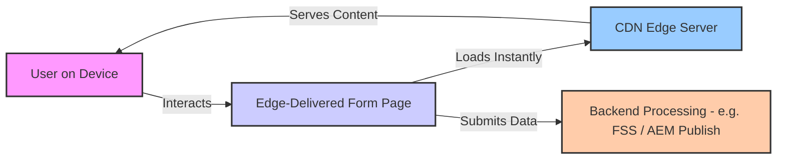
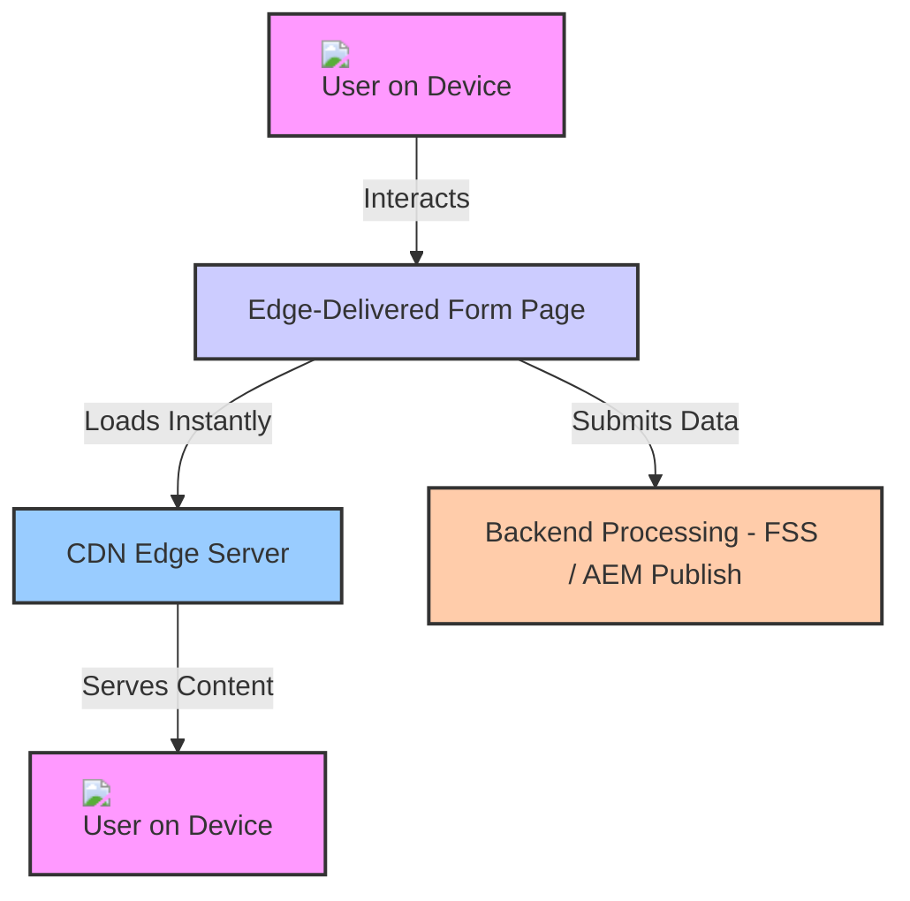
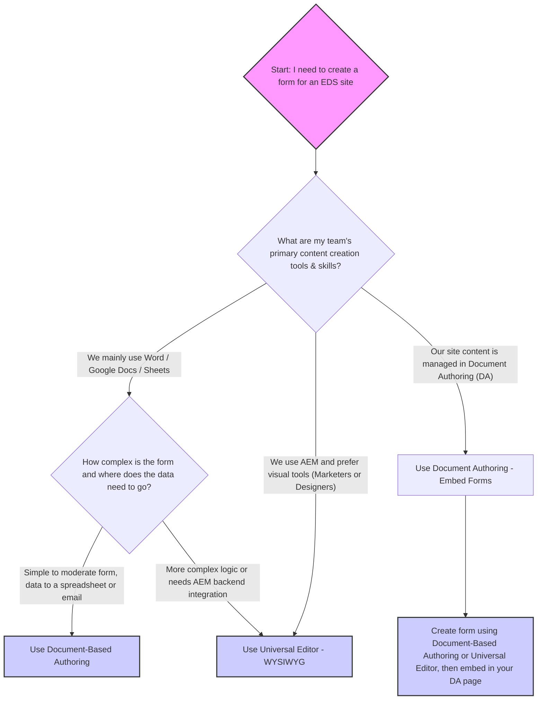
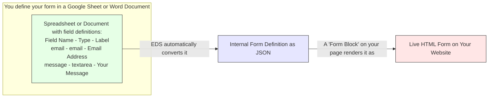
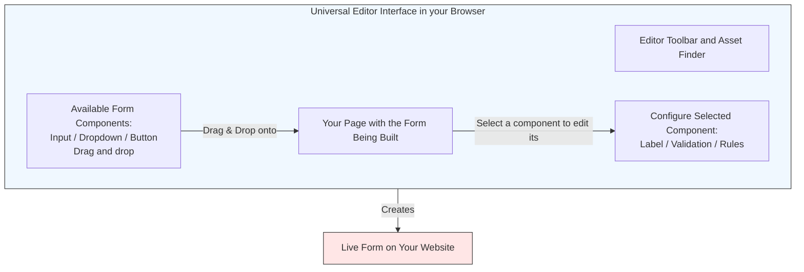
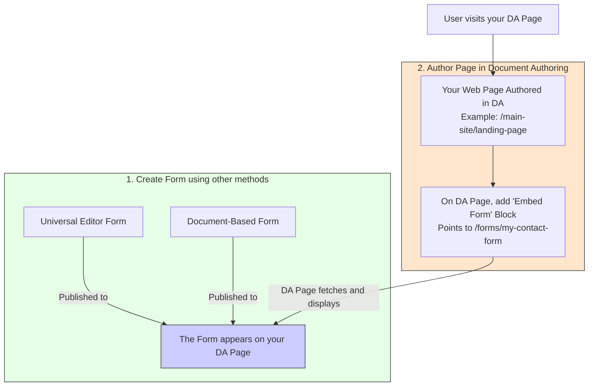
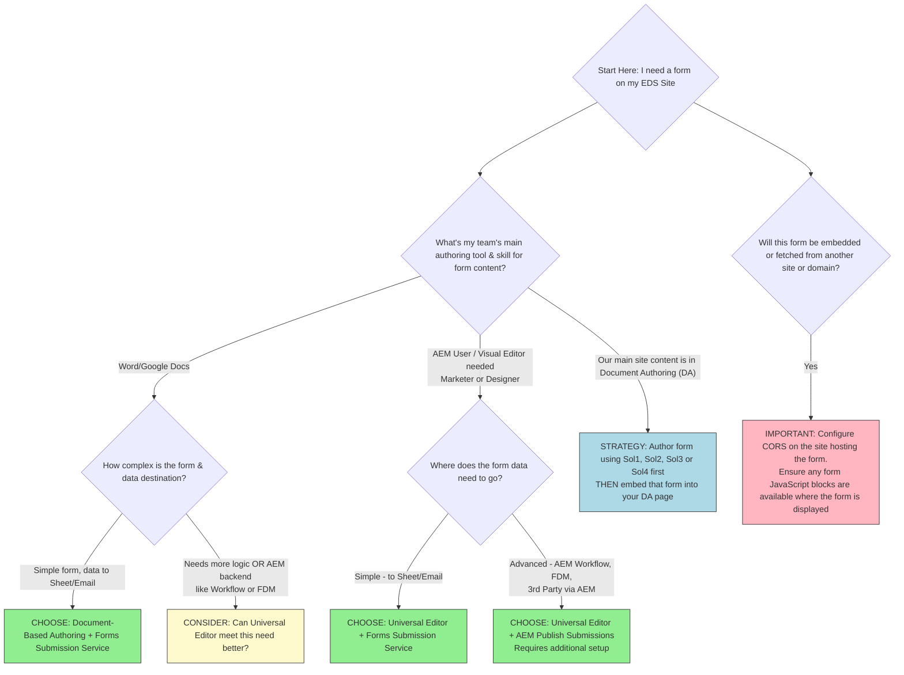
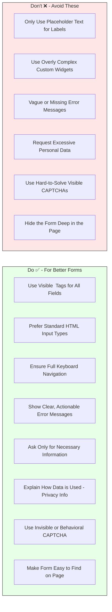

# Getting Started with Forms on AEM Edge Delivery Services

This guide helps you understand and implement forms using Adobe Experience Manager (AEM) Edge Delivery Services (EDS). Whether you are creating a simple contact form or a complex data collection tool, this page walks you through your options.

## Understanding Forms in Edge Delivery Services

Edge Delivery Services is Adobe's modern solution for delivering web content, including forms, with exceptional performance and agility. By using EDS for your forms, you can:

* **Deliver Faster Experiences:** Forms load incredibly quickly because they are served from a global network of edge servers (CDNs) close to your users. This improves user satisfaction and can increase form completion rates.
* **Update Forms More Easily:** The EDS approach often allows for faster development cycles and content updates, so you can adapt your forms quickly.
* **Build Modern, Responsive Forms:** Create forms that look great and work seamlessly on any device.
* **Benefit from Scalability and Reliability:** Your forms will be as robust and scalable as the underlying edge infrastructure.

This guide will:

* Explain the different ways you can create (author) forms for your Edge Delivery Sites.
* Show you how to configure what happens after a user submits a form (submission actions).
* Help you choose the best methods for your specific needs and team skills.
* Provide architectural diagrams and best practices.

## Key Terms You Should Know

*   **Edge Delivery Services (EDS):** Adobe's performance-first architecture for delivering AEM content via CDNs. Also known as Project Franklin.
*   **AEM Forms:** Adobe's solution for creating, managing, and processing forms.
*   **Universal Editor (UE):** A visual, WYSIWYG editor for AEM content, including forms.
*   **Document-Based Authoring:** Creating forms using Microsoft Word or Google Docs/Sheets.
*   **Document Authoring (DA):** An Adobe-hosted service for authoring content (including pages that can host forms) for EDS.
*   **Forms Submission Service (FSS):** An Adobe service that simplifies sending form data to spreadsheets or email.
*   **AEM Publish Instance:** The live AEM environment that can process complex form submissions.
*   **CORS (Cross-Origin Resource Sharing):** A browser security feature that needs configuration when embedding forms from different domains.
*   **CDN (Content Delivery Network):** A network of servers that delivers web content quickly to users based on their geographic location.

Conceptual Diagram of EDS Form Interaction
    

This diagram shows a user interacting with a form delivered quickly via a CDN. The data they submit is then handled by a backend system.

## How Forms Work on the Edge?

To effectively use forms with EDS, it helps to understand the basic architecture.

**A Quick Look at Edge Delivery Services Architecture**

With EDS, your website content (including the structure of your forms) can originate from various sources like AEM as a Cloud Service, SharePoint, Google Drive, or the Document Authoring (DA) service. This content is then published to a global CDN. When a user visits your site, the content is served directly from the nearest CDN edge server, ensuring maximum speed.

*   **Where AEM Forms Fit In**
    Forms in an EDS architecture are designed to be:
    *   **Fast Loading:** Form structures are often simple HTML rendered client-side.
    *   **Decoupled:** The visual part of the form (frontend) is separate from where the data goes after submission (backend).
    *   **Flexible to Create:** You have different tools to build your forms.
    *   **Configurable for Submission:** You can send data to simple services or powerful AEM backends.

    **Simplified EDS Architecture with Forms**

This diagram shows the journey: forms are defined in an authoring system, published to the edge, served to users, and submitted data is processed by a backend.

## Choosing Your Form Authoring Method

You have three main ways to create forms for your Edge Delivery Services sites. Your choice will depend on your team's skills, the complexity of the form, and your project needs.

### Which Authoring Approach is Right for You?

Use this decision tree to help you choose:

**Form Authoring Decision Tree**
    

This decision tree helps you select an authoring method based on your team and form needs.

### Creating Forms with Documents (Word/Google Docs)

This method is great for quickly creating forms if your team is comfortable with Microsoft Word or Google Docs/Sheets.

**How It Works: From Document to Web Form**

You define your form's fields, labels, and types directly in a Word document or a Google Sheet using a special table format or a "Form block." When you publish this document, Edge Delivery Services automatically converts it into a web-ready HTML form that users can interact with on your site.

**Capabilities & Features**

*   Author in familiar tools: Word, Google Docs, Google Sheets.
*   Define fields: text inputs, email, dropdowns, checkboxes, radio buttons, text areas.
*   Add labels, placeholders, and help messages.
*   Set basic validation rules: required fields, email format.
*   Integrate reCAPTCHA for spam protection.
*   Allow file uploads.
*   Publish instantly: Changes in your document quickly reflect on the live site.
*   Extend with custom code: Advanced users can add custom form components and styling via GitHub.

**Considerations**

*   Your team regularly uses Word or Google Docs/Sheets for content.
*   You need to create simple to moderately complex forms quickly.
*   You want to send form data directly to a spreadsheet or an email address with minimal setup.

**How Submissions Work (Primarily Forms Submission Service)**

Forms created this way usually send their data to the AEM Forms Submission Service. You'll configure this (often in the source document itself) to send data to a Google Sheet, an Excel file on OneDrive/SharePoint, or as an email.

**Document-Based Authoring Concept**
    

This diagram shows how a form defined in a document becomes a live web form.

### Forms Visually with Universal Editor

The Universal Editor offers a modern, drag-and-drop interface for building forms directly in your web browser.

**How It Works: Drag-and-Drop Form Building**
        
You use a visual interface to drag form components (like input fields, buttons, dropdowns) onto your page. You can then configure each component's properties (labels, validation, etc.) through a properties panel. The Universal Editor shows you a real-time preview of your form.

**Capabilities & Features**

*   Visual form creation with a library of pre-built components.
*   Configure real-time validation and business logic (e.g., show/hide fields based on selections).
*   See live previews for different devices (desktop, mobile).
*   Integrate with AEM features like Content Fragments, AEM Workflows, and user permissions.
*   Use the "Experience Builder" to get AI assistance for creating or editing forms using prompts.

**Considerations**

*   You need to build complex forms with conditional logic, multi-step panels, or personalization.
*   Your team (e.g., marketers, business users) prefers visual tools.
*   You need strong integration with AEM as a Cloud Service for governance, workflows, or using AEM assets in your forms.

**How Submissions Work (Forms Submission Service or AEM Publish)**

Forms built with Universal Editor can:

*  Use the simple Forms Submission Service (for sending data to spreadsheets or email).
*  Submit data to your AEM Publish instance for more advanced processing (like starting an AEM Workflow, using the Form Data Model, or integrating with other enterprise systems).

**Universal Editor Concept**
    

This diagram shows the main parts of the Universal Editor used for form building.

### Using Forms with Document Authoring (DA)
    
Document Authoring (DA) is an Adobe-hosted service for creating and managing your main website content (pages, articles) that will be delivered via Edge Delivery Services. It's an alternative to using SharePoint or Google Drive for your EDS source content.

**Understanding Document Authoring (DA) for Edge Delivery Services Content**

Document Authoring provides an enterprise-grade authoring environment using Adobe's design system (Spectrum) and AEM's document model (Blocks, Sections). It's designed for structured content management for EDS.

**How DA Handles Forms (Embedding, Not Direct Authoring)**

DA itself is **not a tool for building forms from scratch**. Instead, you use DA to create your web pages, and then you *embed* forms (that were created using Document-Based Authoring or the Universal Editor) into those DA-authored pages.

**Steps to Embed Forms into Your DA Pages**
        
1.  **Create Your Form:** Build your form using either:
    * Document-Based Authoring (Word/Google Docs)
    * Universal Editor
        
1.  **Publish Your Form:** Ensure this form is published and accessible via its own Edge Delivery URL (e.g., `https://your-eds-project.hlx.page/forms/contact-us`).
1. **Author Your Page in DA:** Create or edit the page in Document Authoring where you want the form to appear.
1. **Embed the Form:** Use a specific "block" or component within your DA page to reference and embed the form from its URL. The DA page will then fetch and display this externally created form.

**Document Authoring with Embedded Form**

This diagram shows that you first create a form using UE or Docs, then embed it into a page you build in Document Authoring.

### Comparing Authoring Options

| Criteria                         | Document-Based Authoring              | Universal Editor (WYSIWYG)             | Forms in Document Authoring (DA)         |
|----------------------------------|---------------------------------------|-----------------------------------------|-------------------------------------------|
| **Primary Authoring Tool**       | Word/Google Docs/Sheets               | Browser (AEM Universal Editor)          | N/A (Forms are *embedded*)                |
| **Team Skill Level**             | Familiar with document editors        | Comfortable with visual web tools       | Uses DA for page content                  |
| **Typical Form Complexity**      | Simple to Moderate                    | Moderate to Complex, Enterprise-grade   | Depends on the embedded form              |
| **Submission Option 1 (Simple)** | Forms Submission Service (to Sheet/Email) | Forms Submission Service (to Sheet/Email) | Follows embedded form's setup           |
| **Submission Option 2 (Advanced)**| N/A                                   | AEM Publish (Workflow, FDM, etc.)       | Follows embedded form's setup             |
| **AEM Backend Integration**      | Minimal                               | High (with AEM Publish submission)      | Indirectly, via embedded UE form          |
| **Best For...**                  | Rapid creation of simple forms by content teams, quick data capture. | Marketers, business users needing visual control, complex forms, or deep AEM integration. | Sites where primary content is managed in DA, requiring forms from other sources. |

**Enhanced Decision Tree**

## Feature comparison of Authoring Methods

The following table provides a detailed comparison of key features across different AEM form authoring methods, assisting in selecting the most suitable approach for your requirements.​

| **Capability**                          | **Universal Editor (WYSIWYG)** | **Document-based Authoring** | **Document Authoring (DA)** |
|-----------------------------------------|-------------------------------|-----------------------------|-----------------------------|
| **Unified Composition with Sites**      | ✅                            | ❌                          | ✅ (with embedded forms)     |
| **Embedding Form Support**              | ✅                            | ✅                          | ✅ (embed from UE or Docs)   |
| **Rules (Dynamic Behavior)**            | Advanced rules editor with custom functions | Limited: Show/hide, compute value, custom functions | Depends on embedded form     |
| **Attachment Support**                  | ✅                            | ℹ️ (Early Access)           | Depends on embedded form     |
| **CAPTCHA Support**                     | reCAPTCHA Enterprise          | reCAPTCHA Enterprise       | Depends on embedded form     |
| **Submission Features**                 | REST, Email, FDM, Workflow, SharePoint, OneDrive, Azure Blob, Power Automate, Workfront Fusion (EA) | Only Spreadsheet            | Follows embedded form's setup |
| **Data Schema**                         | FDM, Custom                   | Custom                      | Based on embedded form       |
| **Pre-fill**                            | 💡 (via Wizard)               | ✅                          | Depends on embedded form     |
| **Fragments**                           | ✅                            | ✅                          | Depends on embedded form     |
| **Visual Rule Editor**                  | ✅                            | ❌                          | ❌                            |
| **Localization**                        | 💡 (via Sites)                | ℹ️ (Excel/Sheets manual)    | Depends on embedded form     |
| **Data Schema (Data Tree)**             | 💡 (via UI Extension)         | ❌                          | ❌                            |
| **Template Support**                    | Only Initial Content          | ❌                          | ❌                            |
| **Portal**                              | ❌                            | ❌                          | ❌                            |
❌                            |
| **Theme**                               | ℹ️ (at project level)         | ℹ️ (at project level)        | ℹ️ (based on hosting site)    |
| **Custom Component**                    | ✅                            | ✅                          | ✅ (if embedded component supports it) |
| **OOTB & Custom Functions**             | ✅                            | ✅                          | ✅ (in embedded form)        |
| **Fragment Reference**                  | ❌                            | ❌                          | ❌                            |
| **Sign Integration**                    | ❌                            | ❌                          | ❌                            |
| **Experimentation**                     | ✅                            | ✅                          | Depends on embed context     |
| **Task Management via Workfront**       | ✅                            | ❌                          | ❌                            |
| **Personalization Extension**           | 💡                            | ❌                          | ❌                            |
| **Editor Customization**                | ✅ (via UI Extension)         | ❌                          | ❌                            |
| **Submit Action**                       | ✅                            | Only Spreadsheet            | Based on embedded form       |

## Best Practices for Creating Forms

Building great forms goes beyond just the technology. Here's how to ensure your forms are user-friendly and achieve their goals:

* **Designing User-Friendly and Accessible Forms**

  *   **Use Clear, Visible Labels:** Every form field needs a `<label>`. Don't rely only on placeholder text (text inside the input field), as it disappears when users type and is bad for accessibility.
        *   *Good:* `<label for="email">Email Address:</label> <input type="email" id="email" placeholder="you@example.com">`
        *   *Bad:* `<input type="email" placeholder="Email Address">`
  *   **Keep it Simple:** Use standard HTML input types (`<input type="date">`, `<input type="tel">`) where possible. They often have better mobile support and accessibility than complex custom widgets.
  *   **Logical Order and Grouping:** Arrange fields in a way that makes sense to the user. Group related fields together using `<fieldset>` and `<legend>`.
  *   **Provide Clear Instructions:** For any fields that might be confusing, offer concise help text or tooltips.
  *   **Keyboard Navigation:** Ensure users can navigate through your entire form using only the keyboard (Tab, Shift+Tab, Enter, Spacebar).
  *   **Error Handling:** Make errors obvious and easy to correct. Display error messages next to the relevant field and explain what needs to be fixed.

* **Ensuring Your Forms Load Quickly and Are Visible**

  *   **Place Forms Prominently:** If a form is important, make sure users can see it easily without too much scrolling ("above the fold" if possible). Adobe's research shows many forms get low interaction because they are hidden.
  *   **Optimize Assets:** Keep any custom JavaScript or CSS for your forms as small as possible to ensure fast load times. Edge Delivery Services helps with the base page load, but heavy form scripts can still slow things down.

* **Handling User Data Responsibly**
  *   **Ask Only What You Need:** The less Personal Identifiable Information (PII) you ask for, the better. Every field is a potential reason for a user to abandon the form.
  *   **Be Transparent:** Clearly explain *why* you need certain information and *how it will be used*. Link to your privacy policy. This builds trust.

* **Improving User Experience: Captcha Alternatives**

  * **Rethink Visible Captchas:** Those "type the wavy text" or "click all the traffic lights" tests can be very frustrating for users, especially those with disabilities, and often lead to high drop-off rates.

*   **Consider Alternatives:**
    *   **Honeypot Fields:** Add a hidden field that only bots would fill out. If it has data, the submission is likely spam.
    *   **Time-Based Checks:** Measure how quickly a form is submitted. Submissions that are too fast are often bots.
    *   **Invisible reCAPTCHA (v3):** This Google service analyzes user behavior in the background and only presents a challenge if the user seems suspicious. This is often a much better user experience.

<!--
**Form Design Do's and Don'ts**

## Quick Decision Guide: Choosing the Right Form Strategy

Let's bring it all together to help you decide on the best approach for your forms.

*   **Matching Form Features to Your Project Goals**
    *   **For speed and simplicity with basic data capture (to spreadsheets/email):** Document-Based Authoring with the Forms Submission Service is often your fastest route.
    *   **For visually rich forms with potential for AEM backend integration:** Universal Editor is your tool. You can start with the Forms Submission Service for simple needs and scale to full AEM Publish submissions for complex workflows.
    *   **If your site content is managed in Document Authoring (DA):** You'll create forms using one of the above methods and then embed them into your DA pages. The submission logic will be tied to how the original embedded form was configured.-->

## Next Steps

This guide has provided an overview of using forms with AEM Edge Delivery Services. For more detailed, step-by-step instructions on specific configurations, please refer to the official Adobe Experience Manager documentation:

* [Document-Based Authoring with EDS Forms](https://experienceleague.adobe.com/docs/experience-manager-forms/edge-delivery/document-authoring/document-based-authoring.html)
* [Universal Editor with EDS Forms](https://experienceleague.adobe.com/docs/experience-manager-forms/edge-delivery/universal-editor/universal-editor-authoring.html)
* [Document Authoring (DA) and Embedding Content](https://experienceleague.adobe.com/docs/experience-manager-forms/edge-delivery/document-authoring/embed-forms.html)
* [AEM Forms Submission Service](/help/edge/docs/forms/configure-submission-action-for-eds-forms.md.md)

<!-- 
# Edge Delivery Services for AEM Forms
 

Edge Delivery Services for AEM Forms is a composable set of services that enables a rapid development environment where authors can update, publish, and launch new forms rapidly. These services deliver exceptional and high impact forms experiences that drive engagement and conversions. These forms experiences are easy to author and develop.

These services enable you to:

* **Create enrolment experiences with tools of your choice:** Increase authoring efficiency by decoupling content sources. Out of the box you can use Document-based Authoring (Microsoft SharePoint or Google Drive), WYSIWYG Authoring (Universal Editor or Adaptive Forms Editor). You can work with multiple content sources on the same forms site and use your preferred authoring tools, such as Microsoft Excel, Google Sheets, Universal Editor, or Adaptive Forms Editor.

* **Deliver exceptional Digital Enrolment experiences:** Deliver Digital Enrolment experiences that load and render quickly and continuously monitor your forms performance through Operational Telemetry. Faster loading times and optimized user experience contribute to higher form completion and conversion rates. 

* **Use developer friendly toolset:** Edge Delivery Services for AEM Forms
 uses plain HTML, modern CSS, and vanilla JavaScript to create exceptional experiences, avoiding the steep learning curve of a specific framework. A developer with basic web development skills can customize and easily build form components and experiences. There is no need to wait for a pipeline to run, just check-in your code into GitHub and your changes are live.

## Edge Delivery Services for AEM Forms Overview {#edge-overview}

Edge Delivery Services for AEM Forms allows for a high degree of flexibility in how you author forms on your website. You can author content and forms with [WYSIWYG Authoring](/help/forms/creating-adaptive-form-core-components.md) as well as [Document-based Authoring](/help/edge/docs/forms/create-forms.md). Edge Delivery Services for AEM Forms
 provide a forms block, known as [Adaptive Forms Block](/help/edge/docs/forms/create-forms.md) to add a form to your Edge Delivery Services site.

For example, you author forms directly in Microsoft Excel or Google Sheets and these spreadsheets are transformed into forms for your website. Any new form or form content, such as a new form field, is instantly available on your website without requiring a rebuild process.

The following diagram illustrates how you can edit forms in Microsoft Excel or Google Sheets (Document-based Authoring) and publish to Edge Delivery Services. It also shows the AEM publishing method using the WYSIWYG Authoring (Universal Editor or Adaptive Forms Editor).

Edge Delivery Services for AEM Forms uses GitHub so customers can manage and deploy code directly from their GitHub repository. For example, you can write forms in either [Google Sheets](/help/edge/docs/forms/create-forms.md) or [Microsoft Excel](/help/edge/docs/forms/create-forms.md) and the components of your forms can be developed by using CSS and JavaScript in a GitHub repository.

When your forms are ready, you can use the [AEM Sidekick](/help/edge/docs/forms/tutorial.md#preview-and-publish-your-content), a chrome browser extension, to preview and publish content updates.

The choice between the [Document-based Authoring ](#document-based-authoring-features) and [WYSIWYG Authoring](#wysiwyg-authoring-features) depends on your specific requirements:

* For simple forms that just collect basic information with a few fields (think contact us forms, lead generation forms, or service request forms), and where you need quick data connectivity using a spreadsheet, the [Document-based Authoring](#document-based-authoring-features) is a good fit. You can build these forms like you would build a document in Google Sheets or Microsoft Excel. 

* For complex forms, like forms requiring multiple panels, complex rules and business logic, data manipulation, integration with external systems, or streamlined workflows using AEM features, then [WYSIWYG Authoring](#wysiwyg-authoring-features) is a better option. 

### Key Features of Document-based Authoring and WYSIWYG Authoring

Document-based Authoring offers a basic set of features and WYSIWYG Authoring unlocks additional capabilities beyond the Document-based Authoring, empowering you to build more complex and interactive forms. The key features of both Document-based Authoring and WYSIWYG Authoring are:

#### Document-based Authoring features

Document-based Authoring  allows you to create forms using familiar tools like Microsoft Excel or Google Sheets. These forms offer the following functionalities:

* Accessible components for a user-friendly experience.
* Standardized HTML structure for consistent rendering.
* Rules and validations to ensure data accuracy.
* File attachment options for collecting additional information.
* Google reCAPTCHA integration for spam protection.
* Ability to create custom form components for specific needs.
* Submit form data directly to Microsoft Excel or Google Sheets or email addresses.
* Monitor your forms performance through Operational Telemetry

#### WYSIWYG Authoring features

WYSIWYG Authoring provides WYSIWYG interfaces (Universal Editor and Adaptive Forms Editor) for building forms and offers all the capabilities of Document-based Authoring, plus a wide range of additional features:

* Advanced rules editor for creating complex logic.
* Server-side extensibility for custom functionalities.
* WYSIWYG editing experience for easy form creation and visualization.
* Document of record functionality to create tamper-proof archives of submitted data.
* Integration with Adobe Sign for electronic signatures.
* Integration with Adobe Workfront Fusion to triggering Adobe Workfront Fusion scenarios upon form submission.
* Integration with various data sources for pre-populating forms and submitting data.
* Form Data Model (FDM) for defining data structure and interactions with various data sources.
* Ability to choose from multiple submit actions for handling form submissions, including submitting data to Microsoft SharePoint, Microsoft OneDrive, Adobe Workfront Fusion, Salesforce, Microsoft Dynamics, many more data sources.

The all above features are also available via Adaptive Forms Editor. 

In essence, WYSIWYG Authoring (Universal Editor and [Adaptive Forms Editor](/help/forms/creating-adaptive-form-core-components.md)) builds upon the foundation of [Document-based Authoring](/help/edge/docs/forms/create-forms.md), providing a more advanced toolkit for creating and managing complex forms. 

>[!NOTE]
>
>
> The WYSIWYG Authoring capability is available under the early-adopter program. If you are interested, send a quick email from your work address to aem-forms-ea@adobe.com to request access to the capability.

### Edge Delivery Services for AEM Forms

: Authoring, Publishing, and Submission of Forms  

The following diagrams illustrate the process of creating, publishing, and submitting forms using Document-based Authoring and WYSIWYG Authoring.

## Start creating forms

* [Get started with Edge Delivery Services for AEM Forms](/help/edge/docs/forms/tutorial.md)
* [Create a form using Google Sheets or Microsoft Excel](/help/edge/docs/forms/create-forms.md)
* [Set up your Google Sheets or Microsoft Excel files to start accepting data​](/help/edge/docs/forms/submit-forms.md)
* [Publish your form and start collecting data](/help/edge/docs/forms/publish-forms.md)
* [Customize the look of your forms​](/help/edge/docs/forms/style-theme-forms.md)
* [Add repeatable sections to a form​](/help/edge/docs/forms/repeatable-forms.md)
* [Show a custom thank you message after form submission​](/help/edge/docs/forms/thank-you-page-form.md)
* [Adaptive Form Block components and their properties](/help/edge/docs/forms/form-components.md)
* [Real Use Monitoring](https://www.aem.live/developer/rum#authentication)

<!-- 

## Start creating forms

  

    

        <a href="/help/edge/docs/forms/create-forms.md">
             </b>
             <b style="margin-top: 5px;">Create a form using Google Sheets or Microsoft Excel</b>
        </a>
        
Create forms that load and render quickly and automatically reflows on mobile devices.

    

    

        <a href="/help/edge/docs/forms/create-forms.md#manually-configure-a-spreadsheet-to-accept-data">   
             </b>
             <b style="margin-top: 5px;">Submit form to spreadsheet</b>
        </a>
        
Submit forms directly to your Microsoft Excel or Google Sheets.

    

     

        <a href="/help/edge/docs/forms/style-theme-forms.md">
             </b>
             <b style="margin-top: 5px;">Customize a theme</b>
        </a>
        
Create a consistent brand image by applying the same theme across forms.

    

      

        <a href="/help/edge/docs/forms/validate-forms.md">
             </b>
             <b style="margin-top: 5px;">Apply field validations</b>
        </a>
        
Reduce errors and frustration by checking form inputs for proper formatting.

    
 
            

        <a href="/help/edge/docs/forms/rules-forms.md">
             </b>
             <b style="margin-top: 5px;">Use rules to add dynamic behaviour to a form</b>
        </a>
        
Reuse preconfigured fragments across multiple forms.

    

    

        <a href="/help/edge/docs/forms/translate-forms.md">  
             </b>
             <b style="margin-top: 5px;">Translate a form</b>
        </a>
        
Extend the reach of your forms while keeping costs in check.

    

    

        <a href="/help/edge/docs/forms/repeatable-forms.md">  
             </b>
             <b style="margin-top: 5px;">Add repeatable sections</b>
        </a>
        
Effortlessly create and add repeatable sections to a form.

    

    

        <a href="/help/edge/docs/forms/custom-components-forms.md"> 
             </b>
             <b style="margin-top: 5px;">Create custom components</b>
        </a>
        
Use standard JavaScript and CSS to create components and themes.

    

    

        <a href="/help/edge/docs/forms/recaptacha-forms.md">  
             </b>
             <b style="margin-top: 5px;">Use reCAPTCHA</b>
        </a>
        
Use OOTB reCAPTCHA integration for robust spam and bot protection.

    

 

--> 
