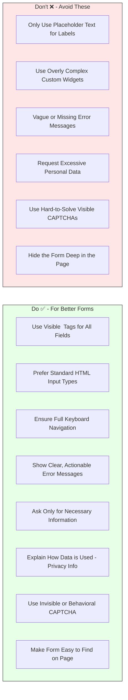

# Best Practices for Creating Forms

Building great forms goes beyond just the technology. Here's how to ensure your forms are user-friendly and achieve their goals:

## Designing User-Friendly and Accessible Forms

  *   **Use Clear, Visible Labels:** Every form field needs a `<label>`. Don't rely only on placeholder text (text inside the input field), as it disappears when users type and is bad for accessibility.
        *   *Good:* `<label for="email">Email Address:</label> <input type="email" id="email" placeholder="you@example.com">`
        *   *Bad:* `<input type="email" placeholder="Email Address">`
  *   **Keep it Simple:** Use standard HTML input types (`<input type="date">`, `<input type="tel">`) where possible. They often have better mobile support and accessibility than complex custom widgets.
  *   **Logical Order and Grouping:** Arrange fields in a way that makes sense to the user. Group related fields together using `<fieldset>` and `<legend>`.
  *   **Provide Clear Instructions:** For any fields that might be confusing, offer concise help text or tooltips.
  *   **Keyboard Navigation:** Ensure users can navigate through your entire form using only the keyboard (Tab, Shift+Tab, Enter, Spacebar).
  *   **Error Handling:** Make errors obvious and easy to correct. Display error messages next to the relevant field and explain what needs to be fixed.

* **Ensuring Your Forms Load Quickly and Are Visible**

  *   **Place Forms Prominently:** If a form is important, make sure users can see it easily without too much scrolling ("above the fold" if possible). Adobe's research shows many forms get low interaction because they are hidden.
  *   **Optimize Assets:** Keep any custom JavaScript or CSS for your forms as small as possible to ensure fast load times. Edge Delivery Services helps with the base page load, but heavy form scripts can still slow things down.

* **Handling User Data Responsibly**
  *   **Ask Only What You Need:** The less Personal Identifiable Information (PII) you ask for, the better. Every field is a potential reason for a user to abandon the form.
  *   **Be Transparent:** Clearly explain *why* you need certain information and *how it will be used*. Link to your privacy policy. This builds trust.

* **Improving User Experience: Captcha Alternatives**

  * **Rethink Visible Captchas:** Those "type the wavy text" or "click all the traffic lights" tests can be very frustrating for users, especially those with disabilities, and often lead to high drop-off rates.

*   **Consider Alternatives:**
    *   **Honeypot Fields:** Add a hidden field that only bots would fill out. If it has data, the submission is likely spam.
    *   **Time-Based Checks:** Measure how quickly a form is submitted. Submissions that are too fast are often bots.
    *   **Invisible reCAPTCHA (v3):** This Google service analyzes user behavior in the background and only presents a challenge if the user seems suspicious. This is often a much better user experience.

## Form Design Do's and Don'ts

## Next Steps

This guide has provided an overview of using forms with AEM Edge Delivery Services. For more detailed, step-by-step instructions on specific configurations, please refer to the official Adobe Experience Manager documentation:

* [Document-Based Authoring with Edge Delivery Services Forms](/help/edge/docs/forms/tutorial.md)
* [Universal Editor with Edge Delivery Services Forms](/help/edge/docs/forms/universal-editor/overview-universal-editor-for-edge-delivery-services-for-forms.md)
* [Document Authoring (DA) and Embedding Content](https://www.aem.live/developer/da-tutorial)
* [AEM Forms Submission Service](/help/edge/docs/forms/configure-submission-action-for-eds-forms.md.md)
