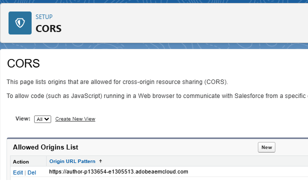
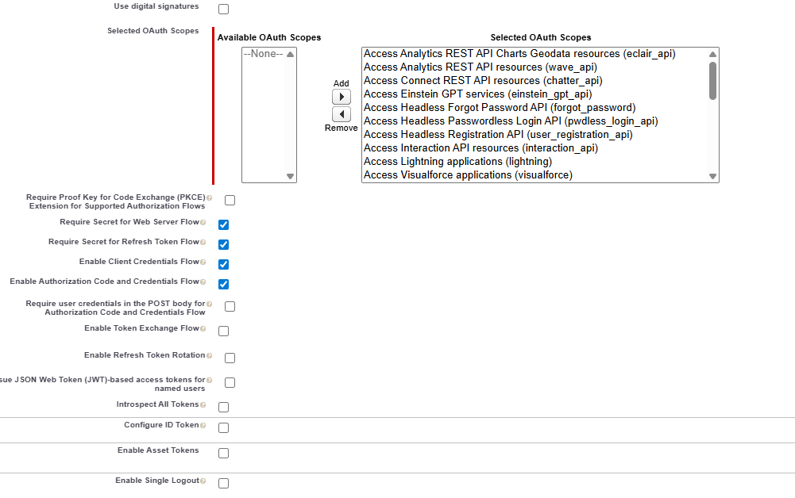
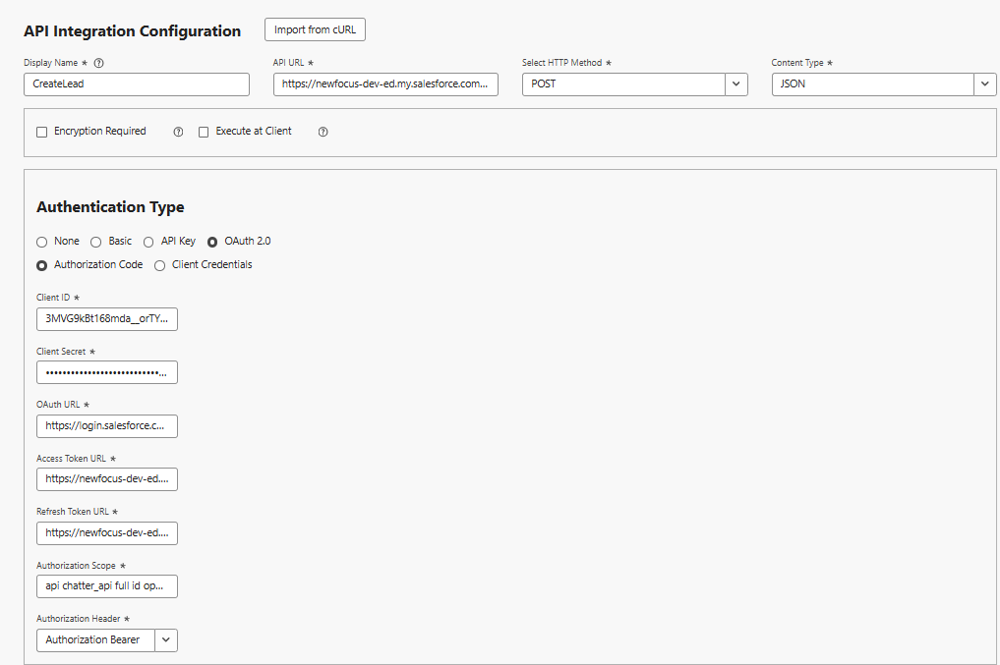
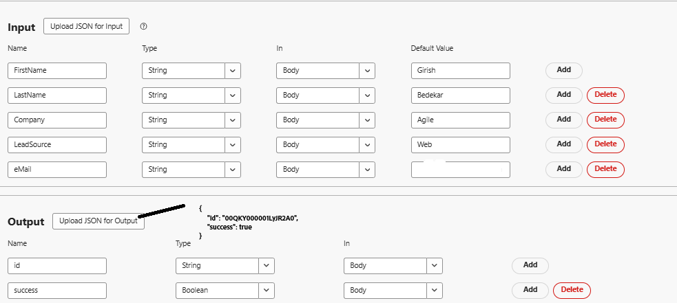
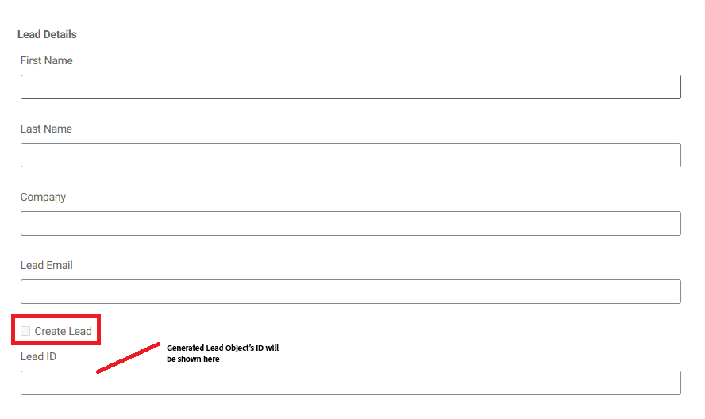
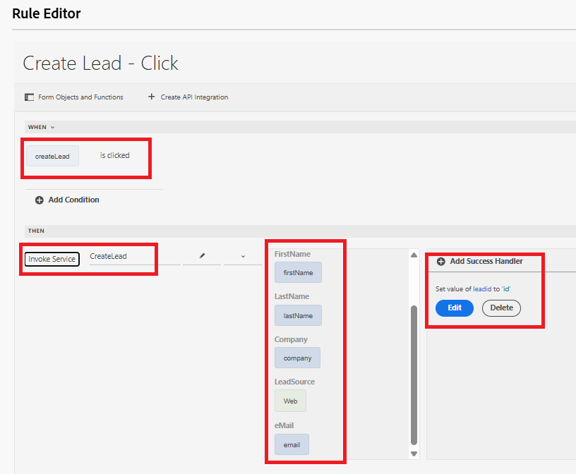

# Create Salesforce Lead object using API Integration

This use case walks through how to create a Lead in Salesforce using the API Integration. By the end of the process, you are able to:

Set up a [Connected App in Salesforce](https://help.salesforce.com/s/articleView?id=platform.ev_relay_create_connected_app.htm&type=5) to enable secure API access.

Configure CORS (Cross-Origin Resource Sharing) to allow code (such as JavaScript) running in a Web browser to communicate with Salesforce from a specific origin, add the origin to the allowed list as shown below



## Connected App Settings

The following settings are used in the connected app. You can assign the OAuth scopes depending on your requirements.


## Create API Integration

| Name                           | Value |
|--------------------------------|------------------|
| API url |https://`<your-domain>`d.my.salesforce.com/services/data/v32.0/sobjects/Lead             |
| Client ID |Specific to your connected app             |
| Client Secret  | Specific to your connected app             |
| OAuth URL      | https://login.salesforce.com/services/oauth2/authorize             |
| Access Token URL      | https://`<your-domain>`/services/oauth2/token             |
| Refresh Token URL      | https://`<your-domain>`/services/oauth2/token             |
| Authorization Scope      | api chatter_api full id openid refresh_token visualforce web             |
| Authorization Header      | Authorization Bearer             |



## Input and Output parameters

Define the input parameters for the API call and map the output parameters using the following json

```json
{
    "id": "00QKY000001LyJR2A0",
    "success": true
}
```



## Create a form

Create a simple adaptive form using the Universal Editor to capture the Lead object details as shown below


Handle the click event on the Create Lead checkbox using the rule editor. Map the input parameters to the values of the appropriate form objects as shown below. Display the ID of the newly created Lead object in the `leadid` TextField object


## Test the integration

- Preview the form
- Enter some meaningful values
- Select the `Create Lead` checkbox to trigger the API call
- The Lead ID of the newly created Lead object is displayed in the `Lead ID` Text Field.
