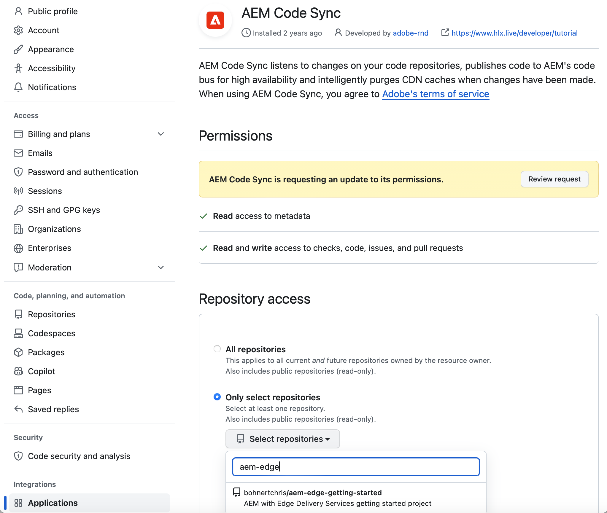
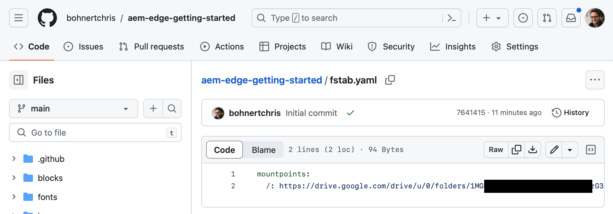
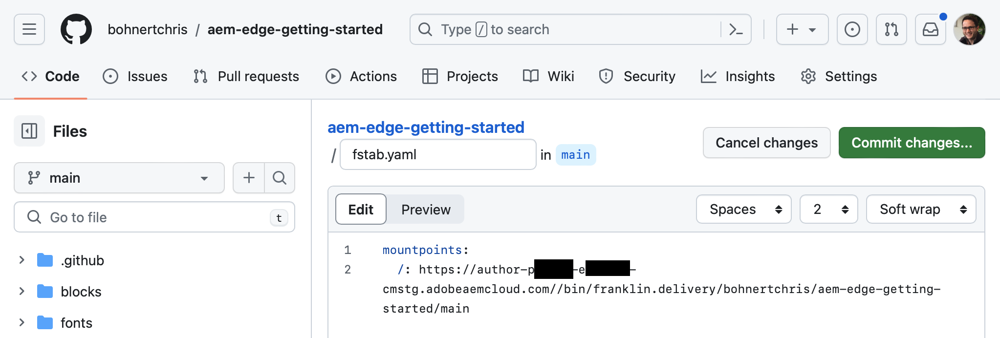
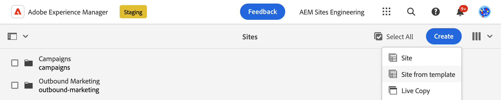
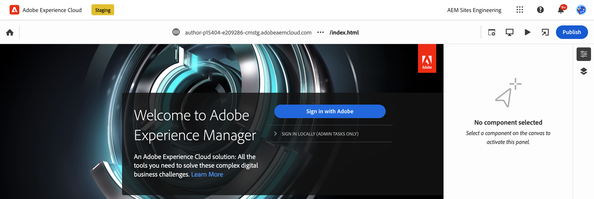

# Developer Getting Started Guide for AEM and Edge Delivery Services {#edge-dev-getting-started}

This guide will get you up-and-running with a new Adobe Experience Manager site using Edge Delivery Services and the Universal Editor.

## Prerequisites {#prerequisites}

Before beginning this guide, you should already be familiar with the basics of and have access to Edge Delivery Services including:

* You have completed the [Edge Delivery Service tutorial.](/help/edge/developer/tutorial.md)
* You have access to an [AEM Cloud Service sandbox.](/help/implementing/cloud-manager/getting-access-to-aem-in-cloud/introduction-sandbox-programs.md)
* You have [enabled the Universal Editor on the same sandbox environment.](/help/implementing/universal-editor/getting-started.md)

## Pick the Right Editor {#editor-choice}

AEM offers two different content editors and the choice of which to use depends on your situation.

* **Universal Editor** - This should be the default choice for new sites.
* **AEM Page Editor** - This should be chosen for an existing AEM Sites migration to Edge Delivery Services.

This guide focuses on AEM projects on Edge Delivery Services using the Universal Editor. See the document [Developing for Edge Delivery Services](/help/edge/developing.md) for more details on choosing the right editor and the migration of existing AEM sites to Edge Delivery Services.

## Getting Started with AEM and Edge Delivery Services {#getting-started}

Once you have fulfilled [the prerequisites](#prerequisites) and have made [the choice to use the Universal Editor,](#editor-choice) you can get started on your own project.

### Create Your GitHub Project {#create-github-project}

First you will need to create a new project on GitHub, based on the Adobe template.

1. Navigate to [`https://github.com/adobe-rnd/aem-boilerplate-xwalk`](https://github.com/adobe-rnd/aem-boilerplate-xwalk) and Click on **Use this template** and select **Create a new repository**.

   * You will need to be signed in to GitHub to see this option.

   

1. By default, the repository will be assigned to you. Change this as necessary as well as provide a repository name and description and click **Create repository**.

   * The repository should be **Public**.

   

1. In a new tab in the same browser, navigate to [`https://github.com/apps/aem-code-sync`](https://github.com/apps/aem-code-sync) and click **Configure**.

   

1. Click **Configure** for the org where you created your new repository in the previous step.

   

1. On the AEM Code Sync GitHub page under **Repository access**, select **Only select repositories**, select the repository that you created in the previous step, and then click **Save**.

   

1. Once AEM Code Sync is installed, you receive a confirmation screen. Return to the browser tab of your new repository.

   

1. Click the `fstab.yaml` file to open it and then the **Edit this file** icon to edit it.

   

1. Edit the `fstab.yaml` file to update the mount point of your project. Replace the default Google Docs URL with the URL of your AEM as a Cloud Service authoring instance and then click **Commit changes...**.

   * `https://<aem-author>/bin/franklin.delivery/<owner>/<repository>/main`
   * Changing the mount point tells Edge Delivery Services where to find the content of the site.
   
   

1. Add a commit message as desired and then click **Commit changes**, committing them directly to the `main` branch.

   

1. Return to the root of your repository and click on `paths.yaml` and then the **Edit this file** icon.

   

1. Replace the default mappings with `/content/<site-name>/:/` and click **Commit changes...**.

   * Provide your own `<site-name>`. You will need it in a later step.
   * The mappings tells Edge Delivery Services how to map the content in your AEM repository to the site URL.

   

1. Add a commit message as desired and then click **Commit changes**, committing them directly to the `main` branch.

   

### Create and Edit a New AEM Site {#create-aem-site}

Now that you have a GitHub project, you must create a new AEM site that the project can use.

1. Sign in to your AEM as a Cloud Service authoring instance and navigate to the Sites console and tap or click **Create** -> **Site from template**.

   

1. On the **Select a site template** tab of the create site wizard, click the **Import** button to import a new template for use with AEM Edge Delivery Services projects.

   * You can download the latest template from `[this is a placeholder](https://thisgoessomewhere.com)`.
   * You only need to do this once.

   

1. Once the template is imported, it appears in the wizard. Tap or click to select it and then tap or click **Next**.

   

1. Provide the following fields and tap or click **Create**.

   * **Site title** - Add a descriptive title for the site.
   * **Site title** - Use the `<site-name>` that you defined in the [previous step.](#create-github-project) 
   * **GitHub URL** - Use the URL of the GitHub project you created in the previous step.

   

1. AEM confirms the site creation with a dialog. Tap or click **OK** to dismiss.

   

1. On the sites console, navigate to the `index.html` of the newly-created site and tap or click **Edit** in the toolbar.

   

1. The Universal Editor opens in a new tab. You may need to tap or click **Sign in with Adobe** to authenticate to edit your page.

   

You can now edit your site using the Universal Editor. See the [Universal Editor documentation](/help/implementing/universal-editor/authoring.md) for more information.

### Publishing Your New Site {#publishing}

Once you are finished editing your new site using the Universal Editor, you can publish your content.

1. On the sites console, select all of the pages you created for your new site and tap or click **Quick publish** in the toolbar.

   

1. Tap or click **Publish** in the confirmation dialog to start the process.

   

1. Open a new tab in the same browser and navigate to the URL of your new site.

   * `https://main--<site-name>--<owner>.hlx.page`

1. See your content published.

   
