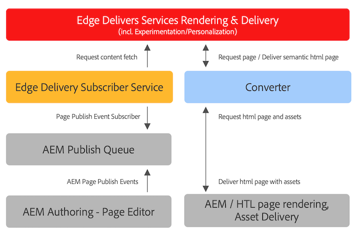

# Using Edge Delivery Services with Existing AEM Projects {#existing-projects}

You needn't wait for a new AEM project to benefit from Edge Delivery Services. Edge Delivery Services can be integrated into your existing AEM project so you can leverage its performance gains immediately.

## AEM Page Editor Limitations {#page-editor}

Before the advent of Edge Delivery Services, content managed in AEM was edited using the AEM Page Editor. If your project began before the introduction of Edge Delivery Services, it is almost certain that you are using the Page Editor.

The AEM Page Editor only works with [AEM components](/help/implementing/developing/components/overview.md) such as the [Core Components.](https://experienceleague.adobe.com/docs/experience-manager-core-components/using/introduction.html) These components are incompatible with Edge Delivery Services. Because of this, two phases are required to introduce Edge Delivery Services to an existing AEM project:

* [Phase 1 - Replace Front End](#replace-front-end)
* [Phase 2 - Switch to Universal Editor](#switch-ue)

## Phase 1 - Replace Front End {#replace-front-end}

In phase one, you can continue to use your existing AEM site structure, components, and authoring tools. The website rendering will be rebuilt by using blocks using JavaScript and CSS and it will be delivered via Edge Delivery Services.

Please see the [Build section](/help/edge/developer/block-collection.md) of the Edge Delivery Services documentation for more details on blocks and how to develop for Edge Delivery services.

A converter on App Builder will be required to convert the AEM rendered HTML output and send it to Edge Delivery Services.

Phase two completes the process by eliminating the technology overlap: AEM Core Components with HTL and Java on AEM Author, JS-based Blocks on Edge Delivery, and a nodeJS-based converter.

## Phase 2 - Switch to Universal Editor {#switch-ue}

In this phase, the AEM Page Editor is replaced with the Universal Editor. Because the Universal Editor can directly work with blocks, the AEM Core Components and converter will no longer be needed.

## How to get started {#how-to-get-started}

Please contact your Adobe representative to get access to this feature.
