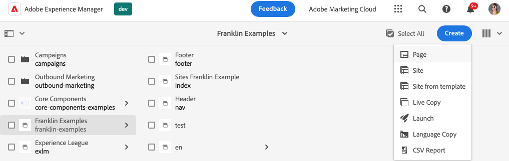
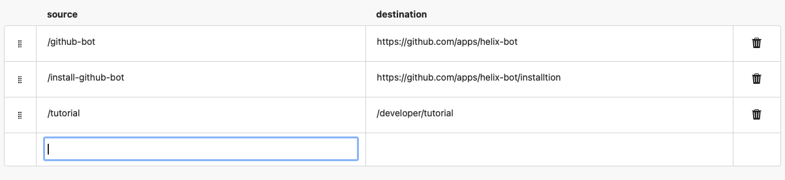
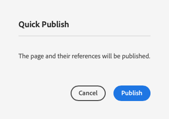
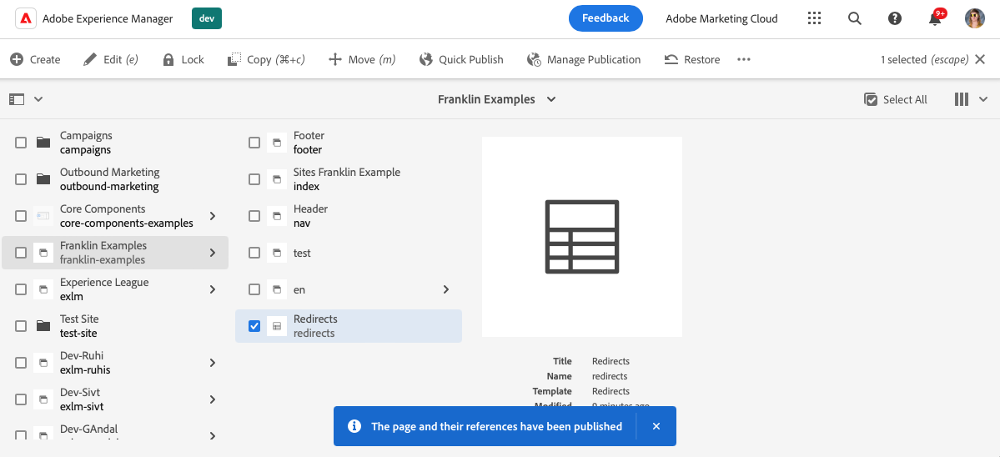
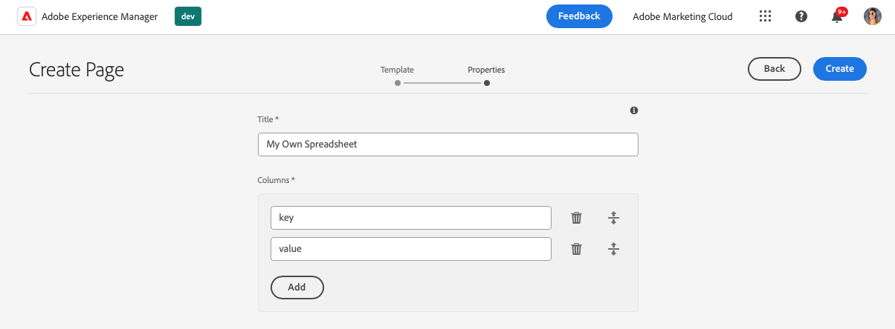

# Using Spreadsheets to Manage Mappings {#mappings}

Learn how to use spreadsheets to manage mappings for various values such as metadata and redirects for your AEM with Edge Delivery Services site.

{{aem-authoring-edge-early-access}}

## Use Cases {#use-cases}

For any AEM with Edge Delivery Services site, there is a need to maintain lists of value mappings. These can be lists of many different values such as metadata and redirects. Edge Deliver Services allows you to maintain such lists using an intuitive tool: the spreadsheet. AEM translates these spreadsheets into JSON files that can easily be consumed by your website or web application. This enables many uses for content that is table-oriented or structured.

Common use cases include:

* [Placeholders](/help/edge/docs/placeholders.md)
* [Metadata](/help/edge/docs/bulk-metadata.md)
* [Headers](/help/edge/docs/custom-headers.md)
* [Redirects](/help/edge/docs/redirects.md)

In addition, you can [create your spreadsheets](#own-spreadsheet) of any structure to store mappings for your own purposes.

This document uses the example of redirects to illustrate how to create such spreadsheets. See the previously-linked topics in the Edge Delivery Services documentation for details of each use case.

>[!TIP]
>
>For more information on how spreadsheets in general work with Edge Delivery Services, please see the document [Spreadsheets and JSON.](/help/edge/developer/spreadsheets.md)

## Prerequisites {#prerequisites}

In order to create mappings using spreadsheets in your AEM with Edge Delivery Services project, you need to have created your site using the latest site template.

Please see the document [ Developer Getting Started Guide for AEM Authoring with Edge Delivery Services](/help/edge/edge-dev-getting-started.md) for more information.

## Creating a Spreadsheet {#spreadsheet}

In this example, you will create a spreadsheet to manage redirects for your AEM with Edge Delivery Services site. The same steps apply to [other spreadsheet types](#other) you wish to create.

1. Sign in to your AEM as a Cloud Service authoring instance, go to the **Sites** console, and navigate to the root of the site which requires a spreadsheet. Tap or click **Create** -> **Page**.

   

1. On the **Template** tab of the create page wizard, tap or click the **Redirects** template to select it and then tap or click **Next**.

   

1. The **Properties** tab of the wizard presents the default values for the redirects spreadsheet. Tap or click **Create**.

   * **Title** - Leave this value as-is.
   * **Columns** - The minimum columns needed for redirects are prepopulated.
     * **source** - The page to be redirected
     * **destination** - The page to redirect to

   

1. In the **Success** dialog, tap or click **Open**.

   

1. A new tab opens with the spreadsheet loaded into an editor with the predefined **source** and **destination** columns. Tap or click the empty row of the **source** column to define your redirects. Changes are saved automatically as you edit the spreadsheet.

   

   * The **source** is relative to the domain of your website, so it only contains the relative path.
   * The **destination** can be either a fully qualified URL if you are redirecting to a different website, or it can be a relative path if you are redirecting within your own website.
   * Use the tab-key to move focus to the next cell.
   * The editor will add new rows to the spreadsheet as necessary.
   * Use the **Delete** icon at the end of each row and the drag handles at the beginning of each row to delete or move a row, respectively.

1. When you are finished defining your redirects, close the tab and return to the **Sites** console.

1. Tap or click to select the redirects spreadsheet that you created in the console and then tap or click **Quick Publish** in the actions bar to publish the spreadsheet.

   

1. In the **Quick Publish** dialog, tap or click **Publish**.

   

1. A banner confirms the publication.

   

The redirects spreadsheet is now published and publicly-accessible.

## Update paths.json {#paths-json}

In order for AEM to be able to consume the data in your spreadsheet, you additionally need to update the `paths.json` file of your project.

1. Open the root of your project in GitHub.

1. Tap or click the `paths.json` file to open its details and then the **Edit** icon.

   

1. Add a line to map your new spreadsheet spreadsheet to a `redirects.json` resource.

   ```json
   {
     "mappings": [
      "/content/<site-name>/:/",
      "/content/<site-name>/redirects:/redirects.json"
     ]
   }
   ```

1. Click **Commit changes...** to save the changes to `main`.

   * Either commit to `main` or create a pull request as per your process.

Once the changes to `paths.json` are merged, the redirects are live for your site.

## Other Spreadsheet Types {#other}

Now that you know how to create a redirects spreadsheet, you can create any other standard spreadsheet type:

* Placeholders
* Metadata
* Headers

Simply follow the same steps in the sections [Create Spreadsheet](#spreadsheet) and [Update paths.json](#paths-json) and choose the appropriate template and update the `paths.json` file appropriately.

Additionally, you can [create your own spreadsheet](#own-spreadsheet) with arbitrary columns for your own use.

## Creating Your Own Spreadsheet {#own-spreadsheet}

1. Follow the same steps in the section [Create Spreadsheet.](#spreadsheet)

1. When selecting the template, choose **Spreadsheet**.

1. In the **Properties** tab of the wizard, you can add your own columns.

   

   * In the **Columns** section, tap or click **Add** to add a new column.
   * Provide a name for the column.
   * Remove or reorganize the columns using the **Delete** and drag handle icons, respectively.

1. Create the spreadsheet and publish as per the instructions for the redirects spreadsheet.

1. Add a mapping to the `paths.json` file as per the instructions for the redirects spreadsheet.
