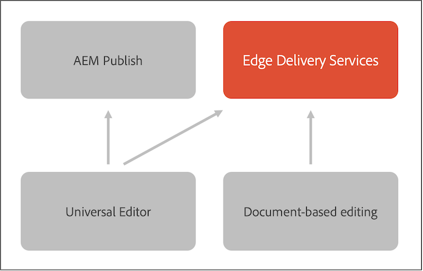

# AEM and Edge Delivery Services {#aem-edge}

With Edge Delivery Services, AEM delivers exceptional experiences that drive engagement and conversions. AEM does so by delivering high-impact experiences that are fast to author and develop. It is a composable set of services that enables a rapid development environment where authors can update and publish quickly, and new sites are launched rapidly. As such, with Edge Delivery Services you can improve conversion, reduce costs, and provide extreme content velocity.

By using Edge Delivery Services, you can:

* Create fast sites with a perfect Lighthouse Score and continuously monitor your site performance through real user monitoring (RUM).
* Increase authoring efficiency by decoupling content sources. Out of the box you can use both AEM authoring and document-based authoring. As such, you can work with multiple content sources on the same website.
* Use a built-in experimentation framework that allows quick test creation, execution without performance impact and fast release to production of a test winner.

## Edge Delivery Services Overview {#edge-overview}

The following diagram illustrates how you can edit content in Microsoft Word (document-based editing) and publish to Edge Delivery Services. It also shows the AEM publishing method using the Universal Editor.

Edge Delivery services is a composable set of services that allows for a high degree of flexibility in how you author content on your website. As mentioned previously,you can use both [AEM content management](https://experienceleague.adobe.com/docs/experience-manager-cloud-service/content/sites/authoring/getting-started/concepts.html) with [Universal Editor authoring](/help/implementing/universal-editor/introduction.md) as well as [document-based authoring.](https://www.aem.live/docs/authoring)

For example, you can use content directly from Microsoft Word or Google Docs. This means that documents from those sources can become pages on your website. Furthermore, headings, lists, images, font elements can all be transferred from the initial source into the website. The new content is added instantly without a rebuild process.

Edge Delivery Services uses GitHub so customers can manage and deploy code directly from their GitHub repository. For example, you can write content in either Google Docs or Microsoft Word and the functionality of your site can be developed by using CSS and JavaScript in GitHub. When you are ready, you can use the Sidekick browser extension to preview and publish content updates.

Further reading in the Edge Delivery Services documentation:

* For details on how to get started with Edge Delivery see the [Build section.](https://www.aem.live/docs/#build)
* To understand how to author and publish content by using Edge Delivery see the [Publish section.](https://www.aem.live/docs/authoring)
* To understand how to properly launch your website project see the [Launch section.](https://www.aem.live/docs/#launch)

## Edge Delivery Services and Other Adobe Experience Cloud products {#edge-other-products}

Edge Delivery Services are part of Adobe Experience Manager and as such Edge Delivery Services and AEM sites can co-exist on the same domain. This is a common use case for larger websites. On top of that, content from Edge Delivery Services can easily be consumed in your AEM Sites pages and conversely.

You can also use Edge Delivery Services with Adobe Target, Analytics, and Launch.

## Getting Access to Edge Delivery Services {#getting-access}

It is easy to get started using Edge Delivery Services. Get started by following the [Getting Started - Developer Tutorial.](https://www.aem.live/developer/tutorial)

## Getting Help from Adobe {#adobe-gethelp}

You can engage with Adobe product teams via your provisioned product collaboration channel (see below for access details) to answer questions on product use or best practices. There are no Service Level Targets (SLTs) associated with the conversations via the product collaboration channel. If a product issue needs additional investigation and troubleshooting, and must meet response SLTs, you can submit a support ticket following the [support process.](https://experienceleague.adobe.com/?support-tab=home#support)

Adobe provides three channels to help you with Edge Delivery Services:

* Engage with community resources for general inquiries
* Access your Product Collaboration Channel for specific questions
* Log a support ticket to solve major and critical issues

### Access Community Resources {#community-resource}

Adobe is committed to empowering you with the best community engagement & support for Edge Delivery Services and Document-based Authoring.

* Participate in [Experience League Community](https://adobe.ly/3Q6kTKl) to ask questions, share feedback, initiate discussions, seek assistance from Adobe experts and AEM Advisors/Champs, and connect with like-minded individuals in real-time.
* Join our [Discord channel,](https://discord.gg/aem-live) a more casual platform for real-time interactions and quick idea exchanges.

### How to Access Your Product Collaboration Channel {#collab-channel}

Given the value of direct communication channel with customers, all AEM customers at launch will establish a Slack channel for speed, critical updates, and scaled reporting on experience quality. You receive an invitation from Adobe to join a Slack channel specific to your organization.

For more information, see [Using the Slack Bot](https://www.aem.live/docs/slack) document for more details.

### Logging a Support Ticket {#support-ticket}

Steps to log a support ticket via the Admin Console:

1. [Following the standard support process,](https://experienceleague.adobe.com/?support-tab=home#support) create a ticket.
1. Add **Edge Delivery** in the title of the ticket.
1. In the description, provide the following details:

    * URL of the live website. For example: `www.mydomain.com`.
    * URL of the origin website (`.hlx` URL).

## What's Next {#whats-next}

Get started by reviewing [Using Edge Delivery Services](/help/edge/using.md).
