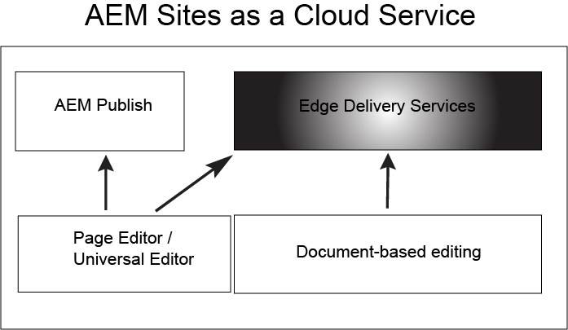

# Getting Started with Edge Delivery Services {#getstart-edge}

>[!NOTE]
>
>This is a draft, feel free to update/modify as needed.
>This content is only viewable from inside the Adobe Firewall (VPN) and will be published live on Tuesday September 26, 2023.

With Edge Delivery Services, AEM delivers exceptional experiences that drive engagement and conversions. AEM does so by delivering high-impact experiences that are fast to author and develop. It is a composable set of services that enables a rapid development environments where authors can update and publish quickly, and new sites are launched rapidly. As such, with Edge Delivery Services you can improve conversion, reduce costs and provide extreme content velocity.

By leveraging Edge Delivery you can:

* Create fast sites with a perfect Lighthouse Score and continuously monitor your site performance through real user monitoring (RUM).
* Increase authoring efficiency by decoupling content sources. Out of the box you can use both AEM authoring and document-based authoring. As such, you can work with multiple content sources on the same website.
* Use a built-in experimentation framework that allows quick test creation, execution without performance impact and fast release to production of a test winner.

## How Edge Delivery works{#edge-works}

The following diagram illustrates how you can edit content in Microsoft Word (document-based editing) and publish to Edge Delivery. It also shows the traditional AEM publishing method using the various editors.

Edge Delivery is a composable set of services that allows for a high degree of flexibility in how you author content on your website. As mentioned previously, you can use both [AEM authoring](https://experienceleague.adobe.com/docs/experience-manager-cloud-service/content/sites/authoring/getting-started/concepts.html) and [document based authoring](https://www.hlx.live/docs/authoring).

For example, you can use content directly from Microsoft Word or Goggle Docs. This means that documents from those sources can become pages on your website. Furthermore, headings, lists, images, font elements can all be transferred from the initial source into the website. The new content will be added instantly without a rebuild process.

Edge Delivery leverages Github so customers can manage and deploy code directly from their Github repository. For example, you can write content in either Google Docs or Microsoft Word and the functionality of your site can be developed by using CSS and Javascript in GitHub . When you are ready, you can use the Sidekick browser extension to preview and publish content updates.

Further reading:

* For details on how to get started with Edge Delivery see the [Build](https://www.hlx.live/docs/#build) section of the Edge delivery documentation.
* To understand how to author and publish content by using Edge Delivery see the [Publish section](https://www.hlx.live/docs/authoring).
* To understand how to properly launch your website project see the [Launch section](https://www.hlx.live/docs/#launch).

## Edge Delivery Services and other Adobe Experience Cloud products {#edge-other-products}

Edge Delivery Services are part of Adobe Experience Manager and as such Edge Delivery and AEM sites can co-exist on the same domain. This is a common use case for larger websites. On top of that, content from Edge Delivery can easily be consumed in your AEM Sites pages and vice-versa.

You can also use Edge Delivery Services in combination with Adobe Target, Analytics and Launch.

## Getting Access to Edge Delivery Services

Its easy to get started using Edge Delivery Services. Get started by following the [Getting Started - Developer Tutorial](https://www.hlx.live/developer/tutorial).

## Getting Help from Adobe {#adobe-gethelp}

You can engage with Adobe product teams via your provisioned product collaboration channel (see below for access details) to answer questions on product use or best practices. Please note that there are no SLT’s associated with the conversations via the product collaboration channel. If a product issue needs additional investigation and troubleshooting, and needs to meet response SLT’s, you can submit a support ticket following the [support process](https://experienceleague.adobe.com/?lang=en&support-tab=home#support).

Adobe provides three channels to help you with Edge Delivery Services:

* Access to community resources
* Access you Product Collaboration Channel
* Log a support ticket

### Access Community Resources

Adobe has two Community Resources to help you with Edge Delivery, [Experience League Community](https://adobe.ly/3RzitVw) and a [Discord channel](https://discord.gg/YFTKQK8M).

### How to access my Product Collaboration Channel

Given the value of direct communication channel with customers, all AEM customers at launch will establish a Slack channel for the purpose of speed, critical updates and scaled reporting on experience quality. You will receive an invitation from Adobe to join a Slack channel specific to your organization.

For more information, see [Using the Slack Bot](https://www.hlx.live/docs/slack) document for more details.

### Logging a Support Ticket

Steps to log a support ticket via Admin Console:

1. Add **Edge Delivery** in the title of the ticket.
2. In the description, please provide the following details:

    * URL of the live website. For example: [www.mydomain.com].
    * URL of the origin website (.hlx URL).

## What's Next

Get started by reviewing the next article: [Using Edge Delivery Services](/help/edge/using.md).

## Useful Resources {#useful-resources}

For additional details about Edge Delivery services, see the [Edge Delivery Services documentation](https://www.hlx.live/docs/).

[def]: assets/assets/edge_delivery.png