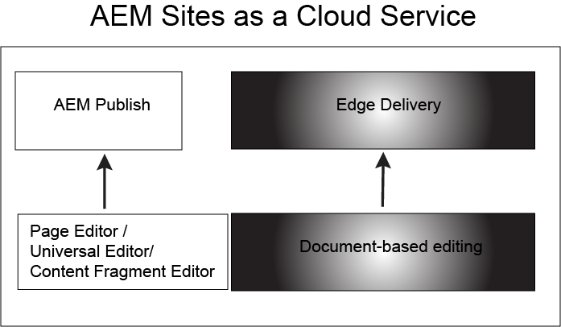

# Edge Delivery Services Introduction {#introduction-edge}

With Edge Delivery, AEM delivers exceptional experiences that drive engagement and conversions. AEM does so by delivering fast performant experiences that are fast to author and develop. As such, with the help of Edge Delivery Services you can improve conversion, reduce costs and increase velocity. Keep in mind that Edge Delivery Services is a composable set of services that are used **in addition** to the usual [AEM authoring methods](https://experienceleague.adobe.com/docs/experience-manager-65/authoring/essentials/author.html) and do not replace the authoring workflows commonly used by customers up to this point.

By leveraging Edge Delivery you can:

* Create fast sites with a perfect Lighthouse Score and continuously monitor your site performance through real user monitoring (RUM).
* Edit content in Microsoft Word, Google Docs, Microsoft Excel, and Google Sheets as well as any custom authoring environment and AEMs Universal Editor. The content can then be incorporated and rendered on the fly without the need for a lenghty rebuild process.
* Use a built-in experimentation framework that allows quick test creation, execution without performance impact and fast release to production of a test winner.

## How Edge Delivery works{#edge-works}

The following diagram illustrates how you can edit content in Microsoft Word (Document-based editing) and publish to Edge Delivery. It also shows the traditional AEM publishing method using the various editors.

As mentioned previously, Edge Delivery is a composable set of services used in addition to the usual AEM authoring methods. This allows for a high degree of flexibility when you add or author content for you website. For example, you can use content directly from Microsoft Word and Goggle Docs. This means that documents from those sources become can become pages on your website. Furthermore, headings, lists, images, font elements can all be transferred from the initial source into you website. The new content will added instantly without a rebuild process.

## How to use Edge Delivery {#edge-use}

To understand how to build, publish and launch a website by using Edge Delivery see:

* Build (link TBD)
* Publish (link TBD)
* Launch (link TBD)

## Edge Delivery Services and other Adobe Experience Cloud products {#edge-other-products}

Edge Delivery Services are a part of Adobe Experience Manager and as such Edge Delivery and AEM sites can co-exist on the same domain. This is usually a common use case for larger websites. On top of that, content from Edge Delivery can easily be consumed in your AEM Sites pages and vice-versa.

You can also use Edge Delivery Services in combination with Adobe Target, Analytics and Launch.

## Getting Help from Adobe {#adobe-gethelp}

You can engage with Adobe product teams via your provisioned product collaboration channel to answer questions on product use or best practices. Please note that there are no SLT’s associated with the conversations via the product collaboration channel. If a product issue needs additional investigation and troubleshooting, and needs to meet response SLT’s, you can submit a support ticket following the [support process](https://experienceleague.adobe.com/?lang=en&support-tab=home#support).

### How to access my Provisioned Product Collaboration Channel

TR: We need details on how a customer receives the details of their Discord Channel and how they can use it.

## Useful Resources {#useful-resources}

For additional details about Edge Delivery services, see the [Edge Delivery Services documentation](https://www.hlx.live/docs/). **SR** - link will probably change after rebranding.

[def]: assets/assets/edge_delivery.png