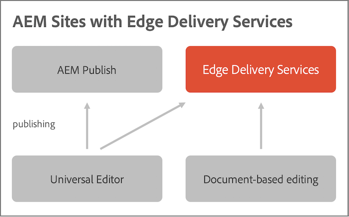
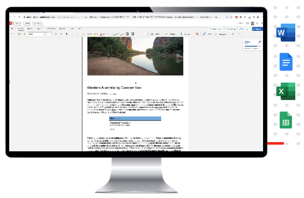
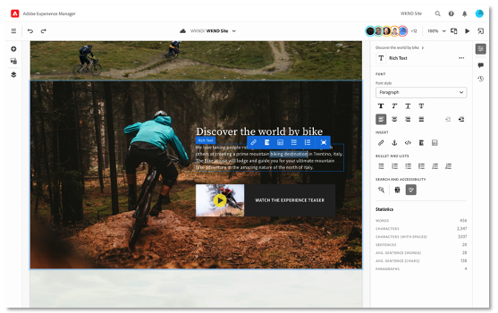

# Edge Delivery Services Overview {#edge-delivery-services}

With Edge Delivery Services, AEM delivers exceptional experiences that drive engagement and conversions. AEM does so by delivering high-impact experiences that are fast to author and develop. It is a composable set of services that enables a rapid development environment where authors can update and publish quickly, and new sites are launched rapidly. As such, with Edge Delivery Services you can improve conversion, reduce costs, and provide extreme content velocity.

By using Edge Delivery Services, you can:

* Create fast sites with a perfect Lighthouse Score and continuously monitor your site performance through real use monitoring (RUM).
* Increase authoring efficiency by decoupling content sources. Out of the box you can use both WYSIWYG and document-based authoring. As such, you can work with multiple content sources on the same website.
* Use a built-in experimentation framework that allows quick test creation, execution without performance impact and fast release to production of a test winner.

## Agile Reaction to Business Needs {#agile-reaction}

As a longstanding recognized industry leader, Adobe knows how important it is to be able to create and publish new, meaningful content quickly for your customers. Common challenges in scaling content creation have been made clear by the market, including:

1. **Demand for content continues to grow.**
   * There is a need to unlock new content authors to meet this demand.
   * The content creation process must scale effectively across the business.
   * Authors must be able to react quickly to changing trends.
1. **There is a need for omni-channel content.**
   * Layout control is needed irrespective of content delivery.
   * Authors need to be empowered to change content layout directly.
1. **Pressure grows to drive ROI on content.**
   * Authors themselves need the ability to optimize the content that they create.

These trends have proved themselves consistent across the industry. However, individual requirements inevitably vary project to project. The goal of any Edge Delivery Services project is to focus on finding the solution that works for your users.

1. **Focus on value instead of features.** - Determine the most optimized workflow to serve your authors rather than getting lost in AEM's expansive feature set.
1. **Take advantage of AEM's flexibility.** - AEM features don't need to be used in a vacuum. Use those features that you need per use case.
1. **Leverage your author's expertise.** - Involve real content authors in the project from the beginning to ensure you are delivering the value they need by implementing the features that make sense.

By focusing on value for your authors, your Edge Delivery Services project can meet the modern industry demands facing your content creators and provide content quickly to delight your customers.

## Flexible Authoring Tools for Your Content Creators {#overview}

Edge Delivery Services is a composable set of services that allows for a high degree of flexibility in how you author content on your website. You can use both [AEM content management](https://experienceleague.adobe.com/en/docs/experience-manager-cloud-service/content/sites/authoring/author-publish) and WYSIWYG authoring using the [Universal Editor](/help/sites-cloud/authoring/universal-editor/authoring.md) as well as [document-based authoring](https://www.aem.live/docs/authoring).

The following diagram illustrates how you can edit content in Microsoft Word (document-based authoring) and publish to Edge Delivery Services. It also shows the WYSIWYG editing using the Universal Editor.

Edge Delivery Services uses GitHub so you can manage and deploy code directly from your GitHub repository. New content is added instantly without a rebuild process.

### Document-Based Authoring {#document-based}

With document-based authoring, you can use content directly from Microsoft Word or Google Docs such that those sources become pages on your website. Headings, lists, images, font elements can all be transferred from the initial source into the website.

* With document-based authoring, every marketer is enabled to create content quickly with known authoring tools (Microsoft Word, Google Docs, etc.).
* Content creation is streamlined by allowing authoring, review, and publishing directly within the source documents.
* Because known tools are used, zero onboarding is required for content authors, increasing content velocity.
* The functionality of your site can be developed by using CSS and JavaScript in GitHub.

Further reading in the document-based authoring documentation:

* For details on how to get started with Edge Delivery, see the [Build section](https://www.aem.live/docs/#build).
* To understand how to author and publish content by using Edge Delivery, see the [Publish section](https://www.aem.live/docs/authoring).
* To understand how to launch your website project properly, see the [Launch section](https://www.aem.live/docs/#launch).

### WYSIWYG Authoring {#wysiwyg-authoring}

What-you-see-is-what-you-get (WYSIWYG) authoring leverages the Universal Editor, a customizable, one-stop place to edit content live and in-context with a visual preview.

* With WYSIWYG authoring, you increase author efficiency whether headless or headful.
* You can take advantage of AEM's comprehensive content-management capabilities including workflow and governance.
* Leverage numerous extension points to support your own processes and integrations.
* The functionality of your site can be developed by using CSS and JavaScript in GitHub.

Further reading in the WYSIWYG authoring documentation:

* For an overview of the Universal Editor and WYSIWYG authoring, see [WYSIWYG Content Authoring for Edge Delivery Services](/help/edge/wysiwyg-authoring/authoring.md).
* For a developer overview, see the [Developer Getting Started Guide for WYSIWYG Authoring with Edge Delivery Services](/help/edge/wysiwyg-authoring/edge-dev-getting-started.md).

### Deciding on Your Authoring Method {#authoring-method}

AEM's flexibility ensures that your authoring needs are covered. Adobe can help you determine what method (or methods) best fit your requirements.

* Always involve your content authors in the decision.
* Multiple authoring methods can be implemented.
* You can always change your authoring method after-the-fact.
* You do not need to decide before the implementation, but rather as part of the implementation.

See [Choosing an Authoring Method](authoring-methods.md) for more information.

## Edge Delivery Services and Other Adobe Experience Cloud Products {#edge-other-products}

Edge Delivery Services are part of Adobe Experience Manager. As such, Edge Delivery Services and AEM Sites can co-exist on the same domain, which is a common use case for larger websites. Additionally, your AEM Sites pages can seamlessly consume content from Edge Delivery Services, and the reverse is also true.

See the [Developer Getting Started Guide for WYSIWYG with Edge Delivery Services](/help/edge/wysiwyg-authoring/edge-dev-getting-started.md) to learn how to start your own project to author with AEM and Edge Delivery Services.

You can also use Edge Delivery Services with [Adobe Target](https://www.aem.live/developer/target-integration), [Real Use Monitoring (RUM)](https://www.aem.live/developer/rum) to diagnose usage and performance of your sites, and [Launch](https://experienceleague.adobe.com/en/docs/experience-platform/tags/home).

## Getting Started with Edge Delivery Services {#getting-started}

It is easy to get started using Edge Delivery Services by following the [Getting Started - Developer Tutorial](https://www.aem.live/developer/tutorial).

## Getting Help from Adobe {#getting-help}

Adobe provides three channels to help you with Edge Delivery Services:

* Engage with [community resources](#community-resources) for general inquiries.
* Access your [product collaboration channel](#collaboration-channel) for specific questions.
* [Log a support ticket](#support-ticket) to solve major and critical issues.

### Access Community Resources {#community-resources}

Adobe is committed to empowering you with the best community engagement and support for Edge Delivery Services, WYSIWYG, and document-based authoring.

* Participate in the [Experience League Community](https://adobe.ly/3Q6kTKl) to ask questions, share feedback, initiate discussions, seek assistance from Adobe experts and AEM Advisors/Champs, and connect with like-minded individuals in real-time.
* Join the [Discord channel](https://discord.gg/aem-live), a more casual platform for real-time interactions and quick idea exchanges.

### How to Access Your Product Collaboration Channel {#collaboration-channel}

Given the value of direct communication channel with users, all AEM Projects at launch establish a Slack channel for speed, critical updates, and scaled reporting on experience quality. You receive an invitation from Adobe to join a Slack channel specific to your organization.

For more information, see the document [Using the Slack Bot](https://www.aem.live/docs/slack) for more details.

You can engage with Adobe product teams via your provisioned product collaboration channel to answer questions on product use or best practices. There are no service level targets (SLTs) associated with the conversations via the product collaboration channel. 

### Logging a Support Ticket {#support-ticket}

{{support-ticket}}

## What's Next {#whats-next}

Get started by reviewing [Using Edge Delivery Services](/help/edge/using.md).
