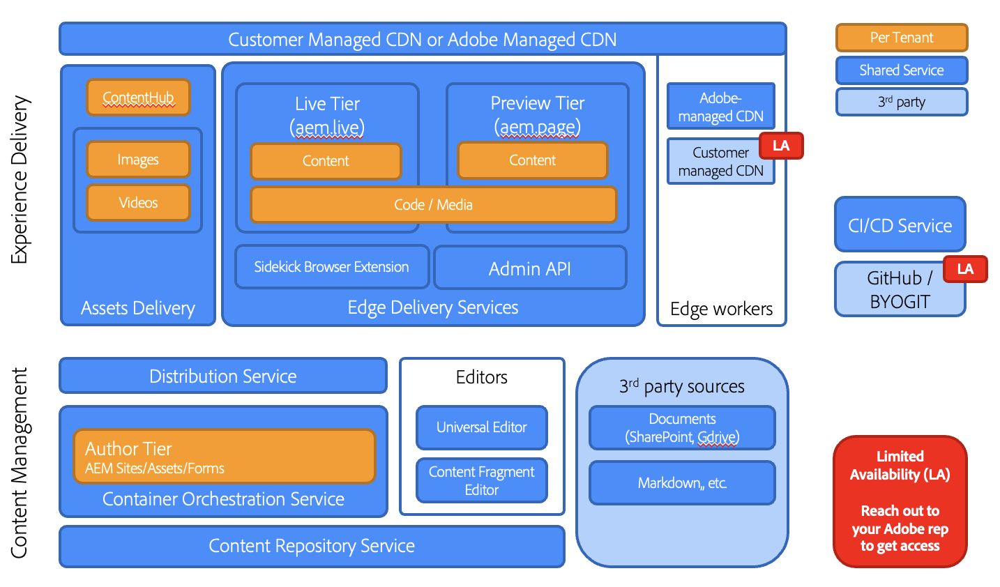

# Edge Delivery Services Overview {#edge-delivery-services}

## What is Edge Delivery Services?
Edge Delivery Services is a modern content delivery framework that reimagines how websites are built and delivered—optimized for speed, simplicity, and scalability. It is a core part of Adobe Experience Manager and enables faster digital experiences by pushing rendering and delivery closer to the user, at the edge of the network.

It is not a replacement for a CDN, but it integrates seamlessly with your own CDN or the included Adobe-managed CDN.

>[!TIP]
>
>**Want to get hands-on right away?**
>
>If you want to get hands-on right away, you can start your own Edge Delivery Services project with AEM authoring in less than 30 minutes by [checking out the tutorial on aem.live.](https://www.aem.live/developer/ue-tutorial)

## Why Edge Delivery Services?

### Increases discoverability and traffic
Edge Delivery websites are optimized for search engines (SEO) and LLMs (GEO). This ensures high visibility and discoverability on all existing and upcoming sources for organic traffic. The **performance-first end-to-end architecture** ensures a delightful customer experience which will positively impact engagement.

### Developer efficiency
Go live in days and weeks instead of months and years! Edge Delivery offers all the tools **modern web developers** love: GitHub, local development with auto-reload, performance, simplicity – and none of the complications: no transpilation, no bundlers, no configurations, no overhead.

The simplicity of Edge Delivery does not require you to use complicated frameworks, tooling, or processes which is ideal for AI code creation. Use plain HTML, modern CSS, and vanilla JavaScript to create exceptional experiences faster than ever before. Focus on work and spend less time for training and learning new tools.

Edge Delivery enables every developer to make lighthouse score 100 a reality.

### Support for multiple content sources
Content from various solutions can directly integrate with Edge Delivery, **inluding all your existing AEM instances**. Authors can manage and **publish content from any system such as SharePoint to Edge Delivery** to gain more velocity with tools they already know.

### Composable architecture
Headless or headful - Deliver the right content in the right format and add the right decoration to make it an experience that stands out in any channel.

## How does it work
Edge Delivery Services is a composable set of services that allows for a high degree of flexibility in how you author content on your website. It replaces AEM Publish / Dispatcher and the traditional way of building experiences with AEM Core Components with a multi-cloud SaaS solution and pure FE development approach.

Edge Delivery Services uses GitHub so you can manage and deploy code directly from your GitHub repository. New content is added instantly without a rebuild process.

## Authoring

### In-context editing
The Universal Editor is a what-you-see-is-what-you-get (WYSIWYG), customizable, one-stop place to edit content live and in-context with a visual preview.

* With AEM authoring and the Universal Editor, you increase author efficiency whether headless or headful.
* You can take advantage of AEM's comprehensive content-management capabilities including workflow and governance.
* Leverage numerous extension points to support your own processes and integrations.
* The functionality of your site can be developed by using CSS and JavaScript in GitHub.

### Document-based editing
Another approach is document-based authoring where content gets managed as documents. Microsoft Word is a popular choice as many enterprises have SharePoint in place where the initial content gets created. No need to learn a new tool and publishing content diretly from SharePoint and Word removes the hassle of copy & paste content into AEM. Customers without SharePoint can also use Gdrive as an alternative.

## Operational Telemetry
Adobe Experience Manager uses [Operational Telemetry](https://www.aem.live/developer/rum) to diagnose usage and performance of web sites running on Adobe Experience Manager. As a developer, you can use the RUM APIs to observe additional events about how your site is used.

## Start exploring
Get started using AEM authoring with the Universal Editor and Edge Delivery Services:

* Edge Delivery Services documentation [Edge Delivery Services](https://www.aem.live)
* For an overview of AEM authoring with the Universal Editor, see the document [Authoring with AEM for Edge Delivery Services](https://www.aem.live/docs/aem-authoring) in the aem.live documentation.
* For a developer overview, see the document [Getting Started - Universal Editor Developer Tutorial](https://www.aem.live/developer/ue-tutorial) in the aem.live documentation.

## Edge Delivery Services and Other Adobe Experience Cloud Products {#edge-other-products}

Edge Delivery Services are part of Adobe Experience Manager. As such, Edge Delivery Services and AEM Sites can co-exist on the same domain, which is a common use case for larger websites. Additionally, your AEM Sites pages can seamlessly consume content from Edge Delivery Services, and the reverse is also true.

You can also use Edge Delivery Services with [Adobe Target](https://www.aem.live/developer/target-integration) and [Launch.](https://experienceleague.adobe.com/en/docs/experience-platform/tags/home)

## Getting Help from Adobe {#getting-help}

Adobe provides three layers to help you with Edge Delivery Services:

* Engage with [community resources](#community-resources) for general inquiries.
* Access your [product collaboration channel](#collaboration-channel) for specific questions.
* [Log a support ticket](#support-ticket) to solve major and critical issues **within the contractual support SLA**.

### Access Community Resources {#community-resources}

Adobe is committed to empowering you with the best community engagement and support for Edge Delivery Services, AEM authoring with the Universal Editor, and document-based authoring.

* Participate in the [Experience League Community](https://adobe.ly/3Q6kTKl) to ask questions, share feedback, initiate discussions, seek assistance from Adobe experts and AEM Advisors/Champs, and connect with like-minded individuals in real-time.
* Join the [Discord channel](https://discord.gg/aem-live), a more casual platform for real-time interactions and quick idea exchanges.

### Logging a Support Ticket {#support-ticket}

{{support-ticket}}
