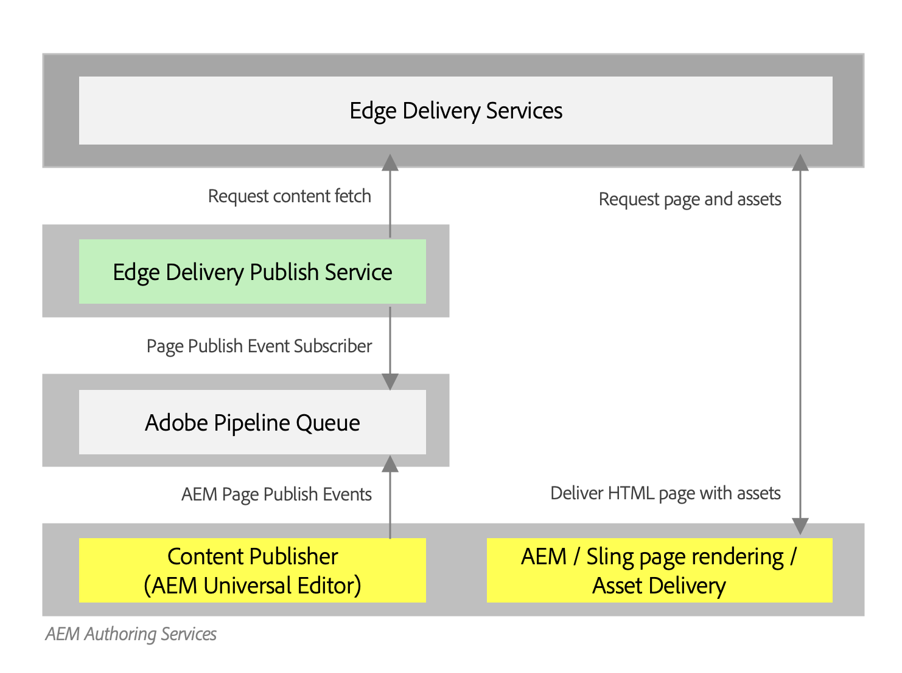

# Publishing Content for Edge Delivery Services {#publishing-edge}

With Edge Delivery Services, publishing content is seamless regardless of your content source:

* Document-based content - Please see [Publish section](https://www.aem.live/docs/#publish) of the Edge Delivery Services documentation.
* AEM content - Please see the details below.

## Publishing Flow from AEM {#publishing-flow}

When using the Universal Editor to author AEM content, publishing is as simple as clicking the **Publish** button in the Universal Editor. Please see the document [Publishing Content with the Universal Editor.](/help/implementing/universal-editor/publishing.md)

The flow of information when publishing is as follows. Once the author starts publication, this flow is automatic and is illustrated here for information purposes.

1. The content author publishes AEM content in the Universal Editor.
1. A publish event is pushed to Adobe Pipeline Queue.
1. The Edge Delivery Publish Service forwards the relevant events to Edge Delivery Admin API.
1. Edge Delivery pulls and ingest semantic HTML from AEM Author.
1. AEM is updated with publish status.

### How to get started {#how-to-get-started}
Please contact your Adobe represenatitive to get access to this feature.
