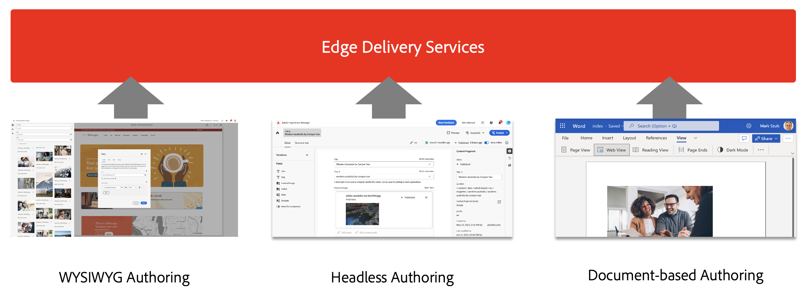
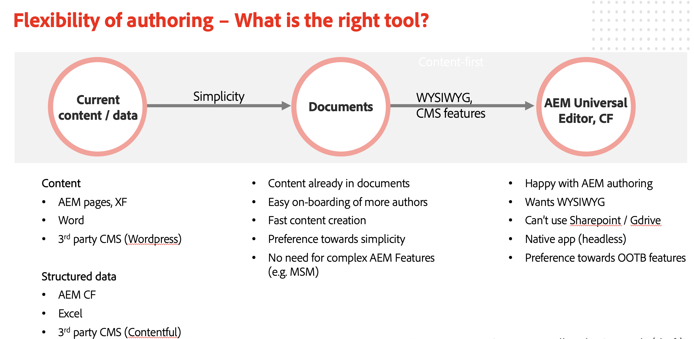

# Using Edge Delivery Services with AEM {#using-edge}

Edge Delivery Services is decoupled from the content source and can ingest content from different content sources. This means you can work with multiple content sources on the same website with seamless and streamlined publishing regardless of you chosen source.

With Edge Delivery Services, you can create rapid development environments where authors can update and publish content quickly and new sites can be launched rapidly. It takes only a couple of seconds to go from editing to seeing the content live on the internet.

Ingesting from multiple content sources offers maximum flexibility to the user. Adobe offers guidance to help you choose which content sources are the best fit for your project.

There are cases where the content source is predefined or otherwise not flexible (e.g. the project can not use Sharepoint or Google Drive). But in many cases, the tool is not preordained and choice of tool is not black and white.

Adobe's guiding principle is simplicity. Start with document-based authoring  and add complexity when needed. If a tool change is needed, AEM's Edge Delivery Services integration covers content migration.

## Authoring {#authoring-edge}

With Edge Delivery Services, authoring is easy, fast, and flexible. You can choose to author using document-based authoring or WYSIWYG authoring using the Universal Editor.

Please see the document [Authoring Content for Edge Delivery Services](/help/edge/wysiwyg-authoring/authoring.md) for more information.

## Publishing {#publishing-edge}

With Edge Delivery Services, publishing content is seamless regardless of your content source.

Please see the document [Publishing Content for Edge Delivery Services](/help/edge/wysiwyg-authoring/publishing.md) for more information.

## Developing {#developing-edge}

Edge Delivery Services is based around the concept of blocks. AEM comes with a comprehensive library of predefined blocks, which can be extended to meet your project needs. Code for Edge Delivery Services projects is managed in GitHub.

Please see the document [Developer Getting Started Guide for WYSIWYG Authoring with Edge Delivery Services](/help/edge/wysiwyg-authoring/edge-dev-getting-started.md) for more information.
